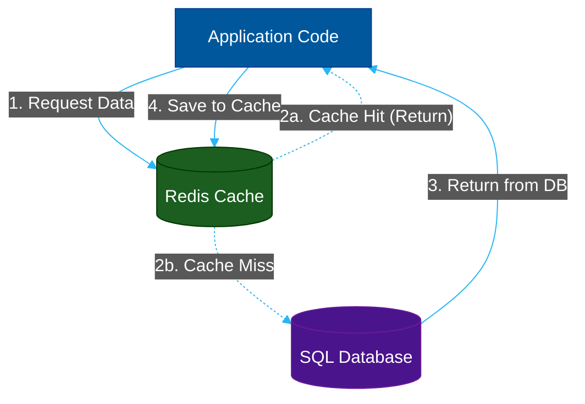

# ⚡ Caching Strategies

> **Series:** Clean Code › System Design · **Level:** Intermediate · **Read Time:** ~10 min

---

## 📖 Table of Contents

- [1. The Physics of Caching](#1-the-physics-of-caching)
- [2. Local Cache vs Distributed Cache](#2-local-cache-vs-distributed-cache)
- [3. Reading Strategies (Cache Aside)](#3-reading-strategies-cache-aside)
- [4. Writing Strategies (Write-Through vs Write-Back)](#4-writing-strategies-write-through-vs-write-back)
- [5. Eviction Policies & Thundering Herds](#5-eviction-policies-thundering-herds)

---

## 1. The Physics of Caching

Why do we need caching? **Physics.** 
Reading data from a physical Solid State Drive (SSD) takes around **1,000,000 nanoseconds** (1 millisecond). 
Reading data directly from RAM takes around **100 nanoseconds**. 

Caching is the process of taking heavily requested data out of a slow database and storing it temporarily in ultra-fast RAM. It is the single most effective way to improve the performance of a read-heavy system.

---

## 2. Local Cache vs Distributed Cache

### Local Cache (In-Memory)
The data is stored in the exact same RAM as the application running it (e.g., using `Caffeine` or `Guava` in Java).
- **Pros:** The fastest possible cache. Zero network latency.
- **Cons:** If you have 5 web servers, they each have their own isolated cache. Server A might cache a user's name as "Bob", while Server B caches it as "Robert". This leads to severe **Cache Incoherence**.

### Distributed Cache
The data is stored in a dedicated, external RAM cluster (e.g., **Redis** or **Memcached**). All 5 web servers connect to this central cache over the network.
- **Pros:** 100% consistent. If Server A updates the cache, Server B sees the update instantly. You can also reboot your web servers without losing the cache.
- **Cons:** Slightly slower than local caching because the data still has to travel over the network (though it's still 100x faster than a database query).

---

## 3. Reading Strategies (Cache Aside)

How does data actually get into the cache? The industry standard is the **Cache Aside** (Lazy Loading) pattern.

1. The application asks Redis for User #123.
2. If Redis has it (**Cache Hit**), it returns instantly.
3. If Redis doesn't have it (**Cache Miss**), the application executes a slow SQL query against the Database.
4. The application takes the SQL result, saves it into Redis, and returns it to the user. The next user will get a Cache Hit.

---

## 4. Writing Strategies (Write-Through vs Write-Back)

When a user updates their profile, how do you keep the database and the cache synchronized?

### Write-Through
The application saves the data to the Database and immediately updates the Cache in the same synchronous transaction. 
- **Pros:** The cache is always 100% accurate.
- **Cons:** Writes are slightly slower because you have to update two systems before responding to the user.

### Write-Back (Write-Behind)
The application saves the data **only to the Cache** and immediately returns a "Success" response to the user. A background process asynchronously flushes the Cache data into the Database every few minutes.
- **Pros:** Incredibly fast writes (used heavily in Space-Based Architectures).
- **Cons:** Highly dangerous. If the Redis server crashes before the background process flushes the data, the user's update is permanently lost.

---

## 5. Eviction Policies & Thundering Herds

RAM is incredibly expensive. You cannot cache your entire 5-Terabyte database in Redis. You must have an **Eviction Policy** to delete old data when the RAM gets full.

- **LRU (Least Recently Used):** Deletes the data that hasn't been accessed in the longest time. (The most common strategy).
- **TTL (Time to Live):** You force every cache entry to expire after a specific time (e.g., 60 seconds). 

### The "Thundering Herd" Problem
If you set a TTL of 60 seconds on a highly requested item (like the front page of Amazon.com), what happens at second 61?
The cache expires. Suddenly, 50,000 concurrent users get a "Cache Miss" at the exact same millisecond. All 50,000 requests bypass the cache and hammer the SQL database simultaneously, instantly crashing it.

**The Solution:** You implement a Mutex Lock. When the cache expires, only **one** thread is allowed to query the database to rebuild the cache. The other 49,999 threads are paused for 50 milliseconds until the cache is rebuilt, preventing the database from ever seeing the massive spike.

---

*← [Database Scaling](./05-database-scaling-replication.md) · [Back to Series Overview](../README.md) →*

## Related

- [Design Patterns](../../design-patterns/README.md)
- [Distributed Architecture Patterns](../distributed-patterns/README.md)
- [Databases](../../../devops/databases/README.md)
- [Observability & Monitoring](../../../devops/observability/README.md)
