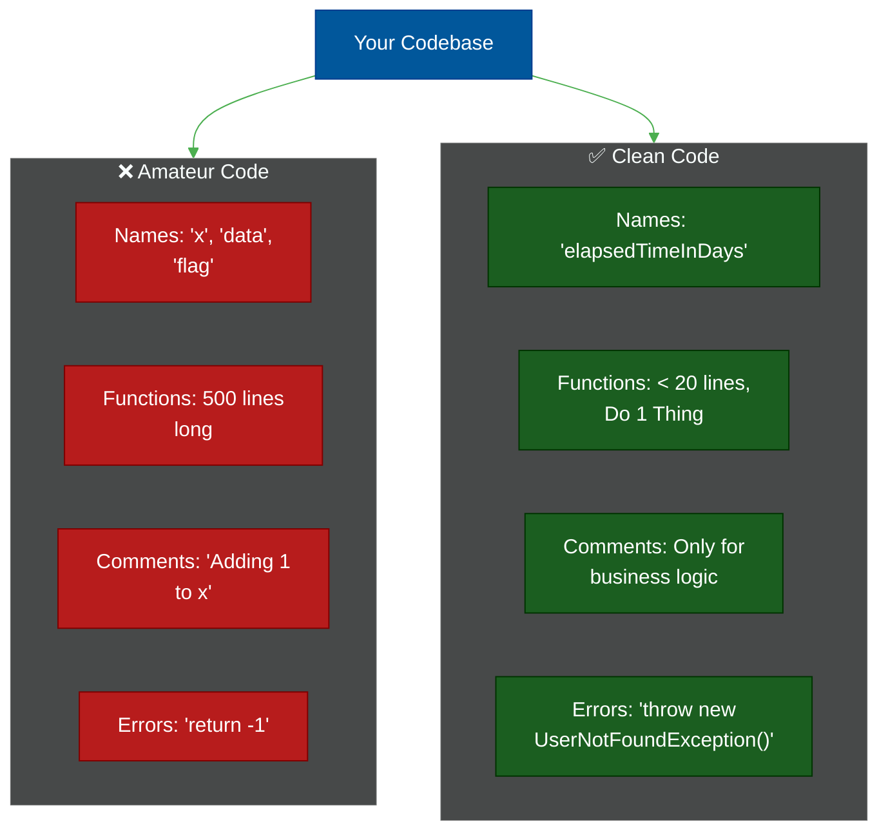

# 🧼 Uncle Bob's Clean Code Rules

A comprehensive distillation of Robert C. Martin's legendary book, *Clean Code: A Handbook of Agile Software Craftsmanship*. This series breaks down the fundamental rules that distinguish professional software engineering from amateur programming.

---

## 📖 Table of Contents

- [The Boy Scout Rule](#the-boy-scout-rule)
- [📚 Module Index](#module-index)
- [The Architecture of Clean Code](#the-architecture-of-clean-code)

---

## The Boy Scout Rule

> *"Always leave the campground cleaner than you found it."*

The core philosophy of Clean Code is that code is read **10 times more** than it is written. Therefore, optimizing for reading is vastly more important than optimizing for writing. You should constantly be refactoring, renaming, and restructuring code as you touch it.

---

## 📚 Module Index

| Module | Title | Level | Read Time | Key Topics |
| :--- | :--- | :--- | :--- | :--- |
| **01** | [Meaningful Names](./01-meaningful-names.md) | Fundamental | ~6 min | Intention-revealing, Pronounceable, Searchable |
| **02** | [Functions & Methods](./02-functions-and-methods.md) | Intermediate | ~8 min | Do One Thing, Small Size, No Side Effects |
| **03** | [Comments & Formatting](./03-comments-and-formatting.md) | Fundamental | ~6 min | Comments as failures, Vertical density, Indentation |
| **04** | [Error Handling & Boundaries](./04-error-handling-boundaries.md) | Intermediate | ~8 min | Exceptions over codes, Wrapping third-party APIs |
| **05** | [Classes & S.O.L.I.D.](./05-classes-and-solid.md) | Advanced | ~10 min | Encapsulation, Cohesion, Single Responsibility |

---

## The Architecture of Clean Code

