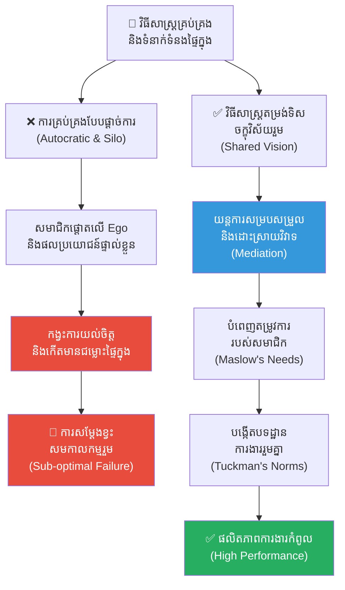

# ២៤១ — អ្នកដឹកនាំក្រុមតន្ត្រី (The Orchestra Conductor)៖ ការរៀបចំរចនាសម្ព័ន្ធអង្គភាព ទំនាក់ទំនងផ្ទៃក្នុង និងការតម្រង់ទិសចក្ខុវិស័យ

**Author:** ichamrong  
**Date:** 2026-05-27  
**Tags:** #organizational-behavior #internal-communications #goal-alignment #team-dynamics #business-sustainability #cambodian-context  
**Category:** Business Sustainability  
**Read Time:** ~12 min  

---

## 📌 មាតិកា (Table of Contents)
- [វិបត្តិធុរកិច្ច និងអន្ទាក់នៃភាពជាឯកត្តជន (The Trap of Individual Virtuosity)](#វិបត្តិធុរកិច្ច-និងអន្ទាក់នៃភាពជាឯកត្តជន-the-trap-of-individual-virtuosity)
- [រឿងនិទានប្រៀបធៀប៖ សំឡេងខ្ទរខ្ទារ និងអ្នកដឹកនាំវង់ភ្លេង (The Parable: The Clashing Virtuosos & The Baton)](#រឿងនិទានប្រៀបធៀប៖-សំឡេងខ្ទរខ្ទារ-និងអ្នកដឹកនាំវង់ភ្លេង-the-parable-the-clashing-virtuosos-&-the-baton)
  - [ការដួលរលំសោភ័ណភាពរបស់ ម៉ាស្ត្រូ ហ្វ្រេដ (The Collapse under Maestro Fred)](#ការដួលរលំសោភ័ណភាពរបស់-ម៉ាស្ត្រូ-ហ្វ្រេដ-the-collapse-under-maestro-fred)
  - [ការមកដល់របស់ ម៉ារ៉ា និងចរន្តចិត្តវិទ្យា (The Emergence of Mara and Behavioral Psychology)](#ការមកដល់របស់-ម៉ារ៉ា-និងចរន្តចិត្តវិទ្យា-the-emergence-of-mara-and-behavioral-psychology)
  - [ដំណើរផ្លាស់ប្តូរ និងលទ្ធផលសមកាលកម្ម (The Symphony of High Performance)](#ដំណើរផ្លាស់ប្តូរ-និងលទ្ធផលសមកាលកម្ម-the-symphony-of-high-performance)
- [ការវិភាគគំនិតសេដ្ឋកិច្ច និងធុរកិច្ច (Theoretical Analysis of Organizational Behavior)](#ការវិភាគគំនិតសេដ្ឋកិច្ច-និងធុរកិច្ច-theoretical-analysis-of-organizational-behavior)
  - [១. ទ្រឹស្តីការវិវត្តក្រុមការងាររបស់ Tuckman (Tuckman's Stages of Group Development)](#១-ទ្រឹស្តីការវិវត្តក្រុមការងាររបស់-tuckman-tuckman's-stages-of-group-development)
  - [២. ទ្រឹស្តីតម្រូវការរបស់ Maslow និងការជំរុញទឹកចិត្ត (Maslow's Hierarchy of Needs in Management)](#២-ទ្រឹស្តីតម្រូវការរបស់-maslow-និងការជំរុញទឹកចិត្ត-maslow's-hierarchy-of-needs-in-management)
  - [៣. ភាពវៃឆ្លាតខាងអារម្មណ៍ និងការគ្រប់គ្រងទំនាក់ទំនង (Emotional Intelligence & Internal Communications)](#៣-ភាពវៃឆ្លាតខាងអារម្មណ៍-និងការគ្រប់គ្រងទំនាក់ទំនង-emotional-intelligence-&-internal-communications)
- [គំនូសតាងលំហូរការងារប្រព័ន្ធឥរិយាបថ (Systemic Behavioral Flow Diagram)](#គំនូសតាងលំហូរការងារប្រព័ន្ធឥរិយាបថ-systemic-behavioral-flow-diagram)
- [ឧទាហរណ៍ជាក់ស្តែងក្នុងពិភពពិត (Real-World Case Studies)](#ឧទាហរណ៍ជាក់ស្តែងក្នុងពិភពពិត-real-world-case-studies)
  - [ករណីសិក្សាទី ១៖ ការតម្រង់ទិសក្រុមការងារចម្រុះមុខងារក្នុង Tech Startup (Cross-Functional Alignment in Tech)](#ករណីសិក្សាទី-១៖-ការតម្រង់ទិសក្រុមការងារចម្រុះមុខងារក្នុង-tech-startup-cross-functional-alignment-in-tech)
  - [ករណីសិក្សាទី ២៖ ការរៀបចំប្រព័ន្ធសេវាកម្មនៃមន្ទីរពេទ្យបង្អែកក្នុងប្រទេសកម្ពុជា (Regional Cambodian Hospital Alignment)](#ករណីសិក្សាទី-២៖-ការរៀបចំប្រព័ន្ធសេវាកម្មនៃមន្ទីរពេទ្យបង្អែកក្នុងប្រទេសកម្ពុជា-regional-cambodian-hospital-alignment)
- [ដំណោះស្រាយ និងមេរៀនយុទ្ធសាស្ត្រធុរកិច្ច (Strategic Solutions & Takeaways)](#ដំណោះស្រាយ-និងមេរៀនយុទ្ធសាស្ត្រធុរកិច្ច-strategic-solutions-&-takeaways)
- [Related Posts / Course Link](#related-posts-course-link)

---

## វិបត្តិធុរកិច្ច និងអន្ទាក់នៃភាពជាឯកត្តជន (The Trap of Individual Virtuosity)

នៅក្នុងការកសាង និងដឹកនាំសហគ្រាស ឬអង្គភាពមួយ ថ្នាក់ដឹកនាំជាច្រើនតែងតែយល់ច្រឡំថា៖ **«ប្រសិនបើយើងជួលមនុស្សដែលពូកែ និងមានសមត្ថភាពខ្ពស់បំផុតមកធ្វើការជាមួយគ្នា នោះយើងនឹងទទួលបានលទ្ធផលការងារដ៏ល្អឥតខ្ចោះដោយស្វ័យប្រវត្ត»**។ ផ្នត់គំនិតនេះបង្កើតជាអន្ទាក់នៃការគិតដ៏ធំមួយ ព្រោះវាបានមើលរំលងភាពស្មុគស្មាញនៃឥរិយាបថអង្គភាព (Organizational Behavior) និងការតម្រង់ទិសចក្ខុវិស័យរួម (Goal Alignment)។

នៅពេលដែលសហគ្រាសប្រមូលផ្តុំទៅដោយបុគ្គលិកឆ្នើមៗ ដែលប្រៀបដូចជាសិល្បករឯកត្តជន (individual virtuosos) ប៉ុន្តែខ្វះនូវរចនាសម្ព័ន្ធទំនាក់ទំនងផ្ទៃក្នុងដ៏រឹងមាំ (internal communication channels) និងការយល់ចិត្តគ្នាទៅវិញទៅមក នោះលទ្ធផលដែលទទួលបានមិនមែនជាផលិតភាពការងារនោះទេ ផ្ទុយទៅវិញ គឺវាបង្កើតជា «ភាពច្របូកច្របល់» និង «ការទាស់ទែងគ្នា» (internal friction and conflict)។ បុគ្គលឆ្នើមម្នាក់ៗព្យាយាមបង្ហាញពីភាពលេចធ្លោផ្ទាល់ខ្លួន (individual ego) បំផ្លាញនូវសមកាលកម្ម (synergy) និងការអភិវឌ្ឍប្រកបដោយនិរន្តរភាពរបស់ក្រុមហ៊ុន។

អត្ថបទនេះនឹងបង្ហាញអំពី៖
1. **រឿងនិទានប្រៀបធៀប (The Parable)** — វិបត្តិនៃការប្រគំតន្ត្រីដែលគ្មានការសម្របសម្រួល និងការផ្លាស់ប្តូរប្រព័ន្ធក្រោមការដឹកនាំដែលមាន EQ ខ្ពស់។
2. **ការវិភាគគំនិតសេដ្ឋកិច្ច និងធុរកិច្ច (Theoretical Analysis)** — ការរុករកទ្រឹស្តីការអភិវឌ្ឍក្រុមការងារ (Tuckman's Stages) ឋានានុក្រមតម្រូវការ (Maslow's Hierarchy) និងការរៀបចំទំនាក់ទំនងផ្ទៃក្នុង។
3. **គំនូសតាងលំហូរការងារ (Mermaid System Diagram)** — ការប្រៀបធៀបឥរិយាបថដែលនាំទៅរកការបរាជ័យ និងសក្តានុពលជោគជ័យ។
4. **ឧទាហរណ៍ជាក់ស្តែងក្នុងពិភពពិត (Real World Cases)** — ករណីសិក្សានៅក្នុងឧស្សាហកម្មបច្ចេកវិទ្យា និងប្រព័ន្ធគ្រប់គ្រងសុខាភិបាលក្នុងប្រទេសកម្ពុជា។
5. **ដំណោះស្រាយ និងមេរៀនយុទ្ធសាស្ត្រ (Strategic Takeaways)** — សកម្មភាពដែលអាចយកទៅអនុវត្តបានភ្លាមៗសម្រាប់អ្នកគ្រប់គ្រង។

---

## រឿងនិទានប្រៀបធៀប៖ សំឡេងខ្ទរខ្ទារ និងអ្នកដឹកនាំវង់ភ្លេង (The Parable: The Clashing Virtuosos & The Baton)

### ការដួលរលំសោភ័ណភាពរបស់ ម៉ាស្ត្រូ ហ្វ្រេដ (The Collapse under Maestro Fred)

នាសម័យកាលដើមសតវត្សទី ២០ នៅក្នុងទីក្រុងវីយែន (Vienna) ដ៏ស្រស់បំព្រង មានរោងមហោស្រពតន្ត្រីដ៏ធំមួយដែលមានឈ្មោះល្បីល្បាញទូទាំងតំបន់។ វង់ភ្លេងរបស់មហោស្រពនេះត្រូវបានបង្កើតឡើងដោយការប្រមូលផ្តុំអ្នកលេងភ្លេង និងអ្នកលេងឧបករណ៍តន្ត្រីឆ្នើមៗជាង ៨០ នាក់ ដែលម្នាក់ៗសុទ្ធតែជាអ្នកឯកទេសខាងឧបករណ៍តន្ត្រីរបស់ខ្លួន មិនថាជាវីយូឡុង ខ្លុយ ឬត្រែឡើយ។ 

ទោះជាយ៉ាងណា វង់ភ្លេងនេះត្រូវបានដឹកនាំដោយ **ម៉ាស្ត្រូ ហ្វ្រេដ (Maestro Fred)** ដែលជាអ្នកដឹកនាំវង់ភ្លេង (Conductor) ដ៏មានកេរ្តិ៍ឈ្មោះល្បីល្បាញខាងបច្ចេកទេស ប៉ុន្តែមានភាពផ្តាច់ការយ៉ាងខ្លាំងក្នុងការគ្រប់គ្រង។ ហ្វ្រេដ ជឿជាក់លើការគ្រប់គ្រងតាមរយៈខ្សែបញ្ជាដ៏តឹងរ៉ឹង (autocratic command structure)។ គាត់បានចេញច្បាប់ថា៖ *«ភារកិច្ចរបស់អ្នកតន្ត្រី គឺមានតែក្រឡេកមើលក្រដាសណោតភ្លេង និងធ្វើតាមចង្អុលបង្ហាញនៃដំបងបន្លឺភ្លេង (baton) របស់ខ្ញុំប៉ុណ្ណោះ។ គ្មានការសួរនាំ គ្មានការបញ្ចេញយោបល់ផ្ទាល់ខ្លួន និងគ្មានការពិភាក្សាឡើយ»*។

ហ្វ្រេដ សម្លឹងមើលសិល្បករម្នាក់ៗប្រៀបដូចជាគ្រឿងម៉ាស៊ីន (mechanistic view)។ គាត់យល់ថាការផ្តល់ប្រាក់ខែខ្ពស់ គឺជាកាតព្វកិច្ចតែមួយគត់ដែលក្រុមហ៊ុនត្រូវធ្វើ ហើយអ្នកតន្ត្រីត្រូវតែលេងឱ្យបានល្អឥតខ្ចោះជាថ្នូរនឹងប្រាក់នោះ។ គាត់មិនដែលខ្វល់ពីភាពតានតឹងផ្លូវចិត្តរបស់សមាជិក ឬជម្លោះផ្ទៃក្នុងរវាងក្រុមឧបករណ៍ខ្សែ (Strings) និងក្រុមឧបករណ៍ផ្លុំខ្យល់ (Woodwinds) ឡើយ។ 

លទ្ធផលបានលេចចេញឡើងយ៉ាងច្បាស់នៅក្នុងការប្រគំតន្ត្រីដ៏ធំប្រចាំឆ្នាំក្នុងខែធ្នូ។ ទោះបីជាសិល្បករម្នាក់ៗលេងបានត្រឹមត្រូវតាមបច្ចេកទេសយ៉ាងណាក៏ដោយ ប៉ុន្តែសំឡេងដែលបញ្ចេញមកគឺខ្វះនូវព្រលឹង និងសមកាលកម្មរួម (no collective synergy)។ អ្នកលេងវីយូឡុងឯក (Violin Soloist) ព្យាយាមលេងឱ្យឮជាងគេដើម្បីបង្អួតសមត្ថភាព ធ្វើឱ្យបាំងសំឡេងដ៏ស្រទន់របស់ក្រុមខ្លុយ។ អ្នកលេងឧបករណ៍ផ្លុំទង់ដែង (Brass) និងអ្នកលេងស្គរធំ (Percussion) លេងដោយកំហឹង និងគ្មានការសម្របសម្រួល។ គ្មានភាពស៊ីសង្វាក់គ្នានៃការសម្តែង (no ensemble cohesion)។ ទស្សនិកជនដែលមកចូលរួមស្តាប់មានអារម្មណ៍ធុញទ្រាន់ និងធ្លាក់ទឹកចិត្តយ៉ាងខ្លាំង រហូតដល់ពួកគេចាប់ផ្តើមដើរចេញពីរោងមហោស្រពតាំងពីម៉ោងសម្រាកពាក់កណ្តាលកម្មវិធី (Intermission)។ ការប្រគំតន្ត្រីនោះបានក្លាយជាភាពបរាជ័យដ៏អាម៉ាស់បំផុតនៅក្នុងប្រវត្តិសាស្ត្ររបស់រោងមហោស្រព។

---

### ការមកដល់របស់ ម៉ារ៉ា និងចរន្តចិត្តវិទ្យា (The Emergence of Mara and Behavioral Psychology)

ដោយមើលឃើញពីការធ្លាក់ចុះនូវប្រជាប្រិយភាព និងហានិភ័យហិរញ្ញវត្ថុ ក្រុមប្រឹក្សាភិបាលនៃមហោស្រពបានសម្រេចចិត្តផ្លាស់ប្តូរអ្នកដឹកនាំ ដោយបានជួលអ្នកដឹកនាំស្រ្តីម្នាក់ឈ្មោះ **ម៉ារ៉ា (Mara)**។ ម៉ា* **បញ្ហា (The Conflict)**៖ 
  * ក្រុមវិស្វករចង់បានកូដដែលស្អាត គ្មានកំហុស និងចង់ចំណាយពេលតេស្តឱ្យបានយូរ (Technical Excellence)។
  * ក្រុមរចនាផលិតផលចង់បាន Feature ស្មុគស្មាញ និងទំនើបបំផុតដើម្បីឈ្នះពានរង្វាន់រចនា (User Experience Artistry)។
  * ក្រុមលក់ចង់បានផលិតផលចេញលក់ឱ្យបានលឿនបំផុតដើម្បីសម្រេចគោលដៅលក់ប្រចាំត្រីមាស និងទទួលបានកម្រៃជើងសារ (Short-term Revenue Driven)។
  * ក្រុមទាំងបីលែងស្តាប់គ្នា ទំនាក់ទំនងផ្ទៃក្នុងត្រូវកាត់ផ្តាច់ និងមានការចោទប្រកាន់គ្នាទៅវិញទៅមកពេលផលិតផលជួបបញ្ហាបច្ចេកទេស។ ម៉ារ៉ា មិនទាន់ឱ្យពួកគេកាន់ឧបករណ៍តន្ត្រីមកលេងភ្លាមៗនោះឡើយ។ នាងបានរៀបចំតុជាវង់មូល និងបានចោទសួរសំណួរដ៏សាមញ្ញមួយទៅកាន់ក្រុមការងារទាំងមូលថា៖ *«ក្នុងនាមជាអ្នកតន្ត្រីដ៏ឆ្នើម តើអ្វីជាកត្តាដែលរារាំងអ្នកទាំងអស់គ្នាមិនឱ្យបញ្ចេញសក្តានុពលដ៏ល្អបំផុតរបស់ខ្លួន? តើវាជាបញ្ហាប្រាក់កម្រៃ ការខ្វះការទទួលស្គាល់ ឬជាទំនាក់ទំនងរវាងគ្នានឹងគ្នា?»*

ដំបូងឡើយ មានតែភាពស្ងប់ស្ងាត់។ ប៉ុន្តែបន្ទាប់មក សមាជិកម្នាក់ៗចាប់ផ្តើមបើកចិត្ត និងបញ្ចេញអារម្មណ៍ពិតប្រាកដដែលបានសង្កត់សង្កិនជាច្រើនឆ្នាំ៖
* អ្នកលេងវីយូឡុងទីពីរ (Second Chair Violinist) បានត្អូញត្អែរថា ពួកគេមិនដែលត្រូវបានគេមើលឃើញ ឬកោតសរសើរឡើយ ទោះបីជាពួកគេខំប្រឹងហាត់យ៉ាងណាក៏ដោយ (lack of recognition)។
* អ្នកលេងឧបករណ៍ផ្លុំខ្យល់ បានលើកឡើងពីភាពមិនច្បាស់លាស់ និងភាពភ័យខ្លាចក្នុងការបាត់បង់ការងារ (job insecurity) ដែលធ្វើឱ្យពួកគេមិនហ៊ានលេងតន្ត្រីដោយភាពច្នៃប្រឌិត និងលះបង់។
* សមាជិកថ្មីៗមានអារម្មណ៍ថា ពួកគេត្រូវបានផាត់ចេញពីក្រុមដោយសារតែឥទ្ធិពល និងអត្តនោម័តរបស់អ្នកចាស់ៗ (interpersonal conflicts)។

ម៉ារ៉ា បានដឹងភ្លាមថា នេះគឺជាសេណារីយ៉ូជាក់ស្តែងនៃទ្រឹស្តី **Maslow's Hierarchy of Needs**។ ដរាបណាតម្រូវការផ្នែកសុវត្ថិភាពផ្លូវចិត្ត (Psychological Safety) ទំនាក់ទំនងសង្គម (Belonging) និងការទទួលបានការគោរព (Esteem) មិនទាន់ត្រូវបានបំពេញទេ ពួកគេមិនអាចឈានដល់កម្រិតកំពូលនៃការបំពេញសម្រេចសមត្ថភាពខ្លួនឯង (Self-Actualization) ដើម្បីលេងតន្ត្រីកម្រិតពិភពលោកបានឡើយ។

---

### ដំណើរផ្លាស់ប្តូរ និងលទ្ធផលសមកាលកម្ម (The Symphony of High Performance)

ម៉ារ៉ា បានចាប់ផ្តើមអនុវត្តយុទ្ធសាស្ត្រផ្លាស់ប្តូរជាជំហានៗ ដោយផ្អែកលើទ្រឹស្តីការអភិវឌ្த்தம்ក្រុមការងាររបស់ Tuckman (**Tuckman's Stages of Group Development**)៖

1. **ដំណាក់កាលបង្កើតក្រុម (Forming Stage)**៖ នាងបានបង្កើតឱ្យមានកម្មវិធីជួបជុំក្រៅផ្លូវការ (informal gatherings) និងកម្មវិធីហាត់សមខ្នាតតូច ដែលគ្មានសម្ពាធពីការដាក់ពិន្ទុ។ នាងបានកំណត់ច្បាស់លាស់ពីគោលដៅរួមរបស់វង់ភ្លេង គឺការបង្កើត «សោភ័ណភាពរួមនៃតន្ត្រី» មិនមែនជាការបង្អួតក្បាច់ឯកត្តជននោះទេ។
2. **ដំណាក់កាលវិវាទ និងការយល់ច្រឡំ (Storming Stage)**៖ នៅពេលដែលជម្លោះរវាងអ្នកលេងវីយូឡុងឯក និងអ្នកលេងស្គរបានផ្ទុះឡើងទាក់ទងនឹងចង្វាក់ភ្លេង ម៉ារ៉ា មិនបានប្រើប្រាស់អំណាចផ្តាច់ការដើម្បីពិន័យ ឬបណ្តេញចេញនោះឡើយ។ ផ្ទុយទៅវិញ នាងបានដើរតួជាអ្នកសម្របសម្រួល (mediator) បើកឱកាសឱ្យភាគីទាំងសងខាងពន្យល់ពីទស្សនៈបច្ចេកទេសរបស់ខ្លួន និងស្វែងរកចំណុចកណ្តាលដែលផ្តល់ផលល្អបំផុតដល់បទភ្លេងទាំងមូល។
3. **ដំណាក់កាលបង្កើតបទដ្ឋាន (Norming Stage)**៖ វង់ភ្លេងបានរួមគ្នាបង្កើតច្បាប់ផ្ទៃក្នុង (team norms) ដូចជា ការមិនបង្អាក់យោបល់គ្នាក្នុងអំឡុងពេលហាត់សម ការផ្តល់មតិស្ថាបនាក្នុងលក្ខណៈស្ងាត់ៗ និងការផ្លាស់ប្តូរវេនគ្នានាំមុខនៅក្នុងវគ្គខ្លីៗ ដើម្បីធានាថាគ្រប់គ្នាសុទ្ធតែមានឱកាសបញ្ចេញសមត្ថភាព និងទទួលបានការគោរព។
4. **ដំណាក់កាលបំពេញការងារដ៏ឆ្នើម (Performing Stage)**៖ នៅក្នុងដំណាក់កាលនេះ សមាជិកម្នាក់ៗយល់ពីតួនាទី និងចង្វាក់របស់គ្នាទៅវិញទៅមកយ៉ាងស៊ីជម្រៅ។ ពួកគេលែងត្រូវការឱ្យម៉ារ៉ាស្រែកបញ្ជាគ្រប់វិនាទីទៀតហើយ។ ពួកគេអាចសម្របខ្លួន និងកែតម្រូវចង្វាក់ភ្លេងទៅតាមស្ថានភាពជាក់ស្តែងនៅលើឆាកដោយស្វ័យប្រវត្ត និងប្រកបដោយភាពស៊ីសង្វាក់គ្នាខ្ពស់បំផុត។

ការប្រគំតន្ត្រីនៅក្នុងខែឧសភាឆ្នាំបន្ទាប់ បានក្លាយជាព្រឹត្តិការណ៍ប្រវត្តិសាស្ត្រដ៏អស្ចារ្យ។ សំឡេងតន្ត្រីដែលបន្លឺឡើងគឺមានភាពស្រទន់ ត្រជាក់ និងអង្រួនចិត្តទស្សនិកជនយ៉ាងខ្លាំង។ គ្រប់ឧបករណ៍តន្ត្រីទាំងអស់បានលេងផ្សារភ្ជាប់គ្នាទៅវិញទៅមក បង្កើតបានជាស្នាដៃសិល្បៈដ៏ល្អឥតខ្ចោះមួយ។ នៅពេលដែលសន្លឹកណោតចុងក្រោយបានបញ្ចប់ ទស្សនិកជនរាប់ពាន់នាក់បានក្រោកឈរឡើងទះដៃអបអរសាទរយ៉ាងខ្លាំងខ្លា និងយូរអង្វែង (*Standing Ovation*)។ រោងមហោស្រពមិនត្រឹមតែទទួលបានជោគជ័យផ្នែកហិរញ្ញវត្ថុ និងកេរ្តិ៍ឈ្មោះឡើងវិញនោះទេ ប៉ុន្តែវាបានក្លាយជាគំរូនៃការកសាងអង្គភាពដែលមានសាមគ្គីភាព និងនិរន្តរភាពពិតប្រាកដ។

---

## ការវិភាគគំនិតសេដ្ឋកិច្ច និងធុរកិច្ច (Theoretical Analysis of Organizational Behavior)

នៅក្នុងវិទ្យាសាស្ត្រនៃការគ្រប់គ្រងធុរកិច្ច ឥរិយាបថអង្គភាព (Organizational Behavior - OB) គឺជាការសិក្សាអំពីរបៀបដែលបុគ្គល (individuals) ក្រុមការងារ (groups) និងរចនាសម្ព័ន្ធ (structures) មានអន្តរកម្មជាមួយគ្នាក្នុងការកំណត់ផលិតភាព និងនិរន្តរភាពរបស់សហគ្រាស។ ករណីសិក្សានៃអ្នកដឹកនាំក្រុមតន្ត្រីនេះ អាចត្រូវបានពន្យល់តាមរយៈទ្រឹស្តីគ្រប់គ្រងគន្លឹះចំនួនបី៖

### ១. ទ្រឹស្តីការវិវត្តក្រុមការងាររបស់ Tuckman (Tuckman's Stages of Group Development)

ក្រុមការងារមិនអាចបង្កើតឡើង និងសម្រេចបានផលិតភាពខ្ពស់ភ្លាមៗនោះឡើយ។ យោងតាមទ្រឹស្តីរបស់ Bruce Tuckman ក្រុមការងារត្រូវតែឆ្លងកាត់ដំណាក់កាលជាប្រព័ន្ធចំនួន ៥៖

| ដំណាក់កាល (Stage) | លក្ខណៈពិសេស (Characteristics) | តួនាទីរបស់អ្នកដឹកនាំ (Leader's Role) |
| :--- | :--- | :--- |
| **១. Forming** (ការបង្កើតក្រុម) | សមាជិកមានការប្រុងប្រយ័ត្ន មិនសូវហ៊ានបញ្ចេញមតិ ស្វែងយល់ពីគោលដៅ និងតួនាទីរៀងៗខ្លួន។ | កំណត់ទិសដៅ ចក្ខុវិស័យ និងគោលបំណងរួមឱ្យបានច្បាស់លាស់។ |
| **២. Storming** (ការវិវាទ/ការប្រឈម) | ជម្លោះផ្ទុះឡើងដោយសារភាពខុសគ្នានៃគំនិត អត្ដចរិត និងការដណ្តើមអំណាច ឬភាពលេចធ្លោ hostility។ | ដើរតួជាអ្នកសម្របសម្រួល (Mediator) បង្កើតច្បាប់នៃការដោះស្រាយវិវាទដោយសន្តិវិធី។ |
| **៣. Norming** (ការបង្កើតបទដ្ឋាន) | សមាជិកចាប់ផ្តើមយល់ចិត្តគ្នា ទទួលយកភាពខុសគ្នា និងបង្កើតក្បួនច្បាប់សហការរួមគ្នា។ | លើកទឹកចិត្តឱ្យមានស្វ័យភាព (Autonomy) និងការជឿជាក់លើគ្នាទៅវិញទៅមក។ |
| **៤. Performing** (ការបំពេញការងារឆ្នើម) | ក្រុមការងារដំណើរការដោយសមកាលកម្មខ្ពស់ មានសាមគ្គីភាព និងដោះស្រាយបញ្ហាដោយឯករាជ្យ។ | ប្រគល់សិទ្ធិអំណាច (Delegation) និងជួយគាំទ្រផ្នែកយុទ្ធសាស្ត្រកម្រិតខ្ពស់។ |
| **៥. Adjourning** (ការរំសាយ/វាយតម្លៃ) | ការបញ្ចប់ការងារ វាយតម្លៃលទ្ធផល និងដកស្រង់មេរៀនដើម្បីការអភិវឌ្ឍនៅគម្រោងបន្ទាប់។ | កោតសរសើរ និងទទួលស្គាល់ការលះបង់របស់សមាជិកគ្រប់រូប។ |

> [!IMPORTANT]
> កំហុសដ៏ធំបំផុតរបស់លោក ម៉ាស្ត្រូ ហ្វ្រេដ គឺគាត់ចង់រុញក្រុមការងារឱ្យទៅដល់ដំណាក់កាល **Performing** ភ្លាមៗ ដោយព្យាយាមលុបបំបាត់ដំណាក់កាល **Storming** តាមរយៈការប្រើប្រាស់អំណាចគាបសង្កត់។ ការធ្វើបែបនេះគ្រាន់តែជួយលាក់បាំងជម្លោះនៅក្រោមផ្ទៃទឹកប៉ុណ្ណោះ តែមិនបានដោះស្រាយវាឡើយ។

---

### ២. ទ្រឹស្តីតម្រូវការរបស់ Maslow និងការជំរុញទឹកចិត្ត (Maslow's Hierarchy of Needs in Management)

មនុស្សមិនអាចផ្តោតអារម្មណ៍លើការងារច្នៃប្រឌិត ឬការស្វែងរកឧត្តមភាពរួមបានឡើយ ប្រសិនបើតម្រូវការជាមូលដ្ឋានរបស់ពួកគេមិនទាន់ត្រូវបានដោះស្រាយ៖

```
         /\
        /  \     Self-Actualization (ការសម្រេចគោលដៅកំពូល៖ ការលេងភ្លេងប្រកបដោយព្រលឹង)
       /    \
      /------\   Esteem Needs (ការទទួលបានការគោរព៖ ការទទួលស្គាល់ស្នាដៃពីអ្នកដឹកនាំ)
     /        \
    /----------\  Social/Belonging (តម្រូវការទំនាក់ទំនង៖ ភាពសាមគ្គី និងការយោគយល់ក្នុងវង់ភ្លេង)
   /            \
  /--------------\ Safety Needs (តម្រូវការសុវត្ថិភាព៖ សន្តិសុខការងារ និងស្ថិរភាពផ្លូវចិត្ត)
 /                \
/------------------\ Physiological Needs (តម្រូវការសរីរវិទ្យា៖ ប្រាក់ខែសមរម្យ និងលក្ខខណ្ឌការងារ)
```

នៅក្នុងបរិបទគ្រប់គ្រងធុរកិច្ចទំនើប៖
* **តម្រូវការសរីរវិទ្យា និងសុវត្ថិភាព (Physiological & Safety Needs)**៖ ការផ្តល់តែប្រាក់បៀវត្សគឺមិនគ្រប់គ្រាន់ទេ បុគ្គលិកត្រូវការសន្តិសុខការងារ (job security) និងបរិយាកាសការងារដែលគ្មានការភ័យខ្លាចពីការដាក់ពិន័យហួសហេតុ។
* **តម្រូវការការគោរព (Esteem Needs)**៖ ការទទួលស្គាល់ស្នាដៃ (Recognition) មិនមែនធ្វើឡើងតែចំពោះអ្នកដឹកនាំក្រុម ឬបុគ្គលលេចធ្លោនោះទេ តែត្រូវធ្វើឡើងចំពោះរាល់បុគ្គលិកនៅគ្រប់ជាន់ថ្នាក់ ដែលបានរួមចំណែកស្ងាត់ៗនៅពីក្រោយខ្នង (ដូចជាអ្នកលេងវីយូឡុងជួរក្រោយៗជាដើម)។

---

### ៣. ភាពវៃឆ្លាតខាងអារម្មណ៍ និងការគ្រប់គ្រងទំនាក់ទំនង (Emotional Intelligence & Internal Communications)

យោងតាមគំរូ EQ របស់ Daniel Goleman អ្នកដឹកនាំដែលមានប្រសិទ្ធភាពត្រូវតែមានធាតុផ្សំគន្លឹះ៖
* **ការយល់ដឹងពីខ្លួនឯង (Self-Awareness)**៖ ដឹងពីឥទ្ធិពលនៃពាក្យសម្តី និងការសម្រេចចិត្តរបស់ខ្លួនទៅលើស្មារតីក្រុម។
* **ការយោគយល់ (Empathy)**៖ សមត្ថភាពក្នុងការដាក់ខ្លួនឯងនៅក្នុងស្ថានភាពរបស់បុគ្គលិក ដើម្បីយល់ពីក្តីបារម្ភ និងកត្តាជម្រុញចិត្តរបស់ពួកគេ។
* **ការគ្រប់គ្រងទំនាក់ទំនង (Relationship Management)**៖ ប្រើប្រាស់យន្តការទំនាក់ទំនងពីរទិស (Two-way communication channels) ដើម្បីកសាងទំនុកចិត្ត (Trust) និងដោះស្រាយវិវាទជាជាងការបង្ខិតបង្ខំ។

---

## គំនូសតាងលំហូរការងារប្រព័ន្ធឥរិយាបថ (Systemic Behavioral Flow Diagram)

ខាងក្រោមនេះជាគំនូសតាងលំហូរដែលបង្ហាញពីអន្តរកម្មរវាងវិធីសាស្ត្រគ្រប់គ្រង និងឥទ្ធិពលរបស់វាទៅលើដំណើរការអង្គភាព៖



---

## ឧទាហរណ៍ជាក់ស្តែងក្នុងពិភពពិត (Real-World Case Studies)

### ករណីសិក្សាទី ១៖ ការតម្រង់ទិសក្រុមការងារចម្រុះមុខងារក្នុង Tech Startup (Cross-Functional Alignment in Tech)

នៅក្នុងក្រុមហ៊ុនបច្ចេកវិទ្យាដែលមានការរីកចម្រើនលឿន (High-growth tech startup) មួយនៅតំបន់អាស៊ីអាគ្នេយ៍ ជម្លោះផ្ទៃក្នុងដ៏ធំមួយបានផ្ទុះឡើងរវាងក្រុមការងារបី៖ **ក្រុមវិស្វករសរសេរកូដ (Engineering)**, **ក្រុមរចនាផលិតផល (Product UX)**, និង **ក្រុមលក់ (Sales)**។

* **បញ្ហា (The Conflict)**៖ 
  * ក្រុមវិស្វករចង់បានកូដដែលស្អាត គ្មានកំហុស និងចង់ចំណាយពេលតេស្តឱ្យបានយូរ (Technical Excellence)目标。
  * ក្រុមរចនាផលិតផលចង់បាន Feature ស្មុគស្មាញ និងទំនើបបំផុតដើម្បីឈ្នះពានរង្វាន់រចនា (User Experience Artistry)。
  * ក្រុមលក់ចង់បានផលិតផលចេញលក់ឱ្យបានលឿនបំផុតដើម្បីសម្រេចគោលដៅលក់ប្រចាំត្រីមាស និងទទួលបានកម្រៃជើងសារ (Short-term Revenue Driven)。
  * ក្រុមទាំងបីលែងស្តាប់គ្នា ទំនាក់ទំនងផ្ទៃក្នុងត្រូវកាត់ផ្តាច់ និងមានការចោទប្រកាន់គ្នាទៅវិញទៅមកពេលផលិតផលជួបបញ្ហាបច្ចេកទេស។

* **ដំណោះស្រាយ (The Resolution)**៖ 
  នាយកប្រតិបត្តិ (CEO) ថ្មីបានផ្លាស់ប្តូរយុទ្ធសាស្ត្រដោយអនុវត្តគោលការណ៍ «អ្នកដឹកនាំក្រុមតន្ត្រី»។ គាត់បានបង្កើតឱ្យមាន **North Star Metric** រួមមួយ គឺ «អត្រារក្សាទុកអ្នកប្រើប្រាស់រយៈពេល ៣០ ថ្ងៃ» (30-day User Retention Rate)។ រាល់ការសម្រេចចិត្ត និងប្រាក់លើកទឹកចិត្ត (incentives) របស់ក្រុមទាំងបីត្រូវផ្សារភ្ជាប់ទៅនឹង Metric តែមួយនេះ។ ទន្ទឹមនឹងនោះ គាត់បានបង្កើតការប្រជុំចម្រុះមុខងារ (cross-functional syncs) ប្រចាំសប្តាហ៍ ដើម្បីឱ្យក្រុមនីមួយៗបានពន្យល់ពីដែនកំណត់បច្ចេកទេសរបស់ខ្លួន។

* **លទ្ធផល (The Outcome)**៖ 
  ការផ្លាស់ប្តូររចនាសម្ព័ន្ធទំនាក់ទំនងនេះបានកាត់បន្ថយជម្លោះផ្ទៃក្នុងរហូតដល់ ៦០% ក្នុងរយៈពេល ៤ ខែ។ ក្រុមហ៊ុនអាចបញ្ចេញផលិតផលថ្មីប្រកបដោយស្ថិរភាព និងបង្កើនការរក្សាទុកអតិថិជនរហូតដល់ ២៥% ព្រោះគ្រប់សមាជិកលែងលេងភ្លេងដើម្បីតែបង្អួតខ្លួនឯងទៀតហើយ តែពួកគេកំពុងសហការគ្នាដើម្បីបទភ្លេងរួមដ៏ពិរោះ។

---

### ករណីសិក្សាទី ២៖ ការរៀបចំប្រព័ន្ធសេវាកម្មនៃមន្ទីរពេទ្យបង្អែកក្នុងប្រទេសកម្ពុជា (Regional Cambodian Hospital Alignment)

នៅមន្ទីរពេទ្យបង្អែកកម្រិតតំបន់មួយក្នុងខេត្តកំពង់ចាម ប្រសិទ្ធភាពនៃការព្យាបាល និងការបំពេញចិត្តរបស់អ្នកជំងឺធ្លាប់បានធ្លាក់ចុះយ៉ាងខ្លាំង ដោយសារតែកង្វះសហការរវាងក្រុមការងារបួនផ្នែក៖ **គ្រូពេទ្យជំនាញ (Specialists)**, **គិលានុបដ្ឋាយិកា (Nurses)**, **បុគ្គលិករដ្ឋបាល (Administration)**, និង **បុគ្គលិកអនាម័យ (Sanitation Staff)**។

* **បញ្ហា (The Conflict)**៖ 
  * គ្រូពេទ្យជំនាញយល់ថាខ្លួនជាអ្នកសំខាន់បំផុត និងមិនសូវស្តាប់របាយការណ៍សង្កេតរបស់អ្នកជំងឺពីគិលានុបដ្ឋាយិកាឡើយ។
  * គិលានុបដ្ឋាយិកាមានអារម្មណ៍ថាត្រូវបានគេមើលងាយ និងលែងចង់ផ្តល់ព័ត៌មានលម្អិត។
  * ក្រុមរដ្ឋបាលផ្តោតតែលើនីតិវិធីក្រដាសស្នាមរញ៉េរញ៉ៃ ធ្វើឱ្យអ្នកជំងឺត្រូវរង់ចាំយូរ។
  * ក្រុមអនាម័យខ្វះការយល់ដឹងពីពេលវេលាចេញចូលរបស់អ្នកជំងឺ ធ្វើឱ្យការសម្អាតបន្ទប់មិនទាន់ពេលវេលា បង្កហានិភ័យឆ្លងរោគ។

* **ដំណោះស្រាយ (The Resolution)**៖ 
  ប្រធានមន្ទីរពេទ្យថ្មីបានផ្លាស់ប្តូររបៀបដឹកនាំដោយការចុះជួបផ្ទាល់ជាមួយក្រុមការងារនីមួយៗ និងអនុវត្តទ្រឹស្តីតម្រូវការរបស់ **Maslow**។ គាត់បានបង្កើតឱ្យមានកម្មវិធី «កោតសរសើរប្រចាំខែ» មិនមែនតែចំពោះគ្រូពេទ្យឆ្នើមនោះទេ តែរួមបញ្ចូលទាំងបុគ្គលិកអនាម័យ និងគិលានុបដ្ឋាយិកាផងដែរ (Esteem Needs)។ គាត់បានដាក់ចេញនូវប្រព័ន្ធរបាយការណ៍រួមគ្នាមួយហៅថា **SBAR (Situation, Background, Assessment, Recommendation)** ដែលជាឧបករណ៍ទំនាក់ទំនងផ្ទៃក្នុងស្តង់ដារ បង្ខំឱ្យគ្រូពេទ្យ និងគិលានុបដ្ឋាយិកាត្រូវសហការគ្នាយ៉ាងស្មើភាព។

* **លទ្ធផល (The Outcome)**៖ 
  ក្នុងរយៈពេល ៦ ខែ សន្ទស្សន៍ពេញចិត្តរបស់អ្នកជំងឺ (Patient Satisfaction Index) បានកើនឡើងរហូតដល់ ៨៥% ហើយអត្រានៃការឆ្លងរោគក្នុងមន្ទីរពេទ្យ (Nosocomial Infection Rate) បានធ្លាក់ចុះយ៉ាងគំហុក។ ប្រធានមន្ទីរពេទ្យបានដើរតួជា «អ្នកដឹកនាំក្រុមតន្ត្រី» ដ៏ជោគជ័យម្នាក់ ដែលអាចសម្របសម្រួលមនុស្សគ្រប់ផ្នែកឱ្យសហការគ្នាដើម្បីសម្រេចបាននូវការសង្គ្រោះជីវិតអ្នកជំងឺប្រកបដោយប្រសិទ្ធភាព។

---

## ដំណោះស្រាយ និងមេរៀនយុទ្ធសាស្ត្រធុរកិច្ច (Strategic Solutions & Takeaways)

ដើម្បីក្លាយជាអ្នកដឹកនាំក្រុមតន្ត្រីដ៏មានប្រសិទ្ធភាពនៅក្នុងធុរកិច្ចរបស់អ្នក ចូរអនុវត្តយុទ្ធសាស្ត្រខាងក្រោម៖

1. **កសាងចក្ខុវិស័យរួមច្បាស់លាស់ (Define the Shared Symphony)**៖
   * ឈប់ឱ្យបុគ្គលិកធ្វើការងារដោយផ្តោតតែលើគោលដៅដាច់ដោយឡែករបស់នាយកដ្ឋានខ្លួនឯង (Silo Mentality)។
   * ត្រូវកំណត់គោលដៅរួមដ៏ធំមួយ (ដូចជា North Star Metric ឬ Shared Mission) ដែលតម្រូវឱ្យគ្រប់ផ្នែកទាំងអស់ត្រូវសហការគ្នាទើបអាចសម្រេចបាន។

2. **បង្កើតយន្តការទំនាក់ទំនងពីរទិស (Establish Two-Way Communication Channels)**៖
   * បង្កើតកម្មវិធីជួបជុំបែប 1-on-1 ជារៀងរាល់ខែ ដើម្បីស្តាប់ពីបញ្ហាប្រឈម និងក្តីបារម្ភផ្ទាល់ខ្លួនរបស់បុគ្គលិក (Empathy and Active Listening)។
   * ប្រើប្រាស់យន្តការមតិត្រឡប់អនាមិក (Anonymous Feedback Systems) ដើម្បីឱ្យបុគ្គលិកហ៊ានបញ្ចេញយោបល់ដោយគ្មានភាពភ័យខ្លាច។

3. **គ្រប់គ្រងវិវាទដោយការសម្របសម្រួល មិនមែនគាបសង្កត់ (Mediate, Don't Suppress)**៖
   * នៅពេលជម្លោះកើតឡើងក្នុងដំណាក់កាល **Storming** មិនត្រូវចាត់ទុកវាជាគ្រោះមហន្តរាយឡើយ តែវាជាឱកាសសម្រាប់ការលូតលាស់។
   * ប្រើប្រាស់វិធីសាស្ត្រសាកសួររកឫសគល់នៃបញ្ហា (ដូចជា 5 Whys Technique) និងដើរតួជាអ្នកសម្របសម្រួលដើម្បីស្វែងរកដំណោះស្រាយឈ្នះ-ឈ្នះ (Win-Win Solutions)。

4. **ទទួលស្គាល់ និងផ្តល់តម្លៃគ្រប់ចំណែក (Recognize the Whole Ensemble)**៖
   * ធានាថាប្រព័ន្ធវាយតម្លៃលទ្ធផលការងារ (Performance Review) ផ្តល់តម្លៃទាំងលើលទ្ធផលបុគ្គល និងការរួមចំណែកដល់ការសហការក្នុងក្រុម (Team Collaboration)។
   * ធ្វើពិធីកោតសរសើរ និងផ្តល់ការលើកទឹកចិត្តដល់បុគ្គលិកដែលខំប្រឹងប្រែងនៅពីក្រោយឆាក ដើម្បីបំពេញតម្រូវការនៃការគោរព (Esteem Needs) របស់ពួកគេ។

---

## Related Posts / Course Link

* **[Organizational Behavior](../01-organizational-behavior.md)** — ក្របខ័ណ្ឌ OB ពេញលេញ រួមមានការវិភាគស៊ីជម្រៅលើទ្រឹស្តី Maslow, Tuckman, Goleman, និង Hofstede សម្រាប់និរន្តរភាពធុរកិច្ច។
* **[Confirmation Bias (ការលំអៀងបញ្ជាក់អំណះអំណាង)៖ អន្ទាក់ចិត្តដែលបង្ខំយើងឱ្យស្តាប់តែអ្វីដែលយើងចង់ឮ](../../../../../concepts/articles/01-confirmation-bias.md)** — វិធីសាស្ត្រជៀសវាងការយល់ឃើញលំអៀងរបស់ថ្នាក់ដឹកនាំនៅពេលធ្វើការសម្រេចចិត្ត។
* **[The 5 Whys Technique៖ ឈប់ដោះស្រាយលើរោគសញ្ញា ចាប់ផ្តើមស្វែងរកឫសគល់នៃបញ្ហា](../../../../../concepts/articles/02-five-whys-technique.md)** — របៀបស្វែងរកឫសគល់នៃវិវាទ និងបញ្ហាផលិតភាពការងារនៅក្នុងអង្គភាព។

---

*Last updated: 2026-05-27*
