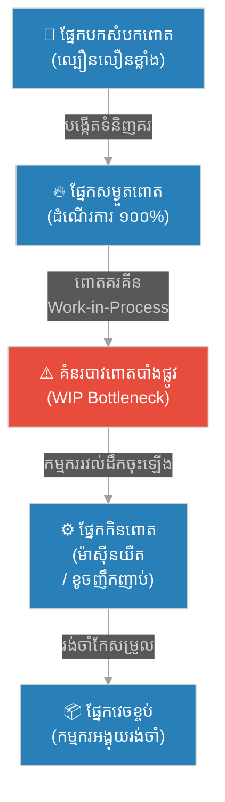
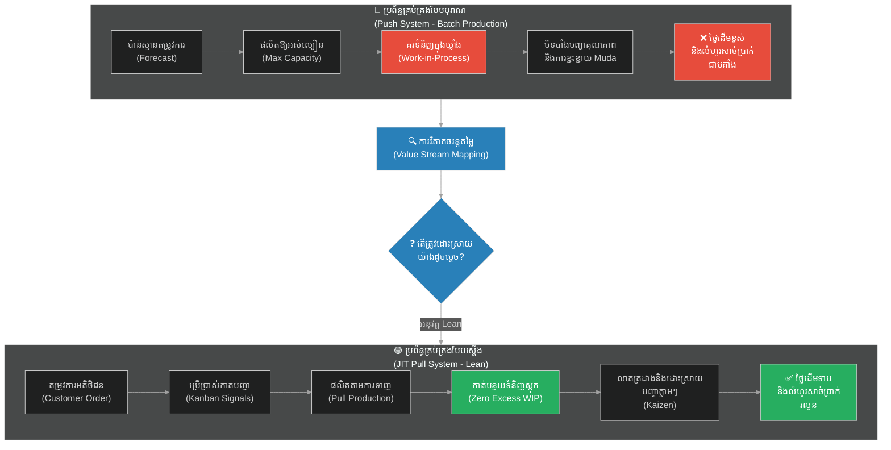

# ២៤២ — ទីធ្លារោងចក្រតូយ៉ូតា (The Toyota Factory Floor)៖ ការគ្រប់គ្រងប្រតិបត្តិការ ផលិតកម្មស្ដើង និងការកាត់បន្ថយកាកសំណល់

**Author:** ichamrong  
**Date:** 2026-05-27  
**Tags:** #operations-management #lean-production #kaizen #muda #waste-elimination #toyota-production-system #cambodian-context  
**Category:** Business Sustainability  
**Read Time:** ~12 min  

---

## 📌 មាតិកា (Table of Contents)
- [អន្ទាក់ផ្លូវចិត្ត / វិបត្តិធុរកិច្ច (The Dilemma / The Trap)](#អន្ទាក់ផ្លូវចិត្ត--វិបត្តិធុរកិច្ច-the-dilemma--the-trap)
- [រឿងនិទានប្រៀបធៀប (The Parable Story)](#រឿងនិទានប្រៀបធៀប-the-parable-story)
  - [រោងម៉ាស៊ីនពោត និងការបំភាន់នៃប្រសិទ្ធភាព (The Corn Processing Mill and the Illusion of Efficiency)](#រោងម៉ាស៊ីនពោត-និងការបំភាន់នៃប្រសិទ្ធភាព-the-corn-processing-mill-and-the-illusion-of-efficiency)
  - [ដំណើរទស្សនកិច្ចរបស់អ្នកជំនាញ និងការលាតត្រដាងកាកសំណល់ (The Expert's Visit and Unmasking the Waste)](#ដំណើរទស្សនកិច្ចរបស់អ្នកជំនាញ-និងការលាតត្រដាងកាកសំណល់-the-experts-visit-and-unmasking-the-waste)
  - [ការធ្វើបដិវត្តន៍តាមរបៀបស្ដើង (The Lean Revolution)](#ការធ្វើបដិវត្តន៍តាមរបៀបស្ដើង-the-lean-revolution)
- [ការវិភាគគំនិតសេដ្ឋកិច្ច / ធុរកិច្ច (Theoretical Analysis)](#ការវិភាគគំនិតសេដ្ឋកិច្ច--ធុរកិច្ច-theoretical-analysis)
  - [១. ការគ្រប់គ្រងប្រតិបត្តិការ (Operations Management)](#១-ការគ្រប់គ្រងប្រតិបត្តិការ-operations-management)
  - [២. ផលិតកម្មស្ដើង និងទ្រឹស្តីតៃល័រ (Lean Production and Taylorism Principles)](#២-ផលិតកម្មស្ដើង-និងទ្រឹស្តីតៃល័រ-lean-production-and-taylorism-principles)
  - [៣. មូដា ឬការលុបបំបាត់កាកសំណល់ទាំង ៧ ប្រភេទ (Muda: The 7 Types of Waste - TIMWOOD)](#៣-មូដា-ឬការលុបបំបាត់កាកសំណល់ទាំង-៧-ប្រភេទ-muda-the-7-types-of-waste---timwood)
  - [៤. គំនិតកែលម្អជាប្រចាំ (Kaizen: Continuous Improvement)](#៤-គំនិតកែលម្អជាប្រចាំ-kaizen-continuous-improvement)
  - [៥. ផលិតកម្មទាន់ពេលល្មម (Just-In-Time / JIT Production)](#៥-ផលិតកម្មទាន់ពេលល្មម-just-in-time--jit-production)
- [គំនូសតាងលំហូរការងារ (High-Contrast Flow Diagram)](#គំនូសតាងលំហូរការងារ-high-contrast-flow-diagram)
- [ឧទាហរណ៍ជាក់ស្តែងក្នុងពិភពពិត (Real World Examples)](#ឧទាហរណ៍ជាក់ស្តែងក្នុងពិភពពិត-real-world-examples)
  - [ឧទាហរណ៍ទី ១៖ ប្រព័ន្ធផលិតកម្មតូយ៉ូតា និងកាតកាន់បាន់ (Toyota Production System & Kanban)](#ឧទាហរណ៍ទី-១៖-ប្រព័ន្ធផលិតកម្មតូយ៉ូតា-និងកាតកាន់បាន់-toyota-production-system--kanban)
  - [ឧទាហរណ៍ទី ២៖ ករណីសិក្សានៅកម្ពុជា — ការដោះស្រាយដបកដបនៅក្នុងរោងចក្រកែច្នៃចំណីអាហារ (Cambodian Case Study: Resolving Bottlenecks on a Food Packaging Floor)](#ឧទាហរណ៍ទី-២៖-ករណីសិក្សានៅកម្ពុជា--ការដោះស្រាយដបកដបនៅក្នុងរោងចក្រកែច្នៃចំណីអាហារ-cambodian-case-study-resolving-bottlenecks-on-a-food-packaging-floor)
- [ដំណោះស្រាយ និងមេរៀនធុរកិច្ច (Strategic Solutions & Takeaways)](#ដំណោះស្រាយ-និងមេរៀនធុរកិច្ច-strategic-solutions--takeaways)
- [Related Posts / Course Link](#related-posts--course-link)

---

## អន្ទាក់ផ្លូវចិត្ត / វិបត្តិធុរកិច្ច (The Dilemma / The Trap)

នៅក្នុងពិភពធុរកិច្ច និងការផលិត (Manufacturing) សហគ្រិន និងអ្នកគ្រប់គ្រងប្រតិបត្តិការភាគច្រើនតែងតែធ្លាក់ចូលទៅក្នុង **«អន្ទាក់នៃប្រសិទ្ធភាពសិប្បនិម្មិត» (The Illusion of Efficiency)**។ ពួកគេជឿជាក់យ៉ាងមុតមាំថា ដើម្បីបង្កើនប្រាក់ចំណេញ និងប្រសិទ្ធភាពការងារ ពួកគេត្រូវតែដំណើរការម៉ាស៊ីនទាំងអស់ និងប្រើប្រាស់កម្លាំងពលកម្មរបស់បុគ្គលិកគ្រប់រូបឱ្យអស់ពីលទ្ធភាព ១០០% ជានិច្ច គ្មានការឈប់សម្រាក។ ការឃើញខ្សែសង្វាក់ផលិតកម្មដំណើរការយ៉ាងគគ្រឹកគគ្រេង និងមានផលិតផលសម្រេចស្តុកទុកយ៉ាងច្រើនសន្ធឹកសន្ធាប់ក្នុងឃ្លាំង តែងតែផ្តល់នូវអារម្មណ៍សុវត្ថិភាព និងភាពជោគជ័យក្លែងក្លាយដល់ពួកគេ។

ទោះជាយ៉ាងណាក៏ដោយ នៅក្នុងការគ្រប់គ្រងប្រតិបត្តិការបែបទំនើប ការបង្ខំឱ្យដំណើរការផលិតកម្មហួសកម្រិតបែបនេះ គឺជាប្រភពនៃការបង្កើត **កាកសំណល់ប្រព័ន្ធ (Systemic Waste)** និង **ការពន្យារពេល (Delays)** ដ៏ធ្ងន់ធ្ងរបំផុត។ នៅពេលដែលស្ថានីយការងារនីមួយៗផលិតទំនិញលឿនពេក និងច្រើនហួសពីតម្រូវការបន្ទាប់របស់ស្ថានីយបន្ទាប់ វានឹងបង្កើតឱ្យមាន **«ទំនិញកំពុងផលិត» (Work-in-Process - WIP)** គរជារានៅគ្រប់កន្លែង។ គំនរទំនិញទាំងនេះមិនត្រឹមតែបង្កកទុនបង្វិល (Working Capital) របស់ក្រុមហ៊ុនប៉ុណ្ណោះទេ ប៉ុន្តែថែមទាំងបិទបាំងនូវរាល់បញ្ហាគុណភាព ភាពយឺតយ៉ាវ និងភាពមិនប្រក្រតីដែលកើតមាននៅក្នុងប្រព័ន្ធផលិតកម្មទាំងមូលផងដែរ។

វិបត្តិដ៏ពិតប្រាកដគឺស្ថិតនៅលើការដែលធុរកិច្ចខិតខំប្រឹងប្រែងផលិតយ៉ាងលឿន ប៉ុន្តែបែរជាចែកចាយផលិតផលទៅដល់ដៃអតិថិជនបានកាន់តែយឺតទៅវិញ។ កម្លាំងពលកម្មដែលចំណាយលើចលនាដែលគ្មានតម្លៃបន្ថែម និងការដឹកជញ្ជូនចុះឡើង ត្រូវបានគេរាប់បញ្ចូលជា «ភាពរវល់» តែមិនមែនជា «លទ្ធផលផលិតភាព» ឡើយ។ នេះហើយជាអន្ទាក់ប្រតិបត្តិការដែលបំផ្លាញនិរន្តរភាពហិរញ្ញវត្ថុ និងលំហូរសាច់ប្រាក់របស់សហគ្រាសខ្នាតតូច និងមធ្យមជាច្រើនដោយមិនដឹងខ្លួន។

---

## រឿងនិទានប្រៀបធៀប (The Parable Story)

### រោងម៉ាស៊ីនពោត និងការបំភាន់នៃប្រសិទ្ធភាព (The Corn Processing Mill and the Illusion of Efficiency)

នៅក្នុងខេត្តត្បូងឃ្មុំ នាដើមទសវត្សរ៍ឆ្នាំ ២០១០ មានសហគ្រាសកែច្នៃពោតក្រៀមមួយកន្លែងដ៏ធំ ដែលគ្រប់គ្រងដោយលោក **សុខា (Sokha)**។ រោងចក្ររបស់គាត់មានតួនាទីទទួលទិញពោតស្រស់ពីកសិករ បកសំបក សម្ងួត កិន និងវេចខ្ចប់ជាបាវដើម្បីនាំចេញទៅលក់នៅលើទីផ្សារអន្តរជាតិ។ 

លោក សុខា គឺជាអ្នកគ្រប់គ្រងបែបប្រពៃណីម្នាក់ដែលផ្តោតលើភាពមមាញឹក។ គាត់តែងតែស្រែកប្រាប់កម្មកររាប់សិបនាក់នៅលើទីធ្លារោងចក្រថា៖ *«ម៉ាស៊ីនទាំងអស់ត្រូវតែដំណើរការកិន និងសម្ងួតគ្មានឈប់ឈរ! កម្មករគ្រប់រូបមិនត្រូវនៅទំនេរដៃឡើយ! ប្រសិនបើយើងឈប់ នោះយើងនឹងខាតបង់លុយ!»*។ 

ដោយសារផ្នត់គំនិតនេះ ផ្នែកបកសំបកពោត និងផ្នែកសម្ងួត បានខិតខំធ្វើការយ៉ាងលឿនបំផុត រហូតដល់ពោតដែលសម្ងួតរួចរាប់សិបតោន ត្រូវបានដឹកជញ្ជូនទៅគរទុកនៅមុខផ្នែកកិន និងផ្នែកវេចខ្ចប់។ ទីធ្លារោងចក្រទាំងមូលពោរពេញទៅដោយបាវពោតគរគ្នាយ៉ាងខ្ពស់ត្រដែត រហូតដល់កម្មករគ្មានផ្លូវដើរត្រឹមត្រូវ និងត្រូវប្រើប្រាស់ឡានស្ទូច (Forklift) ដឹកជញ្ជូនបាវពោតទាំងនោះចុះឡើង ដើម្បីរកកន្លែងទំនេរទុក។

ទោះបីជារោងចក្រមើលទៅហាក់ដូចជាមមាញឹកខ្លាំងក៏ដោយ ប៉ុន្តែលោក សុខា តែងតែជួបប្រទះនូវបញ្ហាដ៏គួរឱ្យឈឺក្បាលជាច្រើន៖
1. **លំហូរសាច់ប្រាក់កកស្ទះ (Cash Flow Tie-up)៖** លុយកាក់ទាំងអស់ត្រូវបានយកទៅប្រើប្រាស់ដើម្បីទិញពោតស្រស់ និងចំណាយលើការសម្ងួត ប៉ុន្តែផលិតផលសម្រេចមិនអាចនាំចេញបានទាន់ពេលឡើយ ព្រោះផ្នែកវេចខ្ចប់នៅយឺតយ៉ាវ។
2. **ការខូចខាតទំនិញ (Inventory Spoilage)៖** ដោយសារគំនរបាវពោតត្រូវរង់ចាំកិនយូរពេកនៅក្នុងបរិយាកាសសើម និងខ្វះខ្យល់ចេញចូល ពោតប្រមាណ ២០% បានកើតផ្សិត និងខូចគុណភាព ដែលតម្រូវឱ្យកម្មករត្រូវចំណាយពេលបំបែកចេញ និងកិនឡើងវិញ (Rework)។
3. **គ្រោះថ្នាក់ការងារ និងការខ្ជះខ្ជាយចលនា (Motion & Safety Issues)៖** កម្មករត្រូវដើរជុំវិញគំនរបាវពោតដ៏ធំ ដែលធ្វើឱ្យពួកគេចំណាយកម្លាំងកាយ និងពេលវេលាយ៉ាងច្រើនលើការដើរស្វែងរកឧបករណ៍ និងការដឹកជញ្ជូនដែលមិនចាំបាច់។

---

### ដំណើរទស្សនកិច្ចរបស់អ្នកជំនាញ និងការលាតត្រដាងកាកសំណល់ (The Expert's Visit and Unmasking the Waste)

ដោយមានការបារម្ភពីការធ្លាក់ចុះនៃប្រាក់ចំណេញ និងការកើនឡើងនៃថ្លៃដើមប្រតិបត្តិការ លោក សុខា បានសម្រេចចិត្តអញ្ជើញ **លោក តាណាកា (Mr. Tanaka)** ដែលជាអ្នកប្រឹក្សាយោបល់ផ្នែកគ្រប់គ្រងប្រតិបត្តិការ និងជាអតីតវិស្វករជាន់ខ្ពស់ដែលធ្លាប់បម្រើការងារនៅលើទីធ្លារោងចក្រតូយ៉ូតា (Toyota Factory Floor) នៅប្រទេសជប៉ុន អស់រយៈពេលជាង ៣០ ឆ្នាំ។

នៅថ្ងៃដំបូងនៃការចុះមកដល់ទីធ្លារោងចក្រ លោក តាណាកា មិនបានសុំមើលរបាយការណ៍ហិរញ្ញវត្ថុ ឬស្តាប់បទបង្ហាញ PowerPoint ណាមួយឡើយ។ ផ្ទុយទៅវិញ គាត់បានសុំឱ្យលោក សុខា នាំគាត់ទៅឈរនៅចំកណ្តាលទីធ្លារោងចក្រកែច្នៃនោះ រួចគូររង្វង់មូលតូចមួយនៅលើដីដោយដីស ហើយប្រាប់លោក សុខា ថា៖ *«ចូរយើងទាំងពីរនាក់ឈរនៅក្នុងរង្វង់នេះ ហើយសង្កេតមើលលំហូរនៃការងារ និងកម្មករដោយស្ងៀមស្ងាត់ រយៈពេល ៣ ម៉ោង»*។ វិធីសាស្ត្រនេះនៅក្នុងប្រព័ន្ធផលិតកម្មតូយ៉ូតាត្រូវបានគេហៅថា **«រង្វង់អូណូ» (Ohno Circle)**។

បន្ទាប់ពីការឈរពិនិត្យយ៉ាងយកចិត្តទុកដាក់ លោក តាណាកា បានចង្អុលបង្ហាញទៅកាន់លោក សុខា នូវការពិតដ៏ជូរចត់៖
* *«លោក សុខា តើលោកឃើញកម្មករពីរនាក់នៅទីនោះទេ? ពួកគេកំពុងលើកបាវពោតចេញពីកន្លែង A ទៅកន្លែង B ដើម្បីតែបើកផ្លូវឱ្យឡានស្ទូចដើរ រួចហើយពួកគេត្រូវលើកបាវនោះត្រឡប់មកកន្លែង A វិញដដែល។ នេះមិនមែនជាការងារបន្ថែមតម្លៃ (Value-added work) ទេ វាជា **ការខ្ជះខ្ជាយចលនា (Waste of Motion)** និង **ការដឹកជញ្ជូន (Transport Waste)**!»*
* *«ចូរមើលទៅផ្នែកវេចខ្ចប់! កម្មករ ៤ នាក់កំពុងអង្គុយរង់ចាំអស់រយៈពេល ២០ នាទី ព្រោះម៉ាស៊ីនកិនពោតនៅផ្នែកមុនបានខូច និងកំពុងរង់ចាំការជួសជុល។ នេះគឺ **ការខ្ជះខ្ជាយនៃការរង់ចាំ (Waste of Waiting)**!»*
* *«ហើយគំនរបាវពោតដ៏មហាសាលដែលកំពុងគរស្អុយផ្សិតនេះ គឺជា **ការខ្ជះខ្ជាយនៃការផលិតហួសតម្រូវការ (Overproduction)** និង **សន្និធិលើសកម្រិត (Excessive Inventory)**! លោកបានចំណាយលុយទិញ និងសម្ងួតពួកវា ប៉ុន្តែលោកមិនទាន់អាចលក់វាបាននៅឡើយទេ។ នេះហើយជាចំណុចដែលលុយរបស់លោកត្រូវកប់ចោល និងរលាយបាត់!»*

លោក តាណាកា បានពន្យល់ថា ការខ្ជះខ្ជាយទាំងនេះនៅក្នុងភាសាជប៉ុនហៅថា **«មូដា» (Muda / 無駄)**។ នៅក្នុងប្រព័ន្ធផលិតកម្មតូយ៉ូតា ភាពមមាញឹកដែលមិនបង្កើតតម្លៃបន្ថែម គឺគ្រាន់តែជាការបិទបាំងនូវរាល់កំហុសឆ្គងនៃប្រព័ន្ធការងារប៉ុណ្ណោះ។

---

### ការធ្វើបដិវត្តន៍តាមរបៀបស្ដើង (The Lean Revolution)

លោក សុខា បានភ្ញាក់រលឹក និងយល់ព្រមឱ្យលោក តាណាកា ដឹកនាំការផ្លាស់ប្តូររោងចក្រទាំងមូលទៅជា **«ផលិតកម្មស្ដើង» (Lean Production)**។ ពួកគេបានចំណាយពេល ៦ ខែ បន្ទាប់ដើម្បីអនុវត្តការផ្លាស់ប្តូរជាយុទ្ធសាស្ត្ររួមមាន៖

1. **ការគូសផែនទីលំហូរតម្លៃ (Value Stream Mapping - VSM)៖** ពួកគេបានកំណត់រាល់ជំហានការងារទាំងអស់ ចាប់ពីពោតស្រស់ចូលរោងចក្រ រហូតដល់ចេញជាផលិតផលសម្រេច។ ជំហានណាដែលមិនបង្កើតតម្លៃបន្ថែម (Non-value added) ត្រូវបានកាត់ចោលភ្លាមៗ។
2. **ការអនុវត្តប្រព័ន្ធទាញ និងទាន់ពេលល្មម (Pull System & Just-In-Time)៖** ពួកគេបានបញ្ឈប់ការបង្ខំឱ្យផ្នែកបកសំបក និងផ្នែកសម្ងួតផលិតឱ្យអស់ល្បឿន។ ផ្ទុយទៅវិញ ពួកគេប្រើប្រាស់ប្រព័ន្ធ **កានបាន់ (Kanban)** ដោយផ្នែកសម្ងួតនឹងដំណើរការផលិតតែនៅពេលដែលទទួលបានសញ្ញា ឬកាតបញ្ជាទិញពីផ្នែកកិន និងផ្នែកវេចខ្ចប់ប៉ុណ្ណោះ។ ប្រសិនបើផ្នែកវេចខ្ចប់មិនទាន់ត្រូវការទេ ផ្នែកមុនៗត្រូវផ្អាកដំណើរការ ឬទៅជួយសម្អាត និងថែទាំម៉ាស៊ីនវិញ។
3. **ការរៀបចំទីធ្លារោងចក្រតាមប្រព័ន្ធ 5S (5S Methodology)៖**
   * **Sort (សើរើ/ចាត់ចែង)៖** ឧបករណ៍ដែលលែងប្រើប្រាស់ និងកម្ទេចកំទីទាំងឡាយ ត្រូវបានបោសសម្អាត និងយកចេញពីរោងចក្រ។
   * **Set in Order (រៀបរយ/រៀបចំទុកដាក់)៖** ឧបករណ៍នីមួយៗត្រូវបានកំណត់កន្លែងទុកដាក់ច្បាស់លាស់ និងមានគំនូសផ្លូវលំហូរការងារ (Flow paths) ពណ៌លឿងនៅលើកម្រាលឥដ្ឋ ដើម្បីការពារកុំឱ្យមានការគរទំនិញបាំងផ្លូវ។
   * **Shine (សម្អាត)៖** ទីតាំងការងារត្រូវតែស្អាតជានិច្ច ដើម្បីងាយស្រួលរកឃើញភាពមិនប្រក្រតី ឬការលេចធ្លាយប្រេងម៉ាស៊ីន។
   * **Standardize (ស្តង់ដារ)៖** បង្កើតសេចក្តីណែនាំប្រតិបត្តិការស្តង់ដារ (Standard Operating Procedures - SOP) យ៉ាងសាមញ្ញ ដោយបិទនៅគ្រប់ស្ថានីយការងារ។
   * **Sustain (រក្សាស្តង់ដារ)៖** អនុវត្តការត្រួតពិនិត្យប្រចាំថ្ងៃ និងវាយតម្លៃដើម្បីរក្សាទម្លាប់ល្អនេះ។

**លទ្ធផលដ៏អស្ចារ្យ៖**  
បន្ទាប់ពីរយៈពេល ៦ ខែ គំនរបាវពោតដែលធ្លាប់តែកកស្ទះលើទីធ្លារោងចក្រត្រូវបានបាត់បង់អស់ ជំនួសមកវិញនូវលំហូរការងារដ៏រលូន។ អត្រាពោតខូចគុណភាព និងកើតផ្សិតបានធ្លាក់ចុះពី **២០% មកត្រឹមតែក្រោម ២%**។ រយៈពេលសរុបនៃការកែច្នៃពោតតាំងពីការទិញចូលរហូតដល់ដឹកជញ្ជូនចេញ (Lead Time) ត្រូវបានកាត់បន្ថយពី **១៤ ថ្ងៃ មកត្រឹមតែ ៤ ថ្ងៃប៉ុណ្ណោះ**។ លំហូរសាច់ប្រាក់បង្វិលរបស់លោក សុខា បានកើនឡើងយ៉ាងគំហុក ហើយកម្មករលែងមានអារម្មណ៍ហត់នឿយខ្លាំងដូចមុនទៀតហើយ ព្រោះពួកគេលែងត្រូវធ្វើការងារដែលគ្មានប្រយោជន៍។

---

## ការវិភាគគំនិតសេដ្ឋកិច្ច / ធុរកិច្ច (Theoretical Analysis)

ដើម្បីយល់ដឹងឱ្យបានស៊ីជម្រៅពីដំណើរការផ្លាស់ប្តូរ និងប្រព័ន្ធគ្រប់គ្រងប្រតិបត្តិការរបស់តូយ៉ូតា នេះជាការវិភាគលើគោលការណ៍សិក្សា និងទ្រឹស្តីសេដ្ឋកិច្ចសំខាន់ៗ៖

### ១. ការគ្រប់គ្រងប្រតិបត្តិការ (Operations Management)
**ការគ្រប់គ្រងប្រតិបត្តិការ (Operations Management)** គឺជាវិទ្យាសាស្ត្រ និងសិល្បៈនៃការរៀបចំ ត្រួតពិនិត្យ និងកែលម្អដំណើរការផលិតកម្ម ដើម្បីបំប្លែងធាតុចូល (Inputs - ដូចជា វត្ថុធាតុដើម កម្លាំងពលកម្ម ពេលវេលា និងថាមពល) ទៅជាធាតុចេញសម្រេច (Outputs - ផលិតផល ឬសេវាកម្មដែលមានគុណតម្លៃ)។ គោលដៅចម្បងគឺការបង្កើន **ប្រសិទ្ធភាព (Efficiency - ការធ្វើការងារដោយប្រើប្រាស់ធនធានតិចបំផុត)** និង **ស័ក្តិសិទ្ធភាព (Effectiveness - ការធ្វើការងារឱ្យត្រូវចំគោលដៅ និងតម្រូវការអតិថិជន)**។

### ២. ផលិតកម្មស្ដើង និងទ្រឹស្តីតៃល័រ (Lean Production and Taylorism Principles)
* **ទ្រឹស្តីតៃល័រ (Taylorism / Scientific Management)៖** បង្កើតឡើងដោយ Frederick Winslow Taylor នាសម័យបដិវត្តន៍ឧស្សាហកម្ម ដោយផ្តោតលើការបែងចែកការងារឱ្យទៅជាផ្នែកតូចៗ និងការបង្កើនល្បឿនការងាររបស់បុគ្គលិកម្នាក់ៗឱ្យដល់កម្រិតអតិបរមា។ ទោះជាយ៉ាងណាក៏ដោយ ទ្រឹស្តីនេះតែងតែមើលរំលងពីបញ្ហាកាកសំណល់ដែលកើតឡើងរវាងស្ថានីយការងារ និងផលប៉ះពាល់លើស្មារតីរបស់បុគ្គលិក។
* **ផលិតកម្មស្ដើង (Lean Production)៖** គឺជាទស្សនវិជ្ជាគ្រប់គ្រងដែលផ្តោតលើការ **បង្កើតតម្លៃបន្ថែមសម្រាប់អតិថិជន (Customer Value)** តាមរយៈការលុបបំបាត់រាល់សកម្មភាពទាំងឡាយណាដែលមិនបង្កើតតម្លៃបន្ថែម (Non-value-added activities)។ ផ្ទុយពី Taylorism ទ្រឹស្តី Lean យកចិត្តទុកដាក់ខ្ពស់លើលំហូរការងារទាំងមូល (Systemic Flow) និងការផ្តល់អំណាចដល់កម្មករជួរមុខក្នុងការចូលរួមដោះស្រាយបញ្ហា។

### ៣. មូដា ឬការលុបបំបាត់កាកសំណល់ទាំង ៧ ប្រភេទ (Muda: The 7 Types of Waste - TIMWOOD)
នៅក្នុងប្រព័ន្ធផលិតកម្មតូយ៉ូតា (TPS) កាកសំណល់ ឬ **Muda (無駄)** ត្រូវបានបែងចែកជា ៧ ប្រភេទ ដែលងាយស្រួលចងចាំតាមរយៈពាក្យកាត់ថា **TIMWOOD**៖
1. **T - Transportation (ការដឹកជញ្ជូន)៖** ការផ្លាស់ទីវត្ថុធាតុដើម ឬទំនិញចុះឡើងដោយមិនចាំបាច់។
2. **I - Inventory (សន្និធិលើសកម្រិត)៖** ការស្តុកទុកវត្ថុធាតុដើម ទំនិញពាក់កណ្តាលសម្រេច (WIP) ឬផលិតផលសម្រេចច្រើនហួសហេតុ ដែលនាំឱ្យកកស្ទះដើមទុន និងខូចខាត។
3. **M - Motion (ចលនាដែលគ្មានប្រយោជន៍)៖** សកម្មភាពកាយវិការរបស់កម្មករដែលមិនចាំបាច់ ដូចជាការដើរស្វែងរកឧបករណ៍ការងារ ឬការបត់បែនខ្លួនខុសបច្ចេកទេស។
4. **W - Waiting (ការរង់ចាំ)៖** ពេលវេលាដែលកម្មករ ឬម៉ាស៊ីនត្រូវនៅទំនេរ ដើម្បីរង់ចាំជំហានការងារមុន ឬរង់ចាំព័ត៌មាន និងការជួសជុល។
5. **O - Overproduction (ការផលិតលើសតម្រូវការ)៖** ការផលិតទំនិញលឿនពេក ច្រើនពេក ឬមុនពេលដែលអតិថិជនត្រូវការ។ នេះជាកាកសំណល់ដ៏គ្រោះថ្នាក់បំផុត ព្រោះវាបង្កើតឱ្យមានកាកសំណល់ដទៃទៀត។
6. **O - Overprocessing (ដំណើរការលើសកម្រិត)៖** ការបន្ថែមលក្ខណៈសម្បត្តិ ឬធ្វើការងារលើផលិតផលច្រើនជាងអ្វីដែលអតិថិជនចង់បាន និងសុខចិត្តបង់ប្រាក់ឱ្យ។
7. **D - Defects (ភាពខ្វះចន្លោះ/ការខូចខាត)៖** ផលិតផលដែលមិនគ្រប់ស្តង់ដារ ដែលតម្រូវឱ្យមានការជួសជុល កិនឡើងវិញ (Rework) ឬបោះចោល។

### ៤. គំនិតកែលម្អជាប្រចាំ (Kaizen: Continuous Improvement)
**កាយហ្សេន (Kaizen / 改善)** គឺជាទស្សនវិជ្ជានៃការផ្លាស់ប្តូរ និងកែលម្អប្រព័ន្ធការងារបន្តិចម្តងៗជាប្រចាំ ដោយគ្មានទីបញ្ចប់។ វាជឿជាក់ថា គ្មានប្រព័ន្ធណាដែលល្អឥតខ្ចោះនោះទេ ហើយការផ្លាស់ប្តូរតូចៗរាប់រយដងដែលធ្វើឡើងដោយបុគ្គលិកគ្រប់កម្រិត (ចាប់ពីកម្មករអនាម័យរហូតដល់នាយកប្រតិបត្តិ) នឹងបង្កើតឱ្យមានការរីកចម្រើនយ៉ាងមហាសាល និងមាននិរន្តរភាពសម្រាប់ស្ថាប័ន។

### ៥. ផលិតកម្មទាន់ពេលល្មម (Just-In-Time / JIT Production)
**ផលិតកម្មទាន់ពេលល្មម (Just-In-Time - JIT)** គឺជាយុទ្ធសាស្ត្រប្រតិបត្តិការដែលតម្រូវឱ្យផលិត និងចែកចាយតែ **«អ្វីដែលត្រូវការ ក្នុងបរិមាណដែលត្រូវការ និងនៅពេលដែលត្រូវការ»** ប៉ុណ្ណោះ។ JIT ពឹងផ្អែកលើ **«ប្រព័ន្ធទាញ» (Pull System)** ដែលជំរុញដោយតម្រូវការជាក់ស្តែងរបស់អតិថិជន (Demand-driven) ជាជាងការប៉ាន់ស្មាន រួមផ្សំនឹងការប្រើប្រាស់ **កានបាន់ (Kanban)** ដើម្បីសម្របសម្រួលលំហូរព័ត៌មានរវាងស្ថានីយការងារ។

---

## គំនូសតាងលំហូរការងារ (High-Contrast Flow Diagram)

ខាងក្រោមនេះជាគំនូសតាងលំហូរការងារ បង្ហាញពីប្រព័ន្ធគ្រប់គ្រងប្រតិបត្តិការបែបប្រពៃណី (Push System) ដែលពោរពេញដោយកាកសំណល់ ប្រៀបធៀបទៅនឹងការបំប្លែងទៅជាប្រព័ន្ធគ្រប់គ្រងបែបស្ដើង (Lean / JIT Pull System)៖

---

## ឧទាហរណ៍ជាក់ស្តែងក្នុងពិភពពិត (Real World Examples)

### ឧទាហរណ៍ទី ១៖ ប្រព័ន្ធផលិតកម្មតូយ៉ូតា និងកាតកាន់បាន់ (Toyota Production System & Kanban)
បន្ទាប់ពីសង្គ្រាមលោកលើកទីពីរ ក្រុមហ៊ុនផលិតរថយន្តតូយ៉ូតា (Toyota) ជួបប្រទះនូវវិបត្តិខ្វះខាតដើមទុន និងធនធានយ៉ាងធ្ងន់ធ្ងរ ដែលមិនអាចអនុវត្តប្រព័ន្ធផលិតកម្មទ្រង់ទ្រាយធំ (Mass Production) ដូចក្រុមហ៊ុន Ford នៅសហរដ្ឋអាមេរិកបានឡើយ។ លោក **តៃអ៊ីឈី អូណូ (Taiichi Ohno)** ដែលជាវិស្វកររបស់តូយ៉ូតា បានបង្កើតប្រព័ន្ធ **TPS (Toyota Production System)** ដោយទទួលបានគំនិតបំផុសពីរបៀបដែល «ផ្សារទំនើបអាមេរិក» ប្រតិបត្តិការ។ 

នៅក្នុងផ្សារទំនើប អតិថិជននឹងដកទំនិញចេញពីធ្នើរតែតាមបរិមាណដែលពួកគេត្រូវការ ហើយបុគ្គលិកផ្សារទំនើបនឹងយកទំនិញថ្មីមកបំពេញបន្ថែមលើធ្នើរតែចំពោះទំនិញដែលបានលក់ដាច់ទៅនោះប៉ុណ្ណោះ។ តូយ៉ូតាបានយកគោលការណ៍នេះមកអនុវត្តក្នុងរោងចក្រ ដោយបង្កើតកាតព័ត៌មានហៅថា **កានបាន់ (Kanban)**។ នៅពេលដែលស្ថានីយការងារ B ប្រើប្រាស់គ្រឿងបន្លាស់អស់មួយប្រអប់ ពួកគេនឹងបញ្ជូនកាត Kanban ត្រឡប់ទៅស្ថានីយការងារ A ដើម្បីជាសញ្ញាអនុញ្ញាតឱ្យផលិតគ្រឿងបន្លាស់ថ្មីមួយប្រអប់មកជំនួស។ ប្រព័ន្ធនេះបានធ្វើឱ្យតូយ៉ូតាក្លាយជាក្រុមហ៊ុនផលិតរថយន្តដែលមានប្រសិទ្ធភាពខ្ពស់បំផុត និងកាត់បន្ថយថ្លៃដើមស្តុកទំនិញបានស្ទើរតែដល់សូន្យ (Zero Inventory) ដែលបដិវត្តន៍ឧស្សាហកម្មផលិតកម្មទូទាំងសកលលោក។

---

### ឧទាហរណ៍ទី ២៖ ករណីសិក្សានៅកម្ពុជា — ការដោះស្រាយដបកដបនៅក្នុងរោងចក្រកែច្នៃចំណីអាហារ (Cambodian Case Study: Resolving Bottlenecks on a Food Packaging Floor)
នៅក្នុងខេត្តកំពង់ចាម មានសហគ្រាសក្នុងស្រុកមួយកន្លែងដែលកែច្នៃ និងវេចខ្ចប់ «ស្វាយចន្ទីលីង» សម្រាប់ផ្គត់ផ្គង់ទីផ្សារក្នុងប្រទេស និងនាំចេញក្នុងតំបន់។ កាលពីមុន ម្ចាស់សហគ្រាសតែងតែជួបប្រទះបញ្ហាដបកដប (Bottleneck) នៅផ្នែក «បកសំបកចន្ទីដោយដៃ» និងផ្នែក «លីងគ្រឿងផ្សំ»។ ដោយសារផ្នែកលីង និងផ្នែកបកសំបកធ្វើការលឿនពេក គ្រាប់ស្វាយចន្ទីរាប់តោនត្រូវបានគរទុកចោលនៅលើតុការងារ រង់ចាំផ្នែក «វេចខ្ចប់ និងបិទស្លាកសញ្ញា» ដែលដំណើរការយឺតជាងគេ។

ការកកស្ទះនេះបណ្តាលឱ្យគ្រាប់ស្វាយចន្ទីបាត់បង់ភាពស្រួយ និងស្រូបសំណើមពីខ្យល់ ដែលធ្វើឱ្យគុណភាពផលិតផលធ្លាក់ចុះ និងត្រូវយកទៅលីងឡើងវិញ (Rework Waste)។ បន្ទាប់ពីបានទទួលការប្រឹក្សាយោបល់ សហគ្រាសបានអនុវត្តគោលការណ៍ Lean៖
* ពួកគេបានរៀបចំទីធ្លាការងារឡើងវិញដោយប្តូរពីលំហូរការងាររញ៉េរញ៉ៃ មកជាខ្សែសង្វាក់ការងាររាងអក្សរ U (U-shaped Layout) ដែលជួយកាត់បន្ថយចលនាដើររបស់កម្មករបានរហូតដល់ ៤០%។
* ពួកគេបានបង្កើតប្រព័ន្ធទាញ (Pull System) ដោយកំណត់ឱ្យផ្នែកលីង ផលិតគ្រឿងផ្សំទៅតាមសមត្ថភាពជាក់ស្តែងដែលផ្នែកវេចខ្ចប់អាចធ្វើបានក្នុងមួយម៉ោងប៉ុណ្ណោះ។
* លទ្ធផល៖ សហគ្រាសអាចលុបបំបាត់ការខូចខាតគ្រាប់ស្វាយចន្ទីបានទាំងស្រុង កាត់បន្ថយរយៈពេលស្តុកទុកទំនិញពាក់កណ្តាលសម្រេច និងបង្កើនទិន្នផលវេចខ្ចប់សរុបបាន **៣៥%** ដោយមិនបាច់ទិញម៉ាស៊ីនថ្មី ឬជួលបុគ្គលិកបន្ថែមឡើយ។

---

## ដំណោះស្រាយ និងមេរៀនធុរកិច្ច (Strategic Solutions & Takeaways)

ដើម្បីដោះស្រាយបញ្ហាកាកសំណល់ និងបង្កើនប្រសិទ្ធភាពប្រតិបត្តិការប្រកបដោយនិរន្តរភាព អ្នកគ្រប់គ្រង និងម្ចាស់អាជីវកម្មគួរតែអនុវត្តយុទ្ធសាស្ត្រគន្លឹះដូចខាងក្រោម៖

1. **ឈប់ផ្តោតលើភាពមមាញឹក ចូរផ្តោតលើលំហូរតម្លៃ (Focus on Flow, Not Busyness)៖**  
   អ្នកគ្រប់គ្រងត្រូវតែលះបង់ចោលនូវផ្នត់គំនិតដែលថា «កម្មករគ្រប់រូបត្រូវតែរវល់គ្រប់វិនាទី»។ ចូរវាស់វែងប្រសិទ្ធភាពរបស់រោងចក្រ ឬការិយាល័យ ផ្អែកលើល្បឿនដែលផលិតផល ឬសេវាកម្មអាចធ្វើដំណើរឆ្លងកាត់ប្រព័ន្ធទៅដល់ដៃអតិថិជន (Lead Time) មិនមែនផ្អែកលើចំនួនម៉ោងដែលម៉ាស៊ីនដំណើរការនោះឡើយ។

2. **លុបបំបាត់ «មូដា» (Muda) ដោយចាប់ផ្តើមពីប្រព័ន្ធ 5S ជានិច្ច៖**  
   ប្រព័ន្ធ 5S មិនមែនគ្រាន់តែជាការធ្វើអនាម័យបោសសម្អាតធម្មតានោះទេ ប៉ុន្តែវាគឺជាគ្រឹះនៃការលាតត្រដាងរាល់បញ្ហានិងកាកសំណល់ដែលលាក់កំបាំង។ នៅពេលដែលកន្លែងធ្វើការមានសណ្តាប់ធ្នាប់ ភាពមិនប្រក្រតី (ដូចជាទំនិញខូច ឬម៉ាស៊ីនលេចធ្លាយប្រេង) នឹងលេចចេញមកឱ្យឃើញភ្លាមៗ ដែលអនុញ្ញាតឱ្យយើងដោះស្រាយបានទាន់ពេលវេលា។

3. **អនុវត្តយន្តការអណ្តុង (Andon System - Stop-the-Line Power)៖**  
   នៅក្នុងរោងចក្រតូយ៉ូតា កម្មករគ្រប់រូបមានសិទ្ធិ និងកាតព្វកិច្ចទាញខ្សែអណ្តុង (Andon cord) ដើម្បីផ្អាកខ្សែសង្វាក់ផលិតកម្មទាំងមូលភ្លាមៗ ប្រសិនបើពួកគេរកឃើញកំហុសបច្ចេកទេស ឬបញ្ហាគុណភាព។ ការធ្វើបែបនេះធានាថាកំហុសនឹងមិនត្រូវបានបញ្ជូនទៅស្ថានីយបន្ទាប់ឡើយ។ ធុរកិច្ចគួរតែផ្តល់អំណាចដល់បុគ្គលិកក្នុងការនិយាយ និងបញ្ឈប់ការងារដើម្បីដោះស្រាយឫសគល់នៃបញ្ហា ជាជាងការបិទបាំងវាដើម្បីឱ្យបានតែរួចរាល់ការងារ។

4. **ការផ្លាស់ប្តូរផ្នត់គំនិតទៅជា Kaizen ជារៀងរាល់ថ្ងៃ៖**  
   កុំរង់ចាំដល់មានថវិកាច្រើនទើបធ្វើការផ្លាស់ប្តូរធំដុំ។ ចូរជម្រុញ និងលើកទឹកចិត្តឱ្យបុគ្គលិករកនឹកវិធីសាស្ត្រកែលម្អការងាររបស់ខ្លួនបន្តិចម្តងៗជារៀងរាល់ថ្ងៃ។ ការកាត់បន្ថយពេលវេលាដើរ ១០ វិនាទី ឬការរៀបចំប្រអប់ឧបករណ៍ឱ្យងាយស្រួលរក នឹងរួមចំណែកបង្កើតឱ្យមានប្រសិទ្ធភាពការងារដ៏មហាសាលក្នុងរយៈពេលវែង។

---

## Related Posts / Course Link

* **[Operations Management](../02-operations-management.md)** — ក្របខ័ណ្ឌការគ្រប់គ្រងប្រតិបត្តិការ ផលិតកម្មស្ដើង (Lean), ប្រព័ន្ធគុណភាព Six Sigma, ការគ្រប់គ្រងខ្សែសង្វាក់ផ្គត់ផ្គង់ (Supply Chain), និងផែនការសមត្ថភាពផលិតកម្ម (Capacity Planning) សម្រាប់និរន្តរភាពធុរកិច្ច។
* **[The 5 Whys Technique៖ ឈប់ដោះស្រាយលើរោគសញ្ញា ចាប់ផ្តើមស្វែងរកឫសគល់នៃបញ្ហា](../../../../../concepts/articles/02-five-whys-technique.md)** — របៀបស្វែងរកឫសគល់នៃបញ្ហាបច្ចេកទេស និងប្រតិបត្តិការដែលកើតមាននៅលើទីធ្លារោងចក្រ។

---

*Last updated: 2026-05-27*
