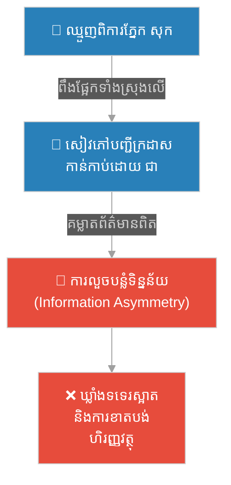
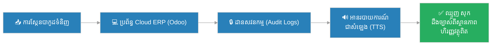

# ២៤៣ — អាជីវករពិការភ្នែក និងសៀវភៅបញ្ជី (The Blind Merchant and the Ledger)៖ ប្រព័ន្ធព័ត៌មានគ្រប់គ្រង និងសុចរិតភាពទិន្នន័យ

**Author:** ichamrong  
**Date:** 2026-05-27  
**Tags:** #management-information-systems #data-integrity #information-asymmetry #database-security #business-sustainability #cambodian-context  
**Category:** Business Sustainability  
**Read Time:** ~12 min  

---

## 📌 មាតិកា (Table of Contents)
- [អន្ទាក់ផ្លូវចិត្ត / វិបត្តិធុរកិច្ច (The Dilemma / The Trap)](#0)
- [រឿងនិទានប្រៀបធៀប៖ ឈ្មួញពិការភ្នែក និងសៀវភៅបញ្ជី (The Parable...)](#1)
- [ការវិភាគគំនិតសេដ្ឋកិច្ច / ធុរកិច្ច (Theoretical Analysis)](#2)
- [គំនូសតាងលំហូរការងារ (High-Contrast Flow Diagram)](#3)
- [ឧទាហរណ៍ជាក់ស្តែងក្នុងពិភពពិត (Real World Examples)](#4)
- [ដំណោះស្រាយ និងមេរៀនធុរកិច្ច (Strategic Solutions & Takeaways)](#5)
- [Related Posts / Course Link](#6)

---

<a id="0"></a>
## អន្ទាក់ផ្លូវចិត្ត / វិបត្តិធុរកិច្ច (The Dilemma / The Trap)

នៅក្នុងសេដ្ឋកិច្ចទីផ្សារសេរី និងការគ្រប់គ្រងសហគ្រាស ព័ត៌មានគឺជា «ចរន្តឈាម» ដែលទ្រទ្រង់ដំណើរការសម្រេចចិត្ត។ ទោះជាយ៉ាងណាក៏ដោយ បញ្ហាប្រឈមដ៏ធំបំផុតមួយនៅក្នុងប្រព័ន្ធគ្រប់គ្រងបែបបុរាណ គឺ **គម្លាតព័ត៌មាន (Information Asymmetry)** និងការខ្វះខាត **សុចរិតភាពទិន្នន័យ (Data Integrity)**។ នៅពេលដែលអាជីវកម្មមួយពឹងផ្អែកទៅលើប្រព័ន្ធកត់ត្រាដោយដៃ (Manual Paper-based Systems) ឬការចងចាំរបស់បុគ្គលម្នាក់ៗ វានឹងបង្កើតនូវ «ចំណុចងងឹត» ដែលបើកឱកាសឱ្យមានការលួចបន្លំ (Fraud) និងកំហុសឆ្គងជាប្រព័ន្ធ។

វិបត្តិធុរកិច្ចពិតប្រាកដកើតឡើងនៅពេលដែលម្ចាស់អាជីវកម្ម ឬអ្នកគ្រប់គ្រង មិនអាចមើលឃើញពីស្ថានភាពហិរញ្ញវត្ថុ និងចរន្តទំនិញសន្និធិ (Inventory Flow) ជាក់ស្តែងរបស់ខ្លួន។ ភាពស្រពិចស្រពិលនេះ ប្រៀបបាននឹងការដើរនៅក្នុងទីងងឹត ដែលគ្រប់ប្រតិបត្តិការទាំងអស់ត្រូវពឹងផ្អែកលើ «ជំនឿចិត្តលើបុគ្គល» ជាជាង «ប្រព័ន្ធត្រួតពិនិត្យដ៏រឹងមាំ»។ នេះគឺជាអន្ទាក់ដ៏គ្រោះថ្នាក់បំផុតសម្រាប់និរន្តរភាពអាជីវកម្ម។

នៅពេលដែលទិន្នន័យត្រូវបានកែខៃ ឬបាត់បង់ សហគ្រាសមិនត្រឹមតែខាតបង់ថវិកាប៉ុណ្ណោះទេ ប៉ុន្តែពួកគេក៏បាត់បង់សមត្ថភាពក្នុងការទទួលបានសំណងធានារ៉ាប់រង ការទាក់ទាញវិនិយោគិន ឬសូម្បីតែការធ្វើសវនកម្មផ្ទៃក្នុង។ ដូច្នេះ ការផ្លាស់ប្តូរពីប្រព័ន្ធសៀវភៅបញ្ជីក្រដាស ទៅជាប្រព័ន្ធព័ត៌មានគ្រប់គ្រងបែបឌីជីថល (Digitalized Management Information Systems) មិនមែនគ្រាន់តែជាការធ្វើទំនើបកម្មនោះទេ ប៉ុន្តែវាគឺជាខែលការពារសុវត្ថិភាព និងនិរន្តរភាពរបស់អាជីវកម្មទាំងមូល។

---

<a id="1"></a>
## រឿងនិទានប្រៀបធៀប៖ ឈ្មួញពិការភ្នែក និងសៀវភៅបញ្ជី (The Parable of the Blind Merchant and the Ledger)

នាសម័យកាលមួយ នៅក្នុងទីក្រុងកំពង់ចាមដ៏មមាញឹក មានឈ្មួញស្រូវម្នាក់ឈ្មោះថា **សុក (Sok)**។ គាត់គឺជាមនុស្សម្នាក់ដែលមានភាពវៃឆ្លាត និងមានទេពកោសល្យខ្ពស់ក្នុងការធ្វើជំនួញ ប៉ុន្តែជាអកុសល គាត់បានធ្លាក់ខ្លួនពិការភ្នែកទាំងសងខាងតាំងពីវ័យក្មេង។ ទោះបីជាពិការភ្នែកក៏ដោយ ក៏ សុក អាចគ្រប់គ្រងអាជីវកម្មទិញលក់ស្រូវដ៏ធំរបស់គាត់បានយ៉ាងរលូន ដោយសារគាត់មានការចងចាំដ៏អស្ចារ្យ (Exceptional Memory) និងប្រើប្រាស់វិធីសាស្ត្រចាស់បុរាណ៖ រាល់ប្រតិបត្តិការទិញលក់ គាត់ត្រូវស្ទាប និងស្តាប់ការរាប់ចំនួនបាវស្រូវដោយផ្ទាល់។

ទោះជាយ៉ាងណា នៅពេលដែលអាជីវកម្មរបស់គាត់រីកធំឡើង រហូតដល់មានការទិញចូល និងលក់ចេញរាប់រយតោនក្នុងមួយថ្ងៃៗ ការចងចាំ និងការតាមដានដោយផ្ទាល់ដៃរបស់ សុក លែងអាចដោះស្រាយបានទៀតហើយ។ គាត់ត្រូវបានបង្ខំឱ្យជួលអ្នកចេះអក្សរម្នាក់ឈ្មោះ **ជា (Chea)** ឱ្យមកធ្វើជាស្មេរ (Scribe) និងជាអ្នកកាន់សៀវភៅកត់ត្រាបញ្ជី (Paper Ledger) ប្រចាំឃ្លាំង។



**ជា** គឺជាមនុស្សដែលមានមហិច្ឆតាខ្ពស់ និងលោភលន់។ នៅពេលដែលគាត់ដឹងថា សុក មិនអាចមើលឃើញអក្សរ និងតួលេខនៅក្នុងសៀវភៅបញ្ជីក្រដាសនោះឡើយ គាត់ក៏ចាប់ផ្តើមបង្កើតគម្លាតព័ត៌មាន (Information Asymmetry)។ រាល់ពេលដែលស្រូវដឹកចូលឃ្លាំង ១០ បាវ ជា កត់ត្រាចូលបញ្ជីតែ ៨ បាវប៉ុណ្ណោះ ហើយលួចលក់ ២ បាវទៀតចូលហោប៉ៅខ្លួនឯង។ ពេលខ្លះ គាត់បានកត់ត្រាការចំណាយខ្មោច (Ghost Transactions) ទៅលើអ្នកផ្គត់ផ្គង់ដែលគ្មានរូបពិត ដើម្បីដកប្រាក់ចេញពីហិរញ្ញវត្ថុរបស់ សុក។ 

សុក ចាប់ផ្តើមមានអារម្មណ៍សង្ស័យ ព្រោះគាត់ធុំក្លិនស្រូវពេញឃ្លាំង ប៉ុន្តែប្រាក់ចំណេញនៅក្នុងប្រអប់ហិរញ្ញវត្ថុបែរជាស្រាលទៅៗ។ នៅពេលដែល សុក សួរនាំ ជា តែងតែយកសៀវភៅបញ្ជីក្រដាសមកគោះ ហើយអានតួលេខភូតភរប្រាប់ សុក ដោយក្តីជឿជាក់៖ *«លោកម្ចាស់! នេះជាកំណត់ត្រាច្បាស់លាស់ណាស់ តួលេខចំណូល និងចំណាយគឺមានតុល្យភាពឥតខ្ចោះ។ ស្រូវក្នុងឃ្លាំងពិតជាធ្លាក់ចុះដោយសារសត្វល្អិតស៊ីបំផ្លាញ និងទីផ្សារធ្លាក់ចុះពិតមែន!»* ដោយសារគ្មានមធ្យោបាយត្រួតពិនិត្យ សុក មានតែសម្រក់ទឹកភ្នែក និងទទួលយកការបាត់បង់ទាំងងងឹតងងុល។

ថ្ងៃមួយ មានយុវជនម្នាក់ឈ្មោះ **ចន្ទ (Chan)** ដែលត្រូវជាក្មួយប្រុសរបស់ សុក បានបញ្ចប់ការសិក្សាផ្នែកគ្រប់គ្រងប្រព័ន្ធព័ត៌មាន (Management Information Systems) ពីសាកលវិទ្យាល័យមួយនៅភ្នំពេញ បានមកលេង។ ពេលឃើញស្ថានភាពអាជីវកម្មដែលកំពុងដុនដាប ចន្ទ បានដឹងភ្លាមថា នេះគឺជាវិបត្តិនៃសុចរិតភាពទិន្នន័យ (Data Integrity Crisis)។

ចន្ទ បាននិយាយទៅកាន់ សុក ថា៖ *«លោកពូ! ការដោះស្រាយបញ្ហានេះ មិនមែនស្ថិតលើការបង្ខំឱ្យពូសម្លឹងឃើញសៀវភៅក្រដាសនោះទេ តែវាស្ថិតលើការបង្កើតប្រព័ន្ធមួយដែលនិយាយជំនួសភ្នែករបស់ពូបាន និងមិនអាចឱ្យនរណាម្នាក់កែប្រែតួលេខដោយគ្មានដានស្នាមឡើយ!»*

ចន្ទ បានចាប់ផ្តើមរៀបចំប្រព័ន្ធឌីជីថលថ្មីមួយ៖
1. **ការធ្វើឌីជីថលនីយកម្មទិន្នន័យ (Digitalized Database)**៖ រាល់ទំនិញចូលឃ្លាំងទាំងអស់ ត្រូវឆ្លងកាត់ការស្កែនបាកូដ (Barcode Scanning) និងកត់ត្រាចូលទៅក្នុងប្រព័ន្ធ Cloud ERP (Enterprise Resource Planning) ភ្លាមៗ។
2. **សុចរិតភាពទិន្នន័យ និងដានសវនកម្ម (Data Integrity & Audit Trails)**៖ រាល់ការកែប្រែទិន្នន័យហិរញ្ញវត្ថុ ឬស្តុកទំនិញ មិនអាចលុបចោលបានឡើយ។ រាល់ Action ទាំងអស់នឹងត្រូវកត់ត្រាទុកនូវអត្តសញ្ញាណអ្នកកែប្រែ ពេលវេលា និងតម្លៃដើម (System Log System)។
3. **ប្រព័ន្ធបញ្ចេញសំឡេងស្វ័យប្រវត្ត (Text-to-Speech Integration)**៖ ចន្ទ បានភ្ជាប់កម្មវិធីសំឡេងអានស្វ័យប្រវត្តដែលអានរបាយការណ៍ហិរញ្ញវត្ថុ និងចរន្តស្តុកចេញជាសំឡេងភាសាខ្មែរ ឱ្យ សុក អាចស្តាប់បានតាមទូរស័ព្ទដៃរបស់គាត់នៅរាល់ចុងម៉ោងការងារ។



នៅពេលដែល ជា ព្យាយាមកែប្រែចំនួនស្តុកស្រូវដូចរាល់ដង ប្រព័ន្ធ ERP បានផ្ញើសារព្រមាន (System Alert) ទៅកាន់ទូរស័ព្ទរបស់ សុក ភ្លាមៗថាមានការកែប្រែស្តុកដោយគ្មានឯកសារបញ្ជាទិញយោង (Purchase Order)។ សុក បានហៅ ជា មកសួរនាំចំៗចំពោះមុខបុគ្គលិកទាំងអស់ ដោយបញ្ចេញភស្តុតាងកំណត់ត្រាឌីជីថល (Digital Footprints) ដែល ជា មិនអាចប្រកែកបានឡើយ។ ជា ត្រូវបានបណ្តេញចេញ និងត្រូវសងសំណងរាល់ការខូចខាតទាំងអស់។

ចាប់ពីពេលនោះមក អាជីវកម្មរបស់ សុក ត្រូវបានរៀបចំឡើងវិញក្រោមការគ្រប់គ្រងរបស់ ចន្ទ។ ពួកគេបានពង្រីកសាខាទៅកាន់ខេត្តបាត់ដំបង និងព្រៃវែង ដោយប្រើប្រាស់ប្រព័ន្ធគ្រប់គ្រងព័ត៌មាន (MIS) រួមតែមួយ។ ទោះបីជា សុក ពិការភ្នែកក៏ដោយ ក៏គាត់នៅតែអាចគ្រប់គ្រងអាជីវកម្មលំដាប់ថ្នាក់ជាតិរបស់គាត់បានយ៉ាងរឹងមាំ និងមានសុវត្ថិភាពបំផុត។

---

<a id="2"></a>
## ការវិភាគគំនិតសេដ្ឋកិច្ច / ធុរកិច្ច (Theoretical Analysis)

រឿងនិទានប្រៀបធៀបខាងលើ បានឆ្លុះបញ្ចាំងយ៉ាងច្បាស់នូវទ្រឹស្តីសេដ្ឋកិច្ច និងគ្រប់គ្រងអាជីវកម្មទំនើបៗដូចខាងក្រោម៖

### ១. គម្លាតព័ត៌មាន (Information Asymmetry) & ទ្រឹស្តីតំណាង (Agency Theory)
នៅក្នុងសេដ្ឋកិច្ចមីក្រូ (Microeconomics) **គម្លាតព័ត៌មាន (Information Asymmetry)** កើតឡើងនៅពេលដែលភាគីម្ខាង (ជា ក្នុងនាមជាបុគ្គលិក/ភ្នាក់ងារ ឬ Agent) មានព័ត៌មានច្រើនជាង និងច្បាស់ជាងភាគីម្ខាងទៀត (សុក ក្នុងនាមជាម្ចាស់អាជីវកម្ម ឬ Principal)។ 
* **សីលធម៌លំអៀង (Moral Hazard)**៖ ស្មេរ ជា បានទាញយកផលប្រយោជន៍ផ្ទាល់ខ្លួនពីភាពងងឹតងងុលរបស់ សុក ដោយការលួចបន្លំតួលេខ ព្រោះគាត់ដឹងថា សុក គ្មានសមត្ថភាពបច្ចេកទេស ឬរូបវន្តក្នុងការត្រួតពិនិត្យឡើងវិញ។
* **ដំណោះស្រាយ**៖ ការប្រើប្រាស់ប្រព័ន្ធព័ត៌មានគ្រប់គ្រង (MIS) ជួយកាត់បន្ថយគម្លាតព័ត៌មាននេះ ដោយធានាថា «ព័ត៌មានពិត» ត្រូវបានបង្ហាញជាសាធារណៈ និងមានតម្លាភាពសម្រាប់គ្រប់ភាគីពាក់ព័ន្ធ។

### ២. សុចរិតភាពទិន្នន័យ (Data Integrity) & គោលការណ៍ ACID
សុចរិតភាពទិន្នន័យ សំដៅលើភាពត្រឹមត្រូវ ភាពពេញលេញ និងភាពគួរឱ្យជឿជាក់នៃទិន្នន័យពេញមួយវដ្តជីវិតរបស់វា (Data Lifecycle)។ នៅក្នុងប្រព័ន្ធគ្រប់គ្រងទិន្នន័យទំនើប គោលការណ៍ **ACID** ត្រូវបានអនុវត្តដើម្បីធានាសុចរិតភាព៖
* **Atomicity (ភាពដាច់ខាត)**៖ ប្រតិបត្តិការ (Transaction) ត្រូវតែជោគជ័យទាំងអស់ ឬបរាជ័យទាំងអស់ គ្មានពាក់កណ្តាលឡើយ (ឧទាហរណ៍៖ ការផ្ទេរប្រាក់ចេញពីគណនី A ទៅ B ត្រូវតែកាត់ប្រាក់ពី A និងបូកចូល B ក្នុងពេលតែមួយ)។
* **Consistency (ភាពស៊ីសង្វាក់គ្នា)**៖ ទិន្នន័យត្រូវតែគោរពតាមច្បាប់កំណត់របស់ Database (Database Constraints) ជានិច្ច។
* **Isolation (ភាពដាច់ដោយឡែក)**៖ ប្រតិបត្តិការដែលដំណើរការទន្ទឹមគ្នា មិនត្រូវរំខានគ្នាទៅវិញទៅមកឡើយ។
* **Durability (ភាពរឹងមាំយូរអង្វែង)**៖ នៅពេលដែលប្រតិបត្តិការត្រូវបានរក្សាទុករួចរាល់ វានឹងមិនបាត់បង់ឡើយ ទោះជាមានការដាច់ចរន្តអគ្គិសនី ឬប្រព័ន្ធគាំងក៏ដោយ។

### ៣. ប្រព័ន្ធព័ត៌មានគ្រប់គ្រង (Management Information Systems - MIS)
MIS គឺជាការរួមបញ្ចូលគ្នារវាង **មនុស្ស (People)** **បច្ចេកវិទ្យា (Technology)** និង **នីតិវិធី (Procedures)** ដើម្បីជួយគាំទ្រដល់ការសម្រេចចិត្តក្នុងអាជីវកម្ម។
* **ERP (Enterprise Resource Planning)**៖ ជួយកម្ចាត់ចោលនូវ «Siloed Data» (ទិន្នន័យដាច់ដោយឡែកពីគ្នា) ដោយបញ្ចូលផ្នែកគណនេយ្យ សន្និធិ ធនធានមនុស្ស និងការលក់ ទៅក្នុងប្រភពទិន្នន័យរួមតែមួយហៅថា **Single Source of Truth (SSOT)**។

---

<a id="3"></a>
## គំនូសតាងលំហូរការងារ (High-Contrast Flow Diagram)

ខាងក្រោមនេះជាគំនូសតាង Mermaid flowchart បង្ហាញពីប្រព័ន្ធគ្រប់គ្រងព័ត៌មាន និងការផ្លាស់ប្តូរពីប្រព័ន្ធខ្សោយ ទៅជាប្រព័ន្ធរឹងមាំ៖

```mermaid
%%{init: {
  'theme': 'dark',
  'themeVariables': {
    'background': '#1e1e1e',
    'primaryTextColor': '#ffffff',
    'lineColor': '#a0a0a0'
  },
  'themeCSS': 'svg { background-color: #1e1e1e !important; padding: 1rem !important; border-radius: 8px !important; } .edgeLabel rect { fill: #1e1e1e !important; } text, tspan { fill: #ffffff !important; }'
}}%%
flowchart TD
    %% Nodes representing the flow
    Start("["📦<br/>ស្រូវដឹកចូលឃ្លាំង"]") --> RecordGate{"❓ តើប្រើប្រាស់<br/>ប្រព័ន្ធបែបណា?"}
    
    %% Legacy path (Information Asymmetry Trap)
    RecordGate -->|"កត់ត្រាដោយដៃ / ក្រដាស"| LegacyNode["📝 កត់ត្រាក្នុងសៀវភៅបញ្ជី<br/>ដោយគ្មានការផ្ទៀងផ្ទាត់"]
    LegacyNode --> AsymmetryTrap{"⚠️ ស្មេរ ជា មាន<br/>អំណាចព័ត៌មានផ្តាច់មុខ"}
    AsymmetryTrap -->|Moral Hazard| FraudNode["🔴 ការលួចបន្លំទិន្នន័យ<br/>និងលួចលក់ស្រូវស្ងាត់ៗ"]
    FraudNode --> BusinessLoss["❌ ឃ្លាំងទទេរស្អាត<br/>និងធុរកិច្ចដួលរលំ"]
    
    %% Modern path (MIS & Data Integrity)
    RecordGate -->|"ប្រើប្រាស់ប្រព័ន្ធឌីជីថល"| ModernGate{"🛡️ ប្រព័ន្ធគ្រប់គ្រង<br/>ព័ត៌មាន (MIS)"}
    ModernGate -->|ស្កែនបាកូដ| ERPNode["💻 Cloud ERP System<br/>(Odoo/SAP)"]
    ERPNode --> IntegrityNode["🔒 ការពារដោយ ACID<br/>និងដានសវនកម្ម<br/>(Audit Logs)"]
    IntegrityNode --> AccessGate{"🔊 text-to-speech / SMS"}
    AccessGate -->|Real-time alerts| OwnerNode["✅ ម្ចាស់អាជីវកម្ម សុក<br/>ដឹងព័ត៌មានពិតភ្លាមៗ"]
    OwnerNode --> SustainableGrowth["📈 អាជីវកម្មរីកចម្រើន<br/>ប្រកបដោយនិរន្តរភាព"]

    %% Custom High-Contrast Styling
    style RecordGate fill:#2980b9,color:#fff
    style LegacyNode fill:#2980b9,color:#fff
    style AsymmetryTrap fill:#e74c3c,color:#fff
    style FraudNode fill:#e74c3c,color:#fff
    style BusinessLoss fill:#e74c3c,color:#fff
    
    style ModernGate fill:#2980b9,color:#fff
    style ERPNode fill:#2980b9,color:#fff
    style IntegrityNode fill:#27ae60,color:#fff
    style OwnerNode fill:#27ae60,color:#fff
    style SustainableGrowth fill:#27ae60,color:#fff
```

---

<a id="4"></a>
## ឧទាហរណ៍ជាក់ស្តែងក្នុងពិភពពិត (Real World Examples)

### ១. ការរួមបញ្ចូលគ្នានៃប្រព័ន្ធទិន្នន័យគ្រឹះស្ថានមីក្រូហិរញ្ញវត្ថុនៅកម្ពុជា (MFI Database Integrations in Cambodia)
កាលពីសម័យមុន គ្រឹះស្ថានមីក្រូហិរញ្ញវត្ថុ (MFIs) និងធនាគារមួយចំនួននៅកម្ពុជា ធ្លាប់ប្រើប្រាស់ការកត់ត្រាបញ្ជីឥណទានលើក្រដាស ឬប្រព័ន្ធ Excel ដាច់ដោយឡែកពីគ្នា ដែលបង្កឱ្យមានបញ្ហា «កម្ចីជាន់គ្នា» (Over-indebtedness) និងការកែប្រែទិន្នន័យកម្ចីដោយភ្នាក់ងារឥណទាន (Loan Officers) មួយចំនួន។ 

ដើម្បីដោះស្រាយបញ្ហានេះ ធនាគារជាតិនៃកម្ពុជា (NBC) បានបង្កើតឱ្យមានការតភ្ជាប់ជាមួយ **ការិយាល័យឥណទានកម្ពុជា (Credit Bureau Cambodia - CBC)**។ រាល់ទិន្នន័យឥណទានរបស់អតិថិជនទាំងអស់ ត្រូវបានកត់ត្រា និងចែករំលែកជាឌីជីថល តាមប្រព័ន្ធរួមតែមួយ ដែលធានាសុចរិតភាពទិន្នន័យ និងកាត់បន្ថយគម្លាតព័ត៌មាន (Information Asymmetry) រវាងអ្នកខ្ចី និងអ្នកផ្តល់កម្ចីយ៉ាងមានប្រសិទ្ធភាព។

### ២. ក្រុមហ៊ុនចរន្តផ្គត់ផ្គង់សកល និងប្រព័ន្ធ Cloud ERP (SAP/NetSuite)
ក្រុមហ៊ុនផលិតកម្មធំៗដូចជា **Unilever** ឬ **Nestlé** គ្រប់គ្រងចរន្តផ្គត់ផ្គង់ (Supply Chain) ទូទាំងសកលលោក ដោយមិនអាចពឹងផ្អែកលើរបាយការណ៍ក្រដាសឡើយ។ ពួកគេប្រើប្រាស់ប្រព័ន្ធ Cloud ERP ដូចជា **SAP S/4HANA** ឬ **Oracle NetSuite** ដើម្បីតាមដានទិន្នន័យស្តុកវត្ថុធាតុដើមពីគ្រប់ច្រកល្ហកនៃពិភពលោក។ 

រាល់ពេលដែលកុងតឺន័រដឹកទំនិញត្រូវបានស្កែននៅកំពង់ផែ ទិន្នន័យនឹងត្រូវធ្វើបច្ចុប្បន្នភាពទៅកាន់ប្រព័ន្ធគណនេយ្យ ផ្នែកលក់ និងផ្នែកផលិតកម្មភ្លាមៗ។ នេះជួយកម្ចាត់ចោលនូវការបាត់បង់ទំនិញ ការលួចបន្លំ ឬការលក់ខ្យល់ (Phantom Inventory)។

---

<a id="5"></a>
## ដំណោះស្រាយ និងមេរៀនធុរកិច្ច (Strategic Solutions & Takeaways)

ដើម្បីការពារអាជីវកម្មរបស់អ្នកពីអន្ទាក់នៃ «សៀវភៅបញ្ជីដែលមើលមិនឃើញ» ចូរអនុវត្តយុទ្ធសាស្ត្រគន្លឹះទាំងនេះ៖

1. **លុបបំបាត់ Siloed Data តាមរយៈ ERP Integration**៖  
   ត្រូវប្រាកដថាប្រព័ន្ធទិន្នន័យគណនេយ្យ ផ្នែកលក់ និងសន្និធិទំនិញត្រូវបានរួមបញ្ចូលគ្នាតែមួយ (Centralized Database)។ ការប្រើប្រាស់ប្រព័ន្ធដូចជា Odoo, ERPNext ឬ NetSuite ការពារការកែសម្រួលទិន្នន័យដោយឯកតោភាគី។

2. **អនុវត្តគោលការណ៍នៃការបែងចែកភារកិច្ច (Segregation of Duties - SoD)**៖  
   កុំប្រគល់អំណាចឱ្យបុគ្គលម្នាក់មានសិទ្ធិទាំងការបញ្ចូលទិន្នន័យ (Data Entry) ការអនុម័ត (Approval) និងការធ្វើសវនកម្ម (Auditing)。 ប្រព័ន្ធ MIS ត្រូវតែកំណត់ Role-Based Access Control (RBAC) ឱ្យបានច្បាស់លាស់។

3. **បង្កើតប្រព័ន្ធដានសវនកម្មស្វ័យប្រវត្ត (Automated Audit Trails)**៖  
   រាល់ការកែប្រែទិន្នន័យហិរញ្ញវត្ថុ ឬស្តុកទំនិញ ត្រូវតែរក្សាទុកនូវកំណត់ហេតុប្រព័ន្ធ (System Logs) ដែលមិនអាចលុបបាន (Immutable Ledger) ដើម្បីងាយស្រួលក្នុងការធ្វើសវនកម្មឡើងវិញនៅពេលមានបញ្ហាមិនប្រក្រតី។

4. **ប្រើប្រាស់ការត្រួតពិនិត្យដោយស្វ័យប្រវត្ត (Automated Alerts & Dashboards)**៖  
   រៀបចំឱ្យមានប្រព័ន្ធផ្ញើសារព្រមានស្វ័យប្រវត្ត (SMS/Email Alerts) ទៅកាន់ថ្នាក់ដឹកនាំ នៅពេលណាដែលមានការទិញចូល ឬលក់ចេញដែលមានទំហំទឹកប្រាក់ធំខុសធម្មតា ឬការកែសម្រួលស្តុកទំនិញ។

---

<a id="6"></a>
## Related Posts / Course Link

- **[Management Information Systems](../03-management-information-systems.md)** — ស្វែងយល់លម្អិតអំពីក្របខ័ណ្ឌ ERP, CRM, SCM, BI Analytics និងការធានាសុចរិតភាពទិន្នន័យក្នុងសហគ្រាសប្រកបដោយចីរភាព។

---

*Last updated: 2026-05-27*
