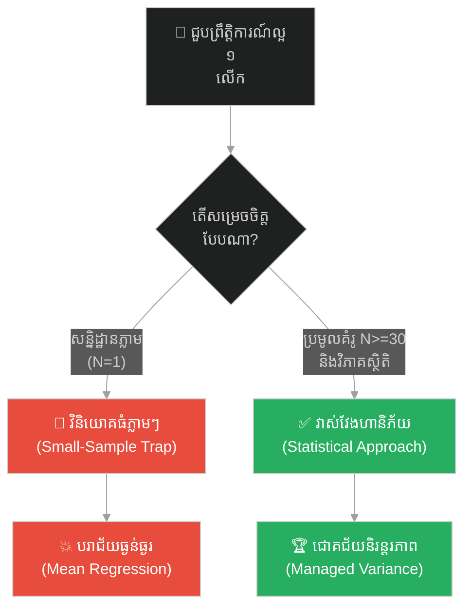
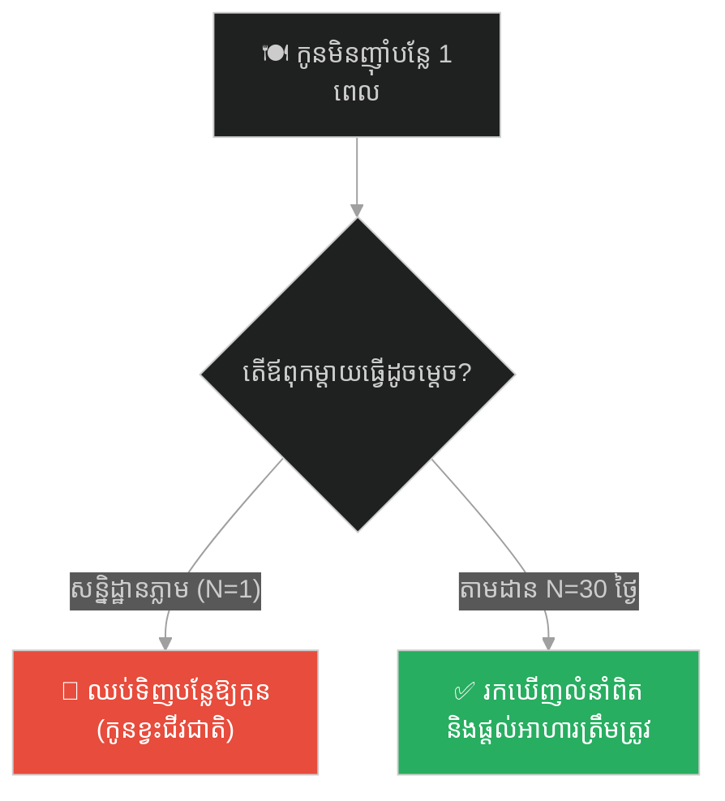
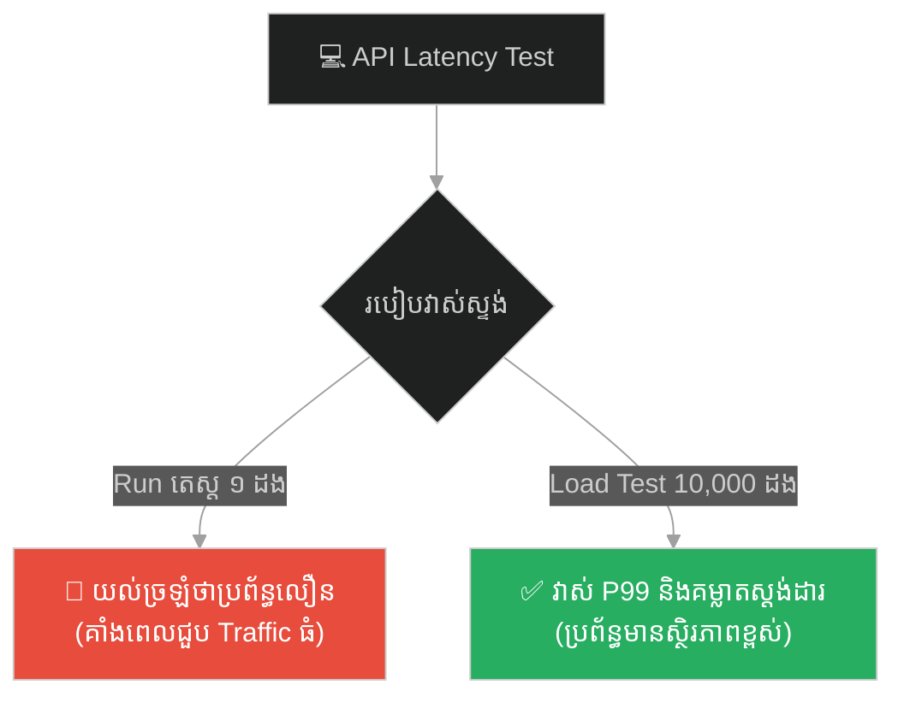
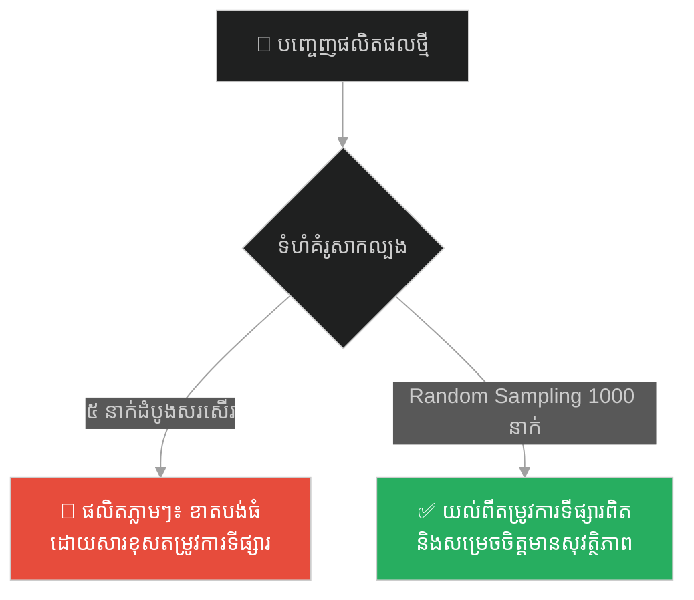
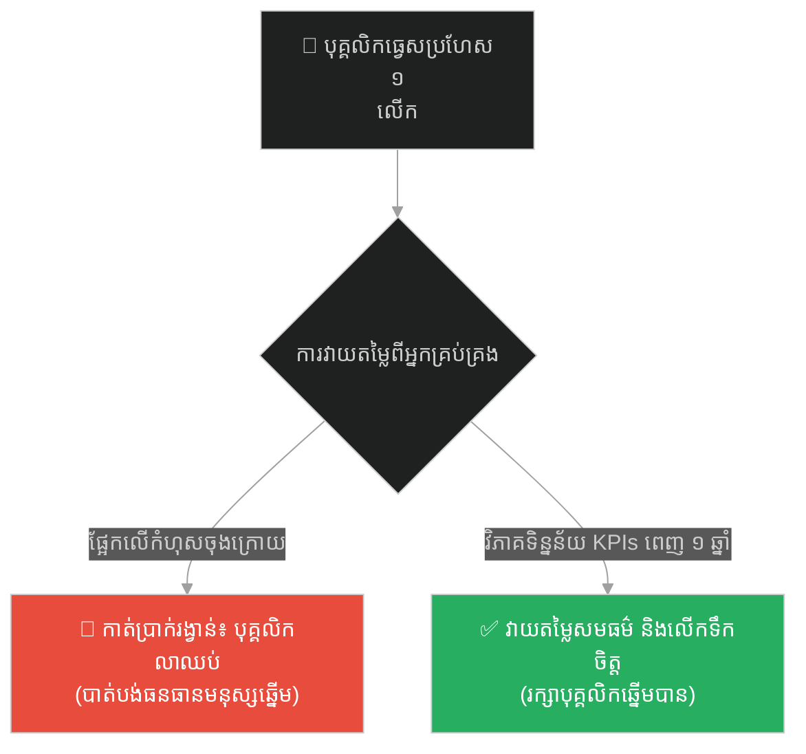
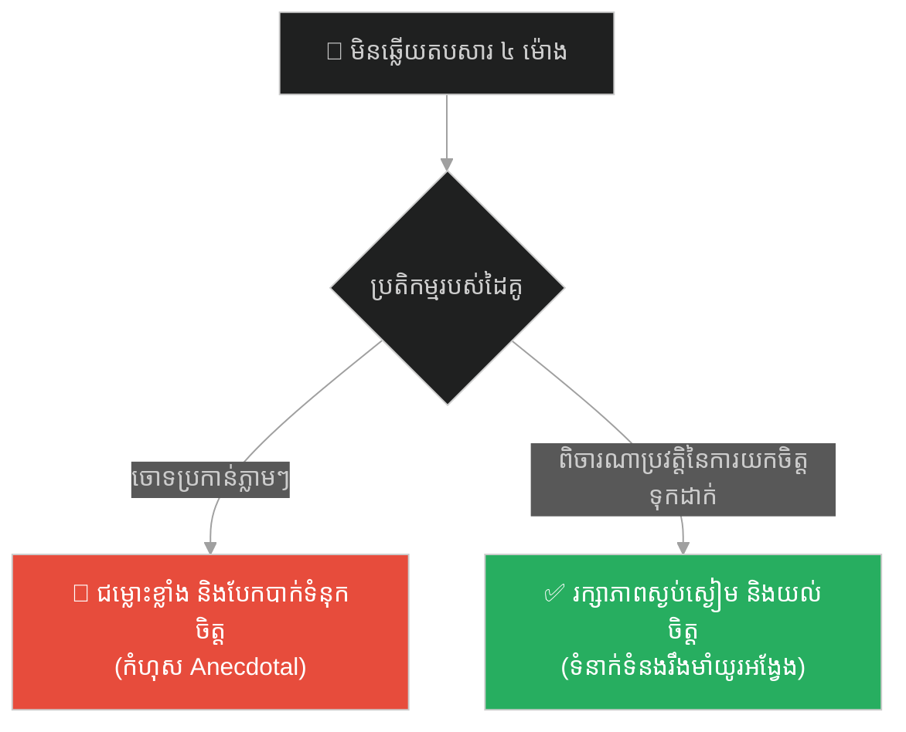
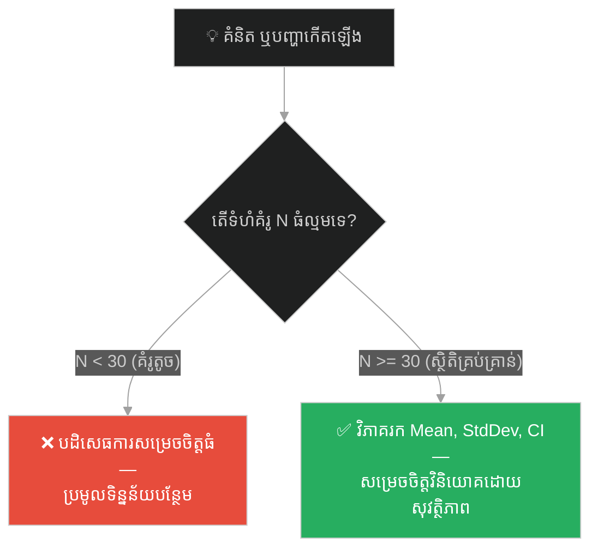

# Statistics & Quantitative Methods (នេសាទករ និងសំណាញ់)៖ វិធីសាស្ត្រស្ថិតិ និងបរិមាណសម្រាប់ការសម្រេចចិត្ត (Statistics & Quantitative Methods & Small-Sample Bias and Sampling Methods & The Fisherman and the Net)

**Author:** ichamrong  
**Date:** 2026-05-27  
**Tags:** #statistics #quantitative-methods #sampling-bias #decision-making #business-sustainability  
**Category:** Business Sustainability  
**Read Time:** ~15 min  

---

## 📌 មាតិកា (Table of Contents)
- [អន្ទាក់ផ្លូវចិត្ត (The Trap)](#0)
- [១. រឿងព្រេងនិទាន៖ នេសាទករ និងសំណាញ់ (The Legend of The Fisherman and the Net)](#1)
  - [គ្រោះមហន្តរាយនៃសេចក្តីសន្និដ្ឋានពីគំរូតូច (The Catastrophe of Small-Sample Conclusions)](#1-1)
- [២. បញ្ហា៖ ភាពលំអៀងនៃទំហំគំរូតូច (The Issue: Small-Sample Bias)](#2)
- [៣. ឧទាហរណ៍ជាក់ស្តែងក្នុងពិភពពិត (Real World Examples)](#3)
  - [ឧទាហរណ៍ទី ១ — កម្រិតស្រាល (គ្រួសារ)៖ ការសន្និដ្ឋានពីរបបអាហារគ្រួសារផ្អែកលើការសង្កេតមួយពេល (The Family Diet Anecdote)](#3-1)
  - [ឧទាហរណ៍ទី ២ — កម្រិតមធ្យម (បច្ចេកទេស)៖ ការវាស់ស្ទង់ Latency របស់ Server ផ្អែកលើការរត់តេស្តតែម្តងគត់ (The Dev Latency Benchmark)](#3-2)
  - [ឧទាហរណ៍ទី ៣ — កម្រិតមធ្យម (ធុរកិច្ច)៖ ការប្រកាសលក់ផលិតផលថ្មីផ្អែកលើមតិអតិថិជន ៥ នាក់ដំបូង (The Business Product Focus Group)](#3-3)
  - [ឧទាហរណ៍ទី ៤ — កម្រិតមធ្យម (សង្គម/គ្រប់គ្រង)៖ ការវាយតម្លៃលទ្ធផលការងារប្រចាំឆ្នាំរបស់បុគ្គលិកដោយផ្អែកលើការធ្វេសប្រហែសតែមួយលើក (The Management Performance Appraisal)](#3-4)
  - [ឧទាហរណ៍ទី ៥ — កម្រិតធ្ងន់ (ទំនាក់ទំនង)៖ ការសន្និដ្ឋានពីភាពស្មោះត្រង់របស់ដៃគូជីវិតដោយផ្អែកលើការយឺតយ៉ាវឆ្លើយតបសារតែម្តងគត់ (The Relationship Response Delay)](#3-5)
- [៤. ដំណោះស្រាយទូទៅ៖ ការវិភាគស្ថិតិ និងការបង្កើនទំហំគំរូ (The General Solution: Statistical Analysis and Sample Size Expansion)](#4)
- [សេចក្តីសន្និដ្ឋាន (Conclusion)](#5)
- [ឯកសារយោង (References)](#6)
- [Related Posts](#7)

---

<a id="0"></a>
## អន្ទាក់ផ្លូវចិត្ត (The Trap)

នៅក្នុងពិភពធុរកិច្ច និងការសម្រេចចិត្ត សហគ្រិន និងអ្នកគ្រប់គ្រងជាច្រើនតែងតែធ្លាក់ចូលទៅក្នុងអន្ទាក់ផ្លូវចិត្តដ៏គ្រោះថ្នាក់មួយ គឺ **«ការសម្រេចចិត្តផ្អែកលើបទពិសោធន៍ផ្ទាល់ខ្លួនមួយពេល ឬការសន្និដ្ឋានពីគំរូតូច» (Anecdotal Decision-Making and Small-Sample Bias)**។ ពួកគេតែងតែជឿជាក់យ៉ាងមុតមាំថា ប្រសិនបើផលិតផលថ្មីមួយទទួលបានការគាំទ្រពីអតិថិជន 2 ទៅ 3 នាក់ដំបូង នោះវាប្រាកដជាទទួលបានជោគជ័យនៅលើទីផ្សារធំទូលាយជាក់ជាមិនខាន។

* **ផ្លូវងងឹត (Failure Path)** — ការសម្រេចចិត្តវិនិយោគធំដោយផ្អែកលើទិន្នន័យគំរូតូច ដែលនាំទៅរកការខាតបង់ធនធាន និងក្ស័យធន។
* **ផ្លូវពន្លឺ (Success Path)** — ការប្រមូលទិន្នន័យជាប្រព័ន្ធ វិភាគស្ថិតិរកគម្លាតស្តង់ដារ និងចន្លោះជឿជាក់មុនពេលបង្កើនទំហំការងារ។

ដើម្បីយល់ដឹងពីរបៀបលុបបំបាត់ការសម្រេចចិត្តតាមការស្មាន និងកសាងប្រព័ន្ធសម្រេចចិត្តផ្អែកលើទិន្នន័យ នេះជាផែនទីបង្ហាញផ្លូវសម្រាប់អត្ថបទនេះ៖
1. **រឿងព្រេងនិទាន (The Legend)** — រឿងរ៉ាវរបស់អ្នកនេសាទពីររូបនៅលើបឹងទន្លេសាប៖ ស្រេង (នេសាទតាមអារម្មណ៍) និង ប៉ូ (នេសាទតាមស្ថិតិ)។
2. **បញ្ហា (The Issue)** — គ្រោះថ្នាក់នៃភាពលំអៀងពីគំរូតូច និងការប្រៀបធៀបគូកូដគំរូ (Python) បង្ហាញពីវិធីសាស្ត្របំផ្លិចបំផ្លាញធៀបនឹងវិធីសាស្ត្រស្ថិតិ។
3. **ឧទាហរណ៍ជាក់ស្តែងក្នុងពិភពពិត (Real World Examples)** — ការវិភាគករណីសិក្សាចំនួន 5 កម្រិត ចាប់ពីកម្រិតគ្រួសារ រហូតដល់កម្រិតទំនាក់ទំនងស្នេហា។
4. **ដំណោះស្រាយទូទៅ (The General Solution)** — ការផ្លាស់ប្តូរទៅកាន់ប្រព័ន្ធធ្វើតេស្តសម្មតិកម្ម និងការបង្កើនទំហំគំរូ។



---

<a id="1"></a>
## ១. រឿងព្រេងនិទាន៖ នេសាទករ និងសំណាញ់ (The Legend of The Fisherman and the Net)

នាសម័យកាលមួយ នៅលើផ្ទៃទឹកដ៏ធំល្វឹងល្វើយនៃបឹងទន្លេសាប មានអ្នកនេសាទពីររូបឈ្មោះ **ស្រេង (Sreng)** និង **ប៉ូ (Po)** តែងតែចេញទូកទៅបោះសំណាញ់នេសាទត្រីជារៀងរាល់ព្រឹកព្រលឹម។ ពួកគេទាំងពីរនាក់បានចាប់ផ្តើមរបរនេះនៅឆ្នាំជាមួយគ្នា មានទូកទំហំប៉ុនគ្នា និងប្រើប្រាស់សំណាញ់ដែលមានក្រឡាទំហំដូចគ្នាឥតខ្ចោះ។ ទោះជាយ៉ាងណាក៏ដោយ វិធីសាស្ត្រក្នុងការរៀបចំផែនការ និងការយល់ឃើញអំពីធម្មជាតិនៃការនេសាទរបស់ពួកគេមានភាពខុសគ្នាស្រឡះ។

**ស្រេង** គឺជាអ្នកនេសាទដែលពឹងផ្អែកទាំងស្រុងលើអារម្មណ៍ផ្ទាល់ខ្លួន និងព្រេងវាសនា។ រាល់ពេលចេញទូក គាត់តែងតែបោះសំណាញ់ដោយផ្អែកលើការស្មាន។ ប្រសិនបើថ្ងៃនេះគាត់បោះសំណាញ់ចំកន្លែងមួយ រួចទទួលបានត្រីធំៗជាច្រើន គាត់នឹងសន្និដ្ឋានភ្លាមៗថា៖ *«ទីតាំងនេះគឺជាទឹកដីមាស! ថ្ងៃអង្គារក្រោយ ឱ្យតែមានពពកខ្មៅបន្តិច ខ្ញុំនឹងមកទីនេះម្តងទៀត ព្រោះវាជាកន្លែងសំបូរត្រីបំផុត!»* ស្រេង កត់ចំណាំរាល់ជោគជ័យកំប៉ិកកំប៉ុករបស់ខ្លួនទុកក្នុងចិត្ត ហើយយកវាមកធ្វើជាច្បាប់សម្រាប់ដឹកនាំការនេសាទរបស់ខ្លួន។

<a id="1-1"></a>
### គ្រោះមហន្តរាយនៃសេចក្តីសន្និដ្ឋានពីគំរូតូច (The Catastrophe of Small-Sample Conclusions)

នៅថ្ងៃមួយ ស្រេង បានធ្វើដំណើរទៅកាន់តំបន់ព្រៃលិចទឹកភាគខាងកើត ហើយចៃដន្យបានបោះសំណាញ់ចំកន្លែងដែលហ្វូងត្រីកំពុងជួបជុំគ្នាពង។ ក្នុងថ្ងៃនោះតែមួយគត់ គាត់នេសាទបានត្រីរាប់រយក្បាល រហូតដល់ទូកស្ទើរតែលិច。ដោយភាពរំភើបញាប់ញ័រ និងការសន្និដ្ឋានយ៉ាងលឿនពីគំរូតែមួយថ្ងៃនេះ ស្រេង បានជឿជាក់យ៉ាងមុតមាំថា នេះគឺជាលំនាំអចិន្ត្រៃយ៍។

គាត់បានរត់ទៅខ្ចីប្រាក់ពីអ្នកចងការក្នុងភូមិក្នុងអត្រាការប្រាក់ខ្ពស់ ដើម្បីទិញទូកធំជាងមុន និងជួលកូនឈ្នួល ២ នាក់បន្ថែម ដើម្បីត្រៀមប្រមូលផលត្រីដ៏មហាសាលនៅតំបន់ដដែលនោះ។ ប៉ុន្តែក្នុងរយៈពេល ៣ សប្តាហ៍បន្ទាប់ ពេលដែលគាត់ត្រឡប់ទៅទីតាំងដដែលនោះជាច្រើនដង គាត់ស្ទើរតែរកត្រីមិនបានសោះឡើយ។ ហ្វូងត្រីបានផ្លាស់ទីទៅបាត់ទៅហើយ។ ស្រេង ត្រូវប្រឈមមុខនឹងការខាតបង់យ៉ាងធ្ងន់ធ្ងរ គ្មានប្រាក់បង់ថ្លៃឈ្នួលឱ្យកម្មករ និងធ្លាក់ខ្លួនជំពាក់បំណុលវណ្ឌក ដោយសារតែការសម្រេចចិត្តវិនិយោគដ៏ធំមួយ ដែលផ្អែកលើ «គំរូជោគជ័យចៃដន្យតែមួយលើក»។

ផ្ទុយទៅវិញ **ប៉ូ** យល់យ៉ាងច្បាស់ថា ផ្ទៃទឹកនៃបឹងទន្លេសាបមានការប្រែប្រួលខ្ពស់ និងពោរពេញដោយភាពចៃដន្យ។ ដើម្បីកាត់បន្ថយហានិភ័យ គាត់មិនដែលជឿលើការសន្និដ្ឋានមួយពេលនោះឡើយ។ ប៉ូ តែងតែមានសៀវភៅក្រាស់មួយក្បាល និងខ្មៅដៃជាប់ខ្លួនជានិច្ច។ ជារៀងរាល់ថ្ងៃ បន្ទាប់ពីត្រឡប់មកពីនេសាទវិញ គាត់បានបំប្លែងបទពិសោធន៍របស់ខ្លួនឱ្យទៅជាទិន្នន័យលេខដោយកត់ត្រាទុកយ៉ាងលម្អិតនូវ៖ កម្ពស់ទឹក ទិសដៅខ្យល់ ដំណាក់កាលព្រះច័ន្ទ ទីតាំងភូមិសាស្ត្រ និងទម្ងន់ត្រីដែលចាប់បាន។

ប៉ូ បានធ្វើការកត់ត្រាបែបនេះយ៉ាងខ្ជាប់ខ្ជួនជារៀងរាល់ថ្ងៃ អស់រយៈពេល ៣ រដូវកាលពេញ។ នៅពេលដែលកូនប្រុសរបស់គាត់សួរថា ហេតុអ្វីបានជាគាត់ត្រូវធ្វើរឿងដ៏គួរឱ្យធុញទ្រាន់នេះ ប៉ូ បានឆ្លើយថា៖ *«សំណាញ់អំបោះធម្មតាអាចចាប់ត្រីបានតែក្នុងរង្វង់ប៉ុន្មានម៉ែត្រជុំវិញទូកប៉ុណ្ណោះ។ ប៉ុន្តែ 'សំណាញ់ទិន្នន័យ' នៅលើក្រដាសនេះ អាចមើលធ្លុះទៅដល់ជម្រៅទឹកទូទាំងបឹងទន្លេសាប»*។

ផ្អែកលើទិន្នន័យដែលឆ្លងកាត់ការវិភាគស្ថិតិ ប៉ូ លែងនេសាទដោយការស្មានទៀតហើយ។ គាត់ដឹងយ៉ាងច្បាស់ថា ថ្ងៃណាគួរចេញទៅទីតាំងណា និងថ្ងៃណាដែលគួរសម្រាកនៅផ្ទះដើម្បីជួសជុលសំណាញ់ ដោយមិនបាច់ខាតបង់ប្រេងម៉ាស៊ីន និងកម្លាំងពលកម្មឥតប្រយោជន៍។ លទ្ធផលគឺចំណូលរបស់ ប៉ូ មានស្ថិរភាពខ្ពស់ គម្លាតស្តង់ដារនៃចំណូលមានកម្រិតទាបបំផុត ហើយគាត់អាចពង្រីកអាជីវកម្មបានយ៉ាងមានសុវត្ថិភាព។

---

<a id="2"></a>
## ២. បញ្ហា៖ ភាពលំអៀងនៃទំហំគំរូតូច (The Issue: Small-Sample Bias)

នៅក្នុងស្ថិតិវិទ្យា ច្បាប់នៃចំនួនធំ **(Law of Large Numbers)** ចែងថា ទំហំគំរូ ($N$) កាន់តែធំ នោះតម្លៃមធ្យមនៃគំរូ ($\bar{X}$) នឹងខិតទៅជិតតម្លៃមធ្យមពិតប្រាកដនៃប្រជាជនទាំងមូល ($\mu$)។ នៅពេលយើងធ្វើការសម្រេចចិត្តដោយផ្អែកលើទំហំគំរូដ៏តូចបំផុត ($N < 30$) យើងកំពុងដើរចូលទៅក្នុងអន្ទាក់ **Small-Sample Bias** និងការយល់ច្រឡំពីតម្លៃ Outlier ដែលជាព្រឹត្តិការណ៍ចៃដន្យបណ្តោះអាសន្ន។

ខាងក្រោមនេះជាកូដគំរូ Python បង្ហាញពីភាពខុសគ្នារវាងការវាយតម្លៃបែបផុយស្រួយ (Fragile Practice) ដែលយកគំរូ $N=1$ និងការវាយតម្លៃបែបធន់ (Resilient Practice) ដែលប្រើស្ថិតិវិភាគ៖

```python
import math

# ============================================================================
# FRAGILE PRACTICE (ការសម្រេចចិត្តបែបផុយស្រួយ)
# ============================================================================
def evaluate_market_fragile(recent_sales_leads):
    """
    Fragile logic: Concludes market high-yield based on a single outlier (N=1).
    ការសម្រេចចិត្តបែបផុយស្រួយ៖ សន្និដ្ឋានលើទីផ្សារទាំងមូលដោយផ្អែកលើគំរូតែមួយគត់។
    """
    single_lead = recent_sales_leads[0]
    print(f"[Fragile Alert] Evaluating based on single sample: {single_lead} units.")
    
    # Making large scale decision based on this single data point
    if single_lead > 100:
        return "DECISION: Invest heavily in expansion immediately!"
    else:
        return "DECISION: Stop all operations."

# ============================================================================
# RESILIENT PRACTICE (ការសម្រេចចិត្តបែបស្ថិតិ និងធន់)
# ============================================================================
def evaluate_market_resilient(sales_data_history):
    """
    Resilient logic: Evaluates mean, standard deviation, and confidence intervals
    using a statistically significant sample size (N >= 30).
    ការសម្រេចចិត្តបែបស្ថិតិ៖ វិភាគតម្លៃមធ្យម គម្លាតស្តង់ដារ និងចន្លោះជឿជាក់។
    """
    n = len(sales_data_history)
    if n < 30:
        return f"DECISION: Insufficient data (N={n}). Do not make strategic moves yet. Collect more samples."
    
    # Calculate sample mean (តម្លៃមធ្យមនៃគំរូ)
    mean_val = sum(sales_data_history) / n
    
    # Calculate sample variance & standard deviation (គម្លាតស្តង់ដារ)
    variance = sum((x - mean_val) ** 2 for x in sales_data_history) / (n - 1)
    std_dev = math.sqrt(variance)
    
    # Calculate 95% Confidence Interval for the mean (z = 1.96)
    margin_of_error = 1.96 * (std_dev / math.sqrt(n))
    lower_confidence_limit = mean_val - margin_of_error
    upper_confidence_limit = mean_val + margin_of_error
    
    print(f"[Resilient Analysis] N={n}, Mean={mean_val:.2f}, StdDev={std_dev:.2f}")
    print(f"95% Confidence Interval: [{lower_confidence_limit:.2f} to {upper_confidence_limit:.2f}]")
    
    # We only invest if the lower bound of our 95% confidence interval is healthy
    if lower_confidence_limit > 50:
        return "DECISION: Statistically safe to scale operations."
    else:
        return "DECISION: High variance or low mean detected. Hold investment, mitigate risk."

# Test simulation
simulated_leads = [120] + [25, 30, 45, 20, 15, 35, 40, 22, 18, 50, 42, 38, 28, 32, 30, 24, 26, 48, 55, 60, 31, 29, 34, 40, 37, 45, 52, 23, 27, 33]

print(evaluate_market_fragile(simulated_leads))
# Output: DECISION: Invest heavily in expansion immediately! (Due to 120 units outlier)

print(evaluate_market_resilient(simulated_leads))
# Output: DECISION: High variance or low mean detected. Hold investment, mitigate risk. (Real statistical safety)
```

---

<a id="3"></a>
## ៣. ឧទាហរណ៍ជាក់ស្តែងក្នុងពិភពពិត (Real World Examples)

ដើម្បីយល់ដឹងឱ្យកាន់តែច្បាស់ នេះជាឧទាហរណ៍ជាក់ស្តែង ៥ កម្រិតដែលបង្ហាញពីការប៉ះទង្គិចគ្នារវាងការគិតបែបគំរូតូច និងការសម្រេចចិត្តបែបស្ថិតិ៖

---

<a id="3-1"></a>
### ឧទាហរណ៍ទី ១ — កម្រិតស្រាល (គ្រួសារ)៖ ការសន្និដ្ឋានពីរបបអាហារគ្រួសារផ្អែកលើការសង្កេតមួយពេល (The Family Diet Anecdote)

**ស្ថានភាព៖** ឪពុកម្នាក់សង្កេតឃើញកូនប្រុសរបស់ខ្លួនមិនព្រមញ៉ាំបន្លែសោះក្នុងពេលអាហារថ្ងៃត្រង់មួយលើក។
* **ការគិតបែបគំរូតូច (Small-Sample Bias)៖** ឪពុកសន្និដ្ឋានភ្លាមៗថា កូនរបស់ខ្លួនជាក្មេងស្អប់បន្លែ ហើយឈប់ទិញបន្លែសម្រាប់កូនញ៉ាំទៀតឡើយ។
* **ការសម្រេចចិត្តបែបស្ថិតិ (Statistical Approach)៖** ម្តាយតាមដានការញ៉ាំរបស់កូនរយៈពេល ៣០ ថ្ងៃ រួចរកឃើញថាកូនញ៉ាំបន្លែបានធម្មតានៅពេលល្ងាច និងពេលគ្មានអារម្មណ៍ហត់នឿយ។



---

<a id="3-2"></a>
### ឧទាហរណ៍ទី ២ — កម្រិតមធ្យម (បច្ចេកទេស)៖ ការវាស់ស្ទង់ Latency របស់ Server ផ្អែកលើការរត់តេស្តតែម្តងគត់ (The Dev Latency Benchmark)

**ស្ថានភាព៖** Developer ម្នាក់ចង់វាស់ស្ទង់ល្បឿន API ថ្មីមួយដែលទើបតែ Deploy លើ Cloud។
* **ការគិតបែបគំរូចរាចរណ៍តូច (Small-Sample Bias)៖** គាត់ចុច Run Test តែម្តងឃើញល្បឿន 50ms រួចសន្និដ្ឋានថា API នេះលឿនល្អណាស់ និងបិទ Task ទុកជាការស្រេច។
* **ការសម្រេចចិត្តបែបស្ថិតិ (Statistical Approach)៖** គាត់រត់ Load Test ចំនួន ១០,០០០ ដង ដើម្បីវិភាគរក P99 latency និង Standard Deviation ការពារកុំឱ្យកើតមាន Spike latency នៅពេលមាន Traffic ច្រើន។



---

<a id="3-3"></a>
### ឧទាហរណ៍ទី ៣ — កម្រិតមធ្យម (ធុរកិច្ច)៖ ការប្រកាសលក់ផលិតផលថ្មីផ្អែកលើមតិអតិថិជន ៥ នាក់ដំបូង (The Business Product Focus Group)

**ស្ថានភាព៖** ក្រុមហ៊ុនមួយចង់បញ្ចេញផលិតផលសាប៊ូកក់សក់ថ្មីទៅកាន់ទីផ្សារទូទាំងប្រទេស។
* **ការគិតបែបគំរូតូច (Small-Sample Bias)៖** ផ្អែកលើមតិអតិថិជន ៥ នាក់ដំបូងដែលសរសើរមិនដាច់ពីមាត់ ក្រុមហ៊ុនបោះទុនផលិតរាប់លានដបភ្លាមៗ ប៉ុន្តែជួបបរាជ័យព្រោះទីផ្សារធំមិនពេញចិត្ត។
* **ការសម្រេចចិត្តបែបស្ថិតិ (Statistical Approach)៖** ក្រុមហ៊ុនធ្វើការស្ទង់មតិលើគំរូអតិថិជនចៃដន្យ (Random Sampling) ចំនួន ១,០០០ នាក់ ដើម្បីធានាបាននូវកម្រិតជឿជាក់ ៩៥% មុននឹងបោះទុនផលិត។



---

<a id="3-4"></a>
### ឧទាហរណ៍ទី ៤ — កម្រិតមធ្យម (សង្គម/គ្រប់គ្រង)៖ ការវាយតម្លៃលទ្ធផលការងារប្រចាំឆ្នាំរបស់បុគ្គលិកដោយផ្អែកលើការធ្វេសប្រហែសតែមួយលើក (The Management Performance Appraisal)

**ស្ថានភាព៖** បុគ្គលិកឆ្នើមម្នាក់ធ្វើការបានល្អឥតខ្ចោះពេញមួយឆ្នាំ ប៉ុន្តែចៃដន្យធ្វើឱ្យយឺតយ៉ាវគម្រោងមួយកាលពីសប្តាហ៍មុន។
* **ការគិតបែបគំរូតូច (Small-Sample Bias)៖** អ្នកគ្រប់គ្រងវាយតម្លៃបុគ្គលិកនោះថា "មិនយកចិត្តទុកដាក់នឹងការងារ" និងកាត់ប្រាក់រង្វាន់ប្រចាំឆ្នាំចោល។
* **ការសម្រេចចិត្តបែបស្ថិតិ (Statistical Approach)៖** អ្នកគ្រប់គ្រងពិនិត្យទិន្នន័យការងារសរុប (KPIs) ពេញមួយឆ្នាំ និងអត្រាបញ្ចប់ការងារទាន់ពេល ៩៨% ដើម្បីវាយតម្លៃការងារដោយយុត្តិធម៌។



---

<a id="3-5"></a>
### ឧទាហរណ៍ទី ៥ — កម្រិតធ្ងន់ (ទំនាក់ទំនង)៖ ការសន្និដ្ឋានពីភាពស្មោះត្រង់របស់ដៃគូជីវិតដោយផ្អែកលើការយឺតយ៉ាវឆ្លើយតបសារតែម្តងគត់ (The Relationship Response Delay)

**ស្ថានភាព៖** គូស្នេហ៍មួយគូជួបប្រទះការផ្ញើសារដែលមិនទាន់មានការឆ្លើយតបអស់រយៈពេល ៤ ម៉ោង។
* **ការគិតបែបគំរូតូច (Small-Sample Bias)៖** ដៃគូម្ខាងទៀតចោទប្រកាន់ថា "លែងខ្វល់ខ្វាយពីទំនាក់ទំនង ឬលួចលាក់មានអ្នកថ្មី" ដែលបង្កជាជម្លោះធំដួលរលំទំនុកចិត្ត។
* **ការសម្រេចចិត្តបែបស្ថិតិ (Statistical Approach)៖** គិតពិចារណាពីប្រវត្តិនៃការយកចិត្តទុកដាក់ និងការឆ្លើយតបដ៏ល្អក្នុងរយៈពេល ៣ ឆ្នាំកន្លងមក ហើយសន្មតថាដៃគូប្រហែលជារវល់ខ្លាំង ឬទូរស័ព្ទអស់ថ្ម។



---

<a id="4"></a>
## ៤. ដំណោះស្រាយទូទៅ៖ ការវិភាគស្ថិតិ និងការបង្កើនទំហំគំរូ (The General Solution: Statistical Analysis and Sample Size Expansion)

ដើម្បីយកឈ្នះលើអន្ទាក់នៃភាពលំអៀងពីគំរូតូច និងការសម្រេចចិត្តតាមអារម្មណ៍ អ្នកត្រូវអនុវត្តតាមយន្តការទាំងនេះ៖

### ១. លុបបំបាត់ការសន្និដ្ឋានពីតម្លៃ Outlier
រាល់ព័ត៌មានដែលទទួលបានពីអតិថិជនម្នាក់ ឬពីរនាក់ដំបូង ត្រូវចាត់ទុកថាជា **សម្មតិកម្ម (Hypothesis)** មិនមែនជា **ការពិត (Fact)** ឡើយ។ ត្រូវចៀសវាងការផ្លាស់ប្តូរយុទ្ធសាស្ត្រធំភ្លាមៗដោយគ្មានទិន្នន័យស្ថិតិគាំទ្រ។

### ២. អនុវត្តវិធីសាស្ត្រតេស្តសម្មតិកម្ម និងវាស់វែងគម្លាតស្តង់ដារ
រាល់ការធ្វើតេស្តផលិតផល ឬការវាយតម្លៃការងារ ត្រូវរៀបចំទំហំគំរូឱ្យបានធំគ្រប់គ្រាន់ ($N \ge 30$ សម្រាប់ទិន្នន័យទូទៅ និង $N \ge 384$ សម្រាប់ការស្ទង់មតិទីផ្សារ) ដើម្បីកាត់បន្ថយ **Margin of Error** ឱ្យមកនៅក្រោម ៥%។

### ៣. បង្កើតយន្តការប្រមូលទិន្នន័យជាប្រព័ន្ធ (Data Infrastructure)
វិនិយោគលើប្រព័ន្ធគ្រប់គ្រងទិន្នន័យ (Database, CRM) ដើម្បីប្រមូលទិន្នន័យការងារឱ្យមានរបៀបរៀបរយ ជួយឱ្យការវិភាគ និងការធ្វើការសម្រេចចិត្តមានភាពរឹងមាំ និងឆ្លុះបញ្ចាំងពីតថភាពពិតនៃប្រព័ន្ធទាំងមូល។



---

## 🐇 ធ្លាក់ចូលក្នុងរន្ធទន្សាយ (Enter the Rabbit Hole)
ដើម្បីស្វែងយល់បន្ថែមអំពីការអនុវត្តប្រព័ន្ធគណនេយ្យគ្រប់គ្រង និងការបែងចែកថ្លៃដើមឱ្យមានប្រសិទ្ធភាពក្នុងស្ថាប័ន សូមបន្តដំណើរទៅកាន់៖

* 🚀 **[ចាប់ផ្តើមដំណើររុករក (Start the Journey) ➔ Managerial Accounting & Cost Allocation (ហេរញ្ញិកនៃប្រាសាទ)](./245-the-temple-treasurer.md)**

---

<a id="5"></a>
## សេចក្តីសន្និដ្ឋាន (Conclusion)

> **«សំណាញ់នេសាទដ៏ល្អបំផុត មិនមែនកើតឡើងដោយសារតែភាពចៃដន្យនៃការបោះចំហ្វូងត្រីតែមួយដងនោះទេ គឺវាកើតឡើងពីការកត់ត្រា និងយល់ដឹងពីលំនាំនៃជម្រៅទឹក និងការប្រែប្រួលនៃធម្មជាតិពិតប្រាកដ។»**

ការសម្រេចចិត្តដោយផ្អែកលើការស្មាន និងទិន្នន័យកំប៉ិកកំប៉ុក អាចផ្តល់ជោគជ័យបណ្តោះអាសន្ននៅថ្ងៃដំបូង តែវានឹងបន្សល់ទុកនូវមហន្តរាយហិរញ្ញវត្ថុនៅពេលទីផ្សារមានការប្រែប្រួល។ ចូរកសាង "សំណាញ់ទិន្នន័យ" របស់អ្នកឱ្យបានរឹងមាំ និងសម្រេចចិត្តផ្អែកលើស្ថិតិវិទ្យា ដើម្បីធានានិរន្តរភាព និងការលូតលាស់នៃអាជីវកម្មរបស់អ្នក។

---

<a id="6"></a>
## ឯកសារយោង (References)

* **Morris, Kief** — *Infrastructure as Code: Managing Servers in the Cloud* (2016)។ ការវិភាគលម្អិតអំពីយុទ្ធសាស្ត្រ IaC និងការលុបបំបាត់ការងារដោយដៃក្នុងយុគសម័យ Cloud។
* **Salkind, Neil J.** — *Statistics for People Who (Think They) Hate Statistics* (2016)។ សៀវភៅណែនាំគ្រឹះនៃស្ថិតិវិទ្យា និងការវាស់ស្ទង់គំរូសម្រេចចិត្ត។
* **Denison University Coursework** — *04 Statistics and Quantitative Methods for Business Sustainability* (Year 1)។ ឯកសារយោងសម្រាប់ការសម្រេចចិត្តដោយផ្អែកលើបរិមាណ។

---

<a id="7"></a>
## Related Posts

* **[04 Statistics and Quantitative Methods](../04-statistics-and-quantitative-methods.md)** — មុខវិជ្ជាស្នូលស្ដីពីវិធីសាស្ត្រស្ថិតិ និងបរិមាណសម្រាប់ការសម្រេចចិត្តធុរកិច្ចនៅ Denison University។
* **[២៤៣ — ពាណិជ្ជករងងឹតភ្នែក និងសៀវភៅកត់ត្រា (The Blind Merchant and the Ledger)](./243-the-blind-merchant-and-the-ledger.md)** — ស្វែងយល់អំពីគ្រឹះនៃគណនេយ្យហិរញ្ញវត្ថុ (Financial Accounting) សម្រាប់គ្រប់គ្រងទ្រព្យសកម្ម និងបំណុល។
* **[01-principles-of-microeconomics.md](../../year-1/01-principles-of-microeconomics.md)** — គ្រឹះនៃទ្រឹស្តីសេដ្ឋកិច្ចមីក្រូ supply និង demand នៅក្នុងទីផ្សារសេរី។
