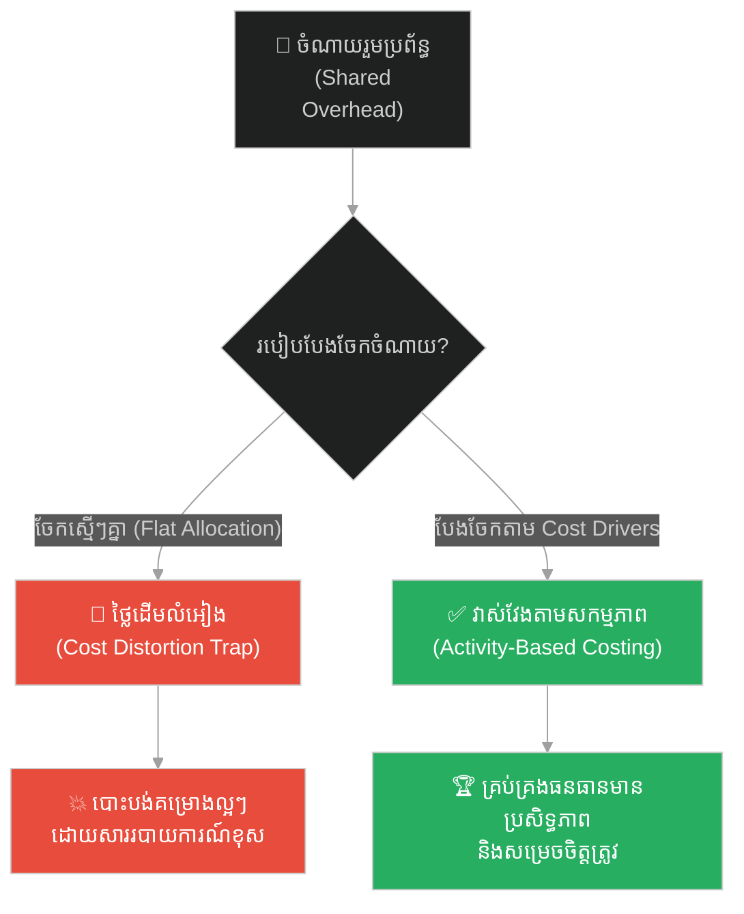
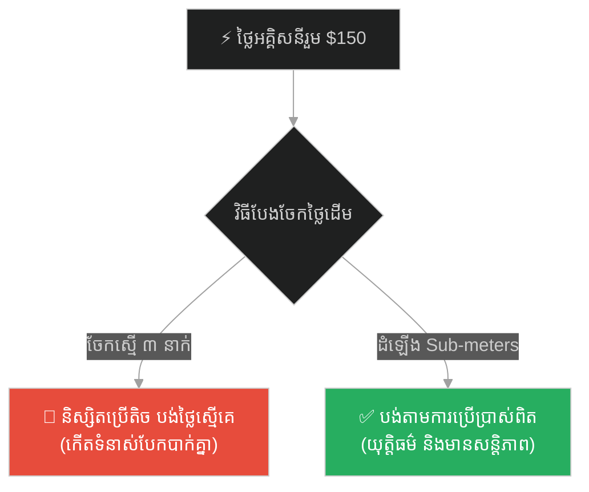
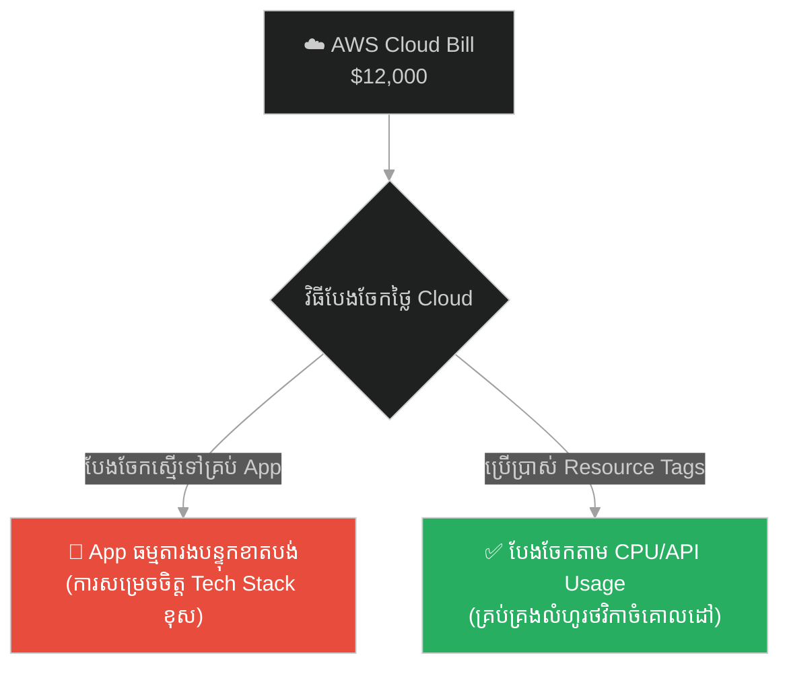
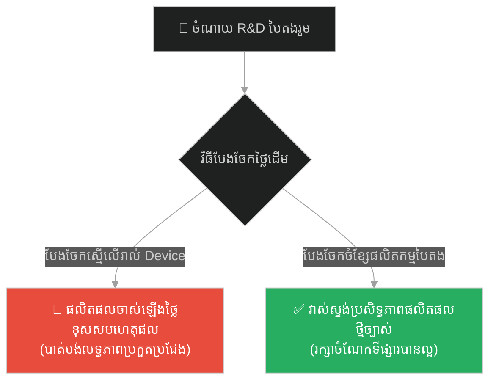
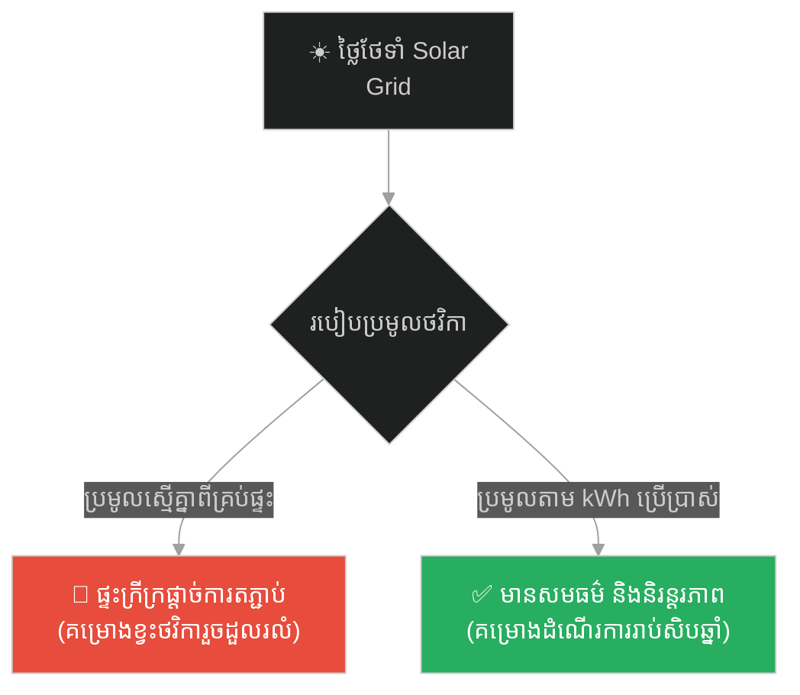
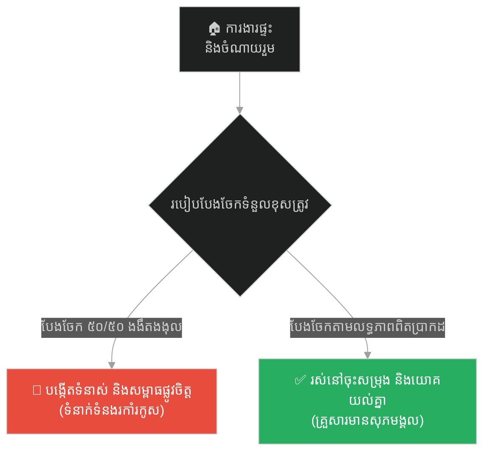
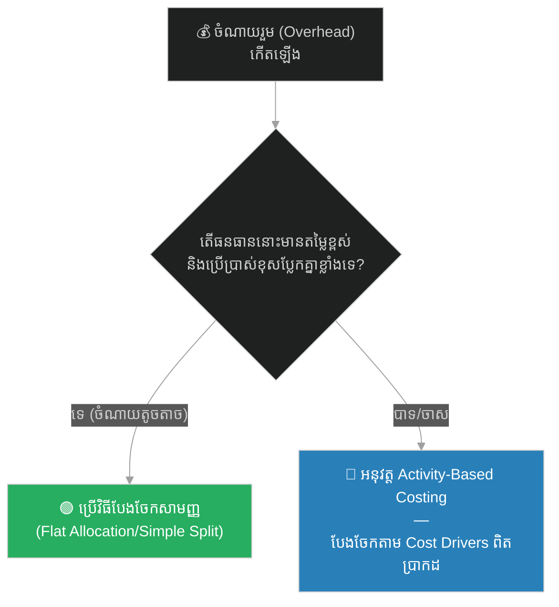

# Managerial Accounting & Cost Allocation (ហេរញ្ញិកនៃប្រាសាទ)៖ គណនេយ្យគ្រប់គ្រង និងការបែងចែកថ្លៃដើមសម្រាប់និរន្តរភាព (Managerial Accounting & Cost Allocation & Activity-Based Costing and Overhead Cost Management & The Temple Treasurer)

**Author:** ichamrong  
**Date:** 2026-05-27  
**Tags:** #managerial-accounting #cost-allocation #activity-based-costing #business-sustainability #cambodian-context  
**Category:** Business Sustainability  
**Read Time:** ~15 min  

---

## 📌 មាតិកា (Table of Contents)
- [អន្ទាក់ផ្លូវចិត្ត (The Trap)](#0)
- [១. រឿងព្រេងនិទាន៖ ហេរញ្ញិកនៃប្រាសាទ (The Legend of The Temple Treasurer)](#1)
  - [ការវិភាគថ្លៃដើមតាមសកម្មភាពពិតប្រាកដ (The Climax: Activity-Based Analysis)](#1-1)
- [២. បញ្ហា៖ ភាពវង្វេងនៃថ្លៃដើមរួម និងការបែងចែកលំអៀង (The Issue: Cost Distortion and Shared Overhead Misallocation)](#2)
- [៣. ឧទាហរណ៍ជាក់ស្តែងក្នុងពិភពពិត (Real World Examples)](#3)
  - [ឧទាហរណ៍ទី ១ — កម្រិតស្រាល (គ្រួសារ)៖ ការបែងចែកថ្លៃទឹកភ្លើងរួមនៅក្នុងផ្ទះជួលរួមគ្នា (The Family Apartment Utility Bill)](#3-1)
  - [ឧទាហរណ៍ទី ២ — កម្រិតមធ្យម (បច្ចេកទេស)៖ ការបែងចែកថ្លៃសេវា Cloud ទៅឱ្យ Microservices ផ្សេងៗគ្នា (The Dev Multi-Tenant Cloud Resource Allocation)](#3-2)
  - [ឧទាហរណ៍ទី ៣ — កម្រិតមធ្យម (ធុរកិច្ច)៖ ការគ្រប់គ្រងថ្លៃ R&D ផលិតផលបៃតងរបស់ក្រុមហ៊ុន Apple (The Business Green Supply Chain Cost Allocation)](#3-3)
  - [ឧទាហរណ៍ទី ៤ — កម្រិតមធ្យម (សង្គម/គ្រប់គ្រង)៖ ការបែងចែកថវិកាគម្រោងរួមរបស់សហគមន៍លើប្រព័ន្ធសូឡាជនបទ (The Management Rural Community Solar Grid Cost Distribution)](#3-4)
  - [ឧទាហរណ៍ទី ៥ — កម្រិតធ្ងន់ (ទំនាក់ទំនង)៖ ការបែងចែកការចំណាយ និងពេលវេលារៀបចំផ្ទះរបស់គូស្រករថ្មីថ្មោង (The Relationship Chore and Financial Resource Allocation)](#3-5)
- [៤. ដំណោះស្រាយទូទៅ៖ ប្រព័ន្ធគណនាថ្លៃដើមតាមសកម្មភាព (The General Solution: Activity-Based Costing - ABC)](#4)
- [សេចក្តីសន្និដ្ឋាន (Conclusion)](#5)
- [ឯកសារយោង (References)](#6)
- [Related Posts](#7)

---

<a id="0"></a>
## អន្ទាក់ផ្លូវចិត្ត (The Trap)

ចម្ងល់ជាមូលដ្ឋាននៅក្នុងគ្រប់ស្ថាប័ន ឬអាជីវកម្មដែលមានធនធានកម្រិតកំណត់ គឺ៖ តើត្រូវធ្វើតុល្យការរវាងភាពម៉ឺងម៉ាត់នៃប្រព័ន្ធហិរញ្ញវត្ថុ និងភាពសាមញ្ញនៃប្រតិបត្តិការដោយរបៀបណា? នៅក្នុងគម្រោងអភិវឌ្ឍន៍ប្រកបដោយចីរភាព ឬការគ្រប់គ្រងស្ថាប័នធំៗ ការបែងចែកថ្លៃដើមរួម (shared overhead cost allocation) ជារឿយៗក្លាយជាអន្ទាក់ហិរញ្ញវត្ថុយ៉ាងធំ ដែលអាចបំផ្លាញគម្រោងល្អៗ ឬការសម្រេចចិត្តជាយុទ្ធសាស្ត្របានយ៉ាងងាយស្រួល។

* **ផ្លូវងងឹត (Failure Path)** — ការបែងចែកថ្លៃដើមរួមស្មើគ្នា (Flat Allocation) ដែលនាំឱ្យគម្រោងប្រើធនធានតិចត្រូវរងបន្ទុកធ្ងន់រហូតត្រូវលុបចោល ខណៈគម្រោងប្រើធនធានច្រើនមើលទៅចំណេញ។
* **ផ្លូវពន្លឺ (Success Path)** — ការបែងចែកថ្លៃដើមតាមសកម្មភាព (Activity-Based Costing) ឆ្លុះបញ្ចាំងពីតម្លៃពិតប្រាកដនៃប្រតិបត្តិការ និងការសម្រេចចិត្តធុរកិច្ចបានត្រឹមត្រូវ។

ដើម្បីយល់ដឹងពីវិធីគ្រប់គ្រងថ្លៃដើម និងយន្តការសម្រេចចិត្តខាងក្រោមនេះជាផែនទីបង្ហាញផ្លូវ៖
1. **រឿងព្រេងនិទាន (The Legend)** — រឿងរ៉ាវរបស់ ចរ (Char) ហេរញ្ញិកប្រចាំប្រាសាទអង្គរវត្ត ក្នុងការសង្គ្រោះគម្រោងការដ្ឋានភាគខាងកើតពីការលុបចោល។
2. **បញ្ហា (The Issue)** — ភាពវង្វេងនៃថ្លៃដើមរួម និងការបកស្រាយកូដគំរូ (Python) នៃការបែងចែកបែបចាស់ធៀបនឹង ABC។
3. **ឧទាហរណ៍ជាក់ស្តែងក្នុងពិភពពិត (Real World Examples)** — ករណីសិក្សា ៥ កម្រិត ចាប់ពីកម្រិតគ្រួសាររហូតដល់ទំនាក់ទំនងរវាងប្តីប្រពន្ធ។
4. **ដំណោះស្រាយទូទៅ (The General Solution)** — ការបង្កើតប្រព័ន្ធគណនេយ្យគ្រប់គ្រងកូនកាត់ និងការកំណត់ថ្លៃដើមតាមសកម្មភាពជាក់ស្តែង។



---

<a id="1"></a>
## ១. រឿងព្រេងនិទាន៖ ហេរញ្ញិកនៃប្រាសាទ (The Legend of The Temple Treasurer)

នៅសតវត្សរ៍ទី ១២ នៃអាណាចក្រខ្មែរ ក្រោមការដឹកនាំរបស់ព្រះបាទសូរ្យវរ្ម័នទី ២ (Suryavarman II) មហាស្នាដៃនៃការសាងសង់ប្រាសាទអង្គរវត្តកំពុងតែដំណើរការទៅយ៉ាងរស់រវើក។ ដើម្បីសម្របសម្រួលការងារដ៏មហិមានេះ ព្រះរាជាបានតែងតាំង **ចរ (Char)** ឱ្យធ្វើជាហេរញ្ញិកកំពូលប្រចាំប្រាសាទ (Temple Treasurer)។ ចរ មិនមែនជាអ្នកកត់ត្រាបញ្ជីចំណូលចំណាយធម្មតាឡើយ គាត់គឺជាអ្នកវិភាគទិន្នន័យ និងគ្រប់គ្រងធនធានដ៏ប៉ិនប្រសប់។

នៅក្នុងគម្រោងសាងសង់ដ៏ធំនេះ មានផ្នែកការដ្ឋានចំនួនបីដែលដំណើរការទន្ទឹមគ្នា៖
1. **ប្រាសាទភាគខាងកើត (East Wing)**៖ ផ្តោតលើការឆ្លាក់ក្បាច់ក្បូរដ៏ល្អិតល្អន់ និងរូបអប្សរាដែលទាមទារសិល្បករជំនាញកំពូល។
2. **ប្រាសាទភាគកណ្តាល (Central Sanctuary)**៖ ជាទីសក្ការៈធំខ្ពស់ត្រដែត ដែលទាមទារថ្មភក់ដុំធំៗមហិមាសម្រាប់សង់គ្រឹះ និងជញ្ជាំងខ្ពស់ៗ។
3. **ប្រាសាទភាគខាងលិច (West Wing)**៖ ជាច្រកចូលធំ និងវិចិត្រសាលវែងអន្លាយសម្រាប់ដង្ហែក្បួនទ័ព។

ការដ្ឋានទាំងបីនេះប្រើប្រាស់ធនធានរួម (Shared Overhead Resources) ដូចគ្នាពីព្រះរាជវាំង រួមមាន៖
* **កងពលដំរីដឹកជញ្ជូន (Elephant Logistics Corps)**៖ សម្រាប់អូសទាញថ្មពីភ្នំគូលែន។
* **ឃ្លាំងស្រូវរួម (Communal Granary)**៖ សម្រាប់ផ្តល់ស្បៀងអាហារដល់សិល្បករ និងកម្លាំងពលកម្ម។
* **ប្រព័ន្ធប្រឡាយទឹកព្រះរាជទ្រព្យ (Royal Canal System)**៖ សម្រាប់ដឹកជញ្ជូនថ្មតាមផ្លូវទឹក។

តាមទម្លាប់ចាស់មុនៗមក មន្ត្រីគណនេយ្យករតែងតែប្រើវិធីសាស្ត្របែងចែកថ្លៃដើមរួមបែប **«ចែកស្មើជាបីភាគ» (Flat 33.3% Split Allocation)** ទៅលើរាល់ចំណាយរួមទាំងអស់។ វិធីនេះមានភាពសាមញ្ញ និងងាយស្រួលយល់ ប៉ុន្តែវាមិនបានឆ្លុះបញ្ចាំងពីតថភាពប្រតិបត្តិការឡើយ។

<a id="1-1"></a>
### ការវិភាគថ្លៃដើមតាមសកម្មភាពពិតប្រាកដ (The Climax: Activity-Based Analysis)

នៅឆ្នាំទី ៤ នៃការពុះពារសាងសង់ គ្រោះមហន្តរាយធម្មជាតិបានកើតឡើង។ ទឹកជំនន់រដូវវស្សាដ៏សាហាវ (monsoon floods) បានវាយប្រហារការដ្ឋានប្រាសាទភាគខាងកើតយ៉ាងធ្ងន់ធ្ងរ។ ទឹកបានលិចផ្លូវ លិចរោងជាង និងបំផ្លាញថ្មភក់ដែលបានឆ្លាក់រួចមួយចំនួនធំ ដែលស្មើនឹងការខូចខាតប្រមាណ **២០% នៃថវិកាសរុប (budget overrun)**។ ជាងចម្លាក់ជាច្រើនត្រូវផ្អាកការងារ និងជម្លៀសទៅកាន់ទីទួលសុវត្ថិភាព។

នៅចំពោះមុខព្រះភក្ត្រព្រះមហាក្សត្រ មន្ត្រីនាយករដ្ឋមន្ត្រីបានក្រាបទូលស្នើសុំឱ្យ **«បញ្ឈប់គម្រោងប្រាសាទភាគខាងកើតចោល»** ដោយផ្អែកលើរបាយការណ៍ហិរញ្ញវត្ថុចាស់៖
> *«ក្រាបទូលព្រះករុណា! ប្រាសាទភាគខាងកើតកំពុងតែលេបត្របាក់ថវិការួមរបស់អាណាចក្រយ៉ាងសន្ធឹកសន្ធាប់។ ទោះបីជាការងារត្រូវផ្អាក តែចំណាយលើដំរីដឹកជញ្ជូន ស្បៀងអាហារ និងប្រព័ន្ធប្រឡាយដែលបែងចែកមកផ្នែកខាងកើត នៅតែខ្ពស់កប់ពពកដដែល។ បើបន្តទៅទៀត យើងនឹងខ្សោះខ្លួនជាមិនខាន!»*

ព្រះរាជាសូរ្យវរ្ម័នទី ២ បានបែរព្រះភក្ត្រមកសួរដេញដោល ចរ ថា៖ **«តើគណនេយ្យរបស់ប្រាសាទភាគខាងកើតពិតជាដុនដាបដល់ថ្នាក់នេះមែនឬ ចរ? តើយើងគួរតែលះបង់គម្រោងសោភ័ណភាពនេះចោលឬ?»**

ចរ បានក្រាបថ្វាយបង្គំរួចបើកក្រាំងស្បែកសត្វដ៏ធំរបស់ខ្លួន ហើយទូលតបវិញយ៉ាងស្ងប់ស្ងៀមថា៖
> *«សូមទ្រង់ព្រះមេត្តាប្រោស! របាយការណ៍ដែលនាយករដ្ឋមន្ត្រីបានឃើញ គឺជាគណនេយ្យលំអៀង។ ប្រាសាទភាគខាងកើតមិនបានបំផ្លាញថវិកាដំរី ឬប្រព័ន្ធទឹកដូចការចោទប្រកាន់នោះឡើយ។»*

ចរ បានពន្យល់ពីវិធីសាស្ត្រ **«ការវិភាគថ្លៃដើមតាមសកម្មភាពជាក់ស្តែង» (Activity-Based Costing - ABC)** ដែលគាត់បានរៀបចំឡើងជាសម្ងាត់៖
1. **កងពលដំរី (Elephant Logistics)**៖ កន្លងមក ថ្លៃដើមរក្សាដំរីត្រូវបានបែងចែកស្មើគ្នា ៣៣.៣% ទៅឱ្យគម្រោងទាំងបី។ ប៉ុន្តែតាមការពិត ប្រាសាទភាគខាងកើតប្រើប្រាស់តែថ្មភក់តូចៗដែលដឹកដោយរទេះប៉ុណ្ណោះ ពួកគេប្រើប្រាស់ដំរីតែ **៥%** នៃជើងដឹកជញ្ជូនសរុប។ ផ្ទុយទៅវិញ គឺប្រាសាទភាគកណ្តាលដែលប្រើប្រាស់កងពលដំរីរហូតដល់ **៧៥%** ដើម្បីអូសដុំថ្មយក្សៗ។
2. **ឃ្លាំងស្រូវរួម (Communal Granary)**៖ ជាងចម្លាក់នៅភាគខាងកើតប្រើប្រាស់កម្លាំងពលកម្មតិចតែមានជំនាញខ្ពស់ ពួកគេប្រើប្រាស់ស្បៀងត្រឹមតែ **១០%** ប៉ុណ្ណោះ ចំណែកភាគខាងលិចដែលប្រើកម្លាំងពលកម្មរាប់ម៉ឺននាក់សម្រាប់សង់វិចិត្រសាល បែរជាប្រើប្រាស់ស្បៀងរហូតដល់ **៦០%**។

ចរ បានក្រាបទូលសេចក្តីសន្និដ្ឋានថា៖
> *«នៅពេលរដូវវស្សាមកដល់ ហើយការងារនៅភាគខាងកើតត្រូវផ្អាក យើងបានកាត់បន្ថយចំណាយអថេរ (Variable Costs) ដូចជា ថ្មភក់ និងប្រាក់រង្វាន់ជាងចម្លាក់អស់ទៅហើយ។ ចំណែកចំណាយរួមដែលនៅសេសសល់ គឺត្រូវបានបែងចែកខុសដោយប្រព័ន្ធគណនេយ្យចាស់ប៉ុណ្ណោះ។ បើយើងបែងចែកថ្លៃដើមរួមទៅតាម **សកម្មភាព និងកត្តាជម្រុញថ្លៃដើមពិតប្រាកដ (Cost Drivers)** នោះយើងនឹងឃើញថា ប្រាសាទភាគខាងកើតចំណាយតិចជាងការគ្រោងទុកទៅទៀត! គម្រោងនេះមិនគួរត្រូវបានលុបចោលឡើយ។ យើងគ្រាន់តែកែសម្រួលកាត់បន្ថយថ្មតុបតែងមិនចាំបាច់មួយចំនួន ១៥% និងពន្យារពេលសាងសង់មួយរដូវវស្សា នោះយើងនឹងសង់ប្រាសាទនេះរួចរាល់ដោយមិនចាំបាច់បន្ថែមថវិកាសូម្បីតែមួយដួងឡើយ។»*

ព្រះរាជាបានព្រះសណ្ដាប់ហើយ ទ្រង់មានការស្ញប់ស្ញែងយ៉ាងខ្លាំងចំពោះគតិបណ្ឌិតរបស់ ចរ និងបានសម្រេចព្រះទ័យអនុម័តឱ្យបន្តការសាងសង់ភ្លាមៗ។ ប្រាសាទភាគខាងកើតត្រូវបានបញ្ចប់ជាស្ថាពរ ប្រកបដោយក្បាច់ចម្លាក់ដ៏វិចិត្រអស្ចារ្យ ដែលតម្កល់ទុកជាកេរដំណែលរាប់ពាន់ឆ្នាំមកទល់បច្ចុប្បន្ន ទាំងអស់នេះក៏ព្រោះតែការសម្រេចចិត្តផ្អែកលើ «គណនេយ្យគ្រប់គ្រងដ៏ត្រឹមត្រូវ» របស់ហេរញ្ញិក ចរ។

---

<a id="2"></a>
## ២. បញ្ហា៖ ភាពវង្វេងនៃថ្លៃដើមរួម និងការបែងចែកលំអៀង (The Issue: Cost Distortion and Shared Overhead Misallocation)

នៅក្នុងគណនេយ្យគ្រប់គ្រង ភាពលំអៀងនៃថ្លៃដើម **(Cost Distortion)** កើតឡើងនៅពេលដែលស្ថាប័នមួយបែងចែកថ្លៃដើមរួម (Overhead) ដោយប្រើប្រាស់វិធីសាស្ត្រសាមញ្ញហួសហេតុ ដូចជាការបែងចែកស្មើគ្នា ឬបែងចែកផ្អែកលើម៉ោងការងារផ្ទាល់តែមួយមុខ។ នេះធ្វើឱ្យផលិតផល ឬគម្រោងដែលប្រើប្រាស់ធនធានតិច (Low volume/Low complexity) ជួយចេញលុយជំនួសផលិតផលដែលប្រើប្រាស់ធនធានច្រើន (High complexity)។

ខាងក្រោមនេះជាកូដគំរូ Python បង្ហាញពីរបៀបបែងចែកថ្លៃដើមបែបចាស់ (Flat Allocation) និងប្រព័ន្ធគណនេយ្យបែបថ្មី (Activity-Based Costing)៖

```python
# ============================================================================
# FRAGILE COST ALLOCATION (វិធីសាស្ត្របែងចែកថ្លៃដើមរួមបែបចាស់ - ចែកស្មើ)
# ============================================================================
def allocate_costs_flat(total_overhead, departments):
    """
    Allocates overhead equally among all departments regardless of actual usage.
    បែងចែកថ្លៃដើមរួមស្មើគ្នារវាងដេប៉ាតឺម៉ង់ទាំងអស់ (បង្កើត Cost Distortion)។
    """
    allocated = {}
    flat_rate = total_overhead / len(departments)
    for dept in departments:
        allocated[dept] = flat_rate
    return allocated

# ============================================================================
# RESILIENT COST ALLOCATION (វិធីសាស្ត្របែងចែកតាមសកម្មភាព - ABC)
# ============================================================================
def allocate_costs_abc(activities, departments_usage):
    """
    Allocates overhead by calculating rates per Cost Driver and mapping to department usage.
    បែងចែកថ្លៃដើមរួមតាមកត្តាជម្រុញ (Cost Drivers) នៃសកម្មភាពនីមួយៗ។
    """
    allocated = {dept: 0.0 for dept in departments_usage}
    
    for activity, details in activities.items():
        total_cost = details["cost"]
        total_driver_units = details["total_driver_units"]
        
        # Calculate allocation rate per unit of cost driver
        rate_per_unit = total_cost / total_driver_units
        
        # Allocate to each department based on its usage
        for dept, usage in departments_usage.items():
            dept_usage = usage.get(activity, 0)
            allocated[dept] += dept_usage * rate_per_unit
            
    return allocated

# Simulation Data
departments = ["East_Wing_Carving", "Central_Sanctuary_Heavy", "West_Wing_Gallery"]
total_overhead_cost = 90000.0  # Total budget for elephants and granary

# ABC Activity setup
activities = {
    "Elephant_Logistics": {"cost": 60000.0, "total_driver_units": 100},  # 100 trips
    "Communal_Granary": {"cost": 30000.0, "total_driver_units": 300}     # 300 workers
}

# Actual usage by each department
departments_usage = {
    "East_Wing_Carving": {"Elephant_Logistics": 5, "Communal_Granary": 30},     # Low usage
    "Central_Sanctuary_Heavy": {"Elephant_Logistics": 75, "Communal_Granary": 90}, # High logistics
    "West_Wing_Gallery": {"Elephant_Logistics": 20, "Communal_Granary": 180}    # High labor
}

print("--- FLAT RATE ALLOCATION RESULT ---")
flat_result = allocate_costs_flat(total_overhead_cost, departments)
for dept, cost in flat_result.items():
    print(f"{dept}: ${cost:.2f}")
# Output: East_Wing_Carving: $30000.00 (Unfairly penalizing East Wing)

print("\n--- ACTIVITY-BASED COSTING (ABC) RESULT ---")
abc_result = allocate_costs_abc(activities, departments_usage)
for dept, cost in abc_result.items():
    print(f"{dept}: ${cost:.2f}")
# Output: East_Wing_Carving: $6000.00 (Accurate cost representation!)
# Output: Central_Sanctuary_Heavy: $54000.00
# Output: West_Wing_Gallery: $30000.00
```

---

<a id="3"></a>
## ៣. ឧទាហរណ៍ជាក់ស្តែងក្នុងពិភពពិត (Real World Examples)

ខាងក្រោមនេះជាករណីសិក្សា ៥ កម្រិតដែលឆ្លុះបញ្ចាំងពីសារៈសំខាន់នៃការបែងចែកថ្លៃដើមរួម៖

---

<a id="3-1"></a>
### ឧទាហរណ៍ទី ១ — កម្រិតស្រាល (គ្រួសារ)៖ ការបែងចែកថ្លៃទឹកភ្លើងរួមនៅក្នុងផ្ទះជួលរួមគ្នា (The Family Apartment Utility Bill)

**ស្ថានភាព៖** និស្សិត ៣ នាក់ជួលផ្ទះរួមគ្នា ហើយត្រូវបង់ថ្លៃអគ្គិសនីរួមប្រចាំខែចំនួន $150។
* **ការបែងចែកបែបលំអៀង (Flat Split)៖** និស្សិតទាំង ៣ នាក់ចែកគ្នាបង់ម្នាក់ $50 ស្មើគ្នា។ ប៉ុន្តែនិស្សិតម្នាក់ប្រើប្រាស់តែអំពូលភ្លើង និងកង្ហារតូច ខណៈមិត្តរួមបន្ទប់ពីរនាក់ទៀតបើកម៉ាស៊ីនត្រជាក់ និងកុំព្យូទ័រលេងហ្គេមពេញ ២៤ ម៉ោង។ នេះបង្កឱ្យមានទំនាស់ និងការរស់នៅមិនចុះសម្រុង។
* **ការបែងចែកតាមសកម្មភាព (ABC Approach)៖** ពួកគេដំឡើងឧបករណ៍វាស់ស្ទង់ថាមពល (sub-meters) នៅតាមបន្ទប់នីមួយៗ ហើយបែងចែកថ្លៃភ្លើងទៅតាមគីឡូវ៉ាត់ម៉ោង (kWh Consumed) ដែលប្រើប្រាស់ពិតប្រាកដ។



---

<a id="3-2"></a>
### ឧទាហរណ៍ទី ២ — កម្រិតមធ្យម (បច្ចេកទេស)៖ ការបែងចែកថ្លៃសេវា Cloud ទៅឱ្យ Microservices ផ្សេងៗគ្នា (The Dev Multi-Tenant Cloud Resource Allocation)

**ស្ថានភាព៖** ក្រុមហ៊ុន Software មួយប្រើប្រាស់គណនី AWS រួមដែលមានតម្លៃ $12,000 ក្នុងមួយខែ។
* **ការបែងចែកបែបលំអៀង (Flat Split)៖** ក្រុមហ៊ុនបែងចែកថ្លៃ Cloud នេះស្មើគ្នាទៅឱ្យគម្រោង App ទាំង ៤ របស់ខ្លួន (ម្នាក់ $3,000)។ លទ្ធផលគឺ App ជំនួយការអតិថិជនសាមញ្ញ (Simple CRUD tool) ដែលប្រើប្រាស់ CPU តិច បែរជារងការខាតបង់ថវិកា ចំណែក App វិភាគរូបភាព (Heavy AI Processor) មើលទៅដូចជាមានប្រសិទ្ធភាពចំណេញខ្ពស់។
* **ការបែងចែកតាមសកម្មភាព (ABC Approach)៖** ក្រុមការងារដំឡើង Tagging (Cost Allocation Tags) លើ AWS Resources ដើម្បីវាស់ស្ទង់ការប្រើប្រាស់ CPU, Memory, និង API requests ពិតប្រាកដ។



---

<a id="3-3"></a>
### ឧទាហរណ៍ទី ៣ — កម្រិតមធ្យម (ធុរកិច្ច)៖ ការគ្រប់គ្រងថ្លៃ R&D ផលិតផលបៃតងរបស់ក្រុមហ៊ុន Apple (The Business Green Supply Chain Cost Allocation)

**ស្ថានភាព៖** ក្រុមហ៊ុន Apple វិនិយោគរាប់លានដុល្លារលើគម្រោងកាត់បន្ថយឧស្ម័នកាបូន និង R&D សម្ភារៈកែច្នៃ (Recycled Materials)។
* **ការបែងចែកបែបលំអៀង (Flat Split)៖** ប្រសិនបើ Apple បែងចែករាល់ថ្លៃ R&D បរិស្ថានទាំងអស់ស្មើគ្នាទៅលើរាល់ផលិតផលទូរស័ព្ទគ្រប់ម៉ូដែល នោះម៉ូដែលទូរស័ព្ទធម្មតានឹងត្រូវឡើងថ្លៃខ្លាំង ហើយទូរស័ព្ទបច្ចេកវិទ្យាបៃតងថ្មីៗនឹងមិនអាចវាស់វែងប្រសិទ្ធភាពចំណេញពិតប្រាកដរបស់វាឡើយ។
* **ការបែងចែកតាមសកម្មភាព (ABC Approach)៖** Apple ប្រើប្រាស់ ABC ដើម្បីបែងចែកថ្លៃដើម R&D បៃតងនេះចំៗទៅលើខ្សែសង្វាក់ផលិតកម្មជាក់ស្តែងដែលប្រើប្រាស់វា (ដូចជា គម្រោង MacBook Air អាលុយមីញ៉ូមកែច្នៃ ១០០%)។



---

<a id="3-4"></a>
### ឧទាហរណ៍ទី ៤ — កម្រិតមធ្យម (សង្គម/គ្រប់គ្រង)៖ ការបែងចែកថវិកាគម្រោងរួមរបស់សហគមន៍លើប្រព័ន្ធសូឡាជនបទ (The Management Rural Community Solar Grid Cost Distribution)

**ស្ថានភាព៖** សហគមន៍ជនបទមួយដំឡើងប្រព័ន្ធសូឡារួម (Community Solar Grid) ហើយត្រូវរួមគ្នាប្រមូលថ្លៃថែទាំអាគុយ និងបច្ចេកទេស។
* **ការបែងចែកបែបលំអៀង (Flat Split)៖** គណៈកម្មការបែងចែកចំណាយស្មើគ្នាទៅលើគ្រប់ផ្ទះ។ ផ្ទះក្រីក្រប្រើប្រាស់ត្រឹមតែអំពូលបំភ្លឺ ១-២ គ្រាប់ ត្រូវបង់លុយស្មើផ្ទះអ្នកមានដែលបើកទូរទឹកកក និងទូរទស្សន៍ពេញមួយថ្ងៃ។ ផ្ទះក្រីក្រគ្មានលទ្ធភាពបង់ក៏សុំផ្តាច់ខ្លួន ដែលនាំឱ្យគម្រោងទាំងមូលដួលរលំ។
* **ការបែងចែកតាមសកម្មភាព (ABC Approach)៖** គណៈកម្មការបែងចែកថ្លៃថែទាំតាមរយៈចំនួន kWh នៃការប្រើប្រាស់ជាក់ស្តែងរបស់ផ្ទះនីមួយៗ ដែលវាស់វែងដោយ Smart meters។



---

<a id="3-5"></a>
### ឧទាហរណ៍ទី ៥ — កម្រិតធ្ងន់ (ទំនាក់ទំនង)៖ ការបែងចែកការចំណាយ និងពេលវេលារៀបចំផ្ទះរបស់គូស្រករថ្មីថ្មោង (The Relationship Chore and Financial Resource Allocation)

**ស្ថានភាព៖** គូស្វាមីភរិយាថ្មីថ្មោងចង់បែងចែកការចំណាយប្រចាំខែ និងការងារផ្ទះរួម (Housekeeping/Cooking)។
* **ការបែងចែកបែបលំអៀង (Flat Split)៖** ពួកគេបែងចែកការចំណាយហិរញ្ញវត្ថុ ៥០/៥០ ស្មើគ្នា និងម៉ោងធ្វើការងារផ្ទះស្មើគ្នា។ ប៉ុន្តែប្តីធ្វើការងារពេញម៉ោងមានប្រាក់ខែខ្ពស់ ឯប្រពន្ធធ្វើការងារក្រៅម៉ោង (Part-time) មានប្រាក់ខែតិចតែមានពេលវេលាច្រើន។ វិធី ៥០/៥០ នេះកៀបសង្កត់ប្រពន្ធផ្នែកហិរញ្ញវត្ថុ និងកៀបសង្កត់ប្តីផ្នែកពេលវេលា បង្កជាទំនាស់រកាំរកូសឥតឈប់ឈរ។
* **ការបែងចែកតាមសកម្មភាព (ABC Approach)៖** ពួកគេបែងចែកចំណាយហិរញ្ញវត្ថុតាមសមាមាត្រប្រាក់ចំណូល និងបែងចែកការងារផ្ទះតាមសមាមាត្រពេលវេលាទំនេរដែលមានជាក់ស្តែង។



---

<a id="4"></a>
## ៤. ដំណោះស្រាយទូទៅ៖ ប្រព័ន្ធគណនាថ្លៃដើមតាមសកម្មភាព (The General Solution: Activity-Based Costing - ABC)

ដើម្បីជៀសវាងគ្រោះថ្នាក់នៃ "ថ្លៃដើមលំអៀង" និងធានាថាគម្រោងល្អៗមិនត្រូវបានលុបចោលដោយសាររបាយការណ៍ហិរញ្ញវត្ថុមិនត្រឹមត្រូវ អ្នកគ្រប់គ្រងគួរតែអនុវត្តយុទ្ធសាស្ត្រទាំងនេះ៖

### ១. លុបបំបាត់ការបែងចែកថ្លៃដើមរួមបែបងងឹតងងុល
ឈប់ប្រើប្រាស់វិធីសាស្ត្រចែកស្មើ (flat-rate allocation) ទៅលើចំណាយធំៗ។ ចូរវិភាគស្វែងរកកត្តាជម្រុញថ្លៃដើមពិតប្រាកដ (cost drivers) ដែលឆ្លុះបញ្ចាំងពីសកម្មភាពប្រតិបត្តិការជាក់ស្តែង។

### ២. អនុវត្តប្រព័ន្ធគណនេយ្យកូនកាត់ (Hybrid ABC Systems)
មិនចាំបាច់អនុវត្ត ABC លើគ្រប់ចំណាយតូចតាចទាំងអស់ឡើយ ព្រោះវាបង្កើតការងាររដ្ឋបាលស្មុគស្មាញ (administrative overhead)។ ផ្ទុយទៅវិញ ត្រូវផ្តោត ABC លើតែធនធានរួមណាដែលមានតម្លៃខ្ពស់ និងត្រូវបានប្រើប្រាស់ដោយគម្រោងផ្សេងៗគ្នាក្នុងកម្រិតខុសគ្នាខ្លាំង។

### ៣. វាយតម្លៃលើចំណាយដែលអាចជៀសវាងបាន (Avoidable Costs)
នៅពេលត្រូវសម្រេចចិត្តលុបចោល ឬបន្តគម្រោងណាមួយ ត្រូវផ្តោតការវិភាគលើ «ចំណាយដែលអាចជៀសវាងបាន» (Avoidable Costs) ប្រសិនបើគម្រោងនោះត្រូវបានបញ្ឈប់។ ចំណាយរួមថេរខ្លះ (Unavoidable Fixed Overhead) ទោះបីជាលុបគម្រោងចោល ក៏វានៅតែកើតមានដដែល។



---

## 🐇 ធ្លាក់ចូលក្នុងរន្ធទន្សាយ (Enter the Rabbit Hole)
ដើម្បីស្វែងយល់បន្ថែមអំពីវិធីសាស្ត្រវាយតម្លៃលទ្ធភាពប្រកួតប្រជែងរបស់ស្ថាប័នក្នុងទីផ្សារ និងការរៀបចំយុទ្ធសាស្ត្រសាជីវកម្ម សូមបន្តដំណើរទៅកាន់៖

* 🚀 **[ចាប់ផ្តើមដំណើររុករក (Start the Journey) ➔ Corporate Strategy & Competitiveness (អាឡិចសាន់ឌឺ និងកម្លាំងប្រជែងទាំងប្រាំ)](./246-alexander-and-the-five-forces.md)**

---

<a id="5"></a>
## សេចក្តីសន្និដ្ឋាន (Conclusion)

> **«របាយការណ៍ហិរញ្ញវត្ថុដែលខ្វះការវិភាគលម្អិត គឺប្រៀបដូចជាកញ្ចក់លំអៀង ដែលអាចធ្វើឱ្យមេទ័ពមើលឃើញកន្លែងមានសុវត្ថិភាពថាជាទឹកដីគ្រោះថ្នាក់ ហើយមើលឃើញទឹកដីគ្រោះថ្នាក់ថាជាកន្លែងមានសុវត្ថិភាព។»**

ការបែងចែកថ្លៃដើមរួមឱ្យបានត្រឹមត្រូវ មិនត្រឹមតែជាកិច្ចការគណនេយ្យប៉ុណ្ណោះទេ ប៉ុន្តែវាគឺជាសសរស្តម្ភដ៏សំខាន់ក្នុងការរៀបចំយុទ្ធសាស្ត្រ និងធានានិរន្តរភាពរបស់ស្ថាប័ន។ ចូរអនុវត្តគណនេយ្យគ្រប់គ្រងដ៏ត្រឹមត្រូវ ដើម្បីការពារគម្រោងល្អៗរបស់អ្នកពីការបំផ្លាញដោយសន្លឹករបាយការណ៍ហិរញ្ញវត្ថុលំអៀង។

---

<a id="6"></a>
## ឯកសារយោង (References)

* **Horngren, Charles T.** — *Cost Accounting: A Managerial Emphasis* (15th Edition)។ សៀវភៅណែនាំគ្រឹះនៃគណនេយ្យថ្លៃដើម និងវិធីសាស្ត្រ Activity-Based Costing (ABC)។
* **Kaplan, Robert S. & Cooper, Robin** — *Cost & Effect: Using Integrated Cost Systems to Drive Profitability and Performance* (1998)។ ការវិភាគលម្អិតអំពីប្រព័ន្ធ ABC និងការសម្រេចចិត្តយុទ្ធសាស្ត្រ។
* **Denison University Coursework** — *05 Principles of Managerial Accounting for Business Sustainability* (Year 1)។ ឯកសារយោងសម្រាប់ការគ្រប់គ្រងថ្លៃដើមរួម។

---

<a id="7"></a>
## Related Posts

* **[05 Principles of Managerial Accounting](../05-managerial-accounting.md)** — មុខវិជ្ជាស្នូលស្ដីពីគណនេយ្យគ្រប់គ្រង និងការបែងចែកថ្លៃដើមរួមនៅ Denison University។
* **[២៤៣ — ពាណិជ្ជករងងឹតភ្នែក និងសៀវភៅកត់ត្រា (The Blind Merchant and the Ledger)](./243-the-blind-merchant-and-the-ledger.md)** — ស្វែងយល់អំពីគ្រឹះនៃគណនេយ្យហិរញ្ញវត្ថុ (Financial Accounting) សម្រាប់គ្រប់គ្រងទ្រព្យសកម្ម និងបំណុល។
* **[២៤៤ — នេសាទករ និងសំណាញ់ (The Fisherman and the Net)](./244-the-fisherman-and-the-net.md)** — មេរៀនស្តីពីវិធីសាស្ត្រស្ថិតិ និងការជៀសវាងភាពលំអៀងពីគំរូតូច។
