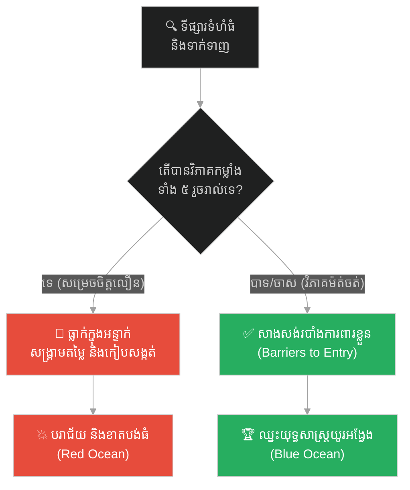
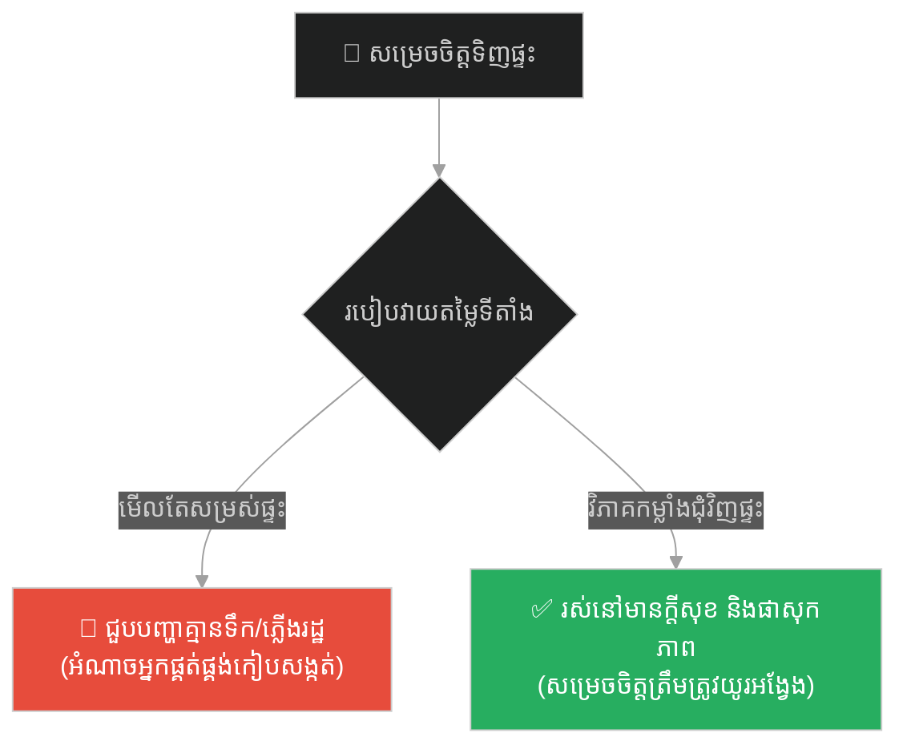
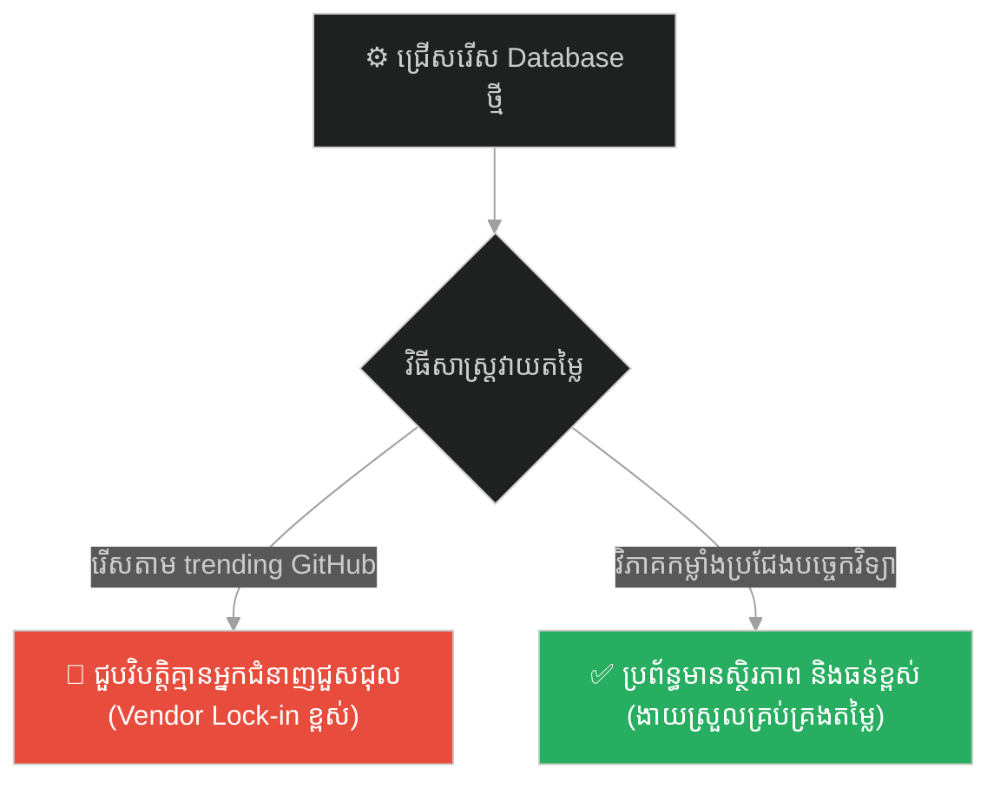
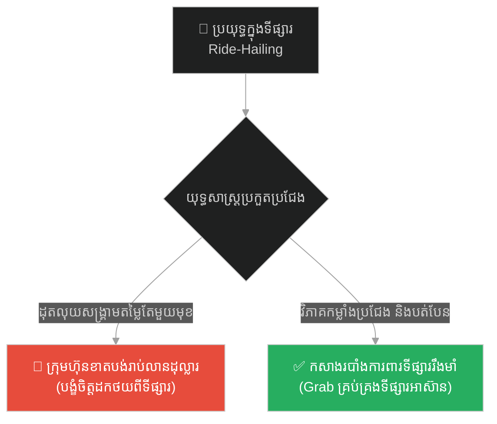
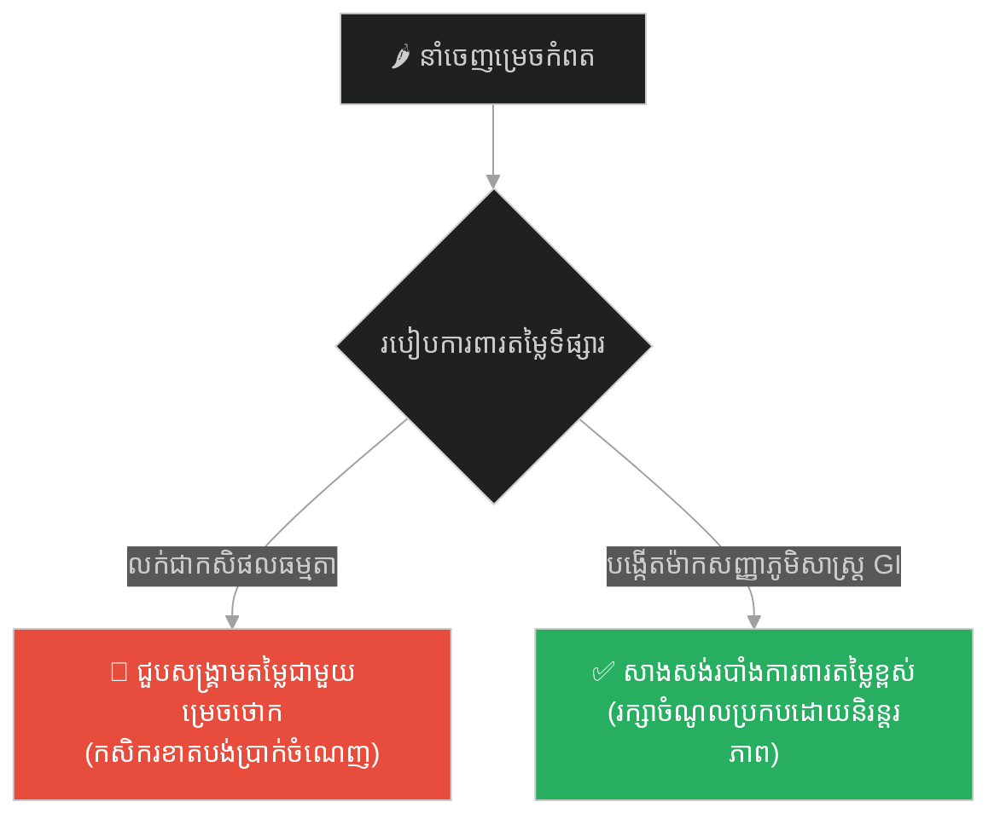
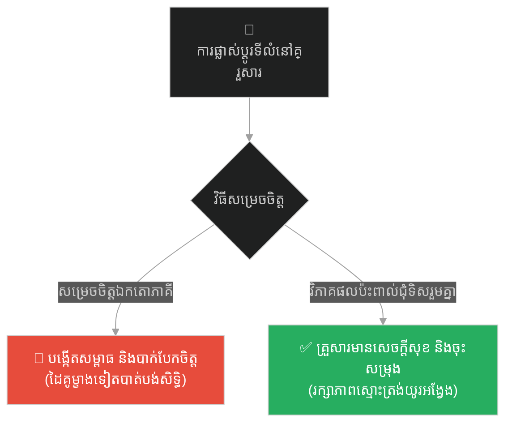
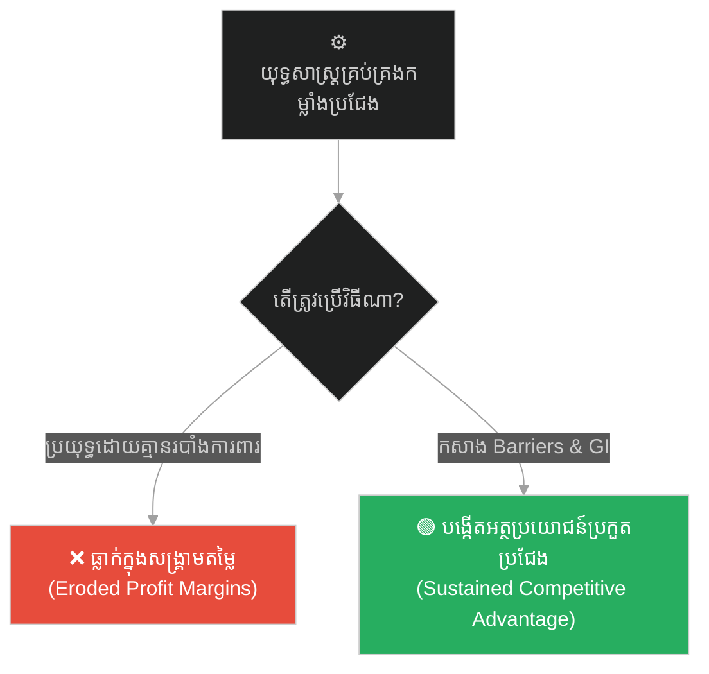

# Corporate Strategy & Competitiveness (អាឡិចសាន់ឌឺ និងកម្លាំងប្រជែងទាំងប្រាំ)៖ យុទ្ធសាស្ត្រសាជីវកម្ម និងការវាយតម្លៃលទ្ធភាពប្រកួតប្រជែង (Corporate Strategy & Competitiveness & Porter's Five Forces and Competitive Advantage & Alexander and the Five Forces)

**Author:** ichamrong  
**Date:** 2026-05-27  
**Tags:** #corporate-strategy #porters-five-forces #competitive-advantage #swot #blue-ocean #business-sustainability  
**Category:** Business Sustainability  
**Read Time:** ~15 min  

---

## 📌 មាតិកា (Table of Contents)
- [អន្ទាក់ផ្លូវចិត្ត (The Trap)](#0)
- [១. រឿងព្រេងនិទាន៖ អាឡិចសាន់ឌឺ និងកម្លាំងប្រជែងទាំងប្រាំ (The Legend of Alexander and the Five Forces)](#1)
  - [យុទ្ធសាស្ត្របំផ្លាញកងទ័ពជើងទឹកលើគោក (The Climax: Neutralizing the Fleet on Land)](#1-1)
- [២. បញ្ហា៖ ភាពទាក់ទាញខាងក្រៅ និងរចនាសម្ព័ន្ធប្រកួតប្រជែងផ្ទៃក្នុង (The Issue: Industry Attractiveness and Porter's Five Forces)](#2)
- [៣. ឧទាហរណ៍ជាក់ស្តែងក្នុងពិភពពិត (Real World Examples)](#3)
  - [ឧទាហរណ៍ទី ១ — កម្រិតស្រាល (គ្រួសារ)៖ ការជ្រើសរើសទិញផ្ទះ ឬទីតាំងលំនៅឋានសម្រាប់គ្រួសារ (The Family Home Location Decision)](#3-1)
  - [ឧទាហរណ៍ទី ២ — កម្រិតមធ្យម (បច្ចេកទេស)៖ ការជ្រើសរើសបច្ចេកវិទ្យា Database ឬ Web Framework សម្រាប់គម្រោងថ្មី (The Dev Tech Stack Selection)](#3-2)
  - [ឧទាហរណ៍ទី ៣ — កម្រិតមធ្យម (ធុរកិច្ច)៖ សង្គ្រាមសេវាជិះឡាន និងម៉ូតូឌុបនៅអាស៊ីអាគ្នេយ៍ (The Business Ride-Hailing War: Grab vs Uber)](#3-3)
  - [ឧទាហរណ៍ទី ៤ — កម្រិតមធ្យម (សង្គម/គ្រប់គ្រង)៖ ការបង្កើតយុទ្ធសាស្ត្រនាំចេញកសិផលសរីរាង្គម្រេចកំពត (The Management Cambodian Kampot Pepper GI Strategy)](#3-4)
  - [ឧទាហរណ៍ទី ៥ — កម្រិតធ្ងន់ (ទំនាក់ទំនង)៖ ការរក្សាតុល្យភាពឥទ្ធិពល និងការសម្រេចចិត្តក្នុងទំនាក់ទំនងប្តីប្រពន្ធ (The Relationship Shared Decision and Influence Power)](#3-5)
- [៤. ដំណោះស្រាយទូទៅ៖ ការកសាងអត្ថប្រយោជន៍ប្រកួតប្រជែងប្រកបដោយចីរភាព (The General Solution: Sustained Competitive Advantage)](#4)
- [សេចក្តីសន្និដ្ឋាន (Conclusion)](#5)
- [ឯកសារយោង (References)](#6)
- [Related Posts](#7)

---

<a id="0"></a>
## អន្ទាក់ផ្លូវចិត្ត (The Trap)

នៅក្នុងពិភពជំនួញ សហគ្រិន និងអ្នកដឹកនាំសាជីវកម្មជាច្រើនតែងតែធ្លាក់ចូលទៅក្នុង «អន្ទាក់នៃភាពទាក់ទាញខាងក្រៅ» (The Size and Attractiveness Trap)។ នៅពេលពួកគេឃើញទីផ្សារណាមួយមានទំហំធំធេង (Large Market Size) មានអតិថិជនរាប់លាននាក់ និងមានកំណើនលឿន ពួកគេតែងតែប្រញាប់ប្រញាល់លោតចូលទៅក្នុងទីផ្សារនោះភ្លាមៗ ដោយគិតយ៉ាងសាមញ្ញថា៖ *«ទីផ្សារធំធេងណាស់ ប្រសិនបើក្រុមហ៊ុនយើងដណ្តើមបានចំណែកទីផ្សារតែ ១% ក៏យើងក្លាយជាសេដ្ឋីដែរ!»*។

* **ផ្លូវងងឹត (Failure Path)** — ការវាយតម្លៃភាពទាក់ទាញរបស់ទីផ្សារដោយផ្អែកលើតែទំហំ និងកម្រិតចំណូល ជាជាងការសិក្សាពី «រចនាសម្ព័ន្ធប្រកួតប្រជែងផ្ទៃក្នុង» ដែលនាំទៅរកសង្គ្រាមតម្លៃ និងការក្ស័យធន។
* **ផ្លូវពន្លឺ (Success Path)** — ការវិភាគកម្លាំងប្រជែងទាំង ៥ យ៉ាងម៉ត់ចត់ ដើម្បីកំណត់វិធីសាស្ត្រសាងសង់របាំងការពារខ្លួន និងកសាងចំណែកទីផ្សារដែលរក្សាចំណេញខ្ពស់។

ដើម្បីយល់ដឹងពីរបៀបវិភាគ និងបង្កើតយុទ្ធសាស្ត្រឈ្នះនៅក្នុងទីផ្សារ នេះជាផែនទីបង្ហាញផ្លូវសម្រាប់អត្ថបទនេះ៖
1. **រឿងព្រេងនិទាន (The Legend)** — របៀបដែលមហាក្សត្រ អាឡិចសាន់ឌឺ (Alexander) វាយតម្លៃកម្លាំងយុទ្ធសាស្ត្រទាំង ៥ មុននឹងសម្រេចចិត្តវាយលុកចក្រភពពែរ្ស។
2. **បញ្ហា (The Issue)** — ការវិភាគ Porter's Five Forces ក្នុងការសម្រេចចិត្តសាជីវកម្ម និងការប្រៀបធៀបគូកូដគំរូ (Python) បង្ហាញពីវិធីសាស្ត្រលំអៀងធៀបនឹងវិធីសាស្ត្រយុទ្ធសាស្ត្រ។
3. **ឧទាហរណ៍ជាក់ស្តែងក្នុងពិភពពិត (Real World Examples)** — ករណីសិក្សា ៥ កម្រិត ចាប់ពីកម្រិតគ្រួសាររហូតដល់ទំនាក់ទំនងរវាងប្តីប្រពន្ធ។
4. **ដំណោះស្រាយទូទៅ (The General Solution)** — ការបង្កើតរបាំងការពារការចូល និងការកសាងអត្ថប្រយោជន៍ប្រកួតប្រជែងប្រកបដោយចីរភាព។



---

<a id="1"></a>
## ១. រឿងព្រេងនិទាន៖ អាឡិចសាន់ឌឺ និងកម្លាំងប្រជែងទាំងប្រាំ (The Legend of Alexander and the Five Forces)

នាសម័យបុរាណ មុនពេលមហាក្សត្រ **អាឡិចសាន់ឌឺ (Alexander the Great)** ដឹកនាំកងទ័ពម៉ាសេដូនៀ (Macedonian Army) 出征 វាយលុក **ចក្រភពពែរ្ស (Persian Empire)** ដ៏មានអំណាច និងមានទំហំធំជាងនគររបស់ព្រះអង្គរាប់រយដង មេទ័ពរៀមច្បងជាច្រើននាក់ ដូចជាមេទ័ព ផាមេនីអន (Parmenion) បានបង្ហាញភាពអន្ទះសាយ៉ាងខ្លាំង។ ពួកគេបានសម្លឹងមើលទៅទ្រព្យសម្បត្តិមហាសាល មាសប្រាក់ និងទំហំទឹកដីដ៏ធំធេងរបស់ពែរ្ស រួចទូលទៅព្រះអង្គថា៖ 
*«ក្រាបទូលព្រះអង្គ! ទីផ្សារទឹកដីពែរ្សពិតជាមានទ្រព្យសម្បត្តិស្តុកស្តម្ភណាស់ បើទោះជាយើងវាយយកបានតែផ្នែកតូចមួយ ក៏នគរយើងនឹងក្លាយជាមហាអំណាចហិរញ្ញវត្ថុដែរ។ កងទ័ពយើងកំពុងមានស្មារតីប្រយុទ្ធខ្ពស់ ហេតុអ្វីក៏ទ្រង់ត្រូវរង់ចាំ និងចំណាយពេលវិភាគយូរម៉្លេះ? សូមអនុញ្ញាតឱ្យយើងចេញច្បាំងភ្លាមទៅ!»*

អាឡិចសាន់ឌឺ បានសម្លឹងមើលមេទ័ពទាំងនោះដោយភាពស្ងប់ស្ងាត់ រួចទ្រង់បានគូសវាសផែនទីខ្សាច់មួយបង្ហាញពីភូមិសាស្ត្រនគរពែរ្ស និងកម្លាំងសឹកជុំវិញ។ ព្រះអង្គបានពន្យល់ថា៖
*«ការចូលទៅវាយលុកអាណាចក្រដ៏ធំមួយ ដោយឃើញតែទំហំទ្រព្យសម្បត្តិរបស់វា គឺជានយោបាយសម្លាប់ខ្លួន។ ប្រសិនបើយើងមិនយល់ដឹងពីកម្លាំងយុទ្ធសាស្ត្រទាំង ៥ (Five Competitive Forces) ដែលគ្រប់គ្រងសមរភូមិនេះទេ ជ័យជម្នះរបស់យើងនឹងរលាយបាត់ទៅវិញដូចផ្សែងជាក់ជាមិនខាន»*

ព្រះអង្គបានចាប់ផ្តើមពន្យល់កម្លាំងនីមួយៗលើផែនទីខ្សាច់៖

**១. អំណាចរបស់អ្នកផ្គត់ផ្គង់ (Bargaining Power of Suppliers)៖**  
*«ខ្សែចង្វាក់ផ្គត់ផ្គង់ (Supply Chain) របស់យើងគឺស្បៀង អាវុធ និងសេះសឹកពីម៉ាសេដូនៀ។ បើយើងដើរកាន់តែជ្រៅទៅក្នុងទឹកដីសត្រូវ ខ្សែចង្វាក់ផ្គត់ផ្គង់នេះនឹងកាន់តែវែង ហើយបើអ្នកផ្គត់ផ្គង់ ឬកុលសម្ព័ន្ធតាមផ្លូវកាត់ផ្តាច់ ឬដំឡើងថ្លៃដឹកជញ្ជូន កងទ័ពយើងនឹងដាច់ស្បៀងស្លាប់ដោយគ្មានបាច់ច្បាំងឡើយ។ ដូច្នេះ យើងត្រូវតែ Lock-in ផ្លូវផ្គត់ផ្គង់ និងបង្កើតសម្ព័ន្ធភាពជាមួយរដ្ឋតាមផ្លូវជាមុន»*

**២. អំណាចរបស់អ្នកទិញ ឬអ្នកគាំទ្រក្នុងតំបន់ (Bargaining Power of Buyers/Locals)៖**  
*«ប្រជាជន និងពួកចៅហ្វាយខេត្ត (Satraps) របស់ពែរ្ស គឺជាអ្នកសម្រេចជោគវាសនានៃការគ្រប់គ្រងរបស់យើង។ ប្រសិនបើយើងប្រើអំពើឃោរឃៅ ពួកគេនឹងរួមដៃគ្នាប្រឆាំងយើង ដែលធ្វើឱ្យយើងខាតបង់កម្លាំងទ័ពសម្រាប់ការពារក្រោយខ្នង។ ផ្ទុយទៅវិញ យើងត្រូវផ្តល់សេរីភាពសាសនា និងបញ្ចុះតម្លៃពន្ធ ដើម្បីទាក់ទាញពួកគេឱ្យស្វាគមន៍យើងជំនួសវិញ»*

**៣. ការគំរាមកំហែងពីអ្នកចូលថ្មី (Threat of New Entrants)៖**  
*«ខណៈពេលដែលយើងកំពុងប្រយុទ្ធជាមួយកងទ័ពធំរបស់ពែរ្ស តើមានកុលសម្ព័ន្ធពនេចរមកពីទិសខាងជើង (Scythians) ឬនគរមកពីទិសខាងកើត (India) លូកដៃចូលមកវាយឆ្មក់យើងដើម្បីដណ្តើមទឹកដីដែរឬទេ? យើងត្រូវតែសង់បន្ទាយការពារនៅតាមព្រំដែន ដើម្បីបិទច្រកមិនឱ្យពួកគេចូលមកបានឡើយ (Barriers to Entry)»*

<a id="1-1"></a>
### យុទ្ធសាស្ត្របំផ្លាញកងទ័ពជើងទឹកលើគោក (The Climax: Neutralizing the Fleet on Land)

**៤. ការគំរាមកំហែងពីយុទ្ធសាស្ត្រជំនួស (Threat of Substitutes)៖**  
*«នេះជាចំណុចគ្រោះថ្នាក់បំផុត។ ទោះបីជាយើងមានកងទ័ពជើងគោក (Phalanx) ខ្លាំងបំផុតនៅលើលោក ដែលគ្មានទ័ពគោកពែរ្សណាទប់ទល់បានក៏ដោយ ប៉ុន្តែពែរ្សមាន 'យុទ្ធសាស្ត្រជំនួស' គឺកងទ័ពជើងទឹក Phoenician ដ៏ខ្លាំងពូកែ។ ពួកគេមិនបាច់មកច្បាំងជាមួយយើងនៅលើគោកទេ ពួកគេគ្រាន់តែជិះសំពៅវាងទៅវាយលុកផ្ទះយើងនៅម៉ាសេដូនៀ និងក្រិកផ្ទាល់ នោះកងទ័ពយើងនឹងត្រូវបាក់ទឹកចិត្ត និងដកថយជាមិនខាន»*

មេទ័ព ផាមេនីអន ក៏សួរឡើងដោយក្តីបារម្ភ៖ *«ចុះតើយើងត្រូវដោះស្រាយយ៉ាងដូចម្តេចចំពោះយុទ្ធសាស្ត្រជំនួសនេះ ព្រោះយើងគ្មានកងទ័ពជើងទឹកខ្លាំងដូចពួកគេឡើយ?»*

អាឡិចសាន់ឌឺ ញញឹមរួចចង្អុលទៅកាន់កំពង់ផែសមុទ្រនានានៅតាមបណ្តោយសមុទ្រមេឌីទែរ៉ាណេ៖  
*«យើងនឹងកម្ចាត់កងទ័ពជើងទឹករបស់ពួកគេនៅលើគោក! យើងនឹងដើរយោធាតតាមឆ្នេរសមុទ្រ វាយដណ្តើមយកមូលដ្ឋាន និងកំពង់ផែជើងទឹកទាំងអស់របស់ពែរ្ស (ដូចជាទីក្រុង Tyre និងភេនីសៀ)។ នៅពេលពួកគេគ្មានកំពង់ផែសម្រាប់ចូលចត គ្មានទឹកស្អាត និងគ្មានស្បៀងផ្គត់ផ្គង់ កងទ័ពជើងទឹកដ៏មានអំណាចរបស់ពួកគេនឹងត្រូវរលាយរលត់ទៅដោយខ្លួនឯង ដោយយើងមិនបាច់ចំណាយកប៉ាល់មួយគ្រឿងទៅច្បាំងឡើយ»*

**៥. ភាពតានតឹងនៃការប្រកួតប្រជែងផ្ទាល់ (Intensity of Competitive Rivalry)៖**  
*«កម្លាំងចុងក្រោយ គឺការប្រឈមមុខដោយផ្ទាល់ជាមួយស្តេច ដារីយុស ទី៣ (Darius III)។ កងទ័ពរបស់គាត់មានចំនួនច្រើនជាងយើងដប់ដង និងមានរទេះចម្បាំងដែកមុតស្រួច។ យើងមិនអាចប្រយុទ្ធដោយគ្មានយុទ្ធសាស្ត្របំបែកក្បួនទ័ព និងវាយចំចំណុចកណ្តាលនៃអំណាច (Heart of Command) របស់គូប្រជែងនោះឡើយ»*

ដោយសារតែការវិភាគយ៉ាងម៉ត់ចត់ទៅលើកម្លាំងទាំង ៥ នេះហើយ ទើបអាឡិចសាន់ឌឺ អាចដឹកនាំយុទ្ធនាការសឹកទទួលបានជោគជ័យ និងបង្កើតអាណាចក្រដ៏អស្ចារ្យបំផុតមួយនៅក្នុងប្រវត្តិសាស្ត្រមនុស្សជាតិ ដោយមិនដែលស្គាល់ពាក្យថាបរាជ័យឡើយ។

---

<a id="2"></a>
## ២. បញ្ហា៖ ភាពទាក់ទាញខាងក្រៅ និងរចនាសម្ព័ន្ធប្រកួតប្រជែងផ្ទៃក្នុង (The Issue: Industry Attractiveness and Porter's Five Forces)

នៅក្នុងយុទ្ធសាស្ត្រសាជីវកម្ម គំរូកម្លាំងទាំងប្រាំរបស់ផតទ័រ **(Porter's Five Forces)** ចែងថា ប្រាក់ចំណេញរបស់ឧស្សាហកម្មមួយ មិនមែនកំណត់ដោយទំហំ ឬកម្រិតបច្ចេកវិទ្យានោះឡើយ ប៉ុន្តែវាត្រូវបានកំណត់ដោយកម្លាំងទីផ្សារទាំង ៥ ជុំវិញខ្លួន។ ប្រសិនបើកម្លាំងទាំងនេះខ្លាំងកៀបសង្កត់ខ្លាំង នោះឧស្សាហកម្មនោះនឹងលែងមានភាពទាក់ទាញ (Unattractive Industry) ព្រោះប្រាក់ចំណេញនឹងត្រូវកាត់បន្ថយ។

ខាងក្រោមនេះជាកូដគំរូ Python បង្ហាញពីការវាយតម្លៃយុទ្ធសាស្ត្រទីផ្សារបែបផុយស្រួយ ធៀបនឹងការវាយតម្លៃផ្អែកលើ Porter's Five Forces៖

```python
# ============================================================================
# FRAGILE EVALUATION (ការវាយតម្លៃបែបផុយស្រួយ - មើលតែទំហំទីផ្សារ)
# ============================================================================
def evaluate_market_fragile(market_size, growth_rate):
    """
    Fragile logic: Considers only external attractiveness parameters.
    ការវាយតម្លៃបែបផុយស្រួយ៖ សម្រេចចិត្តផ្អែកលើតែទំហំ និងកំណើនទីផ្សារ។
    """
    if market_size > 1000000 and growth_rate > 0.10:
        return "DECISION: Enter market immediately! (High risk of failure)"
    return "DECISION: Avoid market."

# ============================================================================
# RESILIENT EVALUATION (ការវាយតម្លៃបែបស្ថិតិ និងយុទ្ធសាស្ត្រ - Porter's Five Forces)
# ============================================================================
def evaluate_market_resilient(market_size, growth_rate, five_forces):
    """
    Resilient logic: Evaluates the underlying structural competitiveness forces.
    Scores range from 1 (very weak force) to 5 (very strong force).
    """
    # We want total force score to be low for high profitability
    # កម្លាំងទាំង ៥ កាន់តែទាប ឱកាសរកបានប្រាក់ចំណេញកាន់តែខ្ពស់
    supplier_power = five_forces.get("supplier_power", 3)
    buyer_power = five_forces.get("buyer_power", 3)
    threat_of_new_entrants = five_forces.get("threat_of_new_entrants", 3)
    threat_of_substitutes = five_forces.get("threat_of_substitutes", 3)
    rivalry_intensity = five_forces.get("rivalry_intensity", 3)
    
    total_force_score = (supplier_power + buyer_power + threat_of_new_entrants + 
                         threat_of_substitutes + rivalry_intensity)
    
    print(f"[Strategy Check] Market Size: ${market_size}, Growth: {growth_rate*100}%")
    print(f"Porter's Forces Total Score: {total_force_score}/25")
    
    # Decisions are based on the strength of competitive barriers
    if total_force_score <= 15:
        return "DECISION: Market structure is healthy. Enter and build competitive advantage!"
    else:
        return "DECISION: Unattractive structure. High risk of profit erosion. Pivot or Avoid!"

# Simulation Data
market_size_usd = 5000000
market_growth = 0.15

# Highly unfavorable forces (e.g. Ride-hailing war)
competitive_forces = {
    "supplier_power": 4,      # Drivers have high bargaining power
    "buyer_power": 5,         # Users switch easily (switching cost is zero)
    "threat_of_new_entrants": 4, # Low barriers to entry
    "threat_of_substitutes": 4,  # Many alternatives (taxis, motorbikes)
    "rivalry_intensity": 5    # Intense price wars
}

print(evaluate_market_fragile(market_size_usd, market_growth))
# Output: DECISION: Enter market immediately! (Overly optimistic)

print(evaluate_market_resilient(market_size_usd, market_growth, competitive_forces))
# Output: DECISION: Unattractive structure. High risk of profit erosion. Pivot or Avoid! (Resilient decision)
```

---

<a id="3"></a>
## ៣. ឧទាហរណ៍ជាក់ស្តែងក្នុងពិភពពិត (Real World Examples)

ខាងក្រោមនេះជាឧទាហរណ៍ ៥ កម្រិតនៃការអនុវត្តការវិភាគកម្លាំងប្រជែងទាំង ៥៖

---

<a id="3-1"></a>
### ឧទាហរណ៍ទី ១ — កម្រិតស្រាល (គ្រួសារ)៖ ការជ្រើសរើសទិញផ្ទះ ឬទីតាំងលំនៅឋានសម្រាប់គ្រួសារ (The Family Home Location Decision)

**ស្ថានភាព៖** គ្រួសារមួយចង់ទិញផ្ទះថ្មីមួយក្នុងគម្រោងបុរីដ៏ស្រស់ស្អាត។
* **ការវាយតម្លៃផ្អែកលើភាពទាក់ទាញខាងក្រៅ៖** ពួកគេទិញភ្លាមដោយឃើញតែផ្ទះស្អាត និងតម្លៃសមរម្យ។ ក្រោយមកពួកគេត្រូវប្រឈមនឹងការស្ទះចរាចរណ៍ខ្លាំង គ្មានសាលារៀនក្បែរ និងគ្មានអ្នកផ្គត់ផ្គង់ទឹកស្អាតរបស់រដ្ឋ (ត្រូវទិញទឹកឡានថ្លៃខ្លាំង)។
* **ការវាយតម្លៃបែបយុទ្ធសាស្ត្រ៖** ពួកគេវិភាគលើកម្លាំងជុំវិញ៖ អំណាចអ្នកផ្គត់ផ្គង់ (ទឹក ភ្លើង អ៊ីនធឺណិត) ជម្រើសជំនួស (ផ្លូវវាង ផ្លូវល្បឿនលឿន) និងលទ្ធភាពនៃការសង់រោងចក្រឧស្សាហកម្មក្បែរផ្ទះនាពេលអនាគត។



---

<a id="3-2"></a>
### ឧទាហរណ៍ទី ២ — កម្រិតមធ្យម (បច្ចេកទេស)៖ ការជ្រើសរើសបច្ចេកវិទ្យា Database ឬ Web Framework សម្រាប់គម្រោងថ្មី (The Dev Tech Stack Selection)

**ស្ថានភាព៖** CTO ជ្រើសរើសបច្ចេកវិទ្យា Database សម្រាប់ Core System របស់ធនាគារ។
* **ការវាយតម្លៃផ្អែកលើភាពទាក់ទាញខាងក្រៅ៖** ជ្រើសរើស Database ដែលកំពុងពេញនិយមខ្លាំងបំផុតនៅលើ GitHub (Trending Tech Stack) ដោយគ្មានការវិភាគស៊ីជម្រៅ។
* **ការវាយតម្លៃបែបយុទ្ធសាស្ត្រ៖** វិភាគកម្លាំង៖ អំណាចអ្នកផ្គត់ផ្គង់ (Vendor lock-in របស់ Oracle/Microsoft) ធនធានជំនាញក្នុងទីផ្សារ (Developer availability) និងបច្ចេកវិទ្យាជំនួស (SQL vs NoSQL)។



---

<a id="3-3"></a>
### ឧទាហរណ៍ទី ៣ — កម្រិតមធ្យម (ធុរកិច្ច)៖ សង្គ្រាមសេវាជិះឡាន និងម៉ូតូឌុបនៅអាស៊ីអាគ្នេយ៍ (The Business Ride-Hailing War: Grab vs Uber)

**ស្ថានភាព៖** Uber ចូលមកវាយលុកទីផ្សារ Ride-hailing នៅអាស៊ីអាគ្នេយ៍។
* **ការវាយតម្លៃផ្អែកលើភាពទាក់ទាញខាងក្រៅ៖** Uber ឃើញទំហំទីផ្សារធំធេង និងអត្រាប្រើប្រាស់ទូរស័ព្ទខ្ពស់ រួចសម្រុកចូលដោយគ្មានយុទ្ធសាស្ត្រតម្រូវការក្នុងស្រុក។
* **ការវាយតម្លៃបែបយុទ្ធសាស្ត្រ៖** Grab យល់ដឹងពីកម្លាំងជំនួស (ម៉ូតូឌុប និងកង់បី) អំណាចអតិថិជន (Switching cost ស្មើនឹងសូន្យ ព្រោះអ្នកប្រើអាចបើក App ទាំងពីរប្រៀបធៀបតម្លៃ) និងបានសម្របខ្លួនឱ្យបង់ប្រាក់សុទ្ធ (Cash) ជំនួសកាតឥណទាន។



---

<a id="3-4"></a>
### ឧទាហរណ៍ទី ៤ — កម្រិតមធ្យម (សង្គម/គ្រប់គ្រង)៖ ការបង្កើតយុទ្ធសាស្ត្រនាំចេញកសិផលសរីរាង្គម្រេចកំពត (The Management Cambodian Kampot Pepper GI Strategy)

**ស្ថានភាព៖** សហគមន៍កសិកម្មចង់នាំចេញម្រេចកំពតទៅទីផ្សារអឺរ៉ុប។
* **ការវាយតម្លៃផ្អែកលើភាពទាក់ទាញខាងក្រៅ៖** ឃើញតម្លៃម្រេចនៅអឺរ៉ុបខ្ពស់ ក៏ដាំម្រេចយ៉ាងច្រើនដោយគ្មានប្រព័ន្ធធានាគុណភាព។ លទ្ធផលគឺម្រេចគ្មានតម្លៃ ព្រោះត្រូវប្រឈមការក្លែងបន្លំពីតំបន់ផ្សេង និងសង្គ្រាមតម្លៃពីវៀតណាម។
* **ការវាយតម្លៃបែបយុទ្ធសាស្ត្រ៖** សហគមន៍បានបង្កើត **ម៉ាកសញ្ញាសម្គាល់ភូមិសាស្ត្រ (Geographical Indication - GI)** ដែលជា «របាំងការពារការចូលដ៏រឹងមាំ» (Strong Entry Barrier) ការពារមិនឱ្យម្រេចតំបន់ផ្សេងមកក្លែងបន្លំបាន។



---

<a id="3-5"></a>
### ឧទាហរណ៍ទី ៥ — កម្រិតធ្ងន់ (ទំនាក់ទំនង)៖ ការរក្សាតុល្យភាពឥទ្ធិពល និងការសម្រេចចិត្តក្នុងទំនាក់ទំនងប្តីប្រពន្ធ (The Relationship Shared Decision and Influence Power)

**ស្ថានភាព៖** គូស្វាមីភរិយាសម្រេចចិត្តផ្លាស់ប្តូរទីកន្លែងធ្វើការងារ និងលំនៅឋានថ្មី។
* **ការវាយតម្លៃផ្អែកលើភាពទាក់ទាញខាងក្រៅ៖** ផ្លាស់ប្តូរទីលំនៅភ្លាមៗដោយផ្អែកលើតែឱកាសការងាររបស់ប្តី ដោយមិនបានគិតពីការប៉ះពាល់ដល់ការងារប្រពន្ធ និងទំនាក់ទំនងជាមួយសាច់ញាតិ។
* **ការវាយតម្លៃបែបយុទ្ធសាស្ត្រ៖** ពិភាក្សា និងវាស់ស្ទង់រាល់ឥទ្ធិពលជុំវិញខ្លួន៖ អំណាចសេដ្ឋកិច្ចរួម (Shared finance) ជម្រើសជំនួស (Remote working) និងការគាំទ្រពីគ្រួសារទាំងសងខាង (Supplier power/Family support)។



---

<a id="4"></a>
## ៤. ដំណោះស្រាយទូទៅ៖ ការកសាងអត្ថប្រយោជន៍ប្រកួតប្រជែងប្រកបដោយចីរភាព (The General Solution: Sustained Competitive Advantage)

ដើម្បីយកឈ្នះលើកម្លាំងច្របាច់កៀបទាំង ៥ និងធានានូវចីរភាពធុរកិច្ច ក្រុមហ៊ុនត្រូវអនុវត្តយុទ្ធសាស្ត្រទាំងនេះ៖

### ១. អនុវត្តយុទ្ធសាស្ត្រមហាសមុទ្រខៀវ (Avoid Red Oceans)
ចៀសវាងការចូលទៅប្រយុទ្ធក្នុងឧស្សាហកម្មដែលគ្មានរបាំងការពារខ្លួន និងមានសង្គ្រាមតម្លៃខ្លាំង។ ចូរស្វែងរក ឬបង្កើតទីផ្សារថ្មី (Niche Market) ដែលមានការប្រកួតប្រជែងទាប។

### ២. បង្កើតរបាំងការពារការចូលឱ្យបានរឹងមាំ (Build High Barriers to Entry)
វិនិយោគលើប៉ាតង់ (Patents) បច្ចេកវិទ្យាផ្តាច់មុខ ឬការកសាងម៉ាកសញ្ញា (Brand Loyalty) ដែលធ្វើឱ្យអតិថិជនមាន Switching Costs ខ្ពស់ ពិបាកប្តូរទៅប្រើផលិតផលគូប្រជែង។

### ៣. គ្រប់គ្រងយុទ្ធសាស្ត្រជំនួសជាមុន (Neutralize Substitutes)
កុំផ្តោតភ្នែកមើលតែគូប្រជែងផ្ទាល់ខ្លួន។ ត្រូវតាមដានបច្ចេកវិទ្យាជំនួស និងធ្វើអន្តរកាល (Transition) ទៅរកបច្ចេកវិទ្យាថ្មីមុនពេលវាបំផ្លាញអាជីវកម្មចាស់របស់អ្នក។



---

## 🐇 ធ្លាក់ចូលក្នុងរន្ធទន្សាយ (Enter the Rabbit Hole)
ដើម្បីស្វែងយល់បន្ថែមអំពីការគ្រប់គ្រងធនធានមនុស្ស ការរចនាតួនាទី និងការរៀបចំប្រព័ន្ធលើកទឹកចិត្តក្នុងស្ថាប័ន សូមបន្តដំណើរទៅកាន់៖

* 🚀 **[ចាប់ផ្តើមដំណើររុករក (Start the Journey) ➔ Human Resource Management & Motivation (នាយកក្បួនចរនៃផ្លូវសូត្រ)](./247-the-silk-road-caravan-master.md)**

---

<a id="5"></a>
## សេចក្តីសន្និដ្ឋាន (Conclusion)

> **«មេទ័ពដ៏ឈ្លាសវៃ មិនវាយតម្លៃភាពជោគជ័យផ្អែកលើទំហំនៃដែនដីសត្រូវនោះទេ គឺផ្អែកលើការគ្រប់គ្រងច្រកយុទ្ធសាស្ត្រ និងការកាត់ផ្តាច់ឥទ្ធិពលទាំង ៥ ដែលអាចព័ទ្ធជុំវិញខ្លួន។»**

ការយល់ដឹងពី Porter's Five Forces ជួយឱ្យអ្នកដឹកនាំធុរកិច្ចអាចមើលធ្លុះរចនាសម្ព័ន្ធទីផ្សារពិតប្រាកដ និងចៀសវាងការខាតបង់ធនធានក្នុងទីផ្សារដែលគ្មានឱកាសទទួលបានផលចំណេញ។ ចូរផ្តោតលើការកសាងរបាំងការពារខ្លួនដ៏រឹងមាំ ដើម្បីធានានិរន្តរភាពរបស់ក្រុមហ៊ុនអ្នក។

---

<a id="6"></a>
## ឯកសារយោង (References)

* **Porter, Michael E.** — *Competitive Strategy: Techniques for Analyzing Industries and Competitors* (1980)។ សៀវភៅគ្រឹះនៃការវិភាគកម្លាំងទាំងប្រាំ និងអត្ថប្រយោជន៍ប្រកួតប្រជែង។
* **Kim, W. Chan & Mauborgne, Renée** — *Blue Ocean Strategy* (2004)។ យុទ្ធសាស្ត្របង្កើតចំណែកទីផ្សារថ្មីដោយគ្មានគូប្រជែង។
* **Denison University Coursework** — *06 Corporate Strategy and Competitiveness* (Year 1)។ ឯកសារយោងសម្រាប់ការសម្រេចចិត្តយុទ្ធសាស្ត្រសាជីវកម្ម។

---

<a id="7"></a>
## Related Posts

* **[06 Corporate Strategy](../../../../../colleges/denison-university/business-sustainability/core-business/06-corporate-strategy.md)** — មុខវិជ្ជាស្នូលស្ដីពីយុទ្ធសាស្ត្រសាជីវកម្ម និងការវាយតម្លៃលទ្ធភាពប្រកួតប្រជែងនៅ Denison University។
* **[២៤៥ — ហេរញ្ញិកនៃប្រាសាទ (The Temple Treasurer)](./245-the-temple-treasurer.md)** — មេរៀនស្តីពីការបែងចែកថ្លៃដើមរួម និងវិធីសាស្ត្រ Activity-Based Costing (ABC)។
* **[២៤១ — អ្នកដឹកនាំក្រុមតន្ត្រី (The Orchestra Conductor)](./241-the-orchestra-conductor.md)** — ការស្វែងយល់ពីភាពជាអ្នកដឹកនាំក្នុងការអនុវត្តយុទ្ធសាស្ត្ររួមគ្នា។
