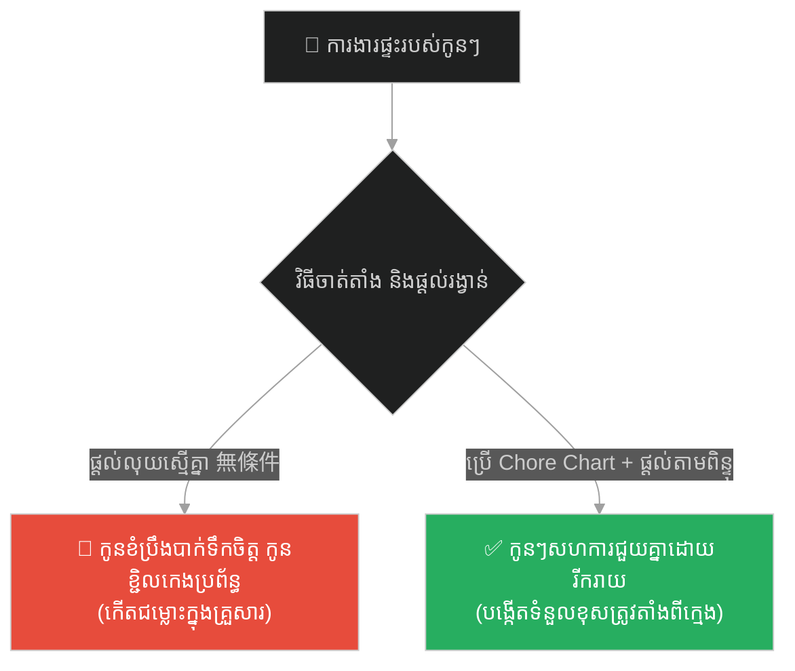
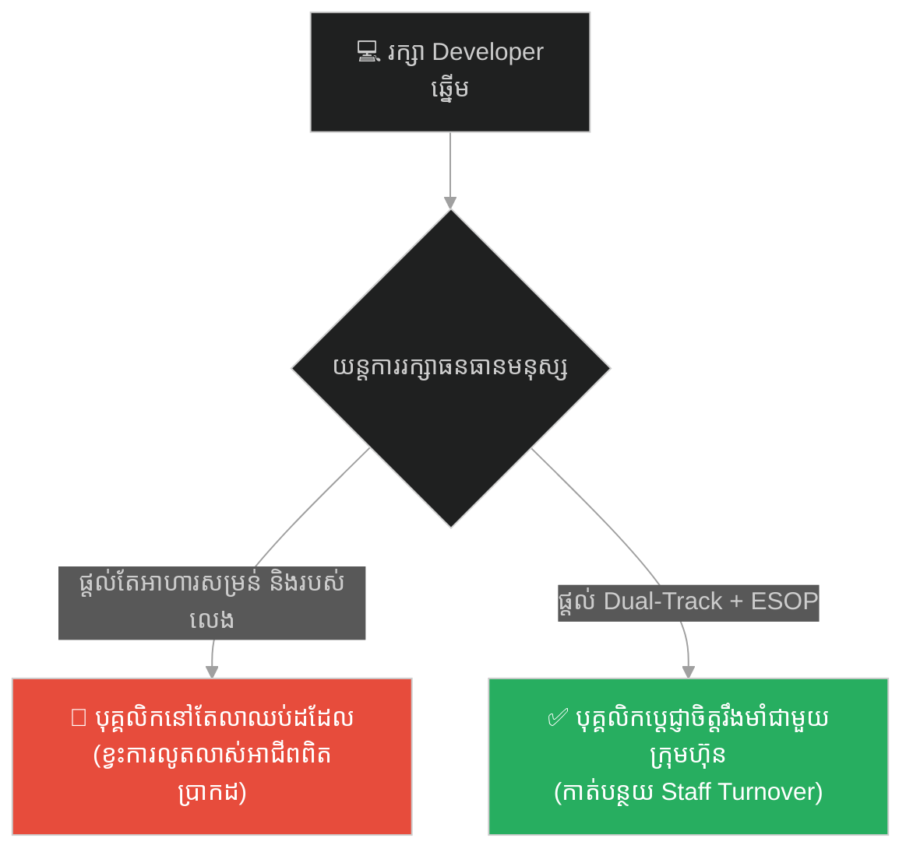
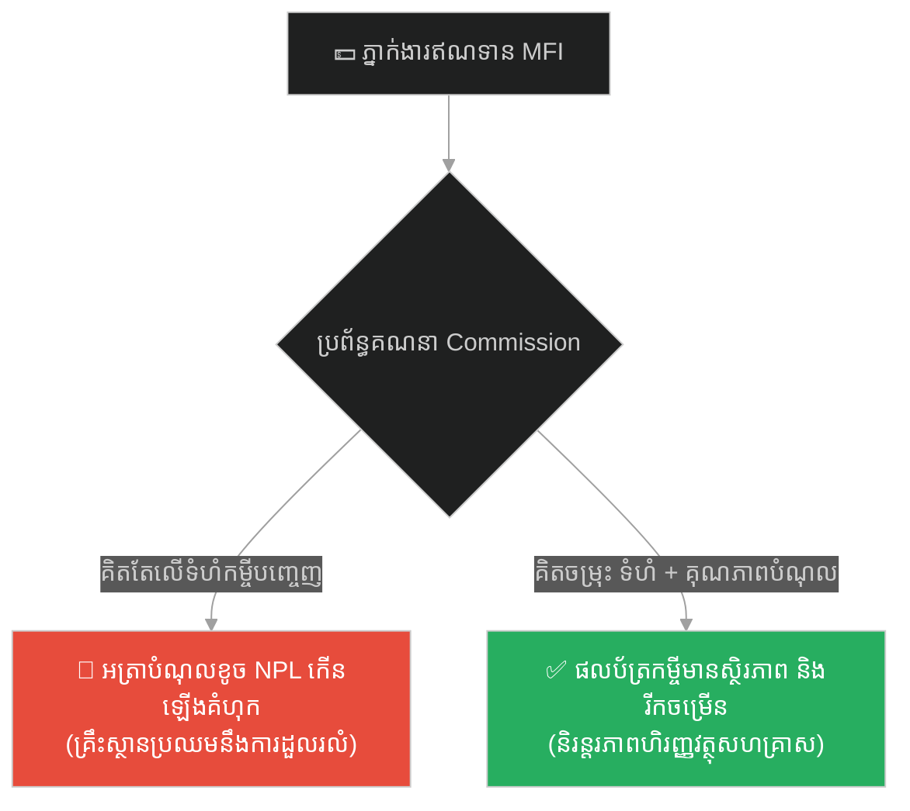
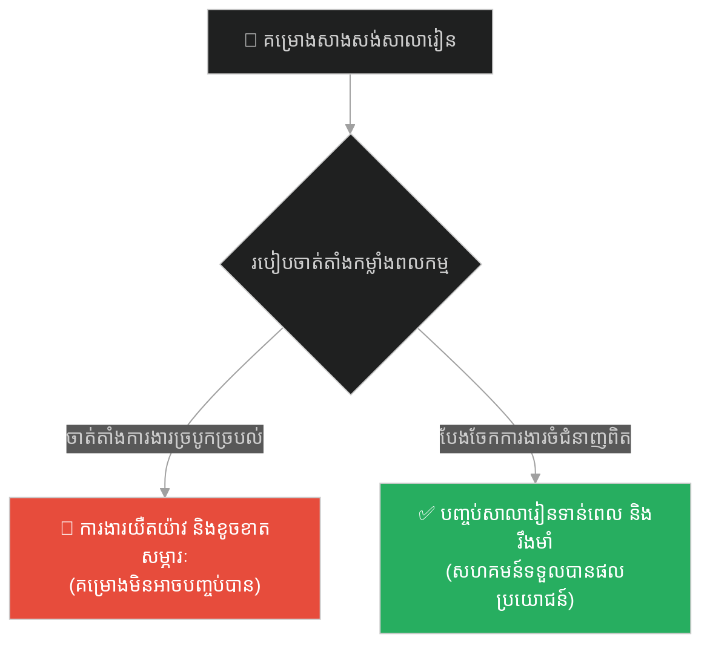
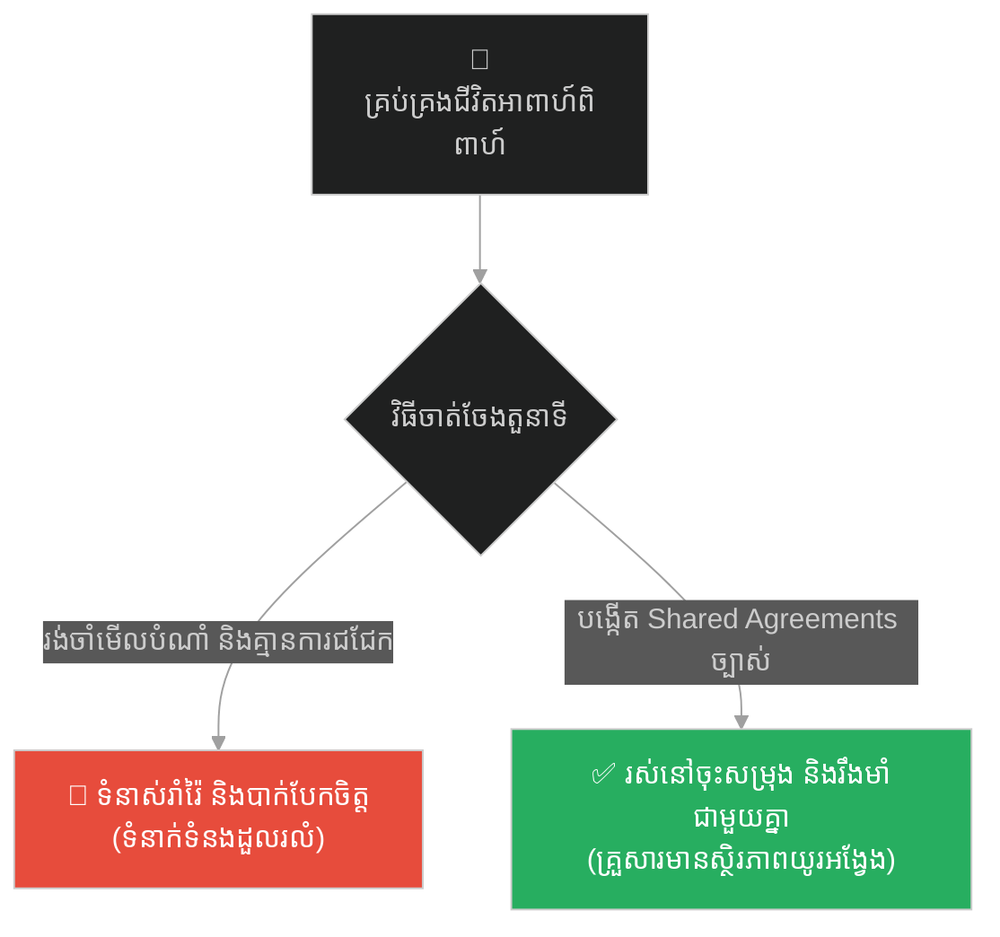
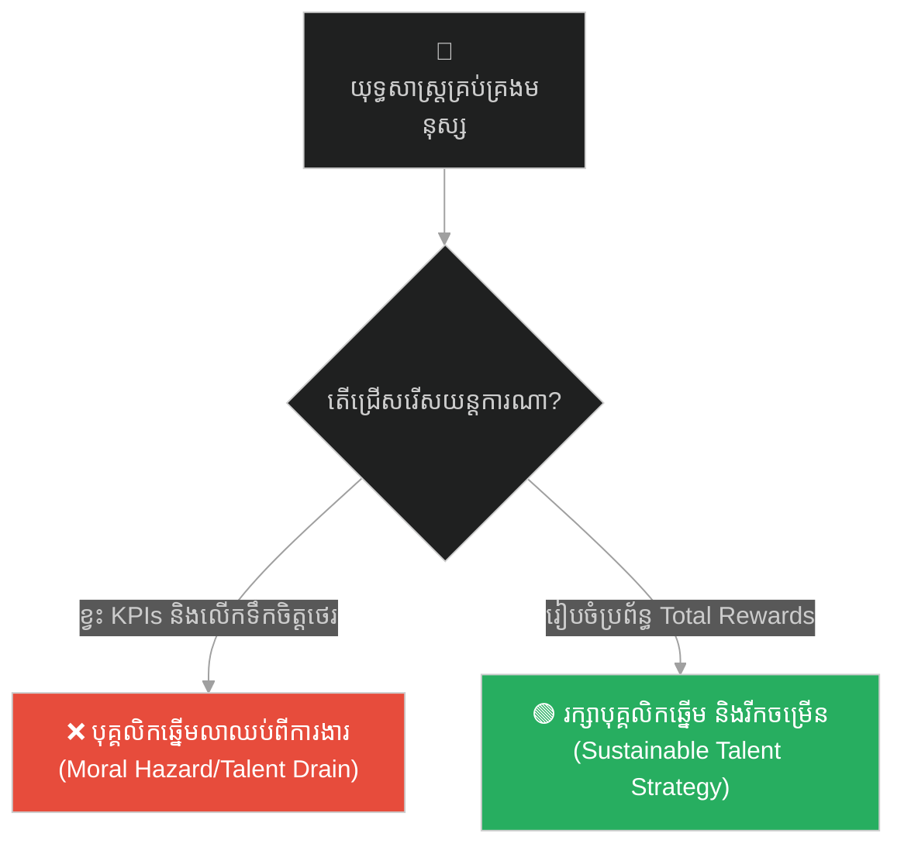

# Human Resource Management & Motivation (នាយក្បួនចរនៃផ្លូវសូត្រ)៖ ការគ្រប់គ្រងធនធានមនុស្ស និងការតម្រង់ទិសលើកទឹកចិត្ត (Human Resource Management & Motivation & Talent Retention and Compensation Frameworks & The Silk Road Caravan Master)

**Author:** ichamrong  
**Date:** 2026-05-27  
**Tags:** #human-resources #hrm #talent-retention #compensation-benefits #motivation-theory #silk-road #business-sustainability  
**Category:** Business Sustainability  
**Read Time:** ~15 min  

---

## 📌 មាតិកា (Table of Contents)
- [អន្ទាក់ផ្លូវចិត្ត (The Trap)](#0)
- [១. រឿងព្រេងនិទាន៖ នាយក្បួនចរនៃផ្លូវសូត្រ (The Legend of The Silk Road Caravan Master)](#1)
  - [មេរៀនជូរចត់កណ្តាលខ្យល់ព្យុះខ្សាច់ (The Bitter Lesson in the Sandstorm)](#1-1)
- [២. បញ្ហា៖ វិបត្តិធនធានមនុស្ស និងការតម្រង់ទិសលើកទឹកចិត្តខុសឆ្គង (The Issue: HR Misalignment and Incentive Deficit)](#2)
- [៣. ឧទាហរណ៍ជាក់ស្តែងក្នុងពិភពពិត (Real World Examples)](#3)
  - [ឧទាហរណ៍ទី ១ — កម្រិតស្រាល (គ្រួសារ)៖ ការចាត់តាំងការងារផ្ទះ និងការលើកទឹកចិត្តកូនៗជួយធ្វើការងារផ្ទះ (The Family Chore Allocation and Incentive)](#3-1)
  - [ឧទាហរណ៍ទី ២ — កម្រិតមធ្យម (បច្ចេកទេស)៖ យុទ្ធសាស្ត្ររក្សាបុគ្គលិកបច្ចេកវិទ្យាកម្រិតខ្ពស់នៅក្នុងតំបន់អាស៊ាន (The Dev Tech Talent Retention in ASEAN)](#3-2)
  - [ឧទាហរណ៍ទី ៣ — កម្រិតមធ្យម (ធុរកិច្ច)៖ ប្រព័ន្ធលើកទឹកចិត្តភ្នាក់ងារឥណទានក្នុងវិស័យមីក្រូហិរញ្ញវត្ថុនៅកម្ពុជា (The Business MFI Field Officers Incentives)](#3-3)
  - [ឧទាហរណ៍ទី ៤ — កម្រិតមធ្យម (សង្គម/គ្រប់គ្រង)៖ ការរចនាតួនាទី និងការបែងចែកកម្លាំងពលកម្មនៅក្នុងគម្រោងអភិវឌ្ឍន៍សហគមន៍ (The Management Community Project Division of Labor)](#3-4)
  - [ឧទាហរណ៍ទី ៥ — កម្រិតធ្ងន់ (ទំនាក់ទំនង)៖ ការដោះស្រាយបញ្ហាទំនាស់តួនាទី និងការបែងចែកភារកិច្ចរបស់ដៃគូជីវិត (The Relationship Role Specification and Shared Agreements)](#3-5)
- [៤. ដំណោះស្រាយទូទៅ៖ ប្រព័ន្ធគ្រប់គ្រងធនធានមនុស្សយុទ្ធសាស្ត្រ (The General Solution: Strategic Human Resource Management)](#4)
- [សេចក្តីសន្និដ្ឋាន (Conclusion)](#5)
- [ឯកសារយោង (References)](#6)
- [Related Posts](#7)

---

<a id="0"></a>
## អន្ទាក់ផ្លូវចិត្ត (The Trap)

នៅក្នុងសង្វៀនធុរកិច្ច និងការគ្រប់គ្រងស្ថាប័ន វិបត្តិដ៏ធំបំផុតមួយដែលតែងតែបំផ្លាញគម្រោងយុទ្ធសាស្ត្រដ៏ល្អៗ មិនមែនជាការខ្វះខាតទុន ឬបច្ចេកវិទ្យានោះឡើយ ប៉ុន្តែវាគឺ **«វិបត្តិធនធានមនុស្ស និងការតម្រង់ទិសលើកទឹកចិត្តខុសឆ្គង» (The Human Resource and Incentive Misalignment Dilemma)**។ សហគ្រិនជាច្រើនតែងតែយល់ច្រឡំថា នៅពេលពួកគេមានគំរូអាជីវកម្មដ៏ច្បាស់លាស់ និងមានដើមទុនគ្រប់គ្រាន់ ពួកគេគ្រាន់តែជួលមនុស្សមកបំពេញការងារ និងផ្តល់ប្រាក់ខែថេរជាការស្រេច។

* **ផ្លូវងងឹត (Failure Path)** — ការផ្តល់ប្រាក់ខែថេរដោយគ្មានការវាយតម្លៃលទ្ធផលការងារ (Flat Pay) ដែលនាំទៅរកបាតុភូត Free-Rider និងការចាកចេញរបស់បុគ្គលិកឆ្នើម។
* **ផ្លូវពន្លឺ (Success Path)** — ការជ្រើសរើសមនុស្សស្របតាមគុណតម្លៃ និងការបង្កើតប្រព័ន្ធលើកទឹកចិត្តតាមលទ្ធផលការងារជាក់ស្តែង (Performance-linked Pay)។

ដើម្បីយល់ដឹងពីរបៀបរៀបចំរចនាសម្ព័ន្ធ និងលើកទឹកចិត្តធនធានមនុស្ស នេះជាផែនទីបង្ហាញផ្លូវ៖
1. **រឿងព្រេងនិទាន (The Legend)** — រឿងរ៉ាវរបស់នាយក្បួនចរ រ៉ាស៊ីដ (Rashid) ក្នុងការដឹកនាំមនុស្សឆ្លងកាត់វាលខ្សាច់តាក្លាម៉ាកានដ៏គ្រោះថ្នាក់។
2. **បញ្ហា (The Issue)** — ទ្រឹស្តី Agency Theory និង Vroom's Expectancy Theory រួមជាមួយគូកូដ Python បង្ហាញពីការគណនាប្រាក់បំណាច់បែបចាស់ធៀបនឹងបែបយុទ្ធសាស្ត្រ។
3. **ឧទាហរណ៍ជាក់ស្តែងក្នុងពិភពពិត (Real World Examples)** — ករណីសិក្សា ៥ កម្រិត ចាប់ពីកម្រិតគ្រួសាររហូតដល់ទំនាក់ទំនងរវាងប្តីប្រពន្ធ។
4. **ដំណោះស្រាយទូទៅ (The General Solution)** — ការកសាងយន្តការជ្រើសរើស ការរចនាតួនាទី និងប្រព័ន្ធវាយតម្លៃ OKRs សម្រាប់ចីរភាព។

```mermaid
%%{init: {
  'theme': 'dark',
  'themeVariables': {
    'background': '#1e1e1e',
    'primaryTextColor': '#ffffff',
    'lineColor': '#a0a0a0'
  },
  'themeCSS': 'svg { background-color: #1e1e1e !important; padding: 1rem !important; border-radius: 8px !important; } .edgeLabel rect { fill: #1e1e1e !important; } text, tspan { fill: #ffffff !important; }'
}}%%
graph TD
    A["👥 បង្កើតក្រុមក្បួន<br/>ការងារ"] --> B{"តើប្រព័ន្ធមនុស្ស<br/>រៀបចំរបៀបណា?"}
    B -->|"ប្រាក់ខែថេរ គ្មាន KPIs"| C["🔴 ខ្ជិលកេងប្រព័ន្ធ ឆ្នើមលាឈប់<br/>(Moral Hazard/Free-Rider)"]
    B -->|"ជ្រើសរើសត្រូវ + លើកទឹកចិត្តចំ"| D["✅ ក្រុមការងារសាមគ្គី ខ្លាំងពូកែ<br/>(Strategic HR Framework)"]
    C --> E["💥 ជួបវិបត្តិទីផ្សារ ប្រព័ន្ធរលាយ"]
    D --> F["🏆 ឆ្លងផុតរាល់ឧបសគ្គទីផ្សារ"]

    style C fill:#e74c3c,color:#fff
    style E fill:#e74c3c,color:#fff
    style D fill:#27ae60,color:#fff
    style F fill:#27ae60,color:#fff
```



---

<a id="1"></a>
## ១. រឿងព្រេងនិទាន៖ នាយក្បួនចរនៃផ្លូវសូត្រ (The Legend of The Silk Road Caravan Master)

នាសតវត្សទី ១០ ក្នុងអំឡុងពេលដែលពាណិជ្ជកម្មតាម **ផ្លូវសូត្រ (Silk Road)** កំពុងតែមានភាពរស់រវើកបំផុត មេដឹកនាំក្បួនរទេះពាណិជ្ជកម្មម្នាក់ឈ្មោះ **រ៉ាស៊ីដ (Rashid)** ទទួលបានភារកិច្ចដ៏ធ្ងន់ធ្ងរមួយ។ គាត់ត្រូវគ្រប់គ្រង **មនុស្សចំនួន ២០០ នាក់** ដែលរួមមាន ៖ ឆ្មាំការពារ (Guards) ចំនួន ៥០ នាក់, ឈ្មួញចរចា (Traders) ចំនួន ១០០ នាក់, និងអ្នកថែទាំអូដ្ឋ (Camel Handlers) ចំនួន ៥០ នាក់។ នេះគឺជាការធ្វើដំណើរដ៏វែងឆ្ងាយ និងគ្រោះថ្នាក់បំផុតពីទីក្រុង Samarkand ឆ្លងកាត់វាលខ្សាច់ដ៏សាហាវតាក្លាម៉ាកាន (Taklamakan Desert) ឆ្ពោះទៅកាន់រាជធានី Chang'an ដែលមានចម្ងាយរហូតដល់ទៅ ៣,០០០ ម៉ាយ។

រ៉ាស៊ីដ ដែលជាមេដឹកនាំដ៏មានមហិច្ឆតា បានគិតថា គន្លឹះនៃភាពជោគជ័យគឺការទិញអូដ្ឋដែលរឹងមាំបំផុត និងការទិញទំនិញសូត្រ និងគ្រឿងទេសដែលមានតម្លៃថ្លៃបំផុតដើម្បីយកទៅលក់។ ចំពោះកម្លាំងពលកម្មវិញ គាត់បានសម្រេចចិត្តជួលមនុស្សតាមតែអាចរកបាន និងផ្តល់ប្រាក់កម្រៃស្មើៗគ្នាសម្រាប់មនុស្សក្នុងក្រុមនីមួយៗនៅពេលបញ្ចប់ការធ្វើដំណើរ ដោយគាត់គិតថា៖ *«នៅចំពោះមុខគ្រោះថ្នាក់នៃវាលខ្សាច់ មនុស្សគ្រប់គ្នានឹងដឹងខ្លួន និងខំប្រឹងប្រែងដើម្បីរស់រានមានជីវិតរៀងៗខ្លួនជាមិនខាន»*។

<a id="1-1"></a>
### មេរៀនជូរចត់កណ្តាលខ្យល់ព្យុះខ្សាច់ (The Bitter Lesson in the Sandstorm)

ទោះជាយ៉ាងណាក៏ដោយ ការសន្មតរបស់រ៉ាស៊ីដបានខុសស្រឡះ។ ត្រឹមតែខែដំបូងនៃការធ្វើដំណើរ ភាពរកាំរកូសបានចាប់ផ្តើមកើតឡើងយ៉ាងខ្លាំងនៅក្នុងក្បួន៖
*   **ឆ្មាំការពារ (Guards)** មួយចំនួនធំបានបណ្តោយខ្លួនឱ្យស្រវឹងស្រា និងខ្វះការប្រុងប្រយ័ត្ន។ ពួកគេគិតថា ទោះបីជាពួកគេខំប្រឹងយាមល្បាតទាំងយប់ទាំងថ្ងៃ ឬដេកលក់ក៏ដោយ ក៏ពួកគេទទួលបានប្រាក់កម្រៃថេរ (flat compensation) ស្មើគ្នានៅចុងបញ្ចប់នៃដំណើរ។ លទ្ធផលគឺ ក្បួនត្រូវបានក្រុមចោរប្លន់ឆ្មក់វាយប្រហារ បណ្តាលឱ្យបាត់បង់ស្បៀងអាហារអស់មួយភាគបី។
*   **ឈ្មួញចរចា (Traders)** ខ្លះចាប់ផ្តើមលួចលាក់ដោះដូរគ្រឿងទេសផ្ទាល់ខ្លួន និងកេងប្រវ័ញ្ចចំណែករបស់អ្នកដទៃ ព្រោះគ្មានប្រព័ន្ធត្រួតពិនិត្យ និងវាយតម្លៃលទ្ធផលការងារ (performance appraisal) ច្បាស់លាស់។ ទំនុកចិត្ត (trust) ក្នុងក្រុមបានធ្លាក់ចុះដល់សូន្យ។
*   **អ្នកថែទាំអូដ្ឋ (Camel Handlers)** ភាគច្រើនជាមនុស្សខ្វះការហ្វឹកហាត់ (untrained)។ ពួកគេមិនដឹងពីរបៀបពិនិត្យជំងឺសត្វអូដ្ឋ ឬរបៀបរៀបចំសមទម្ងន់នៃសំពាយទំនិញឡើយ។ ពួកគេធ្វើការដោយខ្ជិលច្រអូស ព្រោះគ្មាននរណាម្នាក់វាយតម្លៃ ឬខ្វល់ខ្វាយពីការលំបាករបស់ពួកគេ។ សត្វអូដ្ឋជាច្រើនបានធ្លាក់ខ្លួនឈឺ និងងាប់ជាបន្តបន្ទាប់ បណ្តាលឱ្យទំនិញសូត្រដ៏មានតម្លៃត្រូវបោះបង់ចោលកណ្តាលវាលខ្សាច់។

នៅពេលខ្យល់ព្យុះខ្សាច់ដ៏ខ្លាំងក្លាមួយបានបោកបក់មកលើក្បួនរទេះនៅក្បែរទីក្រុង Dunhuang ភាពចលាចលបានផ្ទុះឡើងជាអតិបរមា។ ឆ្មាំការពារបានរត់គេចខ្លួនយកប្រាសក្រៅ ឈ្មួញមិនព្រមជួយលើកទំនិញ ចំណែកអ្នកថែទាំអូដ្ឋបានបោះបង់សត្វពាហនៈចោល។ ក្បួនដង្ហែទាំងមូលស្ទើរតែត្រូវវិនាសសាបសូន្យកណ្តាលវាលខ្សាច់ ដោយសារតែគ្មានការសហការ និងគ្មានទឹកចិត្តសាមគ្គីភាព។ រ៉ាស៊ីដបានរួចជីវិតទាំងត្រដាបត្រដួស និងបានខាតបង់ទ្រព្យសម្បត្តិស្ទើរតែទាំងស្រុង។

បន្ទាប់ពីទទួលបានមេរៀនដ៏ជូរចត់ និងការខាតបង់ដ៏មហាសាល រ៉ាស៊ីដបានចំណាយពេលកែប្រែប្រព័ន្ធទាំងស្រុង។ គាត់បានយល់ឃើញថា៖ **«បើគ្មានការគ្រប់គ្រងមនុស្ស និងការរៀបចំប្រព័ន្ធលើកទឹកចិត្តឱ្យមានប្រសិទ្ធភាពទេ សូម្បីតែទំនិញល្អបំផុត និងដើមទុនច្រើនបំផុត ក៏មិនអាចឆ្លងកាត់វាលខ្សាច់បានដែរ»**។

គាត់បានចាប់ផ្តើមរៀបចំសរសេរ **«ក្រមគ្រប់គ្រងក្បួនផ្លូវសូត្រ» (The Caravan HRM Tablets)** ដែលផ្អែកលើសសរស្តម្ភធំៗចំនួន ៤៖
1. **ការជ្រើសរើស និងការវាយតម្លៃលក្ខណៈសម្បត្តិ**៖ ឈប់ជួលមនុស្សដោយគ្មានលក្ខខណ្ឌច្បាស់លាស់។ គាត់បានធ្វើការសម្ភាសន៍ និងពិនិត្យប្រវត្តិរូប រួចប្រកាន់ខ្ជាប់នូវទស្សនៈថា៖ *«ចូរជ្រើសរើសមនុស្សដែលមានអត្តចរិត និងគុណតម្លៃ (character) ស្របគ្នានឹងក្រុមក្បួន រួចទើបយើងបណ្តុះបណ្តាលជំនាញ (skills) តាមក្រោយ»*។
2. **ការរចនាតួនាទីការងារឱ្យចំជំនាញ**៖ គាត់បានបែងចែកតួនាទីយ៉ាងច្បាស់លាស់ (Right Person, Right Job)។ ឆ្មាំដែលមានកាយសម្បទារឹងមាំត្រូវបានចាត់តាំងជា «ឆ្មាំជួរមុខ»។ ឈ្មួញពូកែចរចា និងភាសាបរទេសត្រូវបានចាត់តាំងជា «ភ្នាក់ងារការទូត»។
3. **ការតម្រង់ទិសប្រាក់បំណាច់ និងការវាយតម្លៃលទ្ធផល**៖ បង្កើតយន្តការវាយតម្លៃនៅគ្រប់ Checkpoints។ ឆ្មាំដែលការពារបានល្អទទួលបាន «ប្រាក់រង្វាន់សន្តិសុខ»។ ឈ្មួញដែលរកចំណេញបានខ្ពស់ទទួលបាន «ចំណែកភាគលាភ»។ ចំណែកអ្នកថែទាំអូដ្ឋ ទទួលបានប្រាក់រង្វាន់បន្ថែមផ្អែកលើ «អត្រារស់រាន និងសុខភាពរបស់អូដ្ឋ»។
4. **ការបណ្តុះបណ្តាល និងការកសាងវប្បធម៌ស្ថាប័ន**៖ មុនពេលចេញដំណើរ គាត់បានរៀបចំវគ្គហ្វឹកហ្វឺនពីបច្ចេកទេសរស់រានកណ្តាលវាលខ្សាច់ និងបង្កើតប្រជុំស្តាប់មតិយោបល់ប្រចាំថ្ងៃ (feedback loops)។

នៅពេលដែលក្បួនរទេះទីពីររបស់រ៉ាស៊ីដបានចេញដំណើរឆ្លងកាត់វាលខ្សាច់ម្តងទៀត ទោះបីជាជួបឧបសគ្គខ្លាំងជាងមុន ក៏ក្បួនដង្ហែទាំងមូលបានទៅដល់ Chang'an ដោយជោគជ័យ និងទទួលបានប្រាក់ចំណេញមហាសាល។

---

<a id="2"></a>
## ២. បញ្ហា៖ វិបត្តិធនធានមនុស្ស និងការតម្រង់ទិសលើកទឹកចិត្តខុសឆ្គង (The Issue: HR Misalignment and Incentive Deficit)

នៅក្នុងការគ្រប់គ្រងធនធានមនុស្សទំនើប ទំនាស់ផលប្រយោជន៍រវាងម្ចាស់អាជីវកម្ម និងបុគ្គលិកត្រូវបានពន្យល់តាមរយៈ **ទ្រឹស្តីតំណាង (Agency Theory)**។ ប្រសិនបើប្រព័ន្ធប្រាក់បំណាច់មិនត្រូវបានតម្រង់ទិសឱ្យបានល្អទេ វានឹងបង្កើតឱ្យមានបាតុភូត **សីលធម៌ចុះខ្សោយ (Moral Hazard)** និង **ការកេងចំណេញពីប្រព័ន្ធ (Free-Rider Problem)**។

ខាងក្រោមនេះជាកូដគំរូ Python បង្ហាញពីប្រព័ន្ធគណនាប្រាក់បំណាច់បែបចាស់ (Flat rate) ដែលបង្កឱ្យមាន Moral Hazard ធៀបនឹងប្រព័ន្ធគណនាបែបយុទ្ធសាស្ត្រ៖

```python
# ============================================================================
# FRAGILE COMPENSATION (ប្រព័ន្ធប្រាក់បំណាច់បែបផុយស្រួយ - គ្មានការវាស់វែង)
# ============================================================================
def calculate_compensation_flat(hours_worked, flat_rate):
    """
    Fragile: Pays a flat rate regardless of actual output quality or effort.
    ប្រព័ន្ធប្រាក់បំណាច់បែបផុយស្រួយ៖ ផ្តល់ប្រាក់ខែថេរដោយមិនខ្វល់ពីលទ្ធផលការងារពិត។
    """
    # Free-riders and star performers receive the exact same salary
    return hours_worked * flat_rate

# ============================================================================
# RESILIENT COMPENSATION (ប្រព័ន្ធប្រាក់បំណាច់យុទ្ធសាស្ត្រ - Performance-Linked)
# ============================================================================
def calculate_compensation_resilient(hours_worked, base_rate, performance_kpi, survival_rate):
    """
    Resilient: Connects pay to KPIs and safety/quality output.
    ប្រព័ន្ធប្រាក់បំណាច់យុទ្ធសាស្ត្រ៖ ភ្ជាប់ប្រាក់ខែទៅនឹងលទ្ធផលការងារ និងគុណភាព។
    """
    base_pay = hours_worked * base_rate
    
    # If the camel survival rate or quality is too low, employee loses bonus
    # បើគុណភាពការងារធ្លាក់ចុះខ្លាំង នោះនឹងមិនទទួលបានប្រាក់រង្វាន់លើកទឹកចិត្តឡើយ
    if survival_rate < 0.80:
        print("[HR Alert] Quality threshold not met! Disqualifying performance bonus.")
        return base_pay
        
    # Performance-linked bonus (0% up to 30% of base pay)
    bonus_multiplier = 0.0
    if performance_kpi >= 90:
        bonus_multiplier = 0.30  # High Performer
    elif performance_kpi >= 70:
        bonus_multiplier = 0.10  # Medium Performer
        
    total_pay = base_pay + (base_pay * bonus_multiplier)
    return total_pay

# Simulation
hours = 160
flat_hourly_rate = 15.0

print("--- FRAGILE SYSTEM COMPENSATIONS ---")
lazy_staff_pay = calculate_compensation_flat(hours, flat_hourly_rate)
star_staff_pay = calculate_compensation_flat(hours, flat_hourly_rate)
print(f"Lazy Staff Pay: ${lazy_staff_pay:.2f} | Star Staff Pay: ${star_staff_pay:.2f}")
# Output: Both get $2400.00 (Creates massive demotivation for star staff!)

print("\n--- RESILIENT SYSTEM COMPENSATIONS ---")
# Star staff has 95 KPI and 98% quality
star_pay = calculate_compensation_resilient(hours, flat_hourly_rate, performance_kpi=95, survival_rate=0.98)
# Lazy staff has 50 KPI and 75% quality
lazy_pay = calculate_compensation_resilient(hours, flat_hourly_rate, performance_kpi=50, survival_rate=0.75)
print(f"Star Staff Pay (Resilient): ${star_pay:.2f} | Lazy Staff Pay (Resilient): ${lazy_pay:.2f}")
# Output: Star Staff gets $3120.00 | Lazy Staff gets $2400.00 (Fair and motivating!)
```

---

<a id="3"></a>
## ៣. ឧទាហរណ៍ជាក់ស្តែងក្នុងពិភពពិត (Real World Examples)

ខាងក្រោមនេះជាករណីសិក្សា ៥ កម្រិតនៃការអនុវត្តការគ្រប់គ្រងធនធានមនុស្ស និងប្រព័ន្ធលើកទឹកចិត្ត៖

---

<a id="3-1"></a>
### ឧទាហរណ៍ទី ១ — កម្រិតស្រាល (គ្រួសារ)៖ ការចាត់តាំងការងារផ្ទះ និងការលើកទឹកចិត្តកូនៗជួយធ្វើការងារផ្ទះ (The Family Chore Allocation and Incentive)

**ស្ថានភាព៖** ឪពុកម្តាយចង់ឱ្យកូនៗជួយលាងចាន បោសផ្ទះ និងបត់ខោអាវ។
* **ប្រព័ន្ធលើកទឹកចិត្តមិនត្រឹមត្រូវ៖** ផ្តល់ប្រាក់ប្រចាំសប្តាហ៍ស្មើគ្នាទៅឱ្យកូនទាំងអស់ដោយគ្មានលក្ខខណ្ឌ។ កូនច្បងធ្វើការងារផ្ទះសឹងទាំងអស់ ចំណែកកូនពៅដេកលេងហ្គេម តែទទួលបានលុយស្មើគ្នា។ លទ្ធផលគឺទំនាស់រវាងកូន និងការមិនព្រមជួយធ្វើការងារផ្ទះទៀតឡើយ។
* **ប្រព័ន្ធលើកទឹកចិត្តបែបយុទ្ធសាស្ត្រ៖** បង្កើត "តារាងពិន្ទុការងារផ្ទះ" (Chore Chart)។ កូនម្នាក់ៗទទួលបានប្រាក់បន្ថែម ឬម៉ោងលេងហ្គេមបន្ថែម ផ្អែកលើចំនួនការងារផ្ទះដែលពួកគេបានបំពេញពិតប្រាកដ។



---

<a id="3-2"></a>
### ឧទាហរណ៍ទី ២ — កម្រិតមធ្យម (បច្ចេកទេស)៖ យុទ្ធសាស្ត្ររក្សាបុគ្គលិកបច្ចេកវិទ្យាកម្រិតខ្ពស់នៅក្នុងតំបន់អាស៊ាន (The Dev Tech Talent Retention in ASEAN)

**ស្ថានភាព៖** ក្រុមហ៊ុន Startup បច្ចេកវិទ្យាចង់កាត់បន្ថយអត្រាលាឈប់របស់វិស្វករសរសេរកូដ (Software Engineers)។
* **ប្រព័ន្ធលើកទឹកចិត្តមិនត្រឹមត្រូវ៖** ក្រុមហ៊ុនផ្តល់តែអាហារសម្រន់ឥតគិតថ្លៃ និងតុលេងហ្គេម (Perks/Hygiene factors) ប៉ុន្តែគ្មាន Career Path ច្បាស់លាស់ និងវាយតម្លៃលទ្ធផលការងារលំអៀង។
* **ប្រព័ន្ធលើកទឹកចិត្តបែបយុទ្ធសាស្ត្រ៖** បង្កើត **Dual-Career Track** (អាចលូតលាស់ជា Tech Expert ឬ Manager ដោយប្រាក់ខែស្មើគ្នា) ព្រមទាំងផ្តល់ភាគហ៊ុនក្រុមហ៊ុន (ESOP) ដើម្បីឱ្យពួកគេមានអារម្មណ៍ជាម្ចាស់អាជីវកម្ម។



---

<a id="3-3"></a>
### ឧទាហរណ៍ទី ៣ — កម្រិតមធ្យម (ធុរកិច្ច)៖ ប្រព័ន្ធលើកទឹកចិត្តភ្នាក់ងារឥណទានក្នុងវិស័យមីក្រូហិរញ្ញវត្ថុនៅកម្ពុជា (The Business MFI Field Officers Incentives)

**ស្ថានភាព៖** គ្រឹះស្ថានមីក្រូហិរញ្ញវត្ថុ (MFI) ត្រូវការប្រមូលសងប្រាក់ត្រឡប់មកវិញដោយជោគជ័យ។
* **ប្រព័ន្ធលើកទឹកចិត្តមិនត្រឹមត្រូវ៖** ផ្តល់ប្រាក់រង្វាន់លើកទឹកចិត្ត (Commission) ផ្អែកលើតែ «បរិមាណបញ្ចេញកម្ចី»។ ភ្នាក់ងារឥណទានក៏សម្រុកបញ្ចេញកម្ចីឱ្យអតិថិជនមានហានិភ័យខ្ពស់ នាំឱ្យអត្រាកម្ចីមិនដំណើរការ (NPL) កើនឡើងខ្លាំង បង្កវិបត្តិហិរញ្ញវត្ថុធ្ងន់ធ្ងរ។
* **ប្រព័ន្ធលើកទឹកចិត្តបែបយុទ្ធសាស្ត្រ៖** ភ្ជាប់ប្រាក់រង្វាន់ទៅនឹង KPIs ចម្រុះ៖ ៥០% លើបរិមាណកម្ចី និង ៥០% លើគុណភាពឥណទាន (Low NPL rate) និងអត្រារក្សាអតិថិជនចាស់។



---

<a id="3-4"></a>
### ឧទាហរណ៍ទី ៤ — កម្រិតមធ្យម (សង្គម/គ្រប់គ្រង)៖ ការរចនាតួនាទី និងការបែងចែកកម្លាំងពលកម្មនៅក្នុងគម្រោងអភិវឌ្ឍន៍សហគមន៍ (The Management Community Project Division of Labor)

**ស្ថានភាព៖** គម្រោងសាងសង់សាលារៀនសហគមន៍ដោយប្រើប្រាស់កម្លាំងស្ម័គ្រចិត្ត និងអ្នកភូមិ។
* **ប្រព័ន្ធលើកទឹកចិត្តមិនត្រឹមត្រូវ៖** ចាត់តាំងមនុស្សដោយគ្មានលក្ខខណ្ឌច្បាស់លាស់ ឱ្យធ្វើការងារច្របូកច្របល់គ្នា។ ជាងកំបោរទៅលើកឈើ ឯកម្លាំងយុវជនទៅលាយល្បាយស៊ីម៉ង់ត៍ខុសបច្ចេកទេស នាំឱ្យការងារយឺតយ៉ាវ និងខូចខាតសម្ភារៈ។
* **ប្រព័ន្ធលើកទឹកចិត្តបែបយុទ្ធសាស្ត្រ៖** វិភាគជំនាញ (Job Analysis) របស់សមាជិកម្នាក់ៗ។ បែងចែកតួនាទីច្បាស់លាស់ (Right Person, Right Job) និងចាត់តាំងមេក្រុមដែលមានបទពិសោធន៍ជាអ្នកសម្របសម្រួល។



---

<a id="3-5"></a>
### ឧទាហរណ៍ទី ៥ — កម្រិតធ្ងន់ (ទំនាក់ទំនង)៖ ការដោះស្រាយបញ្ហាទំនាស់តួនាទី និងការបែងចែកភារកិច្ចរបស់ដៃគូជីវិត (The Relationship Role Specification and Shared Agreements)

**ស្ថានភាព៖** គូស្វាមីភរិយាថ្មីថ្មោងតែងតែឈ្លោះប្រកែកគ្នាពីបញ្ហាលុយកាក់ និងការងារផ្ទះ។
* **ប្រព័ន្ធលើកទឹកចិត្តមិនត្រឹមត្រូវ៖** គ្មានការព្រមព្រៀងគ្នាច្បាស់លាស់ និងសន្មតថាដៃគូម្ខាងទៀតត្រូវតែដឹងពីអ្វីដែលខ្លួនចង់បាន។ ម្នាក់ៗរង់ចាំមើលបំណាំគ្នា បង្កើតឱ្យមានការថ្នាំងថ្នាក់ចិត្ត និងបាក់បែកទំនុកចិត្ត។
* **ប្រព័ន្ធលើកទឹកចិត្តបែបយុទ្ធសាស្ត្រ៖** ជួបជុំគ្នាពិភាក្សា និងបង្កើត **ក្រមព្រមព្រៀងគ្រួសារ (Shared Agreements)**។ បែងចែកតួនាទីច្បាស់លាស់ ដូចជា ប្តីទទួលបន្ទុកផ្នែកហិរញ្ញវត្ថុ និងប្រព័ន្ធភ្លើង ប្រពន្ធទទួលបន្ទុកផ្នែកតុបតែង និងអាហារូបត្ថម្ភ ដោយមានការគាំទ្រគ្នាទៅវិញទៅមកក្នុងពេលមានអាសន្ន។



---

<a id="4"></a>
## ៤. ដំណោះស្រាយទូទៅ៖ ប្រព័ន្ធគ្រប់គ្រងធនធានមនុស្សយុទ្ធសាស្ត្រ (The General Solution: Strategic Human Resource Management)

ដើម្បីសាងសង់ស្ថាប័នមួយដែលមានស្ថិរភាព និងធន់ខ្ពស់ អ្នកគ្រប់គ្រងត្រូវអនុវត្តជំហានទាំងនេះ៖

### ១. អនុវត្តគោលការណ៍ជ្រើសរើសផ្អែកលើអត្តចរិត និងគុណតម្លៃ (Cultural Fit)
ជំនាញបច្ចេកទេសអាចបណ្តុះបណ្តាលបានក្នុងរយៈពេលខ្លី ប៉ុន្តែអត្តចរិត ក្រមសីលធម៌ការងារ និងចិត្តគំនិតបើកចំហ (growth mindset) គឺពិបាកកែប្រែណាស់។ ចូរជ្រើសរើសមនុស្សដែលមានគុណតម្លៃស្របគ្នានឹងស្ថាប័ន។

### ២. រចនាប្រព័ន្ធវាយតម្លៃលទ្ធផលការងារជាប្រព័ន្ធ (KPIs/OKRs)
លុបបំបាត់ការវាយតម្លៃការងារតាមអារម្មណ៍។ ត្រូវវាស់ស្ទង់ផលិតភាពការងារ និងគុណភាពលទ្ធផលការងារដោយមានតម្លាភាព ជួយឱ្យបុគ្គលិកដឹងច្បាស់ពីទិសដៅការងារ និងការរួមចំណែករបស់ពួកគេ។

### ៣. រៀបចំប្រព័ន្ធប្រាក់បំណាច់ឱ្យមានសមធម៌ និងសមស្រប (Total Rewards Framework)
ធានាឱ្យមានតុល្យភាពរវាងសមធម៌ផ្ទៃក្នុង (Internal Equity — បុគ្គលិកពូកែទទួលបានកម្រៃសមនឹងស្នាដៃ) និងសមធម៌ខាងក្រៅ (External Competitiveness — ប្រាក់ខែប្រកួតប្រជែងលើទីផ្សារដើម្បីការពារការហូរធ្លាយខួរក្បាល)។



---

## 🐇 ធ្លាក់ចូលក្នុងរន្ធទន្សាយ (Enter the Rabbit Hole)
ដើម្បីស្វែងយល់បន្ថែមអំពីទ្រឹស្តីវិនិយោគ និងការគ្រប់គ្រងហានិភ័យតាមរយៈការធ្វើពិពិធកម្មផលប័ត្រវិនិយោគ សូមបន្តដំណើរទៅកាន់៖

* 🚀 **[ចាប់ផ្តើមដំណើររុករក (Start the Journey) ➔ Investments & Portfolio Theory (អ្នកវិនិយោគស្រែ និងទ្រឹស្តីផតហ្វូលីយ៉ូ)](../../finance/parables/248-the-rice-paddy-investor.md)**

---

<a id="5"></a>
## សេចក្តីសន្និដ្ឋាន (Conclusion)

> **«ក្បួនដង្ហែដ៏អស្ចារ្យ មិនមែនកើតឡើងពីការមានអូដ្ឋដឹកទំនិញល្អបំផុតនោះទេ គឺវាកើតឡើងពីការតម្រង់ទិសដៅ និងការលើកទឹកចិត្តមនុស្សឱ្យមានសាមគ្គីភាព និងប្តេជ្ញាចិត្តឆ្លងកាត់វាលខ្សាច់រួមគ្នា។»**

ការគ្រប់គ្រងធនធានមនុស្សយុទ្ធសាស្ត្រ គឺជាគន្លឹះគ្រឹះក្នុងការរៀបចំរចនាសម្ព័ន្ធធុរកិច្ចប្រកបដោយចីរភាព។ ចូររៀបចំប្រព័ន្ធលើកទឹកចិត្តឱ្យមានសមធម៌ និងតម្លាភាព ដើម្បីជំរុញទឹកចិត្តក្រុមការងាររបស់អ្នកឱ្យយកឈ្នះរាល់វិបត្តិទីផ្សារ។

---

<a id="6"></a>
## ឯកសារយោង (References)

* **Noe, Raymond A. et al.** — *Human Resource Management: Gaining a Competitive Advantage* (10th Edition)។ សៀវភៅគ្រឹះនៃការគ្រប់គ្រងធនធានមនុស្ស និងប្រព័ន្ធ compensation។
* **Vroom, Victor H.** — *Work and Motivation* (1964)។ ទ្រឹស្តី Vroom's Expectancy Theory និងការជម្រុញការងារ។
* **Denison University Coursework** — *07 Human Resource Management for Business Sustainability* (Year 1)។ ឯកសារយោងសម្រាប់ការរចនាតួនាទី និងប្រព័ន្ធលើកទឹកចិត្ត។

---

<a id="7"></a>
## Related Posts

* **[07 Human Resource Management](../07-human-resource-management.md)** — មុខវិជ្ជាស្នូលស្ដីពីការគ្រប់គ្រងធនធានមនុស្សនៅ Denison University។
* **[២៤១ — អ្នកដឹកនាំក្រុមតន្ត្រី (The Orchestra Conductor)](./241-the-orchestra-conductor.md)** — មេរៀនស្តីពីសិល្បៈនៃការសម្របសម្រួល និងការបង្កើតចង្វាក់ការងាររួមគ្នា។
* **[២៧៤ — ក្បួនដង្ហែឆ្លងកាត់នគរទាំងដប់ (The Caravan That Crossed Ten Kingdoms)](../../year-3/parables/274-the-caravan-that-crossed-ten-kingdoms.md)** — ការស្វែងយល់ពីយុទ្ធសាស្ត្រគ្រប់គ្រងធនធានមនុស្សឆ្លងដែន និងប្រតិបត្តិការអន្តរជាតិ។
