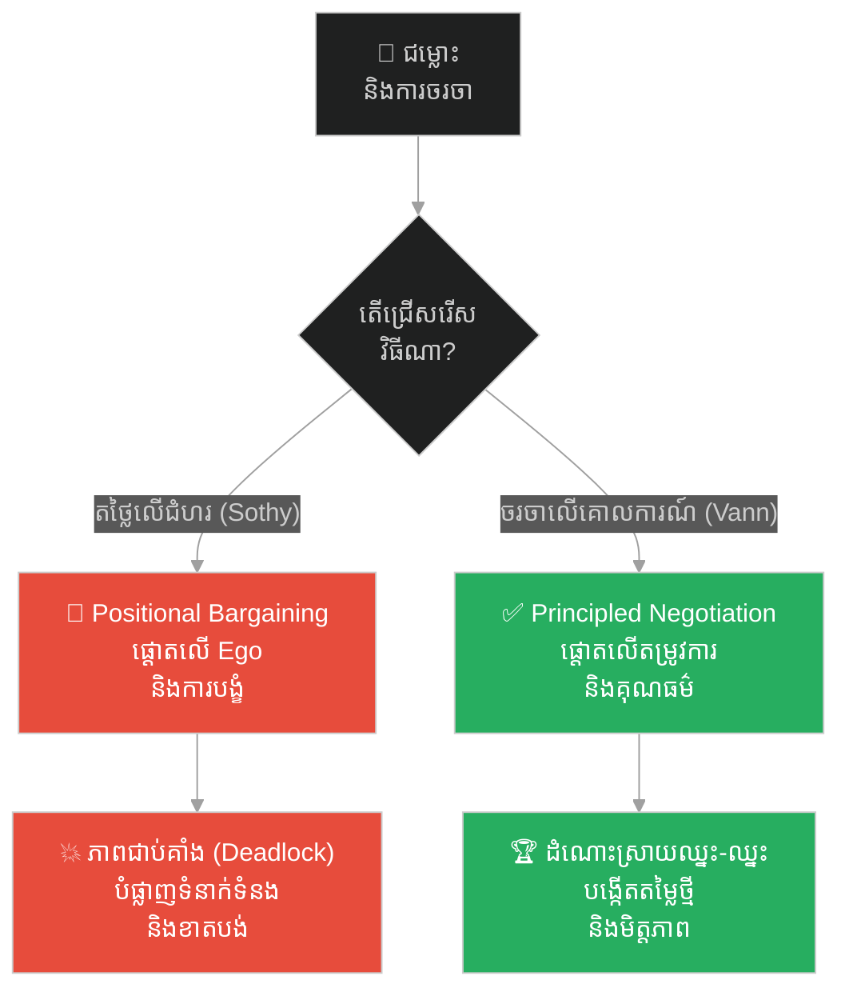
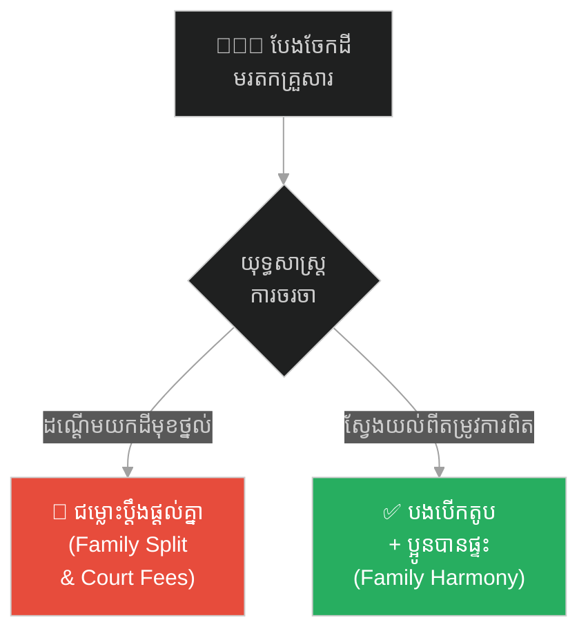
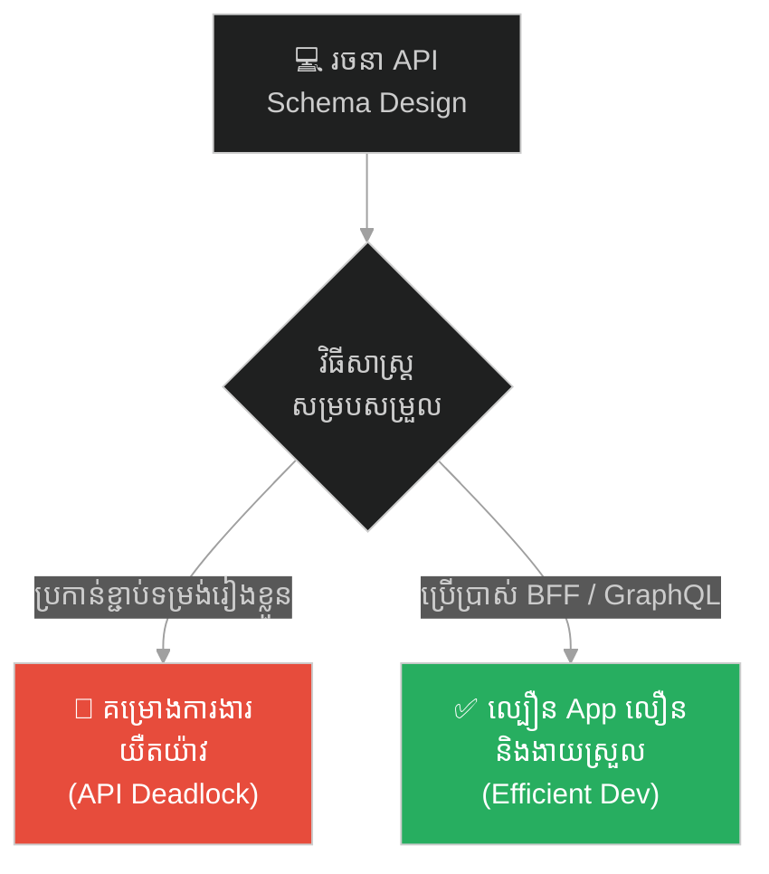
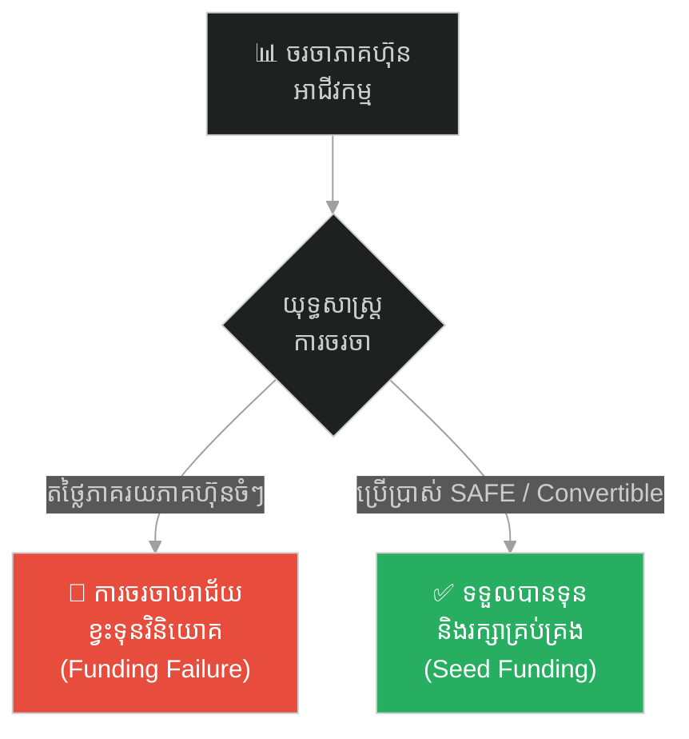
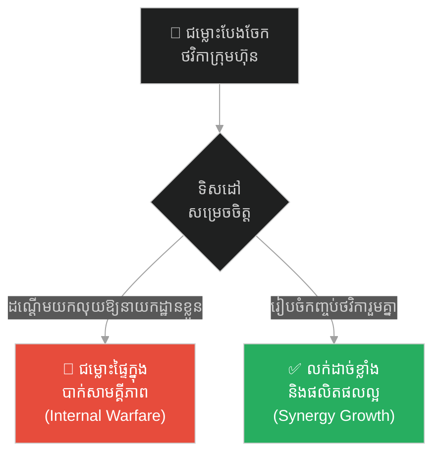
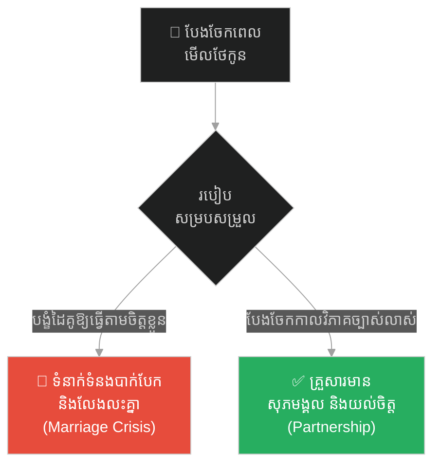
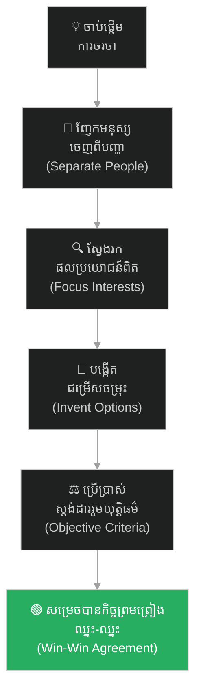

# ២៥៦ — ឈ្មួញពីរនាក់នៅព្រំដែន និងការចរចា (The Two Merchants at the Border)៖ សិល្បៈនៃការចរចាស្វែងរកផលប្រយោជន៍ និងការដោះស្រាយជម្លោះ

**Author:** ichamrong  
**Date:** 2026-05-26  
**Tags:** #negotiation #batna #harvard-negotiation #conflict-resolution #zopa #business-sustainability  
**Category:** Business Sustainability  
**Read Time:** ~15 min  

---

## 📌 មាតិកា (Table of Contents)
- [អន្ទាក់ផ្លូវចិត្ត / វិបត្តិធុរកិច្ច (The Dilemma / The Trap)](#0)
- [១. រឿងនិទានប្រៀបធៀប៖ ឈ្មួញពីរនាក់នៅព្រំដែន (The Parable of the Two Merchants)](#1)
  - [ច្រកភ្នំចុងក្រោយ និងដំណោះស្រាយសហប្រតិបត្តិការ (The Last Pass and the Cooperative Solution)](#1-1)
- [២. បញ្ហា៖ ការតថ្លៃលើជំហរ និងគម្លាតនៃការចរចា (The Issue: Positional Bargaining and the Negotiation Gap)](#2)
- [៣. ឧទាហរណ៍ជាក់ស្តែងក្នុងពិភពពិត (Real World Examples)](#3)
  - [ឧទាហរណ៍ទី ១ — កម្រិតស្រាល (គ្រួសារ)៖ បងប្អូនចរចាបែងចែកមរតកដីធ្លី (The Family Land Division Dispute)](#3-1)
  - [ឧទាហរណ៍ទី ២ — កម្រិតមធ្យម (បច្ចេកទេស)៖ ការចរចា API Contract រវាង Backend និង Frontend Developers (The API Schema Schema Negotiation)](#3-2)
  - [ឧទាហរណ៍ទី ៣ — កម្រិតមធ្យម (ធុរកិច្ច)៖ Founder ចរចាភាគហ៊ុនជាមួយ Angel Investor (The Founder vs Angel Investor Equity Split)](#3-3)
  - [ឧទាហរណ៍ទី ៤ — កម្រិតមធ្យម (សង្គម/គ្រប់គ្រង)៖ ការចរចាថវិការវាងនាយកដ្ឋានលក់ និងនាយកដ្ឋានផលិតផល (The Cross-Departmental Budget Standoff)](#3-4)
  - [ឧទាហរណ៍ទី ៥ — កម្រិតធ្ងន់ (ទំនាក់ទំនង)៖ ការបែងចែកពេលវេលាការងារ និងជីវិតគ្រួសារ (The Work-Life Balance Couple Alignment)](#3-5)
- [៤. ដំណោះស្រាយទូទៅ៖ ការចរចាដោយផ្អែកលើគោលការណ៍ (The General Solution: Principled Negotiation)](#4)
- [សេចក្តីសន្និដ្ឋាន (Conclusion)](#5)
- [ឯកសារយោង (References)](#6)
- [Related Posts / Course Link](#7)

---

## អន្ទាក់ផ្លូវចិត្ត / វិបត្តិធុរកិច្ច (The Dilemma / The Trap)

នៅក្នុងប្រតិបត្តិការធុរកិច្ច និងជីវិតប្រចាំថ្ងៃ ជម្លោះ (Conflict) និងការចរចា (Negotiation) គឺជាអ្វីដែលមិនអាចជៀសវាងបានឡើយ។ ទោះជាយ៉ាងណាក៏ដោយ មនុស្សភាគច្រើនតែងតែធ្លាក់ចូលទៅក្នុងអន្ទាក់ផ្លូវចិត្តដ៏គ្រោះថ្នាក់មួយហៅថា **«ការតថ្លៃលើគោលជំហរ» (Positional Bargaining)**។ នៅក្នុងអន្ទាក់នេះ ភាគីនីមួយៗផ្តោតតែទៅលើ «អ្វីដែលខ្លួនចង់បាន» (What they say they want) ដោយចាត់ទុកការចរចាដូចជាសង្គ្រាមឈ្នះ-ចាញ់ (Win-Lose Game) ដែលមាននំខេកទំហំថេរមួយដុំសម្រាប់ចែកគ្នា (Fixed-Pie Illusion)។

*   **ផ្លូវងងឹត (Failure Path)** — ការឈ្លោះប្រកែកគ្នាដោយប្រកាន់ខ្ជាប់នូវគោលជំហររៀងខ្លួន (Positions) ដែលនាំទៅរកភាពជាប់គាំង (Deadlock) បំផ្លាញទំនាក់ទំនង និងខាតបង់ពេលវេលាដ៏មានតម្លៃ។
*   **ផ្លូវពន្លឺ (Success Path)** — ការញែកមនុស្សចេញពីបញ្ហា ការផ្តោតលើផលប្រយោជន៍ពិតប្រាកដ (Interests) និងការស្វែងរកជម្រើសចម្រុះ (Options for Mutual Gain) ដើម្បីបង្កើតដំណោះស្រាយឈ្នះ-ឈ្នះ (Win-Win Outcome)。

ដើម្បីយល់ដឹងពីសិល្បៈនៃការចរចា និងការដោះស្រាយជម្លោះប្រកបដោយនិរន្តរភាព នេះជាផែនទីបង្ហាញផ្លូវ៖
1. **រឿងនិទានប្រៀបធៀប (The Parable)** — វិបត្តិរបស់ សុធី និង វណ្ណ នៅច្រកព្រំដែនភ្នំមុនពេលព្យុះសង្ឃរាមកដល់។
2. **បញ្ហា (The Issue)** — ការវិភាគទ្រឹស្តីចរចារបស់សាលាហាវ៉ាដ (Harvard Principled Negotiation) និងគំនិតគន្លឹះដូចជា BATNA, ZOPA និង Integrative vs. Distributive Bargaining។
3. **ឧទាហរណ៍ជាក់ស្តែងក្នុងពិភពពិត (Real World Examples)** — ករណីសិក្សា ៥ កម្រិត ចាប់ពីកម្រិតគ្រួសាររហូតដល់ទំនាក់ទំនងគូស្រករ។
4. **ដំណោះស្រាយទូទៅ (The General Solution)** — ជំហានជាក់ស្តែងក្នុងការផ្លាស់ប្តូរពីការតថ្លៃជំហរ មកជាការចរចាលើគោលការណ៍។

---

## ១. រឿងនិទានប្រៀបធៀប៖ ឈ្មួញពីរនាក់នៅព្រំដែន (The Parable of the Two Merchants)

នាសម័យបុរាណ ឆ្លងកាត់ជួរភ្នំក្រវាញដ៏ខ្ពស់ត្រដែត មានច្រកព្រំដែនដ៏តូចចង្អៀតមួយដែលតភ្ជាប់រវាងអាណាចក្រពីរ។ រដូវវស្សាជិតចូលមកដល់ហើយ ហើយព្យុះសង្ឃរាដ៏កាចសាហាវនឹងមកដល់ក្នុងរយៈពេលពីរថ្ងៃទៀត ដែលនឹងបិទច្រកភ្នំនេះអស់រយៈពេលជាច្រើនខែ។ នៅឯព្រំដែន មានរទេះដឹកទំនិញរាប់រយគ្រឿងកំពុងកកស្ទះ ប៉ុន្តែទ្វារព្រំដែនជិតត្រូវបិទ ហើយមន្ត្រីយាមព្រំដែនបានប្រកាសថា ៖ **«មានកន្លែងសម្រាប់រទេះដឹកទំនិញតែមួយគ្រឿងចុងក្រោយប៉ុណ្ណោះដែលអាចឆ្លងកាត់ទៅបាន មុនពេលច្រកភ្នំបិទទាំងស្រុង!»**

នៅខាងមុខជួរ មានឈ្មួញពីរនាក់កំពុងឈរប្រកែកគ្នា។ ឈ្មួញទីមួយឈ្មោះ **សុធី (Sothy)** ដឹកក្រណាត់សូត្រដ៏មានតម្លៃកាត់ថ្លៃមិនបាន។ ឈ្មួញទីពីរឈ្មោះ **វណ្ណ (Vann)** ដឹកទំនិញប្រើប្រាស់ទូទៅ និងស្បៀងអាហារ។ អ្នកទាំងពីរដឹងច្បាស់ថា ប្រសិនបើមិនបានឆ្លងកាត់ច្រកភ្នំនេះទេ ពួកគេនឹងត្រូវខាតបង់ទ្រព្យសម្បត្តិទាំងអស់ និងប្រឈមនឹងគ្រោះថ្នាក់ពីព្យុះសង្ឃរា។

សុធី ចាប់ផ្តើមស្រែកតវ៉ាដោយកំហឹងទៅកាន់អ្នកយាមព្រំដែន និង វណ្ណ ថា ៖ **«ក្រណាត់សូត្ររបស់ខ្ញុំគឺជាសូត្រលំដាប់ក្សត្រ ដែលត្រូវយកទៅថ្វាយព្រះរាជា! ខ្ញុំជាឈ្មួញលំដាប់ខ្ពស់ ដូច្នេះរទេះរបស់ខ្ញុំត្រូវតែទទួលបានសិទ្ធិឆ្លងកាត់មុនគេ! វណ្ណ ដឹកតែរបស់របរសាមញ្ញ គួរតែថយក្រោយទៅ!»** (នេះគឺជាគោលជំហរ ឬ Position របស់ សុធី)។

វណ្ណ ក៏ខឹងសម្បារក្ដៅក្រហាយដែរ ហើយឆ្លើយតបវិញថា ៖ **«ខ្ញុំបានមកដល់ច្រកនេះមុនលោកកន្លះម៉ោង! យោងតាមច្បាប់ព្រំដែន អ្នកមកមុនត្រូវតែបានទៅមុន! ទំនិញរបស់ខ្ញុំក៏សំខាន់សម្រាប់ការចិញ្ចឹមជីវិតដែរ ខ្ញុំមិនថយក្រោយជាដាច់ខាត!»** (នេះគឺជាគោលជំហរ ឬ Position របស់ វណ្ណ)។

អ្នកទាំងពីរប្រកែកគ្នាតឹងសរសៃកអស់រយៈពេលជាច្រើនម៉ោង。 អ្នកយាមព្រំដែនធុញទ្រាន់នឹងការឈ្លោះប្រកែកគ្នា ហើយពេលវេលាក៏កាន់តែខិតជិតដល់ពេលបិទទ្វារ។ គ្មាននរណាម្នាក់ព្រមដកថយឡើយ ជម្លោះកំពុងស្ថិតក្នុងស្ថានភាពជាប់គាំង (Deadlock) ដែលនឹងនាំទៅរកសោកនាដកម្មរួម។

---

### ច្រកភ្នំចុងក្រោយ និងដំណោះស្រាយសហប្រតិបត្តិការ (The Last Pass and the Cooperative Solution)

ដោយដឹងថាកំហឹងមិនអាចដោះស្រាយបញ្ហាបាន ហើយព្យុះក៏ជិតមកដល់ វណ្ណ បានដកដង្ហើមធំ រួចព្យាយាមសម្រួលអារម្មណ៍។ គាត់បានសម្រេចចិត្តផ្លាស់ប្តូរយុទ្ធសាស្ត្រចរចា ដោយដក Ego ខ្លួនឯងចេញ រួចដើរទៅសួរនាំអ្នកយាមព្រំដែនដោយក្តីគោរព និងទន់ភ្លន់ថា ៖

**«លោកមន្ត្រីយាមព្រំដែន តើមានមូលហេតុអ្វីបានជាលោកអនុញ្ញាតឱ្យរទេះតែមួយឆ្លងកាត់? តើមានតម្រូវការបន្ទាន់អ្វីខ្លះដែលលោកកំពុងប្រឈម?»**

អ្នកយាមព្រំដែនដកដង្ហើមធំ រួចឆ្លើយទាំងព្រួយបារម្ភថា ៖ **«ប្រពន្ធរបស់ខ្ញុំនៅភូមិម្ខាងភ្នំកំពុងធ្លាក់ខ្លួនឈឺធ្ងន់ដោយសារជំងឺក្តៅខ្លួនខ្លាំង។ ខ្ញុំត្រូវការថ្នាំសង្គ្រោះជីវិតបន្ទាន់មួយកញ្ចប់ ប៉ុន្តែថ្នាំនោះមានលក់តែនៅទីប្រជុំជនខាងនាយភ្នំប៉ុណ្ណោះ។ ខ្ញុំត្រូវបញ្ជូនរទេះរបស់មន្ត្រីម្នាក់ទៅយកថ្នាំនោះ ហេតុនេះទើបសល់កន្លែងតែមួយសម្រាប់អ្នករាល់គ្នា»**។

វណ្ណ ឮដូចនោះ ក៏ភ្លឺភ្នែកភ្លាម។ គាត់និយាយថា ៖ **«ខ្ញុំជាឈ្មួញទំនិញទូទៅ ហើយនៅក្នុងរទេះរបស់ខ្ញុំ មានកញ្ចប់ថ្នាំក្តៅខ្លួនកម្រិតខ្ពស់ដែលលោកកំពុងត្រូវការនេះស្រាប់! ខ្ញុំរីករាយនឹងប្រគល់ថ្នាំនេះជូនលោកដោយឥតគិតថ្លៃ ដើម្បីលោកអាចសង្គ្រោះភរិយាបានភ្លាមៗ។ ជាថ្នូរមកវិញ តើលោកអាចផ្តល់សិទ្ធិឆ្លងកាត់ច្រកភ្នំនេះឱ្យខ្ញុំ និងជួយសម្របសម្រួលតម្លៃពន្ធគយសម្រាប់ក្រុមការងាររបស់ខ្ញុំនៅខែក្រោយបានដែរឬទេ?»**

អ្នកយាមព្រំដែនរំភើបចិត្តយ៉ាងខ្លាំង ហើយយល់ព្រមភ្លាមៗ ព្រោះគាត់ទទួលបានថ្នាំសង្គ្រោះជីវិតភ្លាមៗដោយមិនបាច់រង់ចាំរទេះទៅយកឆ្ងាយ។

បន្ទាប់មក វណ្ណ បានងាកមកនិយាយជាមួយ សុធី ដោយបើកចិត្តទូលាយថា ៖ **«សុធី! ឥឡូវនេះខ្ញុំទទួលបានសិទ្ធិឆ្លងកាត់សម្រាប់រទេះទីមួយនេះហើយ។ ប៉ុន្តែខ្ញុំដឹងថាលោកត្រូវការឆ្លងកាត់ជាបន្ទាន់ដូចគ្នា។ កូនចៅរបស់ខ្ញុំនឹងដឹកនាំរទេះមួយគ្រឿងទៀតឆ្លងកាត់តាមច្រករបៀងខាងក្រោមនៅព្រឹកស្អែក។ ខ្ញុំនឹងណែនាំឱ្យពួកគេផ្ទេរកន្លែងបម្រុងនោះជូនលោក ដើម្បីលោកអាចដឹកក្រណាត់សូត្រទៅទាន់ពេលវេលា។ តើលោកយល់ព្រមផ្ដល់ចំណែកបញ្ចុះតម្លៃលើសូត្រខ្លះមកឱ្យខ្ញុំសម្រាប់ការលក់បន្តនៅរដូវក្រោយបានទេ?»**

សុធី ខ្មាសអៀនចំពោះអាកប្បកិរិយារបស់ខ្លួនឯងកាលពីមុនផង និងរំភើបចិត្តចំពោះដំណោះស្រាយដ៏ឈ្លាសវៃរបស់ វណ្ណ ផង ក៏ព្រមព្រៀងសហការភ្លាមៗ។ ទីបំផុត ឈ្មួញទាំងពីរបានឆ្លងព្រំដែនដោយសុវត្ថិភាព ភរិយារបស់អ្នកយាមបានជាសះស្បើយ ហើយទំនាក់ទំនងពាណិជ្ជកម្មថ្មីដ៏រឹងមាំមួយត្រូវបានបង្កើតឡើង។

---

## ២. បញ្ហា៖ ការតថ្លៃលើជំហរ និងគម្លាតនៃការចរចា (The Issue: Positional Bargaining and the Negotiation Gap)

នៅក្នុងទ្រឹស្តីចរចាទំនើប (Modern Negotiation Theory) ជាពិសេសតាមគំរូ **Harvard Principled Negotiation** (សរសេរដោយលោក Roger Fisher និង William Ury ក្នុងសៀវភៅ *«Getting to Yes»*) ជម្លោះរវាង សុធី និង វណ្ណ បង្ហាញពីភាពខុសគ្នាយ៉ាងច្បាស់រវាងវិធីសាស្ត្រពីរ៖

1.  **ការចរចាបែបបែងចែក (Distributive / Positional Bargaining)**៖ ផ្តោតលើការប្រកែកយកត្រូវលើ «គោលជំហរ» (Positions)។ ភាគីនីមួយៗមើលឃើញដៃគូជាសត្រូវ។ គោលដៅគឺដណ្តើមយកចំណែកឱ្យបានច្រើនបំផុតពី «នំខេកដែលមានទំហំថេរ» (Claiming Value)។ វិធីសាស្ត្រនេះជារឿយៗបង្កើតឱ្យមានភាពជាប់គាំង (Deadlock) និងបំផ្លាញទំនាក់ទំនង។
2.  **ការចរចាបែបរួមបញ្ចូលគ្នា (Integrative / Principled Negotiation)**៖ ផ្តោតលើ «ផលប្រយោជន៍ និងតម្រូវការ» (Interests)។ ភាគីនីមួយៗរួមគ្នាដោះស្រាយបញ្ហា។ គោលដៅគឺពង្រីកនំខេកឱ្យកាន់តែធំមុននឹងបែងចែក (Creating Value)។

### គំនិតគន្លឹះក្នុងក្របខ័ណ្ឌចរចា (Key Negotiation Concepts)៖
*   **BATNA (Best Alternative to a Negotiated Agreement - ជម្រើសជំនួសដ៏ល្អបំផុតចំពោះកិច្ចព្រមព្រៀងចរចា)**៖ តើអ្នកនឹងធ្វើអ្វីប្រសិនបើការចរចានេះបរាជ័យទាំងស្រុង? ភាគីដែលមាន BATNA ខ្លាំង នឹងមានអំណាចចរចាកាន់តែខ្ពស់។
*   **ZOPA (Zone of Possible Agreement - តំបន់នៃកិច្ចព្រមព្រៀងដែលអាចទៅរួច)**៖ ចន្លោះត្រួតស៊ីគ្នាដែលភាគីទាំងពីរអាចព្រមព្រៀងគ្នាបាន។ ប្រសិនបើគ្មាន ZOPA ទេ ការចរចានឹងមិនអាចសម្រេចបានឡើយ លុះត្រាតែមានការបង្កើត Option ថ្មី។
*   **Reservation Price (តម្លៃកំណត់ចុងក្រោយ)**៖ ចំណុចអាក្រក់បំផុតដែលភាគីម្ខាងសុខចិត្តទទួលយក។ ហួសពីចំណុចនេះ ពួកគេនឹងដើរចេញពីការចរចា (Walk away)。

---

## ៣. ឧទាហរណ៍ជាក់ស្តែងក្នុងពិភពពិត (Real World Examples)

ខាងក្រោមនេះជាករណីសិក្សា ៥ កម្រិតនៃការផ្លាស់ប្តូរការចរចាពីការតថ្លៃជំហរ ទៅជាការចរចាលើគោលការណ៍៖

---

### ឧទាហរណ៍ទី ១ — កម្រិតស្រាល (គ្រួសារ)៖ បងប្អូនចរចាបែងចែកមរតកដីធ្លី (The Family Land Division Dispute)

**ស្ថានភាព៖** បងប្អូនពីរនាក់ចរចាបែងចែកដីមរតកមួយកន្លែងដែលមានទំហំថេរ។
*   **ការតថ្លៃលើជំហរ (Positional)៖** បងចង់បានដីផ្នែកខាងមុខជាប់ថ្នល់ជាតិទាំងស្រុង ហើយប្អូនក៏ចង់បានផ្នែកខាងមុខដូចគ្នា។ ពួកគេឈ្លោះគ្នា កាត់កាលបងប្អូន និងប្តឹងផ្តល់គ្នានៅតុលាការអស់រយៈពេលជាច្រើនឆ្នាំ ខាតបង់ប្រាក់កាស និងបំផ្លាញសុភមង្គលគ្រួសារ។
*   **ការចរចាលើគោលការណ៍ (Principled)៖** ពួកគេជួបគ្នាជជែកពីផលប្រយោជន៍ពិតប្រាកដ។ បងចង់បានដីខាងមុខព្រោះចង់បើកតូបលក់ដូរចំណីអាហារ។ ប្អូនចង់បានដីខាងមុខព្រោះចង់សាងសង់ផ្ទះរស់នៅក្បែរថ្នល់ងាយស្រួលធ្វើដំណើរ។
*   **ដំណោះស្រាយ៖** បងទទួលបានដីខាងមុខដើម្បីសង់តូបលក់ដូរ រីឯប្អូនទទួលបានដីផ្នែកកណ្តាលដែលមានផ្លូវខ្វាត់ខ្វែងចូលទៅ ព្រមទាំងទទួលបានប្រាក់ប៉ះប៉ូវខ្លះពីបងដើម្បីជួយសាងសង់ផ្ទះ។ ពួកគេទាំងពីរទទួលបានអ្វីដែលខ្លួនត្រូវការ និងរក្សាបាននូវភាពសុខដុមរមនាក្នុងគ្រួសារ។

---

### ឧទាហរណ៍ទី ២ — កម្រិតមធ្យម (បច្ចេកទេស)៖ ការចរចា API Contract រវាង Backend និង Frontend Developers (The API Schema Schema Negotiation)

**ស្ថានភាព៖** ក្រុម Backend Developer និង Frontend Developer កំពុងចរចាគ្នាដើម្បីរចនារចនាសម្ព័ន្ធទិន្នន័យ (API Schema) សម្រាប់ Feature ថ្មី។
*   **ការតថ្លៃលើជំហរ (Positional)៖** 
    *   *Backend Devs* ជំទាស់ថា៖ *«យើងត្រូវផ្ញើតែ Raw Data ID ប៉ុណ្ណោះ ព្រោះវាលឿន និងងាយស្រួលសរសេរកូដគល់»*។
    *   *Frontend Devs* ប្រកែកថា៖ *«ទេ! Backend ត្រូវតែរៀបចំទិន្នន័យស្រេចៗ (Nested Objects) ឱ្យរួចរាល់ ព្រោះយើងមិនចង់សរសេរកូដ Loop ច្រើនដងនាំឱ្យយឺត UI ឡើយ»*។
    *   ជម្លោះអូសបន្លាយ ការងារយឺតយ៉ាវ និងបង្កើតឱ្យមានភាពរកាំរកូសក្នុងក្រុម។
*   **ការចរចាលើគោលការណ៍ (Principled)៖** ពួកគេផ្តោតលើផលប្រយោជន៍រួម គឺ **«ល្បឿនដំណើរការរបស់ App (Performance) និងភាពងាយស្រួលក្នុងការថែទាំកូដ (Maintainability)»**。
*   **ដំណោះស្រាយ៖** ពួកគេសម្រេចចិត្តប្រើប្រាស់បច្ចេកវិទ្យា **GraphQL** ឬបង្កើតប្រព័ន្ធ **BFF (Backend For Frontend) Layer**។ Backend បន្តសរសេរ Raw API សាមញ្ញ ចំណែកឯ BFF Layer ជួយបំលែងទិន្នន័យឱ្យទៅជាទម្រង់ដែល Frontend ត្រូវការភ្លាមៗ។ ក្រុមទាំងពីររីករាយ ហើយគុណភាពផលិតផលក៏ល្អប្រសើរ។

---

### ឧទាហរណ៍ទី ៣ — កម្រិតមធ្យម (ធុរកិច្ច)៖ Founder ចរចាភាគហ៊ុនជាមួយ Angel Investor (The Founder vs Angel Investor Equity Split)

**ស្ថានភាព៖** ស្ថាបនិក Startup ចរចាទាក់ទាញទុនវិនិយោគដំបូងពី Angel Investor ក្នុងដំណាក់កាល Seed Round។
*   **ការតថ្លៃលើជំហរ (Positional)៖** 
    *   *Founder* ទាមទារថា៖ *«ខ្ញុំឱ្យភាគហ៊ុនតែ ១០% ប៉ុណ្ណោះសម្រាប់ប្រាក់ $100,000 ព្រោះ Startup របស់ខ្ញុំមានសក្តានុពលមហាសាល»*។
    *   *Investor* ឆ្លើយតបថា៖ *«ទេ! ហានិភ័យដំណាក់កាលដំបូងខ្ពស់ណាស់ ខ្ញុំត្រូវតែបានភាគហ៊ុន ៣០% ទើបព្រមបោះទុន»*。
    *   កិច្ចចរចាជិតដួលរលំ ដែលអាចធ្វើឱ្យ Startup ខ្វះខាតសាច់ប្រាក់រត់ការ ហើយវិនិយោគិនបាត់បង់ឱកាសចំណេញ។
*   **ការចរចាលើគោលការណ៍ (Principled)៖** ពួកគេផ្តោតលើផលប្រយោជន៍ពិត។ Founder ចង់រក្សាអំណាចគ្រប់គ្រង និងការសម្រេចចិត្តក្នុងក្រុមហ៊ុន (Control) រីឯ Investor ចង់បានការធានាហានិភ័យ និងឱកាសទទួលបានផលចំណេញខ្ពស់ពេលក្រុមហ៊ុនរីកចម្រើន (Upside Protection)។
*   **ដំណោះស្រាយ៖** ពួកគេសម្រេចចិត្តប្រើប្រាស់យន្តការ **SAFE (Simple Agreement for Future Equity)** ឬ **Convertible Note (សញ្ញាប័ណ្ណបំប្លែងតម្លៃ)** ជាមួយនឹងការកំណត់តម្លៃ Cap សមរម្យ។ វិនិយោគិនមិនទាន់ទទួលបានភាគហ៊ុនភ្លាមៗទេ ប៉ុន្តែនឹងទទួលបានភាគហ៊ុនបញ្ចុះតម្លៃនៅជុំបន្ទាប់។ Founder រក្សាបានអំណាចគ្រប់គ្រង ហើយទទួលបានថវិកាមកដំណើរការអាជីវកម្មភ្លាមៗ។

---

### ឧទាហរណ៍ទី ៤ — កម្រិតមធ្យម (សង្គម/គ្រប់គ្រង)៖ ការចរចាថវិការវាងនាយកដ្ឋានលក់ និងនាយកដ្ឋានផលិតផល (The Cross-Departmental Budget Standoff)

**ស្ថានភាព៖** នៅក្នុងការរៀបចំផែនការប្រចាំឆ្នាំ នាយកដ្ឋានលក់ (Sales) និងនាយកដ្ឋានអភិវឌ្ឍន៍ផលិតផល (R&D) ដណ្តើមថវិកាគ្នាចំនួន $50,000 ចុងក្រោយដែលនៅសល់ក្នុងក្រុមហ៊ុន។
*   **ការតថ្លៃលើជំហរ (Positional)៖** 
    *   *Sales Lead* ជំទាស់ថា៖ *«យើងត្រូវយកលុយនេះទៅជំរុញយុទ្ធនាការលក់ និងផ្សព្វផ្សាយពាណិជ្ជកម្មភ្លាមៗ ទើបបានចំណូលចូលក្រុមហ៊ុន»*។
    *   *R&D Lead* ប្រកែកថា៖ *«បើគ្មានផលិតផលថ្មីដែលមានគុណភាពទេ ផ្សព្វផ្សាយយ៉ាងណាក៏អតិថិជនលែងគាំទ្រដែរ ដូច្នេះលុយនេះត្រូវវិនិយោគលើការអភិវឌ្ឍ Feature ថ្មី»*។
    *   ជម្លោះផ្ទៃក្នុងអូសបន្លាយ បុគ្គលិកបាក់ទឹកចិត្ត និងគ្មានការសម្រេចចិត្តច្បាស់លាស់។
*   **ការចរចាលើគោលការណ៍ (Principled)៖** ពួកគេផ្តោតលើតម្រូវការរួមរបស់ក្រុមហ៊ុន គឺ **«ការរក្សាអតិថិជនចាស់ និងការទាក់ទាញអតិថិជនថ្មីឱ្យបានលឿនបំផុត»**。
*   **ដំណោះស្រាយ៖** ពួកគេសហការគ្នារៀបចំកញ្ចប់ថវិកាចម្រុះ៖ ៦០% នៃថវិកាត្រូវបានប្រើប្រាស់ដើម្បីអភិវឌ្ឍ Feature ថ្មីដែលអតិថិជនកំពុងស្នើសុំខ្លាំងបំផុត (R&D) ហើយ ៤០% ទៀតត្រូវបានប្រើប្រាស់ដើម្បីរៀបចំយុទ្ធនាការលក់តម្រង់ទិសចំ Feature នោះភ្លាមៗពេលវាបើកដំណើរការ (Sales)。 នាយកដ្ឋានទាំងពីរបានសហការគ្នាជិតស្និទ្ធ និងសម្រេចបានគោលដៅលក់ប្រចាំឆ្នាំរួម។

---

### ឧទាហរណ៍ទី ៥ — កម្រិតធ្ងន់ (ទំនាក់ទំនង)៖ ការបែងចែកពេលវេលាការងារ និងជីវិតគ្រួសារ (The Work-Life Balance Couple Alignment)

**ស្ថានភាព៖** ប្តីប្រពន្ធរវល់ការងាររៀងៗខ្លួន មានទំនាស់គ្នាយ៉ាងខ្លាំងលើការបែងចែកពេលវេលាមើលថែកូនតូច។
*   **ការតថ្លៃលើជំហរ (Positional)៖**
    *   *ប្តី* និយាយថា៖ *«ខ្ញុំត្រូវតែផ្តោតលើការងារពេញមួយល្ងាច ព្រោះគម្រោងនេះសំខាន់សម្រាប់ការឡើងតំណែង។ នាងត្រូវតែជាអ្នកមើលថែកូន!»*
    *   *ប្រពន្ធ* ឆ្លើយតបទាំងទឹកភ្នែក៖ *«ខ្ញុំក៏មានការងារសំខាន់ដែរ! ហេតុអ្វីបានជាលោកតែងតែគិតថាការងារខ្លួនឯងសំខាន់ជាងការងារខ្ញុំជានិច្ច? លោកត្រូវតែមកផ្ទះមើលកូន!»*
    *   ពួកគេឈ្លោះគ្នាឥតឈប់ឈរ កើតមានគម្លាតផ្លូវចិត្ត និងប្រឈមនឹងការលែងលះ។
*   **ការចរចាលើគោលការណ៍ (Principled)៖** ពួកគេដកកំហឹងចេញ រួចសម្លឹងមើលតម្រូវការផ្លូវចិត្តពិតប្រាកដ។ ប្តីត្រូវការពេលវេលាស្ងប់ស្ងាត់ដើម្បីបញ្ចប់គម្រោងឡើងតំណែង (Career growth) រីឯប្រពន្ធត្រូវការអារម្មណ៍ថាខ្លួនត្រូវបានផ្តល់តម្លៃ មិនមែនជាអ្នករ៉ាប់រងការងារផ្ទះតែម្នាក់ឯង (Respect and partnership)។
*   **ដំណោះស្រាយ៖** ពួកគេបែងចែកកាលវិភាគច្បាស់លាស់៖ ប្តីទទួលបន្ទុកមើលកូននៅយប់ថ្ងៃចន្ទ និងពុធ ដើម្បីប្រពន្ធអាចទៅរៀនវគ្គបំប៉នជំនាញ។ ប្រពន្ធទទួលបន្ទុកមើលកូននៅយប់ថ្ងៃអង្គារ និងព្រហស្បតិ៍ ដើម្បីប្តីផ្តោតលើការងារ។ នៅថ្ងៃចុងសប្តាហ៍ ពួកគេជួលអ្នកមើលថែកូនកន្លះថ្ងៃដើម្បីអាចចំណាយពេលមានតម្លៃរួមគ្នាពីរនាក់ប្តីប្រពន្ធ។ ទំនាក់ទំនងត្រូវបានស្រោចស្រង់ឡើងវិញយ៉ាងមានសុភមង្គល។

---

## ៤. ដំណោះស្រាយទូទៅ៖ ការចរចាដោយផ្អែកលើគោលការណ៍ (The General Solution: Principled Negotiation)

ដើម្បីបំបែកខ្លួនចេញពីអន្ទាក់នៃការតថ្លៃលើគោលជំហរ និងកសាងដំណោះស្រាយឈ្នះ-ឈ្នះ ក្នុងការងារ និងជីវិតផ្ទាល់ខ្លួន ចូរអនុវត្តយុទ្ធសាស្ត្របួនជំហានរបស់សាលាហាវ៉ាដ ៖

### ១. ញែកមនុស្សចេញពីបញ្ហា (Separate the People from the Problem)
កុំចាត់ទុកដៃគូចរចាជាសត្រូវផ្ទាល់ខ្លួន។ ចូរវាយប្រហារទៅលើបញ្ហា (Be hard on the problem) តែត្រូវរក្សាភាពទន់ភ្លន់ និងផ្តល់តម្លៃដល់មនុស្ស (Be soft on the people)。 ស្តាប់ដោយការយល់ចិត្ត (Empathy) និងគ្រប់គ្រងអារម្មណ៍កំហឹងឱ្យបានល្អ។

### ២. ផ្តោតលើផលប្រយោជន៍ មិនមែនលើគោលជំហរ (Focus on Interests, Not Positions)
គោលជំហរ (Position) គឺជាអ្វីដែលភាគីសម្រេចចិត្តចង់បាន។ ផលប្រយោជន៍ (Interest) គឺជាមូលហេតុដែលនាំឱ្យពួកគេសម្រេចចិត្តបែបនោះ។ ចូរប្រើប្រាស់សំណួរស្វែងយល់ ៖ **«តើហេតុអ្វីបានជាលោកចង់បានរឿងនេះ?»** ឬ **«តើអ្វីជាការបារម្ភធំបំផុតរបស់លោក?»** ដើម្បីបើកបង្ហាញពីតម្រូវការលាក់កំបាំង។

### ៣. បង្កើតជម្រើសចម្រុះសម្រាប់ការចំណេញទៅវិញទៅមក (Invent Options for Mutual Gain)
កុំប្រញាប់ប្រញាល់ស្វែងរកដំណោះស្រាយតែមួយគត់ភ្លាមៗ។ ចូររួមគ្នារៀបចំការបំផុសគំនិត (Brainstorming) ដើម្បីបង្កើតជម្រើសថ្មីៗជាច្រើនដែលផ្តល់ផលប្រយោជន៍ដល់ភាគីទាំងសងខាង ដូចជាការរកថ្នាំពេទ្យជូនអ្នកយាមព្រំដែនរបស់ វណ្ណ។

### ៤. ប្រើប្រាស់លក្ខណៈវិនិច្ឆ័យដែលមានស្តង់ដាររួម (Use Objective Criteria)
នៅពេលមានការខ្វែងគំនិតគ្នាខ្លាំង ឈប់ប្រើប្រាស់ការបង្ខំតាមអំណាចផ្ទាល់ខ្លួន។ ផ្ទុយទៅវិញ ចូរទាញយកស្តង់ដារដែលមានលក្ខណៈយុត្តិធម៌ និងមិនលំអៀងមកធ្វើជាចំណុចយោង ដូចជា តម្លៃទីផ្សារ ច្បាប់ទម្លាប់ផ្លូវការ ឬសក្ខីកម្មបច្ចេកទេសជាក់ស្តែង។

---

## សេចក្តីសន្និដ្ឋាន (Conclusion)

> **«អ្នកចរចាដ៏ពូកែ និងមានឥទ្ធិពលបំផុត មិនមែនជាអ្នកដែលមានសំឡេងខ្លាំងជាងគេ ឬពូកែស្រែកគំរាមដៃគូដើម្បីដណ្តើមយកចំណែកនំខេកនោះឡើយ។ ប៉ុន្តែគឺជាអ្នកដែលពូកែស្តាប់ដោយការយល់ចិត្ត ឆ្ងល់សួរសំណួរដើម្បីបើកបង្ហាញពីតម្រូវការលាក់កំបាំង និងមានភាពច្នៃប្រឌិតក្នុងការបង្កើតនំខេកថ្មីដ៏ធំសម្រាប់គ្រប់ភាគីទាំងអស់។»**

ជម្លោះរវាង សុធី និង វណ្ណ នៅច្រកភ្នំក្រវាញ បង្ហាញយើងយ៉ាងច្បាស់ថា ការប្រកាន់ខ្ជាប់នូវគោលជំហរ Ego ផ្ទាល់ខ្លួន មានតែនាំទៅរកភាពជាប់គាំង និងសោកនាដកម្ម។ មានតែការលះបង់ Ego ការបើកចិត្តទូលាយដើម្បីសាកសួរ និងគោរពតម្រូវការពិតរបស់អ្នកដទៃ (ច្បាប់ផ្លាទីន - The Platinum Rule) ប៉ុណ្ណោះ ទើបអាចបើកទ្វារព្រំដែនដែលចាក់សោរយ៉ាងរឹងមាំ និងនាំមកនូវភាពជោគជ័យប្រកបដោយចីរភាពដល់អាជីវកម្ម និងជីវិតរបស់អ្នក។

ចូរឈប់ដណ្តើមយកជ័យជម្នះដោយការបង្ខំ ចូរចាប់ផ្តើមកសាងស្ពានសហប្រតិបត្តិការ។

---

## ឯកសារយោង (References)

*   **Fisher, Roger & Ury, William** — *Getting to Yes: Negotiating Agreement Without Giving In* (1981)។ សៀវភៅគ្រឹះដំបូងបំផុតស្តីពីទ្រឹស្តីចរចាផ្អែកលើគោលការណ៍ (Principled Negotiation) របស់សាកលវិទ្យាល័យហាវ៉ាដ។
*   **Lewicki, Roy J.; Saunders, David M. & Barry, Bruce** — *Negotiation* (7th Edition)។ សៀវភៅសិក្សាឈានមុខគេអំពីយុទ្ធសាស្ត្រចរចាបែប Integrative និង Distributive ក្នុងធុរកិច្ច។
*   **Denison University Coursework** — *01 Negotiation and Conflict Resolution* (Year 1)។ ឯកសារយោងសម្រាប់មុខវិជ្ជាសម្របសម្រួល និងដោះស្រាយជម្លោះសាជីវកម្ម។

---

## Related Posts / Course Link

*   **[01 Negotiation and Conflict Resolution](../../../../../colleges/denison-university/business-sustainability/cross-cutting/01-negotiation-and-conflict-resolution.md)** — មុខវិជ្ជាសម្របសម្រួល និងការចរចាពាណិជ្ជកម្មនៅ Denison University។
*   **[២៥៧ — មេទ័ពដែលសួរសំណួរ (The General Who Asked Questions)](./257-the-general-who-asked-questions.md)** — មេរៀនភាពជាអ្នកដឹកនាំ គុណធម៌ និង Servant Leadership។
*   **[២៥៩ — ឯកអគ្គរាជទូត និងភាពស្ងៀម (The Ambassador and the Silence)](./259-the-ambassador-and-the-silence.md)** — ការទំនាក់ទំនងឆ្លងវប្បធម៌ និង Cultural Intelligence (CQ)។
