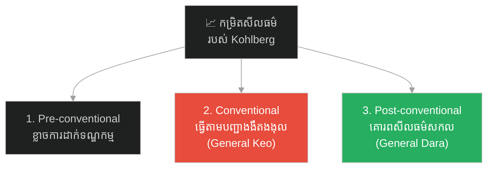
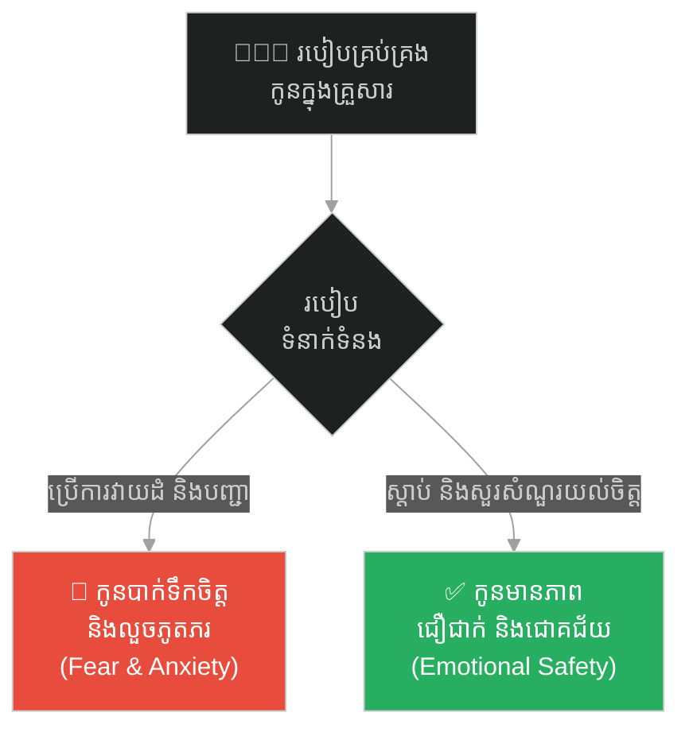
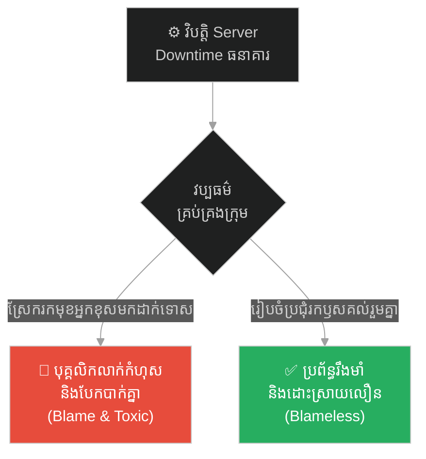
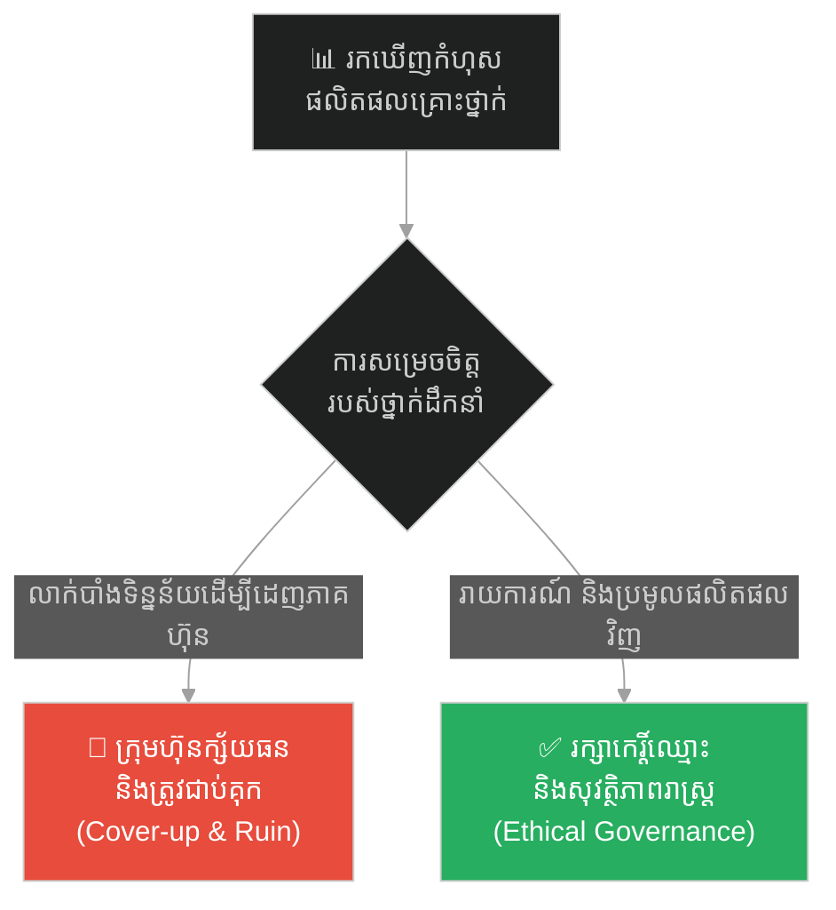
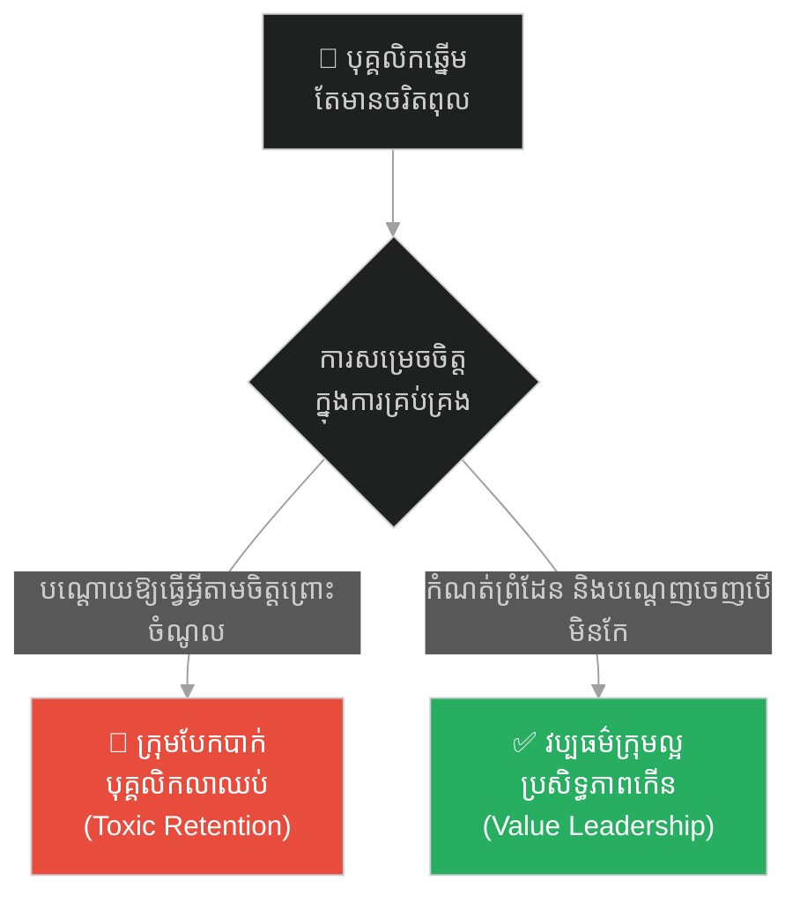
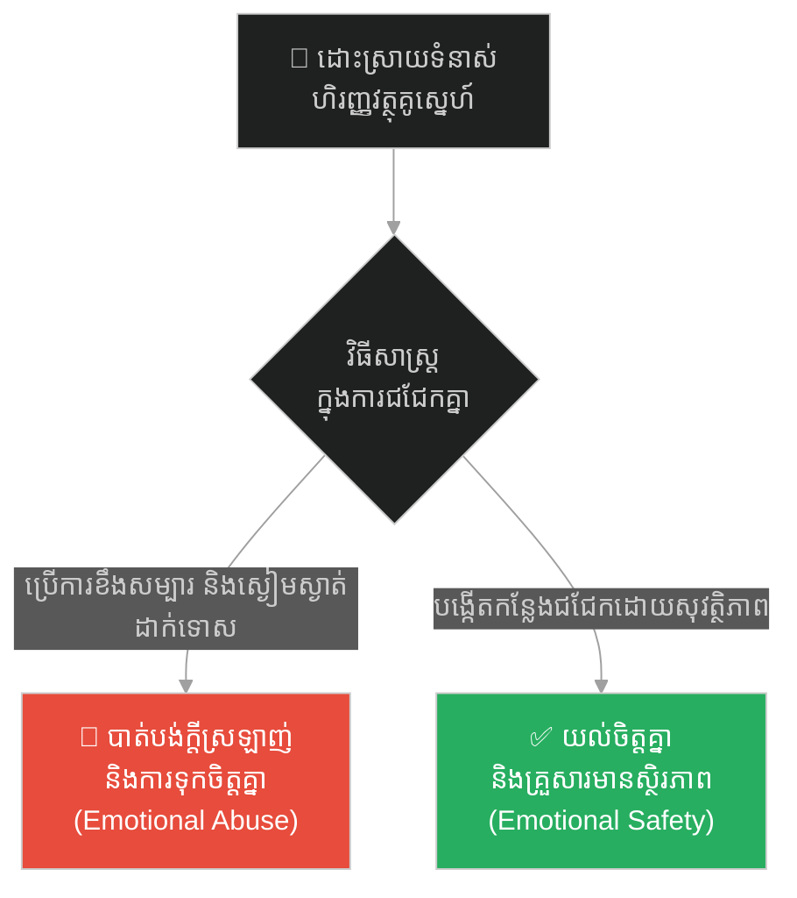
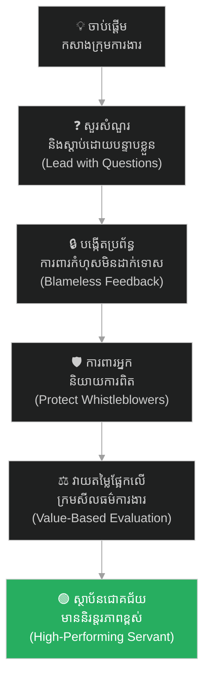

# ២៥៧ — មេទ័ពដែលសួរសំណួរ និងភាពជាអ្នកដឹកនាំ (The General Who Asked Questions)៖ ភាពជាអ្នកដឹកនាំបែបបម្រើ និងក្រមសីលធម៌នៃការសម្រេចចិត្ត

**Author:** ichamrong  
**Date:** 2026-05-26  
**Tags:** #leadership #servant-leadership #ethics #transformational-leadership #corporate-governance #business-sustainability  
**Category:** Business Sustainability  
**Read Time:** ~15 min  

---

## 📌 មាតិកា (Table of Contents)
- [អន្ទាក់ផ្លូវចិត្ត / វិបត្តិធុរកិច្ច (The Dilemma / The Trap)](#0)
- [១. រឿងនិទានប្រៀបធៀប៖ មេទ័ព កែវ និងមេទ័ព តារា (The Parable of Keo and Dara)](#1)
  - [ការសាកល្បងគុណធម៌ និងការសម្រេចចិត្តដ៏សាហាវ (The Ethical Test and the Principled Refusal)](#1-1)
- [២. បញ្ហា៖ ភាពជាអ្នកដឹកនាំដោយការភ័យខ្លាច និងក្រមសីលធម៌ (The Issue: Fear-Based Leadership and Ethics)](#2)
- [៣. ឧទាហរណ៍ជាក់ស្តែងក្នុងពិភពពិត (Real World Examples)](#3)
  - [ឧទាហរណ៍ទី ១ — កម្រិតស្រាល (គ្រួសារ)៖ របៀបគ្រប់គ្រងកូនរបស់ឪពុកម្តាយ (The Parenting Styles Dilemma)](#3-1)
  - [ឧទាហរណ៍ទី ២ — កម្រិតមធ្យម (បច្ចេកទេស)៖ ការគ្រប់គ្រងវិបត្តិ Server គាំងរបស់ Team Lead (The Blameless Post-Mortem vs Blame Culture)](#3-2)
  - [ឧទាហរណ៍ទី ៣ — កម្រិតមធ្យម (ធុរកិច្ច)៖ ការសម្រេចចិត្តរាយការណ៍ពីកំហុសផលិតផល (The Corporate Whistleblowing Decision)](#3-3)
  - [ឧទាហរណ៍ទី ៤ — កម្រិតមធ្យម (សង្គម/គ្រប់គ្រង)៖ ការដោះស្រាយជាមួយបុគ្គលិកឆ្នើមតែមានឥរិយាបថពុល (The Toxic High-Performer Dilemma)](#3-4)
  - [ឧទាហរណ៍ទី ៥ — កម្រិតធ្ងន់ (ទំនាក់ទំនង)៖ ការដោះស្រាយទំនាស់ដោយការប្រើអំណាចលើដៃគូ (The Emotional Silent Treatment vs Psychological Safety)](#3-5)
- [៤. ដំណោះស្រាយទូទៅ៖ ការកសាងសុវត្ថិភាពផ្លូវចិត្ត និងភាពជាអ្នកដឹកនាំបែបបម្រើ (The General Solution: Building Psychological Safety & Servant Leadership)](#4)
- [សេចក្តីសន្និដ្ឋាន (Conclusion)](#5)
- [ឯកសារយោង (References)](#6)
- [Related Posts / Course Link](#7)

---

## អន្ទាក់ផ្លូវចិត្ត / វិបត្តិធុរកិច្ច (The Dilemma / The Trap)

នៅក្នុងប្រព័ន្ធគ្រប់គ្រងសហគ្រាស និងស្ថាប័នជាច្រើន អន្ទាក់ផ្លូវចិត្តដ៏សាហាវបំផុតរបស់ថ្នាក់ដឹកនាំគឺ **«ការដឹកនាំដោយប្រើអំណាច និងការបង្កើតភាពភ័យខ្លាច» (Fear-Based & Transactional Leadership)**។ អ្នកដឹកនាំជារឿយៗជឿជាក់ថា ដើម្បីទទួលបានលទ្ធផលការងារលឿន និងរក្សាបាននូវវិន័យរឹងមាំ ពួកគេត្រូវតែដើរតួជា «អ្នកបញ្ជាផ្តាច់ការ» ដែលមិនអនុញ្ញាតឱ្យមានការសួរដេញដោល ឬបញ្ចេញមតិជំទាស់ឡើយ។ ភាពភ័យខ្លាចនេះបង្កើតបាននូវ **«វប្បធម៌ស្ងប់ស្ងាត់» (Culture of Silence)** ដែលបំផ្លាញគំនិតច្នៃប្រឌិត និងបិទបាំងរាល់បញ្ហាគ្រោះថ្នាក់។

*   **ផ្លូវងងឹត (Failure Path)** — ការដឹកនាំដោយការគំរាមកំហែង និងការដោះដូរប្រយោជន៍រយៈពេលខ្លី (Transactional) ដែលនាំទៅរកការបាត់បង់ទំនុកចិត្ត ការលាក់បាំងកំហុស និងការដួលរលំសីលធម៌ស្ថាប័ន។
*   **ផ្លូវពន្លឺ (Success Path)** — ការដឹកនាំបែបបម្រើ (Servant Leadership) និងការកសាងសុវត្ថិភាពផ្លូវចិត្ត (Psychological Safety) ដែលជំរុញឱ្យបុគ្គលិកហ៊ានបញ្ចេញមតិ ហ៊ានរាយការណ៍ការពិត និងគោរពក្រមសីលធម៌ជាធំ (Post-conventional Ethics)។

ដើម្បីយល់ដឹងពីសិល្បៈនៃការដឹកនាំប្រកបដោយគុណធម៌ និងការកសាងក្រុមការងារដែលមានភាពធន់ នេះជាផែនទីបង្ហាញផ្លូវ៖
1. **រឿងនិទានប្រៀបធៀប (The Parable)** — ការប្រយុទ្ធគ្នារវាងកងទ័ពរបស់មេទ័ព កែវ និងមេទ័ព តារា ព្រមទាំងការសាកល្បងគុណធម៌ចុងក្រោយរបស់ព្រះរាជា។
2. **បញ្ហា (The Issue)** — ការវិភាគទ្រឹស្តីភាពជាអ្នកដឹកនាំ (Transformational vs. Transactional), ទ្រឹស្តីសីលធម៌របស់ Kohlberg និងក្របខ័ណ្ឌសីលធម៌សកល។
3. **ឧទាហរណ៍ជាក់ស្តែងក្នុងពិភពពិត (Real World Examples)** — ករណីសិក្សា ៥ កម្រិត ចាប់ពីកម្រិតគ្រួសាររហូតដល់ទំនាក់ទំនងផ្លូវចិត្ត។
4. **ដំណោះស្រាយទូទៅ (The General Solution)** — ជំហានយុទ្ធសាស្ត្រក្នុងការបង្កើត «សុវត្ថិភាពផ្លូវចិត្ត» និងការគ្រប់គ្រងប្រកបដោយបរិយាបន្ន។

---

## ១. រឿងនិទានប្រៀបធៀប៖ មេទ័ព កែវ និងមេទ័ព តារា (The Parable of Keo and Dara)

នាសម័យបុរាណ ក្នុងអាណាចក្រមួយដែលតែងតែរងការឈ្លានពានពីសត្រូវ ព្រះរាជាបានសម្រេចចិត្តបញ្ជូនកងទ័ពពីរក្រុមដឹកនាំដោយមេទ័ពពីររូបដែលមានចរិតលក្ខណៈផ្ទុយគ្នាស្រឡះ ដើម្បីទៅការពារទឹកដីនៅតំបន់ព្រំដែនដ៏សំខាន់។

មេទ័ពទីមួយឈ្មោះ **កែវ (Keo)** ជាមនុស្សដែលជឿជាក់លើអំណាចផ្តាច់ការ និងការដាក់វិន័យយ៉ាងតឹងរ៉ឹងបំផុត (Transactional Leader)។ គាត់ដឹកនាំដោយការបង្កើតភាពភ័យខ្លាច។ នៅក្នុងជំរំទ័ពរបស់គាត់ គ្មាននរណាម្នាក់ហ៊ានសួរសំណួរ ឬបញ្ចេញមតិយោបល់ជំទាស់នឹងផែនការរបស់គាត់ឡើយ។ ទាហានណាដែលហ៊ានសួរដេញដោល នឹងត្រូវចោទប្រកាន់ថាជាអ្នកបះបោរ និងត្រូវទទួលទណ្ឌកម្មយ៉ាងធ្ងន់ធ្ងរ។ គាត់ជឿជាក់ថា៖ *«ភារកិច្ចរបស់ទាហានគឺធ្វើតាមបញ្ជា មិនមែនមកសួរសំណួរឡើយ!»*

មេទ័ពទីពីរឈ្មោះ **តារា (Dara)** ដឹកនាំកងទ័ពដោយរបៀបផ្ទុយស្រឡះ គឺគាត់អនុវត្តភាពជាអ្នកដឹកនាំបែបបម្រើ (Servant Leadership)។ មុនពេលចេញចម្បាំងម្តងៗ តារា តែងតែដើរចូលទៅក្នុងជំរំទ័ពរបស់ទាហានថ្នាក់ទាប ស្តាប់ការលំបាករបស់ពួកគេ និងសួរសំណួរដោយបើកចិត្តទូលាយថា ៖ **«បងប្អូនទាំងអស់គ្នា តើមានចន្លោះប្រហោង ឬគ្រោះថ្នាក់អ្វីខ្លះនៅក្នុងយុទ្ធសាស្ត្ររបស់ខ្ញុំដែលខ្ញុំអាចនឹងមើលរំលង? តើបងប្អូនមានយោបល់អ្វីខ្លះដើម្បីការពារជីវិតគ្នាយើង និងទទួលបានជ័យជម្នះ?»** (បង្កើតឱ្យមាន Psychological Safety)។ រាល់មតិយោបល់ល្អៗ តែងតែទទួលបានការសរសើរ និងរង្វាន់លើកទឹកចិត្ត។

នៅពេលសង្គ្រាមមកដល់ សត្រូវប្រែក្រឡាស់យុទ្ធសាស្ត្រវាយឆ្មក់ភ្លាមៗ ដែលខុសពីផែនការដើមរបស់មេទ័ពទាំងពីរ។

*   **កងទ័ពរបស់មេទ័ព កែវ** — ផែនការដើមត្រូវរអាក់រអួល។ មន្ត្រីថ្នាក់ក្រោមបានមើលឃើញផ្លូវដែលសត្រូវលួចវាយឆ្មក់ ប៉ុន្តែដោយសារខ្លាចការដាក់ទោស និងគ្មានទម្លាប់ហ៊ានបញ្ចេញមតិ ពួកគេបានត្រឹមតែនៅស្ងៀមទ្រឹង និងធ្វើតាមបញ្ជាចាស់ដែលខុសឆ្គង។ ជាលទ្ធផល កងទ័ពរបស់ កែវ ត្រូវខ្ទេចខ្ទី និងទទួលបរាជ័យយ៉ាងអាម៉ាស់។
*   **កងទ័ពរបស់មេទ័ព តារា** — នៅពេលសត្រូវប្តូរយុទ្ធសាស្ត្រ ទាហានកាំភ្លើងធ្នូថ្នាក់ទាបម្នាក់បានរត់មកប្រាប់ តារា ភ្លាមៗពីចន្លោះប្រហោងខាងក្រោយភ្នំ។ តារា បានស្តាប់ និងអនុញ្ញាតឱ្យកែប្រែក្បួនទ័ពភ្លាមៗ។ កងទ័ពរបស់គាត់បានវាយបក និងទទួលបានជ័យជម្នះយ៉ាងត្រចះត្រចង់។

---

### ការសាកល្បងគុណធម៌ និងការសម្រេចចិត្តដ៏សាហាវ (The Ethical Test and the Principled Refusal)

ក្រោយពេលទទួលបានជ័យជម្នះដ៏ធំធេង ព្រះរាជាដែលកើតចិត្តសង្ស័យ និងចង់សាកល្បងភក្តីភាពរបស់មេទ័ពទាំងពីរ បានចេញព្រះរាជបញ្ជាដ៏ឃោរឃៅមួយគឺ ៖ **«ចូរនាំកងទ័ពទៅដុតបំផ្លាញភូមិរបស់អ្នកស្រុកស្លូតត្រង់ម្នាក់នៅតំបន់ព្រំដែន ដែលមិនព្រមបង់ពន្ធគយ ដើម្បីធ្វើជាការព្រមានដល់ភូមិដទៃទៀត!»**

*   **មេទ័ព កែវ** — ទទួលបានបញ្ជាភ្លាម ក៏ប្រញាប់ដឹកនាំសេនាទៅដុតបំផ្លាញភូមិភ្លាមៗដោយគ្មានការសង្ស័យ ឬសួរសំណួរអ្វីឡើយ ព្រោះគាត់គិតថា៖ *«បញ្ជារបស់ព្រះរាជាគឺដាច់ខាត ខ្ញុំគ្រាន់តែជាអ្នកបំពេញភារកិច្ចការពារខ្លួនពីទោសកំហុសប៉ុណ្ណោះ»* (កម្រិតសីលធម៌ Pre-conventional/Conventional)。
*   **មេទ័ព តារា** — បានបដិសេធយ៉ាងដាច់អហង្ការមិនព្រមអនុវត្តតាមបញ្ជានេះឡើយ។ គាត់បានសរសេរសារលិខិតផ្លូវការផ្ញើថ្វាយព្រះរាជា ដោយពន្យល់ពីក្រមសីលធម៌ និងយុត្តិធម៌ថា៖ *«ការការពារអាណាចក្រគឺដើម្បីសេចក្តីសុខរបស់ប្រជារាស្ត្រ មិនមែនដើម្បីកាប់សម្លាប់រាស្ត្រខ្លួនឯងឡើយ។ ខ្ញុំសុខចិត្តលាលែងពីតំណែង និងទទួលទោសកំហុស តែមិនព្រមធ្វើសកម្មភាពខុសច្បាប់សីលធម៌នេះឡើយ»* (កម្រិតសីលធម៌ Post-conventional)。

ព្រះរាជាបានដកហូតតំណែងរបស់ តារា និងបញ្ជូនគាត់ទៅកាត់ទោសនៅតុលាការយោធា ប៉ុន្តែរឿងរ៉ាវរបស់ តារា ត្រូវបានកត់ត្រាក្នុងប្រវត្តិសាស្ត្រជាមេទ័ពដ៏មានគុណធម៌ខ្ពស់បំផុត ដែលប្រជារាស្ត្រគោរពស្រឡាញ់រហូតដល់សព្វថ្ងៃ។ ចំណែកឯមេទ័ព កែវ ត្រូវបានគេចងចាំថាជាមនុស្សដែលគ្មានវិញ្ញាណ និងជាឧបករណ៍នៃភាពឃោរឃៅ។

---

## ២. បញ្ហា៖ ភាពជាអ្នកដឹកនាំដោយការភ័យខ្លាច និងក្រមសីលធម៌ (The Issue: Fear-Based Leadership and Ethics)

រឿងនិទានប្រៀបធៀបនេះ ឆ្លុះបញ្ចាំងយ៉ាងច្បាស់ពីទ្រឹស្តីគ្រប់គ្រង និងក្រមសីលធម៌ទំនើប៖

### ១. ទ្រឹស្តីភាពជាអ្នកដឹកនាំ (Leadership Styles)
*   **Transactional Leadership (ការដឹកនាំបែបដោះដូរ)**៖ ផ្តោតលើការប្រើប្រាស់រង្វាន់ (Reward) និងការដាក់ទណ្ឌកម្ម (Punishment) ដើម្បីទទួលបានការអនុវត្តការងារ។ វាបង្កើតឱ្យមានការបំពេញការងារត្រឹមតែកាតព្វកិច្ច (Compliance) ប៉ុណ្ណោះ តែមិនជំរុញឱ្យមានការប្តេជ្ញាចិត្តពិតប្រាកដឡើយ។
*   **Transformational & Servant Leadership (ការដឹកនាំបែបបម្រើ និងការផ្លាស់ប្តូរ)**៖ ផ្តោតលើការបំផុសគំនិត (Inspiration) ការអភិវឌ្ឍសមត្ថភាពបុគ្គល និងការបម្រើអ្នកក្រោមបង្គាប់។ អ្នកដឹកនាំបង្កើត **«សុវត្ថិភាពផ្លូវចិត្ត» (Psychological Safety)** ដូចដែល Amy Edmondson (សាលាធុរកិច្ចហាវ៉ាដ) បានស្រាវជ្រាវថា ជាគន្លឹះដែលធ្វើឱ្យសហគ្រាសជោគជ័យ ព្រោះបុគ្គលិកហ៊ានបញ្ចេញមតិយោបល់ និងរាយការណ៍កំហុសដើម្បីកែលម្អ។

### ២. ទ្រឹស្តីនៃការអភិវឌ្ឍក្រមសីលធម៌របស់ Kohlberg (Kohlberg's Stages of Moral Development)
លោក Lawrence Kohlberg បានបែងចែកកម្រិតនៃការយល់ដឹងពីសីលធម៌របស់មនុស្សជា ៣ កម្រិតធំៗ៖
1.  **Pre-conventional (មុនច្បាប់ទម្លាប់)**៖ ធ្វើរឿងត្រឹមត្រូវព្រោះខ្លាចការដាក់ទណ្ឌកម្ម ឬចង់បានរង្វាន់។
2.  **Conventional (តាមច្បាប់ទម្លាប់)**៖ ធ្វើរឿងត្រឹមត្រូវព្រោះចង់ឱ្យគេទទួលស្គាល់ និងគោរពច្បាប់សង្គម/បញ្ជាថ្នាក់លើដោយងងឹតងងុល (ដូចជាមេទ័ព កែវ)។
3.  **Post-conventional (លើសច្បាប់ទម្លាប់)**៖ ធ្វើរឿងត្រឹមត្រូវដោយផ្អែកលើគោលការណ៍យុត្តិធម៌ សិទ្ធិមនុស្ស និងសីលធម៌សកល ទោះបីជាវាត្រូវផ្ទុយនឹងច្បាប់កំណត់ ឬបញ្ជារបស់អ្នកមានអំណាចក៏ដោយ (ដូចជាមេទ័ព តារា)។

---

## ៣. ឧទាហរណ៍ជាក់ស្តែងក្នុងពិភពពិត (Real World Examples)

ខាងក្រោមនេះជាករណីសិក្សា ៥ កម្រិតនៃការអនុវត្តភាពជាអ្នកដឹកនាំ និងក្រមសីលធម៌ក្នុងការងារ និងជីវិតប្រតិបត្តិការ៖

---

### ឧទាហរណ៍ទី ១ — កម្រិតស្រាល (គ្រួសារ)៖ របៀបគ្រប់គ្រងកូនរបស់ឪពុកម្តាយ (The Parenting Styles Dilemma)

**ស្ថានភាព៖** ឪពុកម្តាយចង់ឱ្យកូនផ្តោតលើការសិក្សា និងមិនដើរលេងពាសវាលពាសកាល។
*   **ការដឹកនាំបែបភ័យខ្លាច (Fear-based)៖** ឪពុកម្តាយប្រើការវាយដំ គំរាមកំហែង និងហាមឃាត់មិនឱ្យកូនសួរនាំអ្វីទាំងអស់។ កូនមានអារម្មណ៍ភ័យខ្លាច មិនដែលហ៊ានប្រាប់ពីបញ្ហាដែលខ្លួនកំពុងជួបប្រទះនៅសាលា (ដូចជាការត្រូវគេធ្វើបាប ឬរងសម្ពាធផ្លូវចិត្ត)។ លទ្ធផល៖ កូនលួចបន្លំ ភូតភរ និងកើតជំងឺបាក់ទឹកចិត្តយ៉ាងធ្ងន់ធ្ងរ។
*   **ការដឹកនាំបែបបម្រើ និងយល់ចិត្ត (Servant/Dialogue)៖** ឪពុកម្តាយបង្កើតការជជែកគ្នាដោយបើកចំហរ (Open dialogue) និងសួរសំណួរដោយក្ដីយល់ចិត្ត៖ *«តើកូនជួបការលំបាកអ្វីខ្លះនៅសាលាថ្ងៃនេះ? តើម៉ាក់ប៉ាអាចជួយសម្រាលបន្ទុកកូនដោយរបៀបណា?»* កូនមានអារម្មណ៍ថាមានសុវត្ថិភាពផ្លូវចិត្ត ហ៊ានប្រាប់ការពិត និងខិតខំរៀនសូត្រដោយស្វ័យប្រវត្ត។

---

### ឧទាហរណ៍ទី ២ — កម្រិតមធ្យម (បច្ចេកទេស)៖ ការគ្រប់គ្រងវិបត្តិ Server គាំងរបស់ Team Lead (The Blameless Post-Mortem vs Blame Culture)

**ស្ថានភាព៖** ប្រព័ន្ធទិន្នន័យរបស់ App ធនាគារជួបវិបត្តិគាំងដំណើរការ (System Outage) ព្រោះមានការរុញកូដ (Push code) ខុសឆ្គងពី Developer ម្នាក់។
*   **ការដឹកនាំបែបភ័យខ្លាច (Blame Culture)៖** Engineering Manager ស្រែកជេរប្រមាថ និងស្វែងរកមុខអ្នកធ្វើខុសចំៗដើម្បីដេញចេញភ្លាកៗ។ ជាលទ្ធផល ក្រុមការងារដទៃទៀតចាប់ផ្តើមភ័យខ្លាច លាក់បាំងរាល់បញ្ហា ឬរុញកំហុសដាក់គ្នាទៅវិញទៅមក ដែលធ្វើឱ្យវិបត្តិកាន់តែរីករាលដាល និងមិនអាចរកឃើញឫសគល់បញ្ហាពិតប្រាកដ។
*   **ការដឹកនាំបែបយល់ចិត្ត (Blameless Post-Mortem)៖** Tech Lead ដឹកនាំការប្រជុំដោយបើកចំហ និងផ្តោតលើបញ្ហា៖ *«យើងមិនមកទីនេះដើម្បីស្វែងរកមនុស្សដាក់ទោសឡើយ។ យើងចង់ដឹងថា តើមានចន្លោះប្រហោងអ្វីខ្លះនៅក្នុងប្រព័ន្ធគ្រប់គ្រងគុណភាព (CI/CD Pipeline) របស់យើងដែលអនុញ្ញាតឱ្យកូដខុសនោះរុញចូល Production បាន? តើយើងត្រូវរួមគ្នាជួសជុលវាដោយរបៀបណា?»* ក្រុមការងារហ៊ានរាយការណ៍ការពិត ជួយគ្នាដោះស្រាយបញ្ហារួចរាល់ភ្លាមៗ និងកែលម្អប្រព័ន្ធការពារកុំឱ្យកើតឡើងម្តងទៀត។

---

### ឧទាហរណ៍ទី ៣ — កម្រិតមធ្យម (ធុរកិច្ច)៖ ការសម្រេចចិត្តរាយការណ៍ពីកំហុសផលិតផល (The Corporate Whistleblowing Decision)

**ស្ថានភាព៖** ក្រុមហ៊ុនផលិតថ្នាំពេទ្យមួយរកឃើញថា ផលិតផលថ្មីរបស់ខ្លួនមានផ្ទុកសារធាតុផ្សំមួយចំនួនដែលអាចបង្កផលប៉ះពាល់ដល់សុខភាពអ្នកប្រើប្រាស់ក្នុងរយៈពេលវែង ប៉ុន្តែផលិតផលនោះត្រូវបានដាក់លក់លើទីផ្សាររួចទៅហើយ។
*   **ការដឹកនាំខ្វះសីលធម៌ (Ego/Cover-up)៖** CEO សម្រេចចិត្តលាក់បាំងទិន្នន័យនេះ ព្រោះខ្លាចប៉ះពាល់ដល់តម្លៃភាគហ៊ុនរបស់ក្រុមហ៊ុន និងកេរ្តិ៍ឈ្មោះផ្ទាល់ខ្លួន។ គាត់បង្គាប់ឱ្យបុគ្គលិកបច្ចេកទេសទាំងអស់នៅស្ងៀម។ បុគ្គលិកខ្លះដែលដឹងរឿង មិនហ៊ាននិយាយព្រោះខ្លាចបាត់បង់ការងារ។ ចុងក្រោយ ការពិតត្រូវបានលេចឡើង ក្រុមហ៊ុនត្រូវកាត់ទោសទូទាំងពិភពលោក និងក្ស័យធនទាំងស្រុង។
*   **ការដឹកនាំផ្អែកលើសីលធម៌គុណធម៌ (Post-conventional Ethics)៖** ថ្នាក់ដឹកនាំ ឬបុគ្គលិកម្នាក់បានសម្រេចចិត្តប្រើប្រាស់យន្តការ **Whistleblowing (ការរាយការណ៍អំពីអំពើខុសឆ្គង)** ទៅកាន់ស្ថាប័នត្រួតពិនិត្យសុខាភិបាលជាផ្លូវការ ទោះបីជាដឹងថាវាអាចប៉ះពាល់ដល់ការងាររបស់ខ្លួនក៏ដោយ។ ក្រុមហ៊ុនត្រូវបានបង្ខំឱ្យដកផលិតផលត្រលប់មកវិញភ្លាមៗ ជួសជុលកំហុស និងទទួលបានការទុកចិត្តឡើងវិញពីសាធារណជនក្នុងរយៈពេលវែង។

---

### ឧទាហរណ៍ទី ៤ — កម្រិតមធ្យម (សង្គម/គ្រប់គ្រង)៖ ការដោះស្រាយជាមួយបុគ្គលិកឆ្នើមតែមានឥរិយាបថពុល (The Toxic High-Performer Dilemma)

**ស្ថានភាព៖** នៅក្នុងក្រុមហ៊ុនមួយ មានអ្នកលក់ដ៏ឆ្នើមម្នាក់ (Top Sales) ដែលអាចរកចំណូលបានរហូតដល់ទៅ ៤០% នៃចំណូលសរុបរបស់ក្រុមហ៊ុន ប៉ុន្តែគាត់មានឥរិយាបថច្រឡបខំ ជេរប្រមាថ និងជាន់ឈ្លីបុគ្គលិករួមក្រុមផ្សេងទៀតឥតឈប់ឈរ។
*   **ការគ្រប់គ្រងបែបបណ្តោយ (Transactional Trap)៖** Manager សម្រេចចិត្តនៅស្ងៀម និងយោគយល់ឱ្យអ្នកលក់នោះជានិច្ច ព្រោះគិតតែពី «តួលេខលក់ដាច់» (Transactional logic)。 ជាលទ្ធផល បុគ្គលិកឆ្នើមៗដទៃទៀតសម្រេចចិត្តលាឈប់ពីការងារជាបន្តបន្ទាប់ វប្បធម៌ក្រុមទាំងមូលធ្លាក់ចុះ និងបំផ្លាញនិរន្តរភាពរបស់ក្រុមហ៊ុនទាំងស្រុងក្នុងរយៈពេលវែង។
*   **ការគ្រប់គ្រងផ្អែកលើគុណតម្លៃ និងវប្បធម៌ (Value-Based Leadership)៖** Manager សម្រេចចិត្តហៅបុគ្គលិកនោះមកព្រមានចំៗ និងកំណត់ព្រំដែនឥរិយាបថច្បាស់លាស់។ ទោះបីជាគាត់មិនកែប្រែខ្លួន ហើយត្រូវបណ្តេញចេញដែលធ្វើឱ្យប៉ះពាល់ដល់ចំណូលរយៈពេលខ្លីក៏ដោយ ក៏ក្រុមការងារដែលនៅសល់មានអារម្មណ៍ថាមានសុវត្ថិភាព និងខិតខំប្រឹងប្រែងបង្កើនការលក់រួម រហូតដល់អាចសម្រេចបានចំណូលខ្ពស់ជាងមុនទៅទៀត។

---

### ឧទាហរណ៍ទី ៥ — កម្រិតធ្ងន់ (ទំនាក់ទំនង)៖ ការដោះស្រាយទំនាស់ដោយការប្រើអំណាចលើដៃគូ (The Emotional Silent Treatment vs Psychological Safety)

**ស្ថានភាព៖** គូស្នេហ៍មានការយល់ខុសគ្នាចំពោះការបែងចែកថវិកាចំណាយក្នុងផ្ទះ។
*   **ការប្រើប្រាស់អំណាចផ្លូវចិត្ត (Fear/Control)៖** ដៃគូម្ខាងប្រើប្រាស់វិធីសាស្ត្រ «ស្ងៀមស្ងាត់ដាក់ទោស» (Silent Treatment) ឬការជេរប្រមាថឱ្យដៃគូម្ខាងទៀតកើតមានវិប្បដិសារី និងមានអារម្មណ៍ភ័យខ្លាចដើម្បីឱ្យគេព្រមព្រៀងតាមចិត្តខ្លួនឯង។ នេះជាការបង្កើតបរិយាកាសមិនមានសុវត្ថិភាពផ្លូវចិត្ត។ លទ្ធផល៖ ដៃគូម្ខាងទៀតបាត់បង់ភាពខ្លួនឯង និងរស់នៅក្នុងការភ័យខ្លាច រហូតដល់បែកបាក់។
*   **ការកសាងសុវត្ថិភាពផ្លូវចិត្ត (Psychological Safety)៖** ពួកគេទាំងពីរដកកំហឹងចេញ រួចបើកចិត្តជជែកគ្នា៖ *«តើការចំណាយបែបណាដែលធ្វើឱ្យយើងទាំងពីរមានអារម្មណ៍ស្រណុកចិត្ត និងមានសុវត្ថិភាពហិរញ្ញវត្ថុ? តើខ្ញុំបានធ្វើអ្វីខ្លះដែលធ្វើឱ្យអ្នកមានអារម្មណ៍មិនស្រួលចិត្តកន្លងមក?»* ទំនាក់ទំនងកាន់តែរឹងមាំ និងមានក្តីសុខ។

---

## ៤. ដំណោះស្រាយទូទៅ៖ ការកសាងសុវត្ថិភាពផ្លូវចិត្ត និងភាពជាអ្នកដឹកនាំបែបបម្រើ (The General Solution: Building Psychological Safety & Servant Leadership)

ដើម្បីផ្លាស់ប្តូរស្ថាប័នរបស់អ្នកពីវប្បធម៌ភ័យខ្លាច ទៅជាវប្បធម៌គុណធម៌ និងមានគំនិតច្នៃប្រឌិតខ្ពស់ ចូរអនុវត្តយុទ្ធសាស្ត្រគន្លឹះទាំងនេះ ៖

### ១. កសាងវប្បធម៌សួរសំណួរ និងស្តាប់ដោយការយកចិត្តទុកដាក់ (Lead with Questions)
ឈប់ដើរតួជាអ្នកដឹងសព្វគ្រប់ការងារទាំងអស់។ ចូរចាប់ផ្តើមការប្រជុំដោយការសួរសំណួរ៖ *«តើអ្វីជាបញ្ហាប្រឈមធំបំផុតដែលបងប្អូនជួបប្រទះសប្តាហ៍នេះ? តើខ្ញុំអាចជួយសម្រាលការលំបាកនោះដោយរបៀបណា?»* ការសួរសំណួរបង្ហាញពីភាពបន្ទាបខ្លួន និងការផ្តល់តម្លៃដល់អ្នកក្រោមបង្គាប់។

### ២. បង្កើតប្រព័ន្ធ «Blameless Feedback Loop»
នៅពេលមានកំហុសបច្ចេកទេស ឬប្រតិបត្តិការកើតឡើង ឈប់ផ្តោតលើការ «ស្វែងរកអ្នកខុសមកដាក់ទោស»។ ចូរផ្តោតលើ «ការវិភាគប្រព័ន្ធការពារ» ដើម្បីកែលម្អការងាររួមគ្នា។ អនុវត្តគោលការណ៍ **KISS (Keep It Simple, Stupid)** ក្នុងការរចនាការងារដើម្បីកាត់បន្ថយភាពស្មុគស្មាញ និងកំហុសឆ្គង។

### ៣. លើកកម្ពស់អភិបាលកិច្ចល្អ និងការពារអ្នករាយការណ៍កំហុស (Protect Whistleblowers)
រៀបចំឱ្យមានប្រព័ន្ធរាយការណ៍កំហុស ឬអំពើពុករលួយដោយអនាមិក (Anonymous Reporting System) នៅក្នុងក្រុមហ៊ុន។ ធានាឱ្យបាននូវការការពារផ្លូវច្បាប់ និងផ្លូវចិត្តដាច់ខាតសម្រាប់បុគ្គលិកដែលហ៊ាននិយាយការពិតដើម្បីប្រយោជន៍រួម។

### ៤. កែលម្អការវាយតម្លៃដោយផ្អែកលើគុណតម្លៃ (Value-Based Performance)
កុំវាយតម្លៃបុគ្គលិកត្រឹមតែលើ «តួលេខលទ្ធផលរយៈពេលខ្លី» ប៉ុណ្ណោះ។ ចូររួមបញ្ចូលទាំង «អាកប្បកិរិយា ក្រមសីលធម៌ និងការជួយជ្រោមជ្រែងសមាជិកក្រុម» ទៅក្នុងលក្ខណៈវិនិច្ឆ័យដំឡើងប្រាក់ខែ ឬឡើងតំណែង។

---

## សេចក្តីសន្និដ្ឋាន (Conclusion)

> **«ភាពជាអ្នកដឹកនាំដ៏អស្ចារ្យបំផុត មិនមែនស្ថិតនៅលើសមត្ថភាពបង្ខំមនុស្សរាប់ពាន់នាក់ឱ្យធ្វើតាមបញ្ជាដោយភាពភ័យខ្លាចនោះឡើយ។ ប៉ុន្តែវាស្ថិតនៅលើភាពក្លាហានក្នុងការសួរសំណួរ ស្តាប់ដោយក្តីគោរព និងការតាំងខ្លួនជាបង្អែក ឬជាអ្នកបម្រើដែលជួយសម្រាលរាល់ការលំបាករបស់អ្នកក្រោមបង្គាប់ ដើម្បីពួកគេមានសេរីភាពផ្លូវចិត្តក្នុងការបញ្ចេញសក្តានុពលខ្ពស់បំផុតរបស់ខ្លួន។»**

មេទ័ព កែវ អាចទទួលបានការគោរពវិន័យរយៈពេលខ្លីតាមរយៈការគំរាមកំហែង ប៉ុន្តែនៅចំពោះមុខវិបត្តិពិតប្រាកដ កងទ័ពរបស់គាត់បានត្រឹមតែនៅស្ងៀមទ្រឹង និងដួលរលំ។ ផ្ទុយទៅវិញ មេទ័ព តារា ឈ្នះបាននូវក្តីគោរព និងទំនុកចិត្តពិតប្រាកដ ដែលជាកម្លាំងចលករនាំទៅរកជ័យជម្នះគ្រប់ពេលវេលា។ ជាងនេះទៅទៀត ការសម្រេចចិត្តបដិសេធមិនព្រមធ្វើសកម្មភាពខុសច្បាប់សីលធម៌របស់ តារា គឺជាសក្ខីភាពនៃកម្រិតសីលធម៌ដ៏ឧត្តុង្គឧត្តមដែលប្រវត្តិសាស្ត្រគ្មានថ្ងៃបំភ្លេច។

ចូរឈប់ប្រើអំណាចដើម្បីគ្រប់គ្រង ចូរចាប់ផ្តើមបម្រើដើម្បីដឹកនាំ។

---

## ឯកសារយោង (References)

*   **Greenleaf, Robert K.** — *Servant Leadership: A Journey into the Nature of Legitimate Power and Greatness* (1977)។ សៀវភៅគ្រឹះដំបូងបំផុតស្តីពីទ្រឹស្តីភាពជាអ្នកដឹកនាំបែបបម្រើ។
*   **Edmondson, Amy C.** — *The Fearless Organization: Creating Psychological Safety in the Workplace for Learning, Innovation, and Growth* (2018)។ ការស្រាវជ្រាវលម្អិតអំពីសុវត្ថិភាពផ្លូវចិត្តក្នុងសហគ្រាសទំនើប។
*   **Kohlberg, Lawrence** — *Essays on Moral Development, Vol. 1: The Philosophy of Moral Development* (1981)។ ទ្រឹស្តីកម្រិតនៃការយល់ដឹងសីលធម៌របស់មនុស្ស។
*   **Denison University Coursework** — *02 Leadership and Ethics* (Year 1)។ ឯកសារយោងសម្រាប់មុខវិជ្ជាអភិបាលកិច្ចល្អ និងក្រមសីលធម៌អាជីវកម្ម។

---

## Related Posts / Course Link

*   **[02 Leadership and Ethics](../../../../../colleges/denison-university/business-sustainability/cross-cutting/02-leadership-and-ethics.md)** — មុខវិជ្ជាភាពជាអ្នកដឹកនាំ និងក្រមសីលធម៌គ្រប់គ្រងនៅ Denison University។
*   **[២៥៦ — ឈ្មួញពីរនាក់នៅព្រំដែន (The Two Merchants at the Border)](./256-the-two-merchants-at-the-border.md)** — សិល្បៈនៃការចរចាស្វែងរកផលប្រយោជន៍ និងការដោះស្រាយជម្លោះ។
*   **[២៤១ — ប្រធានក្រុមតន្ត្រី និងការគ្រប់គ្រងស្ថាប័ន (The Orchestra Conductor)](../../core-business/parables/241-the-orchestra-conductor.md)** — មេរៀនស្តីពីឥរិយាបថស្ថាប័ន និងការរៀបចំក្រុមការងារ។
