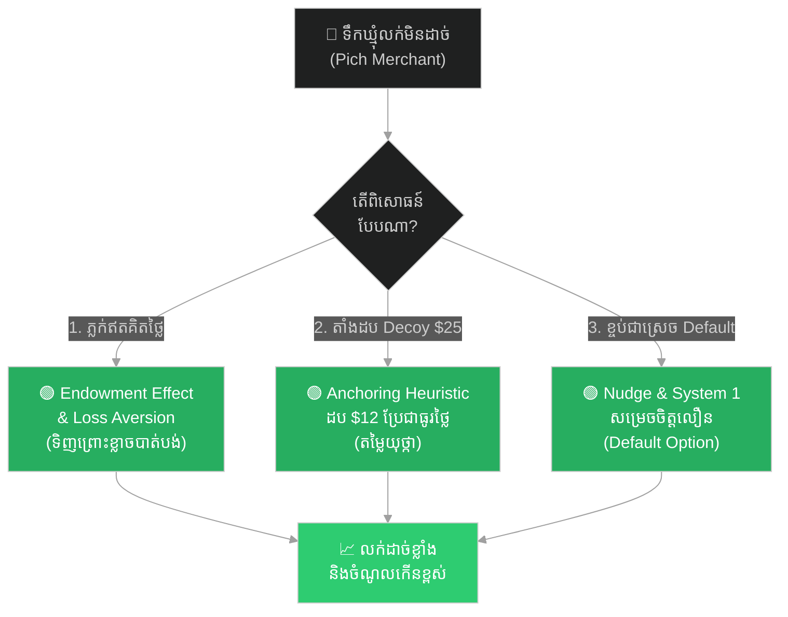
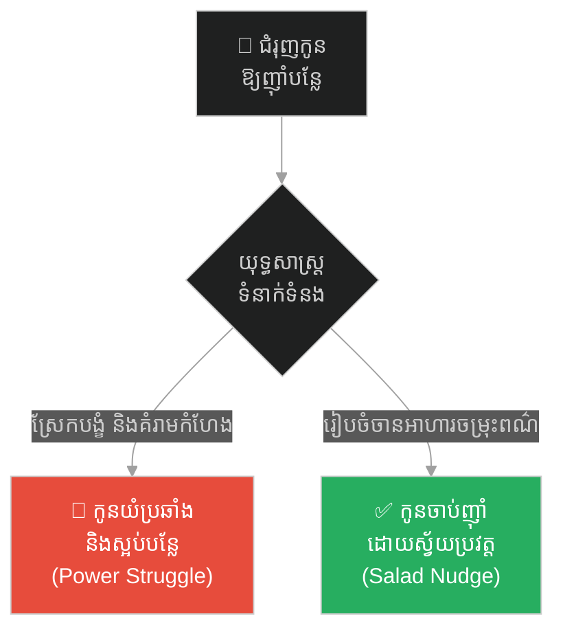
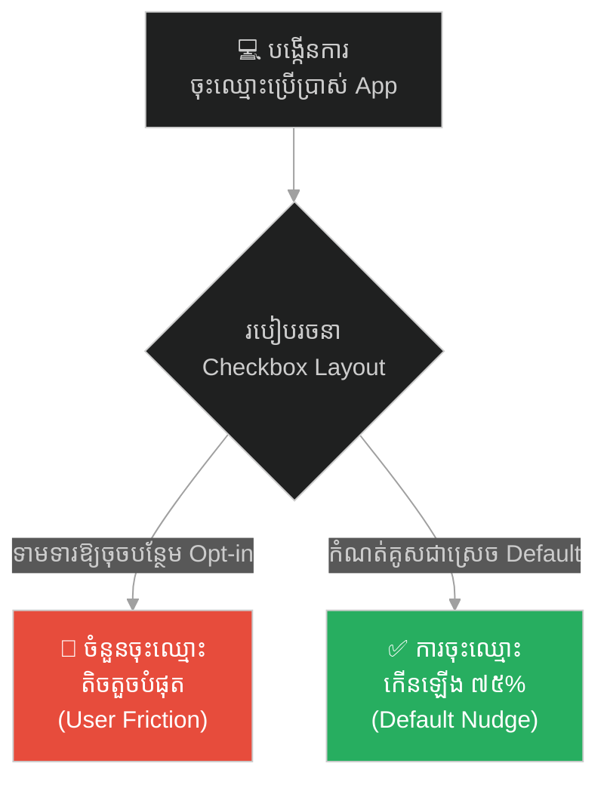
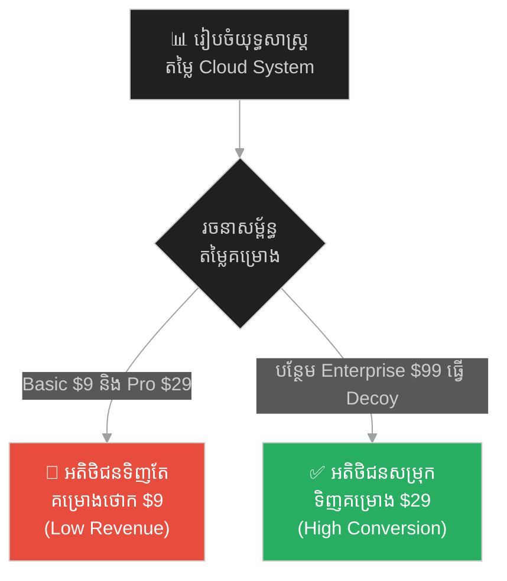
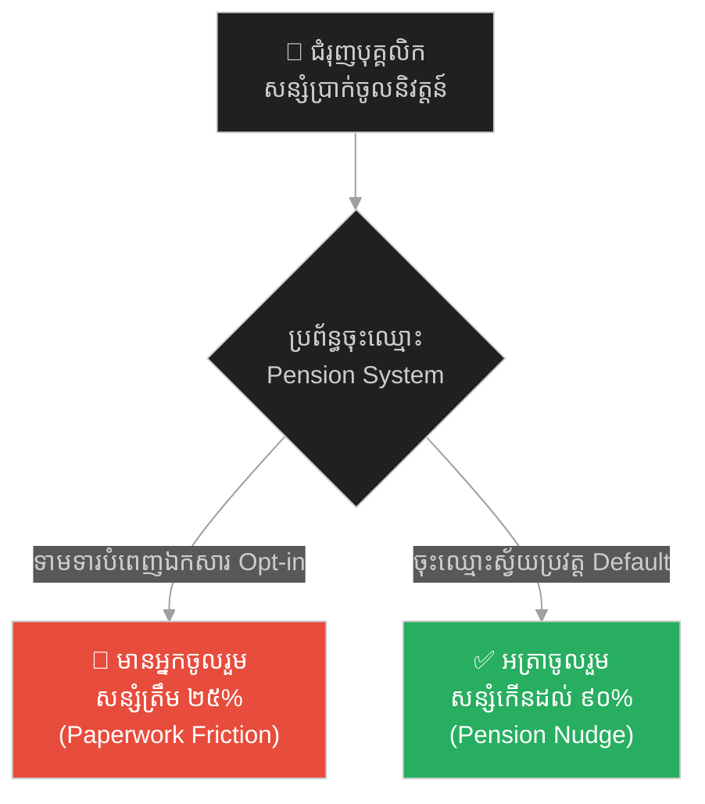
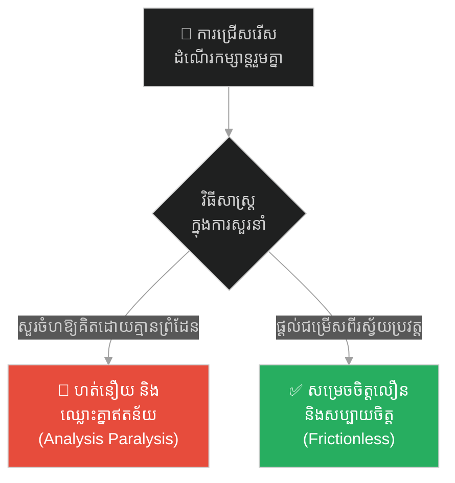
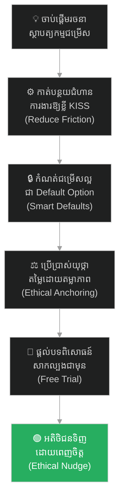

# ២៥៨ — ឈ្មួញទឹកឃ្មុំ និងគំរូឥតគិតថ្លៃ (The Merchant and the Free Sample)៖ សេដ្ឋកិច្ចអាកប្បកិរិយា និងអាថ៌កំបាំងនៃការសម្រេចចិត្តរបស់អតិថិជន

**Author:** ichamrong  
**Date:** 2026-05-26  
**Tags:** #behavioral-economics #nudge-theory #loss-aversion #anchoring #kahneman #system-1-system-2 #business-sustainability  
**Category:** Business Sustainability  
**Read Time:** ~15 min  

---

## 📌 មាតិកា (Table of Contents)
- [អន្ទាក់ផ្លូវចិត្ត / វិបត្តិធុរកិច្ច (The Dilemma / The Trap)](#0)
- [១. រឿងនិទានប្រៀបធៀប៖ ឈ្មួញទឹកឃ្មុំ ពេជ្រ និងការពិសោធន៍ទាំងបី (The Parable of Pich and the Three Experiments)](#1)
  - [ការពិសោធន៍ទី ១ ៖ គំរូឥតគិតថ្លៃ និងឥទ្ធិពលកម្មសិទ្ធិ (Experiment 1: Free Samples & Endowment Effect)](#1-1)
  - [ការពិសោធន៍ទី ២ ៖ ការបោះយុថ្កា និងការយល់ឃើញតម្លៃ (Experiment 2: Decoy Jars & Anchoring)](#1-2)
  - [ការពិសោធន៍ទី ៣ ៖ ការរុញច្រានដោយដកភាពស្មុគស្មាញ (Experiment 3: Default Portions & Nudging)](#1-3)
- [២. បញ្ហា៖ ភាពមិនសមហេតុផលរបស់ខួរក្បាល និងសេដ្ឋកិច្ចអាកប្បកិរិយា (The Issue: Brain Irrationality and Behavioral Economics)](#2)
- [៣. ឧទាហរណ៍ជាក់ស្តែងក្នុងពិភពពិត (Real World Examples)](#3)
  - [ឧទាហរណ៍ទី ១ — កម្រិតស្រាល (គ្រួសារ)៖ ការរៀបចំចានអាហារដើម្បីជំរុញឱ្យកូនញ៉ាំបន្លែ (The Parental Salad Nudge)](#3-1)
  - [ឧទាហរណ៍ទី ២ — កម្រិតមធ្យម (បច្ចេកទេស)៖ ការរចនា User Onboarding Flow របស់ UI/UX Designer (The Software Sign-up Default Nudge)](#3-2)
  - [ឧទាហរណ៍ទី ៣ — កម្រិតមធ្យម (ធុរកិច្ច)៖ ការរៀបចំតម្លៃបែបបោះយុថ្កាលើ SaaS Platform (The Decoy Pricing Strategy)](#3-3)
  - [ឧទាហរណ៍ទី ៤ — កម្រិតមធ្យម (សង្គម/គ្រប់គ្រង)៖ ការចុះឈ្មោះសន្សំប្រាក់ចូលនិវត្តន៍ដោយស្វ័យប្រវត្ត (The Automatic Retirement Enrollment)](#3-4)
  - [ឧទាហរណ៍ទី ៥ — កម្រិតធ្ងន់ (ទំនាក់ទំនង)៖ ការសម្រេចចិត្តជ្រើសរើសដំណើរកម្សាន្តដោយកាត់បន្ថយជម្រើស (The Decisional Friction Reduction in Couples)](#3-5)
- [៤. ដំណោះស្រាយទូទៅ៖ ស្ថាបត្យកម្មនៃជម្រើស និងការរុញច្រានប្រកបដោយសីលធម៌ (The General Solution: Choice Architecture & Ethical Nudging)](#4)
- [សេចក្តីសន្និដ្ឋាន (Conclusion)](#5)
- [ឯកសារយោង (References)](#6)
- [Related Posts / Course Link](#7)

---

## អន្ទាក់ផ្លូវចិត្ត / វិបត្តិធុរកិច្ច (The Dilemma / The Trap)

នៅក្នុងសេដ្ឋកិច្ចបែបបុរាណ (Classical Economics) គេសន្មតថាមនុស្សគឺជាបុគ្គលដែលមានហេតុផលឥតខ្ចោះ **«Homo Economicus»** ដែលតែងតែធ្វើការសម្រេចចិត្តដោយការគណនាថ្លៃដើម និងផលចំណេញយ៉ាងត្រឹមត្រូវបំផុត។ ទោះជាយ៉ាងណាក៏ដោយ នៅក្នុងពិភពធុរកិច្ចពិតប្រាកដ អន្ទាក់ផ្លូវចិត្តដ៏ធំបំផុតរបស់សហគ្រិនគឺការគិតថា៖ *«ប្រសិនបើផលិតផលរបស់យើងល្អ និងមានតម្លៃថោក នោះអតិថិជននឹងប្រញាប់ប្រញាល់មកទិញភ្លាមៗជាមិនខាន»*។ 

ផ្ទុយទៅវិញ ខួរក្បាលរបស់មនុស្សមិនបានដំណើរការដោយហេតុផលសុទ្ធសាធឡើយ។ មនុស្សតែងតែធ្វើការសម្រេចចិត្តដោយក្តីបារម្ភ ភាពខ្ជិលច្រអូស ព័ត៌មានលំអៀង និងអារម្មណ៍រយៈពេលខ្លី ដែលនាំទៅរក **«ភាពមិនសមហេតុផលជាប្រព័ន្ធ» (Systematic Irrationality)**。

*   **ផ្លូវងងឹត (Failure Path)** — ការព្យាយាមបញ្ចុះតម្លៃទំនិញឥតឈប់ឈរ (Price War) ដោយគិតថាតម្លៃគឺជាកត្តាតែមួយគត់ ដែលចុងក្រោយធ្វើឱ្យខាតបង់ប្រាក់ចំណេញ និងបំផ្លាញតម្លៃម៉ាកយីហោ។
*   **ផ្លូវពន្លឺ (Success Path)** — ការយល់ដឹងពីចិត្តសាស្ត្ររបស់អតិថិជន ការប្រើប្រាស់ទ្រឹស្តីរុញច្រាន (Nudge Theory) និងការរៀបចំស្ថាបត្យកម្មនៃជម្រើស (Choice Architecture) ដើម្បីសម្រួលដល់ការសម្រេចចិត្តទិញដោយរលូន។

ដើម្បីយល់ដឹងពីកម្លាំងនៃសេដ្ឋកិច្ចអាកប្បកិរិយា នេះជាផែនទីបង្ហាញផ្លូវ៖
1. **រឿងនិទានប្រៀបធៀប (The Parable)** — ការពិសោធន៍ចិត្តសាស្ត្រទាំងបីរបស់ឈ្មួញទឹកឃ្មុំ ពេជ្រ ដើម្បីស្រោចស្រង់តូបលក់ទំនិញដែលស្ងាត់ជ្រងំ។
2. **បញ្ហា (The Issue)** — ការវិភាគទ្រឹស្តី Prospect Theory, Endowment Effect, Anchoring និងប្រព័ន្ធគិត System 1 & System 2 របស់ Daniel Kahneman។
3. **ឧទាហរណ៍ជាក់ស្តែងក្នុងពិភពពិត (Real World Examples)** — ករណីសិក្សា ៥ កម្រិត ចាប់ពីកម្រិតគ្រួសាររហូតដល់ទំនាក់ទំនងគូស្រករ។
4. **ដំណោះស្រាយទូទៅ (The General Solution)** — វិធីសាស្ត្ររចនា Choice Architecture ប្រកបដោយសីលធម៌ ដើម្បីបង្កើនការលក់ដោយគ្មានការបង្ខិតបង្ខំ។

---

## ១. រឿងនិទានប្រៀបធៀប៖ ឈ្មួញទឹកឃ្មុំ ពេជ្រ និងការពិសោធន៍ទាំងបី (The Parable of Pich and the Three Experiments)

នាសម័យកាលមួយ នៅទីផ្សារដ៏មមាញឹកនៃខេត្តសៀមរាប មានឈ្មួញម្នាក់ឈ្មោះ **ពេជ្រ (Pich)** ដែលប្រកបរបរលក់ទឹកឃ្មុំព្រៃសុទ្ធល្អឥតខ្ចោះ។ ទឹកឃ្មុំរបស់ ពេជ្រ មានគុណភាពខ្ពស់ និងផ្អែមឈ្ងុយឆ្ងាញ់ខ្លាំងណាស់។ ទោះជាយ៉ាងនេះក្តី តូបលក់ទឹកឃ្មុំរបស់គាត់មានសភាពស្ងាត់ជ្រងំ។ ពេជ្រ បានព្យាយាមបញ្ចុះតម្លៃពី $15 មកសល់ត្រឹមតែ $10 ក្នុងមួយដប ហើយថែមទាំងស្រែកផ្សព្វផ្សាយយ៉ាងខ្លាំងៗពេញមួយថ្ងៃ ប៉ុន្តែអ្នកដំណើរនៅតែដើរកាត់តូបរបស់គាត់ទៅមុខបាត់ៗដោយមិនខ្វល់ខ្វាយទិញឡើយ។

ពេជ្រ កើតក្តីអស់សង្ឃឹម និងពិបាកចិត្តយ៉ាងខ្លាំង។ គាត់បានទៅប្រឹក្សាយោបល់ជាមួយដូនតាអ្នកចេះដឹងម្នាក់ក្នុងភូមិ ដែលល្បីល្បាញខាងចិត្តវិទ្យាទីផ្សារ។ ដូនតានោះបានញញឹមរួចនិយាយថា៖ 

> **«ពេជ្រ អើយ! មនុស្សមិនមែនទិញរបស់ព្រោះតែតម្លៃថោកនោះទេ។ ពួកគេទិញព្រោះតែអារម្មណ៍ និងរបៀបដែលខួរក្បាលរបស់ពួកគេវាយតម្លៃតម្លៃទំនិញនោះ។ ចូរឈប់បញ្ចុះតម្លៃ ចូរចាប់ផ្តើមកែប្រែបរិបទនៃការសម្រេចចិត្តរបស់ពួកគេវិញ»។**

ដូនតាបានណែនាំឱ្យ ពេជ្រ អនុវត្តការពិសោធន៍ចំនួនបីជំហាន៖

---

### ការពិសោធន៍ទី ១ ៖ គំរូឥតគិតថ្លៃ និងឥទ្ធិពលកម្មសិទ្ធិ (Experiment 1: Free Samples & Endowment Effect)

ពេជ្រ ឈប់បញ្ចុះតម្លៃទឹកឃ្មុំមកត្រឹម $10 ទៀតហើយ គឺគាត់ដាក់តម្លៃ $12 ក្នុងមួយដបវិញ។ ប៉ុន្តែ គាត់បានដាក់ដបទឹកឃ្មុំតូចមួយដែលមានឈើចាក់ធ្មេញតូចៗក្បែរនោះ រួចសរសេរស្លាកធំមួយថា ៖ **«សូមសាកល្បងភ្លក់ទឹកឃ្មុំព្រៃដ៏ផ្អែមឈ្ងុយឆ្ងាញ់នេះដោយសេរី និងឥតគិតថ្លៃ!»**

នៅពេលអ្នកដំណើរដើរកាត់ ពួកគេបានទាញឈើចាក់ធ្មេញមកជ្រលក់ភ្លក់។ ភ្លាមៗនោះ រសជាតិផ្អែមស្រទន់ និងក្លិនក្រអូបឈ្ងុយនៃទឹកឃ្មុំព្រៃបានដកជាប់ក្នុងចិត្តពួកគេ។ ពួកគេមានអារម្មណ៍ថា ខ្លួនពួកគេហាក់ដូចជា «ម្ចាស់» នៃបទពិសោធន៍ផ្អែមឆ្ងាញ់នោះទៅហើយ (Endowment Effect)។ ការសម្រេចចិត្តដកប្រាក់ $12 ទិញ លែងមានអារម្មណ៍ថាជា «ការខាតបង់ប្រាក់កាស» ទៀតហើយ តែវាប្រែជាអារម្មណ៍ «ការពារមិនឱ្យបាត់បង់ភាពផ្អែមឆ្ងាញ់» នោះទៅវិញ (Loss Aversion)។ ចំនួនអតិថិជនទិញបានកើនឡើងទ្វេដង។

---

### ការពិសោធន៍ទី ២ ៖ ការបោះយុថ្កា និងការយល់ឃើញតម្លៃ (Experiment 2: Decoy Jars & Anchoring)

បន្ទាប់មក ពេជ្រ បានរៀបចំតាំងបង្ហាញទឹកឃ្មុំក្នុងតូបរបស់គាត់ឡើងវិញ។ គាត់បានយកដបទឹកឃ្មុំធំប្រណីតមួយដែលមានស្លាកសញ្ញាមាសរំលេចសម្រស់យ៉ាងស្រស់ស្អាត ហើយដាក់តម្លៃយ៉ាងខ្ពស់រហូតដល់ **$25 ក្នុងមួយដប** តាំងនៅខាងមុខបង្អស់។ ក្បែរនោះ គាត់ដាក់តាំងបង្ហាញដបទឹកឃ្មុំស្តង់ដារធម្មតាកម្រិត $12 ដដែល។

នៅពេលអតិថិជនក្រឡេកឃើញតម្លៃ $25 មុនគេ ខួរក្បាលរបស់ពួកគេបានយកតួលេខនេះធ្វើជា «ចំណុចយោង» ឬយុថ្កា (Anchor) ភ្លាមៗ។ ពេលពួកគេក្រឡេកមកមើលដបស្តង់ដារ $12 ពួកគេស្រាប់តែមានអារម្មណ៍ថា ដប $12 នេះមានតម្លៃធូរថ្លៃ និងជា «ឱកាសចំណេញ» (Bargain) ភ្លាមៗ ធៀបនឹងតម្លៃ $25 កាលពីមុន ទោះបីជាគុណភាពទឹកឃ្មុំស្តង់ដារនៅដដែលក៏ដោយ។ ចំណូលលក់ដប $12 កើនឡើងយ៉ាងគំហុក។

---

### ការពិសោធន៍ទី ៣ ៖ ការរុញច្រានដោយដកភាពស្មុគស្មាញ (Experiment 3: Default Portions & Nudging)

ជាចុងក្រោយ ពេជ្រ សង្កេតឃើញថា នៅពេលអតិថិជនចង់ទិញទឹកឃ្មុំ ពួកគេតែងតែសួរនាំ និងរារែកចិត្តច្រើនលើការជ្រើសរើសទំហំ និងកម្រិតចំណុះ៖ *«តើខ្ញុំគួរទិញទំហំកន្លះលីត្រ ឬមួយលីត្រ? តើខ្ញុំគួរច្រកថង់ ឬច្រកដប?»* ការគិតនេះត្រូវការការវិភាគ និងបង្កើតជាភាពរអាក់រអួលផ្លូវចិត្ត (Decision Friction) ធ្វើឱ្យពួកគេ ៥០% ដើរចេញវិញដោយមិនបានទិញ។

ពេជ្រ ក៏បានច្រកទឹកឃ្មុំចូលទៅក្នុងដបកែវស្អាតៗដែលមានទំហំស្តង់ដារពេញនិយមបំផុត (ទំហំកន្លះលីត្រ តម្លៃ $12) រួចរៀបចំដាក់ជាជួរជាស្រេចក្បែរដៃយួរ រួចដាក់ស្លាកថា ៖ **«កញ្ចប់ទឹកឃ្មុំសហគ្រាសពេញនិយមបំផុត - យួរយកទៅភ្លាមៗ!»** (បង្កើតជា Default Option)。

ជាលទ្ធផល ៨០% នៃអតិថិជនបានសម្រេចចិត្តទិញយួរយកទៅភ្លាមៗដោយមិនបាច់សួរនាំ ឬគិតច្រើនឡើយ ព្រោះ ពេជ្រ បានដកចេញនូវភាពស្មុគស្មាញ និងសម្រួលផ្លូវសម្រេចចិត្តឱ្យពួកគេរុញទៅមុខដោយស្វ័យប្រវត្ត (System 1 Thinking)。

ទីបំផុត ពេជ្រ បានក្លាយជាអាជីវករលក់ទឹកឃ្មុំជោគជ័យបំផុតនៅក្នុងផ្សារ ដោយមិនធ្លាប់បំបែកគុណភាព ឬបញ្ចុះតម្លៃទំនិញរបស់គាត់ឡើយ។ គាត់គ្រាន់តែយល់ដឹងពីសេដ្ឋកិច្ចអាកប្បកិរិយាប៉ុណ្ណោះ។

---

## ២. បញ្ហា៖ ភាពមិនសមហេតុផលរបស់ខួរក្បាល និងសេដ្ឋកិច្ចអាកប្បកិរិយា (The Issue: Brain Irrationality and Behavioral Economics)

យោងតាមការស្រាវជ្រាវរបស់លោក Daniel Kahneman និង Amos Tversky (ម្ចាស់ពានរង្វាន់ណូបែលសេដ្ឋកិច្ច) ឥរិយាបថរបស់ ពេជ្រ ឆ្លុះបញ្ចាំងពីទ្រឹស្តីសេដ្ឋកិច្ចអាកប្បកិរិយាសំខាន់ៗចំនួន ៥ ៖

### ១. ទ្រឹស្តី Prospect Theory & ការស្អប់ការបាត់បង់ (Loss Aversion)
មនុស្សមានទំនោរចិត្តខ្លាចការ «បាត់បង់» (Loss) ខ្លាំងជាងចង់បាន «ផលចំណេញ» (Gain) រហូតដល់ទៅពីរដង។ ការបាត់បង់លុយ $10 បង្កើតការឈឺចាប់ផ្លូវចិត្តខ្លាំងជាងក្តីរំភើបនៃការទទួលបានលុយ $10។ ការផ្តល់គំរូឥតគិតថ្លៃ (Free Sample) ធ្វើឱ្យអតិថិជនមានអារម្មណ៍ថាខ្លួនមានកម្មសិទ្ធិលើរបស់នោះរួចជាស្រេច ហើយការមិនទិញមានអារម្មណ៍ដូចជាការបាត់បង់។

### ២. ឥទ្ធិពលកម្មសិទ្ធិ (Endowment Effect)
នៅពេលមនុស្សមានអារម្មណ៍ថាបានក្លាយជា «ម្ចាស់» នៃរបស់អ្វីមួយ (ទោះបីជាគ្រាន់តែភ្លក់ ឬប៉ះពាល់ក្នុងរយៈពេលខ្លី) ពួកគេនឹងកាត់តម្លៃរបស់នោះខ្ពស់ជាងតម្លៃពិតប្រាកដភ្លាមៗ។

### ៣. ការបោះយុថ្កាអារម្មណ៍ (Anchoring Heuristic)
នៅពេលខួរក្បាលរបស់មនុស្សព្យាយាមប៉ាន់ស្មានតម្លៃអ្វីមួយ វាតែងតែងាកទៅរកព័ត៌មាន ឬតួលេខដំបូងគេបង្អស់ដែលវាបានឃើញ (Anchor) ដើម្បីធ្វើជាចំណុចយោង ទោះបីជាតួលេខនោះគ្មានទំនាក់ទំនងផ្ទាល់ក៏ដោយ។ តម្លៃ $25 របស់ ពេជ្រ ដើរតួជាយុថ្កាដែលធ្វើឱ្យតម្លៃ $12 មើលទៅថោក។

### ៤. ប្រព័ន្ធគិត System 1 និង System 2 (Thinking, Fast and Slow)
*   **System 1 (គិតលឿន/ស្វ័យប្រវត្តិ)**៖ ដំណើរការលឿន មិនប្រើប្រាស់កម្លាំងខួរក្បាលច្រើន និងផ្អែកលើទម្លាប់អារម្មណ៍។
*   **System 2 (គិតយឺត/វិភាគ)**៖ ដំណើរការយឺត ប្រើប្រាស់កម្លាំងវិភាគ និងកម្លាំងខួរក្បាលខ្ពស់ ដែលមនុស្សជារឿយៗជៀសវាងព្រោះហត់នឿយខួរក្បាល (Cognitive depletion)។ ពេជ្រ បានសម្រួលជម្រើសឱ្យអតិថិជនប្រើប្រាស់ System 1 ក្នុងការទិញយួរភ្លាមៗ។

### ៥. ទ្រឹស្តីរុញច្រាន (Nudge Theory ដោយ Richard Thaler)
ការកែប្រែ «ស្ថាបត្យកម្មនៃជម្រើស» (Choice Architecture) ក្នុងបរិស្ថាន ដើម្បីតម្រង់ទិសមនុស្សឱ្យធ្វើការសម្រេចចិត្តដោយរលូន និងមានផលប្រយោជន៍ ដោយមិនប្រើប្រាស់ការហាមឃាត់ ឬការបង្ខិតបង្ខំផ្លូវច្បាប់ ឬសេដ្ឋកិច្ចឡើយ។

---

## ៣. ឧទាហរណ៍ជាក់ស្តែងក្នុងពិភពពិត (Real World Examples)

ខាងក្រោមនេះជាករណីសិក្សា ៥ កម្រិតនៃការអនុវត្តសេដ្ឋកិច្ចអាកប្បកិរិយា និងទ្រឹស្តីរុញច្រាន ៖

---

### ឧទាហរណ៍ទី ១ — កម្រិតស្រាល (គ្រួសារ)៖ ការរៀបចំចានអាហារដើម្បីជំរុញឱ្យកូនញ៉ាំបន្លែ (The Parental Salad Nudge)

**ស្ថានភាព៖** ឪពុកម្តាយចង់ឱ្យកូនតូចញ៉ាំបន្លែ និងផ្លែឈើឱ្យបានច្រើនដើម្បីសុខភាពល្អ។
*   **ការបង្ខំ និងបញ្ជា (System 2 / Friction)៖** ឪពុកម្តាយស្រែកជេរ បង្ខំ និងប្រកែកតឹងសរសៃក៖ *«កូនត្រូវតែញ៉ាំបន្លែស្ពៃនេះឱ្យអស់ពីចាន ទើបអនុញ្ញាតឱ្យទៅលេងហ្គេម!»* កូនយំ និងកើតការស្អប់ខ្ពើមបន្លែខ្លាំងជាងមុន។
*   **ការរុញច្រានដោយរៀបចំជម្រើស (Nudging)៖** ឪពុកម្តាយផ្លាស់ប្តូរចានអាហារ៖ ដាក់បន្លែ និងផ្លែឈើចម្រុះពណ៌ស្រស់ស្អាតនៅចំកណ្តាលចាន និងដាក់មុនគេបង្អស់ពេលកូនកំពុងឃ្លានខ្លាំង រួចកាត់សាច់ជាដុំតូចៗដាក់នៅចំហៀង។ ពួកគេប្រើប្រាស់ទំហំចានតូចជាងមុនដើម្បីឱ្យមើលឃើញអាហារពេញណែន (Delboeuf Illusion)។ កូនចាប់ទាញបន្លែញ៉ាំដោយស្វ័យប្រវត្ត (System 1) ដោយរីករាយ។

---

### ឧទាហរណ៍ទី ២ — កម្រិតមធ្យម (បច្ចេកទេស)៖ ការរចនា User Onboarding Flow របស់ UI/UX Designer (The Software Sign-up Default Nudge)

**ស្ថានភាព៖** ក្រុមការងារចង់បង្កើនការចុះឈ្មោះប្រើប្រាស់ប្រព័ន្ធព័ត៌មាន (Newsletter Subscription) របស់ App ធនាគារ។
*   **ការរចនាបែបស្មុគស្មាញ (Opt-in System 2)៖** ក្នុងទំព័រ Sign-up ពួកគេដាក់ប្រអប់ Checkbox ទទទេរ រួចសរសេរអត្ថបទស្មុគស្មាញថា៖ *«សូមចុចត្រង់នេះ ប្រសិនបើអ្នកយល់ព្រមទទួលព័ត៌មានប្រចាំខែពីយើង»*។ អតិថិជនខ្ជិលអាន និងមិនដែលចុចឡើយ (ត្រឹមតែ ៥% ប៉ុណ្ណោះចុះឈ្មោះ)។
*   **ការរចនាបែបសម្រួល (Default Nudge / Opt-out)៖** ពួកគេរចនាប្រអប់ Checkbox ដែលមានសញ្ញា Tick រួចជាស្រេច (Pre-checked Default)៖ *«យើងនឹងផ្ញើរបាយការណ៍ហិរញ្ញវត្ថុឥតគិតថ្លៃដើម្បីជួយអ្នក។ ចុចដកសញ្ញា Tick ប្រសិនបើមិនចង់បាន»*។ អតិថិជនភាគច្រើនទុកវានៅដដែលព្រោះវាជា Status Quo Bias។ ចំនួនចុះឈ្មោះកើនឡើងរហូតដល់ ៧៥%。

---

### ឧទាហរណ៍ទី ៣ — កម្រិតមធ្យម (ធុរកិច្ច)៖ ការរៀបចំតម្លៃបែបបោះយុថ្កាលើ SaaS Platform (The Decoy Pricing Strategy)

**ស្ថានភាព៖** ក្រុមហ៊ុនលក់សេវាកម្ម Cloud Backup ចង់ជំរុញឱ្យអតិថិជនជាវគម្រោង «Pro Plan» ដែលមានតម្លៃសមរម្យ។
*   **ការដាក់តម្លៃធម្មតា៖** ពួកគេដាក់ជម្រើសតែពីរគឺ គម្រោង Basic ($9/ខែ) និង គម្រោង Pro ($29/ខែ)។ អតិថិជនភាគច្រើនសម្រេចចិត្តយកគម្រោង Basic $9 ព្រោះគិតថា Pro $29 ថ្លៃពេក។
*   **ការប្រើប្រាស់តម្លៃបោះយុថ្កា (Decoy Pricing)៖** ពួកគេបន្ថែមគម្រោងទីបីគឺ គម្រោង Enterprise ($99/ខែ) តាំងនៅខាងស្តាំបង្អស់។ ភ្លាមៗនោះ តម្លៃ $99 ដើរតួជាយុថ្កាដ៏ខ្ពស់ ដែលធ្វើឱ្យតម្លៃ Pro $29 មើលទៅប្រែជា «ថោក និងជាជម្រើសល្អបំផុត» ភ្លាមៗ។ អតិថិជន ៧០% បែរជាជ្រើសរើស Pro $29 ជំនួស Basic $9 វិញ។

---

### ឧទាហរណ៍ទី ៤ — កម្រិតមធ្យម (សង្គម/គ្រប់គ្រង)៖ ការចុះឈ្មោះសន្សំប្រាក់ចូលនិវត្តន៍ដោយស្វ័យប្រវត្ត (The Automatic Retirement Enrollment)

**ស្ថានភាព៖** ក្រុមហ៊ុនចង់ជំរុញឱ្យបុគ្គលិកទាំងអស់ចូលរួមក្នុងកម្មវិធីសន្សំប្រាក់ចូលនិវត្តន៍ (Pension Scheme) ដើម្បីធានាសុវត្ថិភាពអនាគត។
*   **ការគ្រប់គ្រងបែបចាស់ (Manual Opt-in)៖** ក្រុមហ៊ុនចែកពាក្យសុំឱ្យបុគ្គលិកបំពេញដោយដៃ៖ *«ចូរបំពេញឯកសារ ៥ ទំព័រនេះ ប្រសិនបើចង់ចូលរួមសន្សំប្រាក់»*។ ដោយសារភាពស្មុគស្មាញ និងទម្លាប់ពន្យារពេល (Procrastination Bias) មានបុគ្គលិកតែ ២៥% ប៉ុណ្ណោះដែលបានចុះឈ្មោះ។
*   **ការគ្រប់គ្រងបែបថ្មី (Automatic Enrollment Nudge)៖** ក្រុមហ៊ុនកំណត់ប្រព័ន្ធចុះឈ្មោះដោយស្វ័យប្រវត្តតាំងពីដំបូង (Default Option)។ បុគ្គលិកគ្រប់រូបត្រូវបានបញ្ចូលឈ្មោះចូលរួមភ្លាមៗពេលចូលធ្វើការ។ ប្រសិនបើបុគ្គលិកណាមិនចង់ចូលរួម ត្រូវបំពេញឯកសារដកឈ្មោះចេញ (Opt-out)។ ជាលទ្ធផល អត្រាចូលរួមសន្សំប្រាក់កើនឡើងរហូតដល់ ៩០% ការពារហានិភ័យអនាគតរបស់បុគ្គលិកបានយ៉ាងជោគជ័យ។

---

### ឧទាហរណ៍ទី ៥ — កម្រិតធ្ងន់ (ទំនាក់ទំនង)៖ ការសម្រេចចិត្តជ្រើសរើសដំណើរកម្សាន្តដោយកាត់បន្ថយជម្រើស (The Decisional Friction Reduction in Couples)

**ស្ថានភាព៖** គូស្នេហ៍ចង់សម្រេចចិត្តរើសកន្លែងទៅញ៉ាំអហារពេលល្ងាច ឬដំណើរកម្សាន្តចុងសប្តាហ៍។
*   **ការសម្រេចចិត្តបែបសួរចំហ (Overwhelming Choices)៖** ភាគីម្ខាងសួរសំណួរចំហ៖ *«តើយើងចង់ទៅញ៉ាំអីល្ងាចនេះ? ហាងណាក៏បាន!»* ការផ្តល់ជម្រើសរាប់សិបបង្កើតឱ្យមានភាពហត់នឿយខួរក្បាល (Analysis Paralysis) ដែលជារឿងជឿថាជាការឈ្លោះប្រកែកគ្នា៖ *«សួរម្តងណាក៏លោកមិនដែលសម្រេចចិត្តដែរ!»*
*   **ការសម្រេចចិត្តបែបកាត់បន្ថយជម្រើស (Nudging Choices)៖** ភាគីម្ខាងផ្លាស់ប្តូរការសួរនាំដោយផ្តល់ជម្រើសសម្រេចចិត្តស្រេចៗចំនួនពីរ៖ *«ល្ងាចនេះ បើមិនទៅញ៉ាំស៊ុបក្តៅៗទេ គឺយើងទៅញ៉ាំបុកល្ហុងល្បីនៅទួលគោក។ តើអូនស្រឡាញ់មួយណាជាង?»* សម្រួលដល់ការសម្រេចចិត្តលឿន និងរីករាយទាំងសងខាង។

---

## ៤. ដំណោះស្រាយទូទៅ៖ ស្ថាបត្យកម្មនៃជម្រើស និងការរុញច្រានប្រកបដោយសីលធម៌ (The General Solution: Choice Architecture & Ethical Nudging)

ដើម្បីអនុវត្តទ្រឹស្តីសេដ្ឋកិច្ចអាកប្បកិរិយា និងជួយសម្រួលដល់អតិថិជនដោយមិនបង្ខិតបង្ខំ ចូរអនុវត្តក្របខ័ណ្ឌយុទ្ធសាស្ត្រទាំងបួននេះ ៖

### ១. សម្រួល និងកាត់បន្ថយភាពស្មុគស្មាញ (Minimize Friction / KISS)
ចូររៀបចំដំណើរការទិញផលិតផល ឬការងារឱ្យមានភាពងាយស្រួលបំផុត។ កាត់បន្ថយចំនួនជំហរចុចប៊ូតុង ឬការបំពេញឯកសារដែលមិនចាំបាច់។ អនុវត្តគោលការណ៍ **KISS (Keep It Simple, Stupid)** ជានិច្ច ព្រោះខួរក្បាលរបស់មនុស្សស្អប់ការងារស្មុគស្មាញ (System 2)។

### ២. រៀបចំប្រព័ន្ធ «Default Option» ដ៏ឈ្លាសវៃ
ជម្រើសដែលត្រូវបានកំណត់ជាស្រេច (Default) គឺជាយន្តការរុញច្រាន (Nudge) ដ៏មានឥទ្ធិពលបំផុត។ ចូររៀបចំឱ្យជម្រើសដែលមានប្រយោជន៍ដល់អតិថិជន និងក្រុមហ៊ុនបំផុត ក្លាយជាជម្រើសកំណត់ជាស្រេចតាំងពីដំបូង ដូចជាការចុះឈ្មោះប្រើប្រាស់របាយការណ៍ហិរញ្ញវត្ថុឥតគិតថ្លៃ។

### ៣. ប្រើប្រាស់ទ្រឹស្តីបោះយុថ្កាដោយតម្លាភាព (Ethical Anchoring)
រៀបចំបង្ហាញផលិតផលកម្រិតខ្ពស់ ឬតម្លៃយោងដ៏សមរម្យមួយ ដើម្បីជួយឱ្យអតិថិជនយល់ដឹងពីគុណតម្លៃពិតនៃផលិតផលស្តង់ដារ។ កុំប្រើប្រាស់តម្លៃបោកប្រាស់ តែត្រូវប្រើប្រាស់គំរូយោងពិតប្រាកដដែលបង្ហាញពីភាពខុសគ្នានៃ Feature។

### ៤. កសាងទំនុកចិត្តតាមរយៈ «Endowment Experience»
អនុញ្ញាតឱ្យអតិថិជនបានសាកល្បង ប៉ះពាល់ ឬប្រើប្រាស់ផលិតផលជាមុន (Trial version/Free sample)។ នៅពេលពួកគេមានអារម្មណ៍ថាបានក្លាយជាម្ចាស់ ពួកគេនឹងឱ្យតម្លៃផលិតផលរបស់អ្នកខ្ពស់ជាងមុន និងសម្រេចចិត្តទិញដោយរីករាយ។

---

## សេចក្តីសន្និដ្ឋាន (Conclusion)

> **«ការលក់ទំនិញ ឬការដឹកនាំដ៏ជោគជ័យបំផុត មិនមែនជាការបង្ខិតបង្ខំឱ្យអតិថិជនបង់លុយតាមរយៈការនិយាយបញ្ចុះបញ្ចូល ឬការបញ្ចុះតម្លៃទំនិញរហូតដល់សូន្យនោះឡើយ។ ប៉ុន្តែវាគឺជាសិល្បៈនៃការយល់ដឹងពីចិត្តវិទ្យា និងការរៀបចំផ្លូវដើរដ៏រលូន ដែលសម្រួលឱ្យខួរក្បាលរបស់ពួកគេសម្រេចចិត្តទិញដោយរីករាយ និងមានអារម្មណ៍ថាខ្លួនឯងគឺជាអ្នកជ្រើសរើសជម្រើសដ៏ល្អបំផុតនោះដោយសេរី។»**

ឈ្មួញទឹកឃ្មុំ ពេជ្រ មិនដែលផ្លាស់ប្តូរគុណភាពទឹកឃ្មុំព្រៃរបស់គាត់ឡើយ។ គាត់គ្រាន់តែដកចេញនូវភាពស្មុគស្មាញ កាត់បន្ថយការវិភាគហត់នឿយរបស់អតិថិជន និងរៀបចំជម្រើសឱ្យបានត្រឹមត្រូវស្របតាមធម្មជាតិរបស់ខួរក្បាលមនុស្ស។ ការផ្លាស់ប្តូរពីការតស៊ូដណ្តើមតម្លៃ មកជាការរៀបចំស្ថាបត្យកម្មនៃជម្រើសដ៏ឈ្លាសវៃ គឺជាគន្លឹះយុទ្ធសាស្ត្រដែលជួយឱ្យធុរកិច្ចរបស់អ្នករីកចម្រើនប្រកបដោយនិរន្តរភាព និងភាពធន់មាំខ្ពស់បំផុត។

ចូរឈប់បង្ខំឱ្យអតិថិជនទិញ ចូររៀបចំផ្លូវដើរឱ្យពួកគេទិញដោយរីករាយ។

---

## ឯកសារយោង (References)

*   **Kahneman, Daniel** — *Thinking, Fast and Slow* (2011)។ សៀវភៅគ្រឹះដ៏ល្បីល្បាញបំផុតដែលពន្យល់ពីប្រព័ន្ធគិត System 1 & 2 និងការយល់ឃើញលំអៀងរបស់ខួរក្បាល។
*   **Thaler, Richard H. & Sunstein, Cass R.** — *Nudge: Improving Decisions About Health, Wealth, and Happiness* (2008)។ សៀវភៅបង្គោលដែលបង្កើតទ្រឹស្តីរុញច្រាន និងស្ថាបត្យកម្មនៃជម្រើស។
*   **Kahneman, Daniel & Tversky, Amos** — *Prospect Theory: An Analysis of Decision under Risk* (1979)។ ឯកសារស្រាវជ្រាវវិទ្យាសាស្ត្រគន្លឹះដែលបង្កើតទ្រឹស្តី Prospect Theory និង Loss Aversion។
*   **Denison University Coursework** — *03 Behavioral Economics* (Year 1)。 ឯកសារយោងសម្រាប់ការសម្រេចចិត្ត និងឥរិយាបថអតិថិជនក្នុងសហគ្រាសប្រកបដោយចីរភាព។

---

## Related Posts / Course Link

*   **[03 Behavioral Economics](../../../../../colleges/denison-university/business-sustainability/cross-cutting/03-behavioral-economics.md)** — មុខវិជ្ជាសេដ្ឋកិច្ចអាកប្បកិរិយា និងចិត្តវិទ្យាសម្រេចចិត្តនៅ Denison University។
*   **[២៥៦ — ឈ្មួញពីរនាក់នៅព្រំដែន (The Two Merchants at the Border)](./256-the-two-merchants-at-the-border.md)** — សិល្បៈនៃការចរចាស្វែងរកផលប្រយោជន៍ និងការដោះស្រាយជម្លោះ។
*   **[២៥៩ — ឯកអគ្គរាជទូត និងភាពស្ងៀម (The Ambassador and the Silence)](./259-the-ambassador-and-the-silence.md)** — ការទំនាក់ទំនងឆ្លងវប្បធម៌ និង Cultural Intelligence (CQ)។
