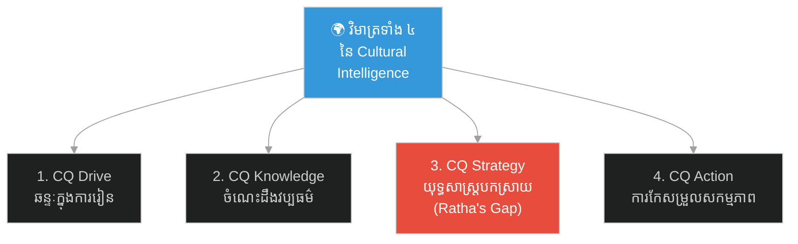
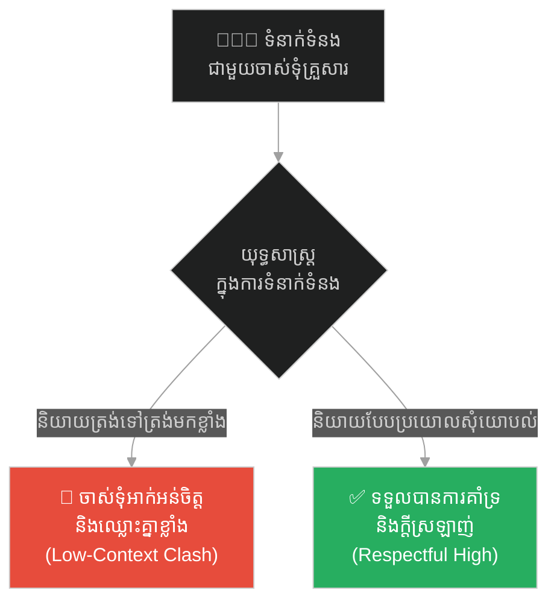
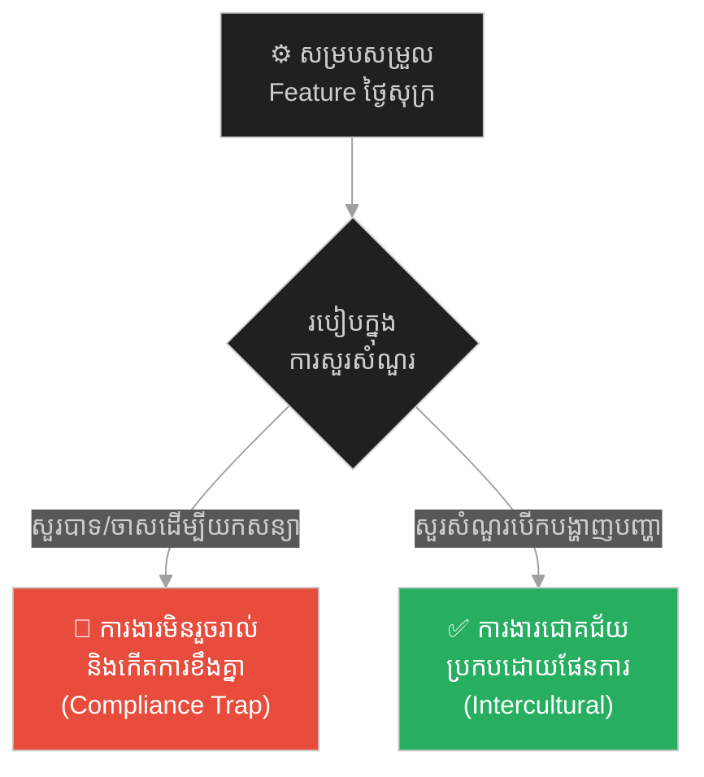
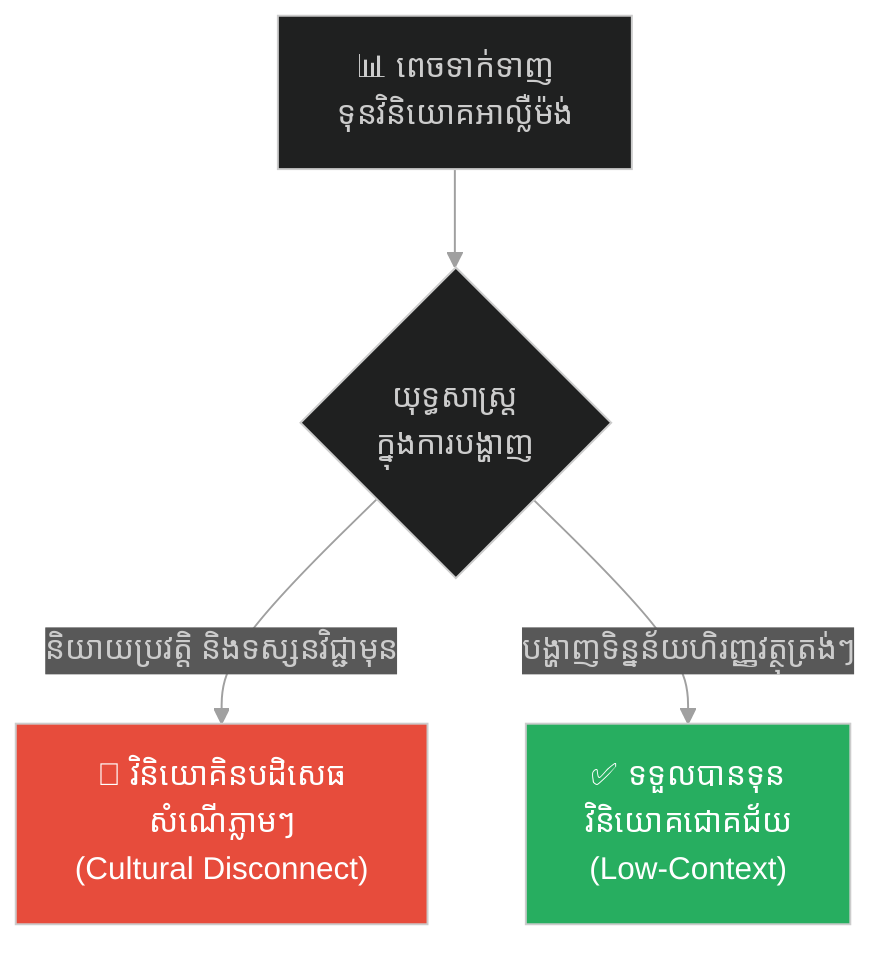
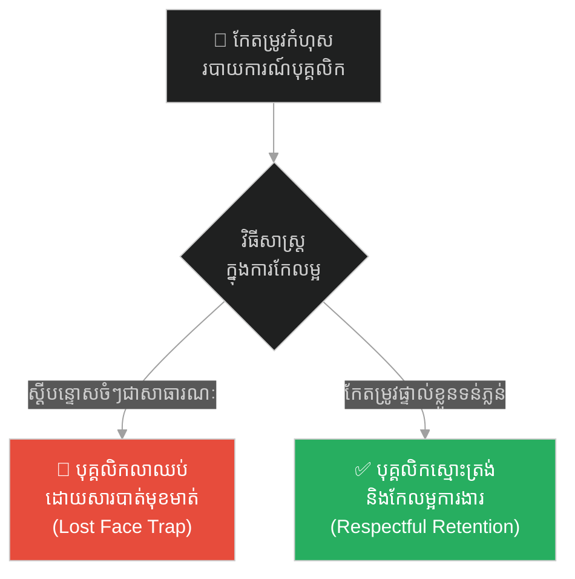
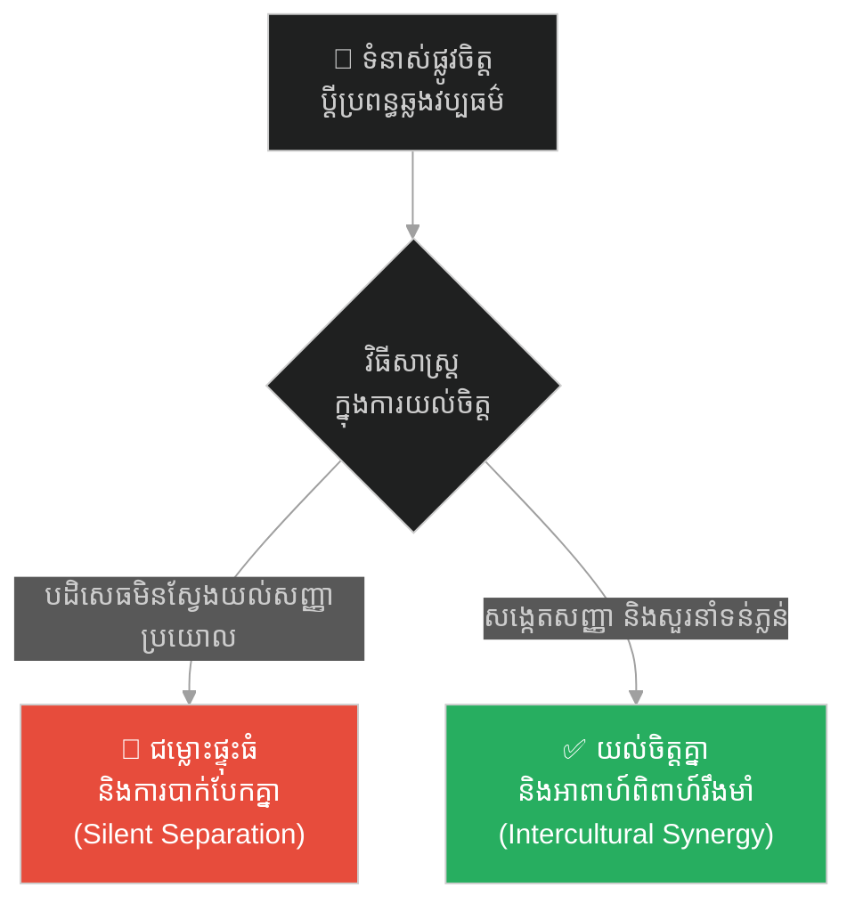
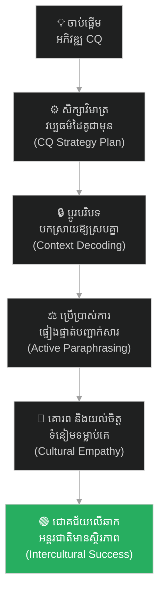

# ២៥៩ — ឯកអគ្គរាជទូត និងភាពស្ងៀមស្ងាត់ (The Ambassador and the Silence)៖ ការទំនាក់ទំនងឆ្លងវប្បធម៌ និងកម្លាំងនៃបញ្ញាខាងវប្បធម៌

**Author:** ichamrong  
**Date:** 2026-05-26  
**Tags:** #intercultural-communication #hofstede #high-low-context #cultural-intelligence #global-management #business-sustainability  
**Category:** Business Sustainability  
**Read Time:** ~15 min  

---

## 📌 មាតិកា (Table of Contents)
- [អន្ទាក់ផ្លូវចិត្ត / វិបត្តិធុរកិច្ច (The Dilemma / The Trap)](#0)
- [១. រឿងនិទានប្រៀបធៀប៖ ឯកអគ្គរាជទូត រដ្ឋា និងភាពស្ងៀមស្ងាត់នៅតូក្យូ (The Parable of Ratha and the Tokyo Silence)](#1)
  - [លិខិតយល់ព្រមបន្ទាប់ពីព្យុះស្ងប់ស្ងាត់ (The Day After: The Silent Success)](#1-1)
- [២. បញ្ហា៖ គម្លាតទំនាក់ទំនង និងបញ្ញាខាងវប្បធម៌ (The Issue: Communication Gaps and Cultural Intelligence)](#2)
- [៣. ឧទាហរណ៍ជាក់ស្តែងក្នុងពិភពពិត (Real World Examples)](#3)
  - [ឧទាហរណ៍ទី ១ — កម្រិតស្រាល (គ្រួសារ)៖ ការប្រាស្រ័យទាក់ទងបែបបង្កប់ន័យជាមួយចាស់ទុំ (The High-Context In-Law Dynamic)](#3-1)
  - [ឧទាហរណ៍ទី ២ — កម្រិតមធ្យម (បច្ចេកទេស)៖ ទំនាស់បកស្រាយពាក្យ «បាទ/ចាស» ក្នុងក្រុមកូដចម្រុះជាតិសាសន៍ (The Global Dev Team 'Yes' Misunderstanding)](#3-2)
  - [ឧទាហរណ៍ទី ៣ — កម្រិតមធ្យម (ធុរកិច្ច)៖ ការប្រជុំពេចចរកទុនរវាង Startup ខ្មែរ និងស្ថាប័នវិនិយោគអាល្លឺម៉ង់ (The Direct vs Indirect VC Pitch)](#3-3)
  - [ឧទាហរណ៍ទី ៤ — កម្រិតមធ្យម (សង្គម/គ្រប់គ្រង)៖ អ្នកគ្រប់គ្រងបរទេស និងការរក្សាមុខមាត់របស់បុគ្គលិកខ្មែរ (The Expat Manager & Saving Face Principle)](#3-4)
  - [ឧទាហរណ៍ទី ៥ — កម្រិតធ្ងន់ (ទំនាក់ទំនង)៖ អាពាហ៍ពិពាហ៍ឆ្លងវប្បធម៌ និងការសម្តែងអារម្មណ៍ (The Cross-Cultural Marriage & Emotional Expression)](#3-5)
- [៤. ដំណោះស្រាយទូទៅ៖ ការអភិវឌ្ឍបញ្ញាខាងវប្បធម៌ និងការសម្របសម្រួលបរិបទ (The General Solution: Developing CQ & Context Decoding)](#4)
- [សេចក្តីសន្និដ្ឋាន (Conclusion)](#5)
- [ឯកសារយោង (References)](#6)
- [Related Posts / Course Link](#7)

---

## អន្ទាក់ផ្លូវចិត្ត / វិបត្តិធុរកិច្ច (The Dilemma / The Trap)

នៅក្នុងយុគសម័យសកលភាវូបនីយកម្ម និងការធ្វើពាណិជ្ជកម្មអន្តរជាតិ អន្ទាក់ផ្លូវចិត្តដ៏គ្រោះថ្នាក់បំផុតមួយរបស់ថ្នាក់ដឹកនាំ និងអ្នកគ្រប់គ្រងគឺ **«ការយកស្តង់ដារវប្បធម៌ខ្លួនឯងទៅវាយតម្លៃអ្នកដទៃ» (Self-Reference Criterion - SRC)**。 មនុស្សភាគច្រើនគិតថា៖ *«របៀបដែលយើងប្រាស្រ័យទាក់ទងគ្នា និងបង្ហាញសញ្ញាអារម្មណ៍នៅក្នុងវប្បធម៌របស់យើង គឺត្រូវតែមានន័យដូចគ្នានៅគ្រប់ទីកន្លែងលើពិភពលោក»*。 

កង្វះខាត **បញ្ញាខាងវប្បធម៌ (Cultural Intelligence - CQ)** នេះ បង្កើតឱ្យមាន «ចំណុចងងឹត» ក្នុងការទំនាក់ទំនង ដែលនាំទៅរកការយល់ច្រឡំ ការបាត់បង់ឱកាសពាណិជ្ជកម្ម និងការបាក់បែកសម្ព័ន្ធភាពយុទ្ធសាស្ត្រ។

*   **ផ្លូវងងឹត (Failure Path)** — ការបកស្រាយសញ្ញាទំនាក់ទំនងខុស (Misdecoding Context) ផ្អែកលើការយល់ឃើញផ្ទាល់ខ្លួន ដែលនាំទៅរកការភ័យខ្លាច ការធ្វើសហសម្បទានដែលមិនចាំបាច់ និងការបរាជ័យក្នុងការចរចា។
*   **ផ្លូវពន្លឺ (Success Path)** — ការអភិវឌ្ឍបញ្ញាខាងវប្បធម៌ខ្ពស់ (High CQ Strategy) ការយល់ដឹងពីវប្បធម៌បរិបទខ្ពស់/ទាប (High/Low Context) និងការសម្របសម្រួលឥរិយាបថដើម្បីកសាងទំនុកចិត្តអន្តរវប្បធម៌។

ដើម្បីស្វែងយល់ពីអាថ៌កំបាំងនៃការទំនាក់ទំនងឆ្លងវប្បធម៌ នេះជាផែនទីបង្ហាញផ្លូវ៖
1. **រឿងនិទានប្រៀបធៀប (The Parable)** — វិបត្តិ និងការបកស្រាយខុសចំពោះភាពស្ងៀមស្ងាត់របស់ឯកអគ្គរាជទូត រដ្ឋា ក្នុងបន្ទប់ចរចានៅតូក្យូ។
2. **បញ្ហា (The Issue)** — ការវិភាគទ្រឹស្តីវិមាត្រវប្បធម៌ទាំង ៦ របស់ Hofstede, ទំនាក់ទំនង High/Low Context របស់ Hall និងផែនទីវប្បធម៌របស់ Erin Meyer។
3. **ឧទាហរណ៍ជាក់ស្តែងក្នុងពិភពពិត (Real World Examples)** — ករណីសិក្សា ៥ កម្រិត ចាប់ពីកម្រិតគ្រួសាររហូតដល់ទំនាក់ទំនងគូស្រករឆ្លងវប្បធម៌។
4. **ដំណោះស្រាយទូទៅ (The General Solution)** — ជំហានជាក់ស្តែងក្នុងការអភិវឌ្ឍសមត្ថភាព CQ ទាំងបួនវិមាត្រ ដើម្បីជោគជ័យលើឆាកអន្តរជាតិ។

---

## ១. រឿងនិទានប្រៀបធៀប៖ ឯកអគ្គរាជទូត រដ្ឋា និងភាពស្ងៀមស្ងាត់នៅតូក្យូ (The Parable of Ratha and the Tokyo Silence)

នាសម័យទំនើប មានឯកអគ្គរាជទូត និងជាតំណាងពាណិជ្ជកម្មជាន់ខ្ពស់កម្ពុជាមួយរូបឈ្មោះ **រដ្ឋា (Ratha)**។ គាត់ទទួលបានបេសកកម្មដ៏សំខាន់មួយ គឺត្រូវដឹកនាំប្រតិភូធ្វើដំណើរទៅកាន់ទីក្រុងតូក្យូ ប្រទេសជប៉ុន ដើម្បីចរចាកិច្ចព្រមព្រៀងដៃគូយុទ្ធសាស្ត្រនាំចេញកសិផលសរីរាង្គទំហំរាប់លានដុល្លារ ជាមួយសាជីវកម្មយក្សជប៉ុន។

រដ្ឋា ជាមនុស្សដែលទទួលបានការអប់រំ និងធ្លាប់ធ្វើការងារជាមួយដៃគូមកពីបស្ចិមប្រទេស (Low-Context Communication) ដែលចូលចិត្តភាពត្រង់ទៅត្រង់មក ការបង្ហាញយោបល់លឿនៗ និងការជជែកដេញដោលខ្លាំងក្លា។

នៅក្នុងបន្ទប់ចរចាដ៏ស្ងប់ស្ងាត់ និងមានរបៀបរៀបរយខ្ពស់នៅតូក្យូ រដ្ឋា បានឡើងធ្វើបទបង្ហាញ (Pitching) យ៉ាងក្បោះក្បាយ ជឿជាក់ និងមានថាមពលខ្លាំងខ្លាបំផុត។ ពេញមួយពេលបង្ហាញនោះ ក្រុមប្រឹក្សាភិបាលជប៉ុនទាំង ១០ រូប គ្រាន់តែអង្គុយត្រង់ខ្លួន ស្តាប់យ៉ាងយកចិត្តទុកដាក់ និងធ្មេចភ្នែកតិចៗម្តងម្កាល ដោយមិនបញ្ចេញមតិ ឬកាត់សម្តីរបស់ រដ្ឋា សូម្បីតែមួយម៉ាត់។

នៅពេល រដ្ឋា បញ្ចប់បទបង្ហាញ គាត់បានសួរនាំដោយស្នាមញញឹមថា៖ *«តើអស់លោកមានយោបល់ ឬសំណួរអ្វីខ្លះចំពោះសំណើដ៏ល្អឥតខ្ចោះនេះ?»*

ភ្លាមៗនោះ ស្ថានភាពក្នុងបន្ទប់ចរចាទាំងមូលបានធ្លាក់ចូលទៅក្នុង **«ភាពស្ងៀមស្ងាត់ ១០០%» (Complete Silence) អស់រយៈពេល ៣ នាទីពេញ**។ គ្មានអ្នកណាឆ្លើយ គ្មានអ្នកណានិយាយ ពួកគេគ្រាន់តែឱនក្បាលតិចៗ និងសម្លឹងមើលឯកសារ។

នៅក្នុងវប្បធម៌ទំនាក់ទំនង និងការចរចារបស់ រដ្ឋា ភាពស្ងៀមស្ងាត់យូរខុសធម្មតាបែបនេះ ត្រូវបានខួរក្បាលរបស់គាត់បកស្រាយស្វ័យប្រវត្តថាជា **«ការបដិសេធទាំងស្រុង»** ឬជា **«ភាពមិនពេញចិត្តយ៉ាងធ្ងន់ធ្ងរ»** ចំពោះសំណើរបស់គាត់។ 

រដ្ឋា កើតក្តីភ័យស្លន់ស្លោ និងថប់បារម្ភយ៉ាងខ្លាំង។ ដោយចង់ស្រោចស្រង់ស្ថានភាព គាត់ក៏ប្រញាប់ប្រញាល់និយាយពន្យល់សារជាថ្មី បន្ថែមព័ត៌មានលម្អិត ហើយថែមទាំងបានប្រកាស **បញ្ចុះតម្លៃនាំចេញ ៥% ភ្លាមៗ និងសន្យាផ្តល់ការធានាដឹកជញ្ជូនឥតគិតថ្លៃ** ដែលជាការធ្វើសហសម្បទាន (Concession) ដ៏ធំធេងដោយមិនចាំបាច់សោះឡើយ គ្រាន់តែដើម្បីបំបែកភាពស្ងាត់ជ្រងំនោះ។

ប្រធានប្រតិភូជប៉ុនបានឱនក្បាលតិចៗ រួចឆ្លើយយ៉ាងស្រទន់ថា៖ *«សូមអរគុណ លោករដ្ឋា។ យើងខ្ញុំបានកត់ត្រាទុកហើយ។ យើងនឹងពិភាក្សាគ្នាផ្ទៃក្នុងបន្ថែម»*។

រដ្ឋា ហោះហើរត្រលប់មកភ្នំពេញវិញដោយអារម្មណ៍បាក់ទឹកចិត្ត និងវិប្បដិសារី ព្រោះគាត់គិតថាបេសកកម្មនេះបានទទួលបរាជ័យទាំងស្រុងបាត់ទៅហើយ។

---

### លិខិតយល់ព្រមបន្ទាប់ពីព្យុះស្ងប់ស្ងាត់ (The Day After: The Silent Success)

ប៉ុន្តែ ពីរថ្ងៃក្រោយមក រដ្ឋា បានទទួលទូរសារផ្លូវការមួយពីប្រធានក្រុមហ៊ុនជប៉ុន។ នៅពេលបើកអាន គាត់ស្រឡាំងកាំងយ៉ាងខ្លាំង ព្រោះវាជា **លិខិតយល់ព្រមព្រៀងផ្លូវការ (Formal Acceptance Agreement)** លើគ្រប់ចំណុចនៃសំណើដំបូងរបស់គាត់ ព្រមទាំងទទួលបានការបញ្ចុះតម្លៃ ៥% ដែលគាត់បានបន្ថែមដោយខ្លួនឯងនោះទៀតផង!

យុវជនម្នាក់នៅក្នុងក្រុមការងាររបស់ រដ្ឋា ដែលធ្លាប់សិក្សានៅប្រទេសជប៉ុន បានពន្យល់ប្រាប់គាត់ថា៖ 

> **«លោករដ្ឋា! នៅក្នុងវប្បធម៌បរិបទខ្ពស់ (High-Context) របស់ជប៉ុន ភាពស្ងៀមស្ងាត់ ៣ នាទីនោះ មិនមែនជាការបដិសេធឡើយ។ ផ្ទុយទៅវិញ វាគឺជាការបង្ហាញការគោរពដ៏ខ្ពង់ខ្ពស់បំផុត (Ma - 間)។ វាមានន័យថា សំណើរបស់លោកមានគុណតម្លៃខ្ពស់ សក្តិសមនឹងឱ្យពួកគេចំណាយពេលវេលាគិតពិចារណាក្នុងភាពស្ងប់ស្ងាត់។ ការដែលលោកភ័យស្លន់ស្លោ និងប្រញាប់និយាយបន្ថែម ធ្វើឱ្យយើងខាតបង់ចំណេញ ៥% ដោយឥតប្រយោជន៍ ព្រោះតែគម្លាត CQ នេះឯង»។**

រដ្ឋា ដកដង្ហើមធំទាំងធូរទ្រូងផង និងទទួលបានមេរៀនដ៏មានតម្លៃបំផុតពេញមួយជីវិតការងាររបស់គាត់ផង។

---

## ២. បញ្ហា៖ គម្លាតទំនាក់ទំនង និងបញ្ញាខាងវប្បធម៌ (The Issue: Communication Gaps and Cultural Intelligence)

វិបត្តិរបស់ រដ្ឋា ឆ្លុះបញ្ចាំងពីទ្រឹស្តីទំនាក់ទំនងឆ្លងវប្បធម៌ (Intercultural Communication Theory) សំខាន់ៗចំនួន ៣ ៖

### ១. ទ្រឹស្តីទំនាក់ទំនងបរិបទខ្ពស់ និងបរិបទាប របស់ Hall (Edward T. Hall's Context Theory)
*   **Low-Context Communication (បរិបទទាប - ដូចជា អាមេរិក អាល្លឺម៉ង់)**៖ អត្ថន័យសារព័ត៌មានត្រូវបានបញ្ជាក់យ៉ាងច្បាស់ៗ ត្រង់ទៅត្រង់មក តាមពាក្យសម្តីសម្តែង (Explicit)។ ភាពស្ងៀមស្ងាត់ជារឿយៗបង្ហាញពីភាពមិនស្រួលចិត្ត ឬការបដិសេធ។
*   **High-Context Communication (បរិបទខ្ពស់ - ដូចជា ជប៉ុន ខ្មែរ ចិន)**៖ អត្ថន័យភាគច្រើនបង្កប់នៅពីក្រោយបរិបទ ឋានានុក្រម ទំនាក់ទំនងមិនមែនពាក្យសម្តី និងភាពស្ងប់ស្ងាត់ (Implicit)។ អ្នកស្តាប់ត្រូវចេះ «អាននៅចន្លោះបន្ទាត់អក្សរ» (Read Between the Lines)。

### ២. វិមាត្រវប្បធម៌ទាំង ៦ របស់ Hofstede (Hofstede's Cultural Dimensions)
*   **គម្លាតអំណាច (Power Distance - PDI)**៖ ប្រទេសកម្ពុជា (៩០) និងជប៉ុន (៥៤) មានគម្លាតអំណាចខ្ពស់ ដែលមានន័យថាសមាជិកគោរពឋានានុក្រម និងស្ដាប់បង្គាប់ថ្នាក់ដឹកនាំខ្លាំង។
*   **ការជៀសវាងភាពមិនប្រាកដប្រជា (Uncertainty Avoidance - UAI)**៖ ជប៉ុនមានពិន្ទុ UAI រហូតដល់ ៩២ (ខ្ពស់ខ្លាំង) ដែលមានន័យថាពួកគេត្រូវការពេលវេលាត្រួតពិនិត្យទិន្នន័យច្បាស់លាស់ ផែនការលម្អិត និងស្អប់ការសម្រេចចិត្តប្រញាប់ប្រញាល់។

### ៣. ម៉ូដែលបញ្ញាខាងវប្បធម៌ទាំង ៤ វិមាត្រ (The Four CQ Capabilities)
បញ្ញាខាងវប្បធម៌ (Cultural Intelligence) គឺជាសមត្ថភាពរបស់បុគ្គលក្នុងការបំពេញការងារ និងទំនាក់ទំនងប្រកបដោយប្រសិទ្ធភាពក្នុងបរិស្ថានចម្រុះវប្បធម៌។ វាមាន ៤ វិមាត្រ៖
1.  **CQ Drive (ការលើកទឹកចិត្ត)**៖ ឆន្ទៈ និងភាពជឿជាក់ក្នុងការរៀនសូត្រពីវប្បធម៌ថ្មី។
2.  **CQ Knowledge (ចំណេះដឹង)**៖ ការយល់ដឹងពីការពិត ទំនៀមទម្លាប់ និងភាសារបស់វប្បធម៌ផ្សេងៗ។
3.  **CQ Strategy (យុទ្ធសាស្ត្រ/មេតាកុកនីទីវ)**៖ សមត្ថភាពក្នុងការរៀបចំផែនការ ត្រួតពិនិត្យ និងកែសម្រួលផ្នត់គំនិតពេលប្រឈមមុខនឹងវប្បធម៌ខុសគ្នា (ចំណុចដែល រដ្ឋា ខ្វះខាត)。
4.  **CQ Action (សកម្មភាព)**៖ សមត្ថភាពកែសម្រួលពាក្យសម្តី កាយវិការ និងភាសាកាយវិការឱ្យស្របតាមស្ថានភាពជាក់ស្តែង។

---

## ៣. ឧទាហរណ៍ជាក់ស្តែងក្នុងពិភពពិត (Real World Examples)

ខាងក្រោមនេះជាករណីសិក្សា ៥ កម្រិតនៃការអនុវត្តបញ្ញាខាងវប្បធម៌ក្នុងការងារ និងជីវិតប្រតិបត្តិការ៖

---

### ឧទាហរណ៍ទី ១ — កម្រិតស្រាល (គ្រួសារ)៖ ការប្រាស្រ័យទាក់ទងបែបបង្កប់ន័យជាមួយចាស់ទុំ (The High-Context In-Law Dynamic)

**ស្ថានភាព៖** យុវជនម្នាក់ចរចាជាមួយ ឪពុកម្តាយក្មេកបែបបុរាណ ដើម្បីសុំអនុញ្ញាតនាំប្រពន្ធទៅរស់នៅខេត្តឆ្ងាយ។
*   **ការទាក់ទងបែបខ្វះ CQ (Low-Context Approach)៖** គាត់និយាយចំៗ និងរឹងត្អឹង៖ *«ម៉ាក់ប៉ា! ខែក្រោយខ្ញុំនឹងនាំកូនស្រីម៉ាក់ប៉ាទៅរស់នៅបាត់ដំបងហើយ ព្រោះនៅទីនោះមានឱកាសការងារល្អជាង»*។ ឪពុកម្តាយក្មេកមានអារម្មណ៍ថាត្រូវគេមិនគោរព ជាន់ឈ្លីមុខមាត់ និងកើតការអាក់អន់ចិត្តយ៉ាងខ្លាំង។
*   **ការទាក់ទងបែបមាន CQ (High-Context Approach)៖** គាត់នាំប្រពន្ធមកសួរសុខទុក្ខ ជូនកាដូ និងនិយាយបែបប្រយោល និងឱនលំទោន៖ *«ម៉ាក់ប៉ា! នៅបាត់ដំបងមានឱកាសការងារមួយដែលល្អសម្រាប់អនាគត។ ខ្ញុំចង់សុំយោបល់ និងការណែនាំពីម៉ាក់ប៉ា តើយើងខ្ញុំគួររៀបចំខ្លួនរបៀបណាទើបសមរម្យ?»* ឪពុកម្តាយក្មេកមានអារម្មណ៍ថាទទួលបានការគោរព និងយល់ព្រមគាំទ្រភ្លាមៗ។

---

### ឧទាហរណ៍ទី ២ — កម្រិតមធ្យម (បច្ចេកទេស)៖ ទំនាស់បកស្រាយពាក្យ «បាទ/ចាស» ក្នុងក្រុមកូដចម្រុះជាតិសាសន៍ (The Global Dev Team 'Yes' Misunderstanding)

**ស្ថានភាព៖** Engineering Manager មកពី Silicon Valley (Low-Context) គ្រប់គ្រងក្រុមកូដឌីជីថលនៅអាស៊ីអាគ្នេយ៍ (High-Context)។
*   **ការបកស្រាយខុស (No CQ Strategy)៖** Manager សួរថា៖ *«តើយើងអាចបញ្ចប់ Feature គណនេយ្យនេះនៅថ្ងៃសុក្របានទេ?»* បុគ្គលិកអាស៊ីងក់ក្បាលរួចឆ្លើយថា៖ *«បាទ/ចាស»*។ ដល់ថ្ងៃសុក្រ ការងារមិនទាន់រួចរាល់ឡើយ។ Manager ខឹងសម្បារយ៉ាងខ្លាំង និងចោទថាបុគ្គលិកភូតភរ។ តាមពិត ក្នុងវប្បធម៌អាស៊ី ពាក្យ «បាទ/ចាស» ជារឿយៗគ្រាន់តែមានន័យថា *«ខ្ញុំបានឮ និងយល់សំណួររបស់លោកហើយ»* មិនមែនមានន័យថា *«ខ្ញុំសន្យាថានឹងធ្វើវាឱ្យរួចរាល់នោះទេ»* (ព្រោះចង់រក្សាមុខមាត់ មិនហ៊ានបដិសេធចំៗ)。
*   **ការគ្រប់គ្រងបែបមាន CQ (Decoded Strategy)៖** Manager ផ្លាស់ប្តូរការសួរនាំដោយប្រើសំណួរបើកចំហរ៖ *«តើយើងត្រូវការធនធាន ឬជួបបញ្ហាប្រឈមអ្វីខ្លះដែលអាចធ្វើឱ្យ Feature នេះមិនទាន់រួចរាល់នៅថ្ងៃសុក្រ? តើយើងអាចរួមគ្នាជួយដោះស្រាយវាដោយរបៀបណា?»* ក្រុមការងារហ៊ានរាយការណ៍ពីបញ្ហាជាក់ស្តែងភ្លាមៗ។

---

### ឧទាហរណ៍ទី ៣ — កម្រិតមធ្យម (ធុរកិច្ច)៖ ការប្រជុំពេចចរកទុនរវាង Startup ខ្មែរ និងស្ថាប័នវិនិយោគអាល្លឺម៉ង់ (The Direct vs Indirect VC Pitch)

**ស្ថានភាព៖** ស្ថាបនិក Startup កសិកម្មខ្មែរម្នាក់ ធ្វើបទបង្ហាញទាក់ទាញទុនពីស្ថាប័ន VC ប្រទេសអាល្លឺម៉ង់ (Low-Context, Task-Oriented)。
*   **ការទាក់ទងខ្វះ CQ (Indirect Narrative)៖** Founder ចំណាយពេល ៣០ នាទីដំបូងនិយាយរៀបរាប់ពីប្រវត្តិគ្រួសារ ទំនាក់ទំនងមិត្តភាព និងទស្សនវិជ្ជាជីវិតកសិករខ្មែរ ដោយមិនទាន់បង្ហាញទិន្នន័យហិរញ្ញវត្ថុ និងគំរូអាជីវកម្មច្បាស់លាស់។ វិនិយោគិនអាល្លឺម៉ង់មានអារម្មណ៍ធុញទ្រាន់ យល់ថាខ្វះវិជ្ជាជីវៈ និងសម្រេចចិត្តបដិសេធភ្លាមៗ។
*   **ការទាក់ទងមាន CQ (Direct Business Pitch)៖** Founder ផ្លាស់ប្តូរការ Pitching ភ្លាមៗ៖ បើកទំព័រដំបូងបង្ហាញទិន្នន័យចំណូល (traction) គំរូអាជីវកម្ម (Business model) គណនេយ្យហិរញ្ញវត្ថុ និងផែនការត្រឡប់មកវិញនៃការវិនិយោគ (ROI) យ៉ាងត្រង់ទៅត្រង់មក រួចទើបបញ្ច្រាបទស្សនវិជ្ជាសង្គមនៅចុងបញ្ចប់។ ទទួលបានការចាប់អារម្មណ៍ និងវិនិយោគជោគជ័យ។

---

### ឧទាហរណ៍ទី ៤ — កម្រិតមធ្យម (សង្គម/គ្រប់គ្រង)៖ អ្នកគ្រប់គ្រងបរទេស និងការរក្សាមុខមាត់របស់បុគ្គលិកខ្មែរ (The Expat Manager & Saving Face Principle)

**ស្ថានភាព៖** នាយកប្រតិបត្តិជនជាតិអាមេរិក (Low-Context, Direct critique) ចង់កែតម្រូវកំហុសរបាយការណ៍របស់ប្រធានផ្នែកគណនេយ្យខ្មែរ។
*   **ការគ្រប់គ្រងបែបខ្វះ CQ (Public Confrontation)៖** នាយកប្រតិបត្តិស្រែកស្តីបន្ទោស និងកែតម្រូវកំហុសរបស់ប្រធានផ្នែកគណនេយ្យចំៗនៅចំពោះមុខបុគ្គលិកទាំងអស់ក្នុងបន្ទប់ប្រជុំធំ។ ប្រធានផ្នែកមានអារម្មណ៍អាម៉ាស់យ៉ាងខ្លាំង ត្រូវបាត់បង់មុខមាត់ (Lost Face) និងសម្រេចចិត្តដាក់ពាក្យលាឈប់ពីការងារនៅសប្តាហ៍បន្ទាប់។
*   **ការគ្រប់គ្រងបែបមាន CQ (Private Saving Face)៖** នាយកប្រតិបត្តិហៅប្រធានផ្នែកមកជួបជជែកផ្ទាល់ខ្លួននៅក្នុងបន្ទប់បិទជិត (1-on-1 meeting) សរសើរពីចំណុចល្អរបស់គាត់ជាមុន រួចទើបកែតម្រូវកំហុសរបាយការណ៍ដោយទន់ភ្លន់ និងរក្សាកិត្តិយសរបស់គាត់។ ប្រធានផ្នែកកោតសរសើរ ខិតខំកែលម្អការងារ និងស្មោះត្រង់ជាមួយក្រុមហ៊ុនយូរអង្វែង។

---

### ឧទាហរណ៍ទី ៥ — កម្រិតធ្ងន់ (ទំនាក់ទំនង)៖ អាពាហ៍ពិពាហ៍ឆ្លងវប្បធម៌ និងការសម្តែងអារម្មណ៍ (The Cross-Cultural Marriage & Emotional Expression)

**ស្ថានភាព៖** គូស្វាមីភរិយាឆ្លងវប្បធម៌ (ប្តីជនជាតិអាមេរិក Low-Context និងប្រពន្ធជនជាតិខ្មែរ High-Context) ជួបទំនាស់ផ្លូវចិត្ត។
*   **ការខ្វះ CQ សម្របសម្រួល (Silent Crisis)៖** ប្រពន្ធមានការថប់បារម្ភ និងអាក់អន់ចិត្ត តែមិននិយាយចំៗឡើយ នាងគ្រាន់តែដកដង្ហើមធំ និងធ្វើការងារផ្ទះទាំងស្ងប់ស្ងាត់ (High-Context signal)។ ប្តីបកស្រាយថាគ្មានបញ្ហាអ្វីឡើយព្រោះនាងមិននិយាយអ្វីសោះ (Low-Context decoding)។ កំហឹងលាក់កំបាំងកាន់តែកើនឡើង រហូតដល់ផ្ទុះជម្លោះធំនិងបែកបាក់។
*   **ការកសាងសមត្ថភាព CQ (Intercultural Harmony)៖** ប្តីរៀនសង្កេតសញ្ញា និងសួរនាំទន់ភ្លន់៖ *«អូនសម្លាញ់! ខ្ញុំមើលឃើញថាអូនហាក់ដូចជាកំពុងហត់នឿយ និងមានការបារម្ភក្នុងចិត្ត។ តើមានរឿងអ្វីដែលខ្ញុំអាចជួយសម្រាលបន្ទុកអូនបានទេ?»* ប្រពន្ធបើកចិត្តជជែកបង្ហាញអារម្មណ៍ពិត។ ជីវិតអាពាហ៍ពិពាហ៍មានសន្តិភាព និងយូរអង្វែង។

---

## ៤. ដំណោះស្រាយទូទៅ៖ ការអភិវឌ្ឍបញ្ញាខាងវប្បធម៌ និងការសម្របសម្រួលបរិបទ (The General Solution: Developing CQ & Context Decoding)

ដើម្បីការពារទំនាក់ទំនងរបស់អ្នកពីវិបត្តិនៃការយល់ខុសឆ្លងវប្បធម៌ និងជោគជ័យក្នុងការដឹកនាំសហគ្រាសអន្តរជាតិ ចូរអនុវត្តយុទ្ធសាស្ត្រគន្លឹះទាំងបួននេះ ៖

### ១. អភិវឌ្ឍសមត្ថភាព «CQ Strategy» ជានិច្ច
មុនពេលធ្វើការទំនាក់ទំនង ឬចរចាជាមួយដៃគូមកពីវប្បធម៌ផ្សេង ចូរឈប់សន្មតថាពួកគេគិតដូចអ្នក។ ចូររៀបចំផែនការ សិក្សាពីប្រព័ន្ធវប្បធម៌របស់ពួកគេ (Hofstede Dimensions/Culture Map) និងត្រៀមលក្ខណៈកែសម្រួលការបកស្រាយរបស់អ្នក ដូចជាការយល់ដឹងពីអត្ថន័យនៃភាពស្ងៀមស្ងាត់របស់ជប៉ុន។

### ២. រៀនប្តូររវាង High-Context និង Low-Context Decoding
*   នៅពេលធ្វើការជាមួយដៃគូ **High-Context**៖ ចូរសង្កេតមើល ភាសាកាយវិការ ឋានានុក្រម ភាពស្ងប់ស្ងាត់ និងសួរសំណួរដោយទន់ភ្លន់ដើម្បីបើកបង្ហាញតម្រូវការ។
*   នៅពេលធ្វើការជាមួយដៃគូ **Low-Context**៖ ចូរនិយាយឱ្យច្បាស់ៗ ត្រង់ទៅត្រង់មក កំណត់ទិន្នន័យជាក់លាក់ និងកុំបារម្ភពីការបញ្ចេញមតិខ្វែងគំនិតគ្នា។

### ៣. អនុវត្តយន្តការ «Active Listening & Paraphrasing»
ដើម្បីកាត់បន្ថយគម្លាតនៃការយល់ច្រឡំ ចូរប្រើប្រាស់ការផ្ទៀងផ្ទាត់ឡើងវិញ៖ *«ដើម្បីឱ្យប្រាកដថាខ្ញុំយល់បានត្រឹមត្រូវ តើចំណុចដែលលោកមានប្រសាសន៍មិញគឺ [ចំណុច A] ត្រូវដែរឬទេ?»* វិធីនេះការពារការយល់ខុសលើកិច្ចសន្យា និងផែនការការងារ។

### ៤. កសាងទំនុកចិត្តផ្អែកលើ «Cultural Empathy»
ដកចេញនូវ Ego វប្បធម៌ផ្ទាល់ខ្លួន។ គោរពទំនៀមទម្លាប់ របៀបធ្វើការងារ និងស្ថាបត្យកម្មសម្រេចចិត្តរបស់ដៃគូ។ ការផ្តល់តម្លៃ និងការយល់ចិត្ត បង្កើតបាននូវសម្ព័ន្ធភាពពាណិជ្ជកម្មដ៏រឹងមាំ និងមាននិរន្តរភាពបំផុត។

---

## សេចក្តីសន្និដ្ឋាន (Conclusion)

> **«កម្លាំងពិតប្រាកដនៃបញ្ញាខាងវប្បធម៌ មិនមែនជាការទន្ទេញចាំច្បាប់វប្បធម៌ទាំងអស់របស់ពិភពលោកនោះឡើយ។ ប៉ុន្តែវាគឺជាភាពទន់ភ្លន់ និងភាពបន្ទាបខ្លួនផ្លូវចិត្តក្នុងការលះបង់ចោលនូវ Ego វប្បធម៌ផ្ទាល់ខ្លួន ដឹងពីរបៀបបត់បែនប្រព័ន្ធបកស្រាយឱ្យស្របតាមដៃគូ និងគោរពរាល់សញ្ញាទំនាក់ទំនង ទោះបីជាសញ្ញានោះជាភាពស្ងៀមស្ងាត់ក៏ដោយ។»**

ឯកអគ្គរាជទូត រដ្ឋា ស្ទើរតែដុតបំផ្លាញឱកាសទទួលបានកិច្ចព្រមព្រៀងដ៏ល្អឥតខ្ចោះ និងខាតបង់ថវិកា ៥% ដោយឥតប្រយោជន៍ ព្រោះតែការយកស្តង់ដារទំនាក់ទំនងបរិបទទាបរបស់ខ្លួន ទៅបកស្រាយភាពស្ងៀមស្ងាត់បែបបរិបទខ្ពស់របស់ជប៉ុន។ ភាពស្ងៀមស្ងាត់មិនមែនជាការបដិសេធឡើយ វាគឺជាកន្លែងគិតពិចារណាដ៏មានតម្លៃបំផុត។ នៅក្នុងការងារ និងជីវិតប្រតិបត្តិការអន្តរជាតិ ការអភិវឌ្ឍបញ្ញាខាងវប្បធម៌ (CQ) គឺជាជំនាញទន់ដ៏មានតម្លៃបំផុតដែលនាំមកនូវនិរន្តរភាព និងភាពជោគជ័យដ៏អស្ចារ្យ។

ចូរកុំបំបែកភាពស្ងៀមស្ងាត់ដោយភាពភ័យខ្លាច ចូរយល់ចិត្តវាដោយបន្ទាបខ្លួន។

---

## ឯកសារយោង (References)

*   **Hofstede, Geert** — *Cultures and Organizations: Software of the Mind* (3rd Edition, 2010)។ វិទ្យាសាស្ត្រគន្លឹះដែលបង្កើតទ្រឹស្តីវិមាត្រវប្បធម៌ទាំង ៦។
*   **Hall, Edward T.** — *Beyond Culture* (1976)។ ការស្រាវជ្រាវដំបូងដែលបង្កើតទ្រឹស្តី High-Context & Low-Context Communication។
*   **Meyer, Erin** — *The Culture Map: Breaking Through the Invisible Boundaries of Global Business* (2014)។ ឧបករណ៍វិភាគទិដ្ឋភាព ៨ ចំណុចនៃការងារឆ្លងវប្បធម៌ក្នុងសហគ្រាសសកល។
*   **Ang, Soon & Van Dyne, Linn** — *Handbook of Cultural Intelligence: Theory, Measurement, and Applications* (2008)។ ម៉ូដែលអភិវឌ្ឍន៍ និងវាស់វែងសមត្ថភាព CQ ទាំងបួនវិមាត្រ។
*   **Denison University Coursework** — *04 Intercultural Communication* (Year 1)។ ឯកសារយោងសម្រាប់មុខវិជ្ជាទំនាក់ទំនងឆ្លងវប្បធម៌ និងការគ្រប់គ្រងសកល។

---

## Related Posts / Course Link

*   **[04 Intercultural Communication](../../../../../colleges/denison-university/business-sustainability/cross-cutting/04-intercultural-communication.md)** — មុខវិជ្ជាទំនាក់ទំនងឆ្លងវប្បធម៌នៅ Denison University។
*   **[២៥៦ — ឈ្មួញពីរនាក់នៅព្រំដែន (The Two Merchants at the Border)](./256-the-two-merchants-at-the-border.md)** — សិល្បៈនៃការចរចាស្វែងរកផលប្រយោជន៍ និងការដោះស្រាយជម្លោះ។
*   **[២៥៧ — មេទ័ពដែលសួរសំណួរ (The General Who Asked Questions)](./257-the-general-who-asked-questions.md)** — ភាពជាអ្នកដឹកនាំ ក្រមសីលធម៌ និង Servant Leadership។
