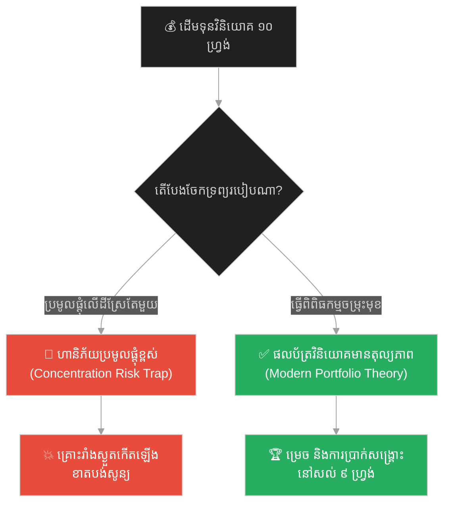
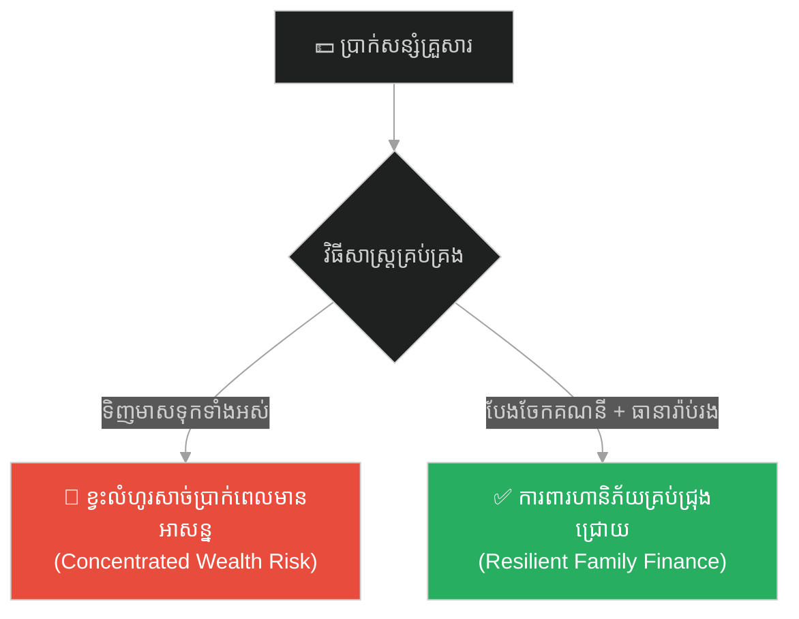
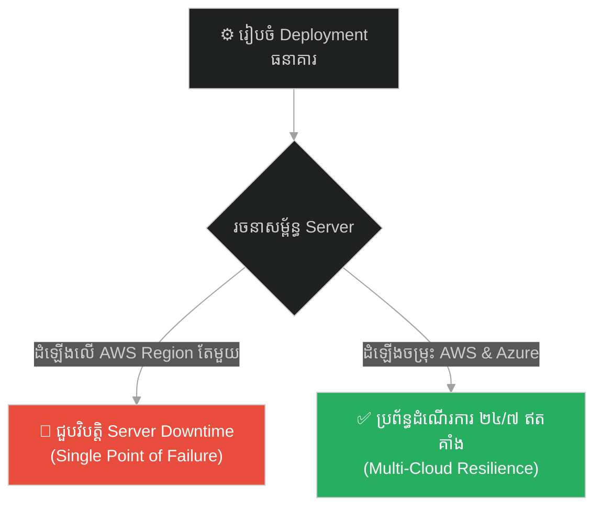
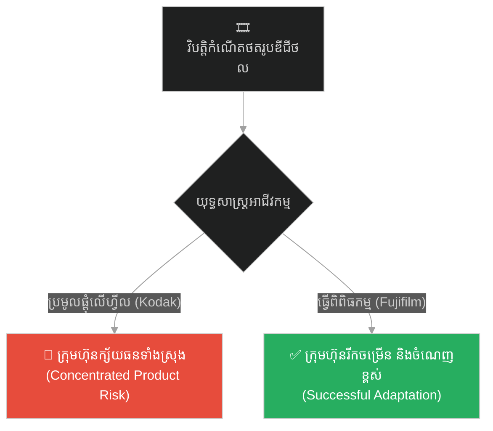
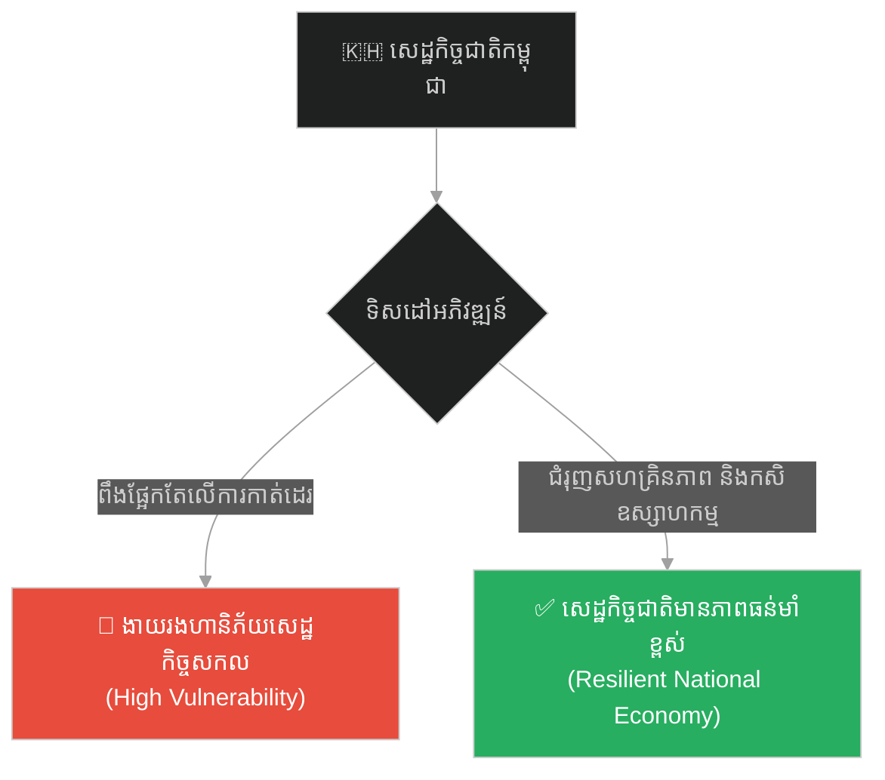
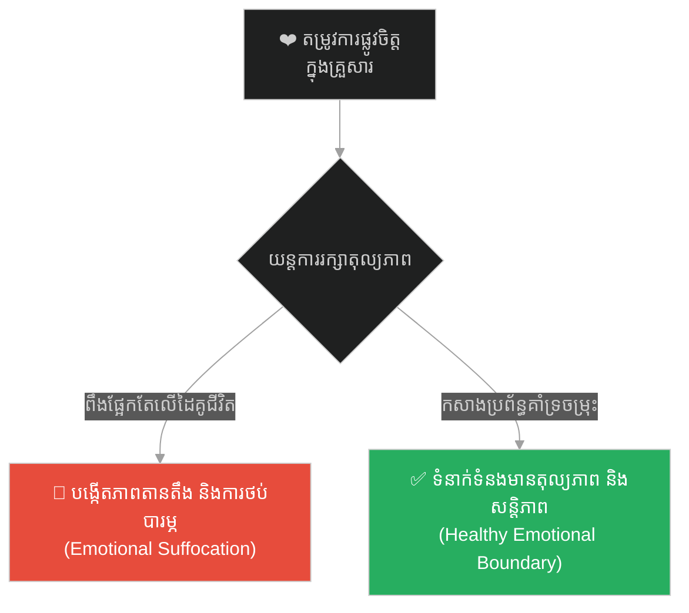
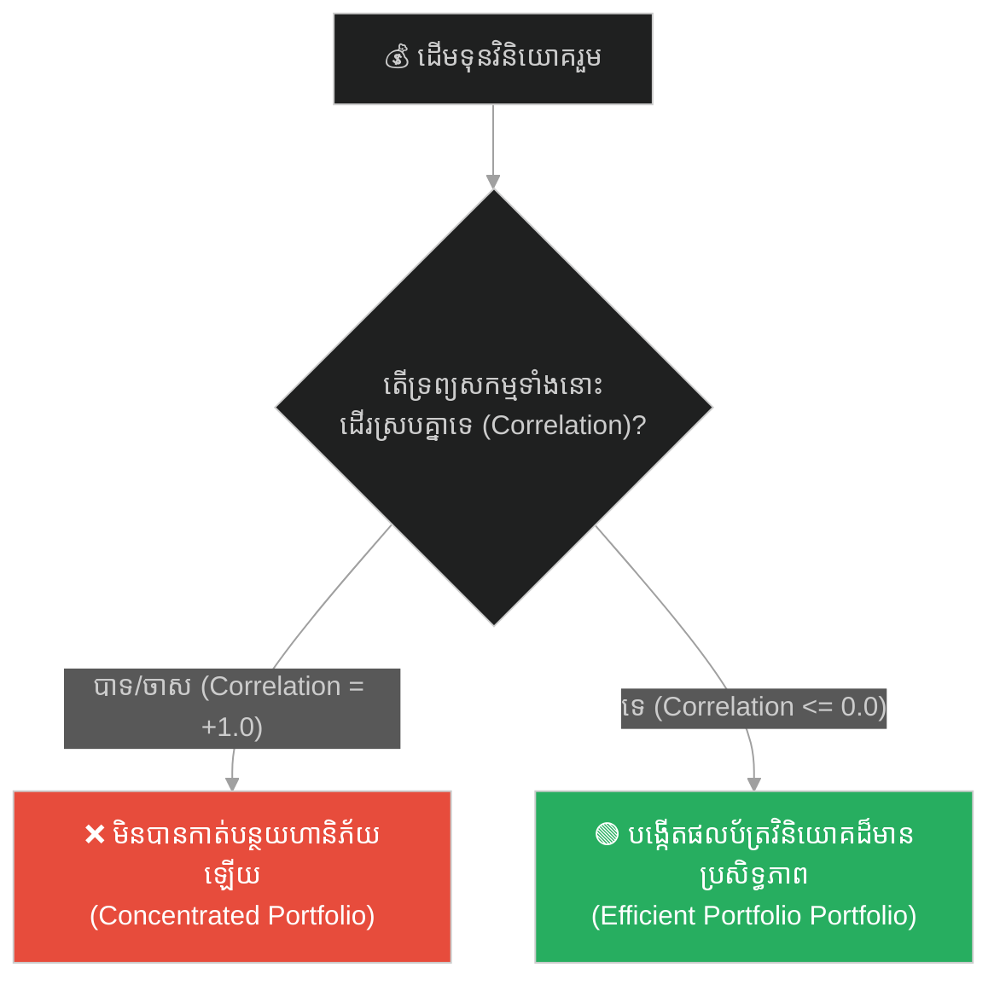

# Investments & Portfolio Theory (អ្នកវិនិយោគស្រែ និងទ្រឹស្តីផលប័ត្រវិនិយោគ)៖ ទ្រឹស្តីផលប័ត្រវិនិយោគ និងការគ្រប់គ្រងហានិភ័យ (Investments & Portfolio Theory & Modern Portfolio Theory and Capital Asset Pricing Model & The Rice Paddy Investor)

**Author:** ichamrong  
**Date:** 2026-05-26  
**Tags:** #investments #portfolio-theory #diversification #capm #risk-management #finance  
**Category:** Concepts / Parables  
**Read Time:** ~15 min  

---

## 📌 មាតិកា (Table of Contents)
- [អន្ទាក់ផ្លូវចិត្ត (The Trap)](#0)
- [១. រឿងព្រេងនិទាន៖ អ្នកវិនិយោគស្រែ និងទ្រឹស្តីផលប័ត្រវិនិយោគ (The Legend of The Rice Paddy Investor)](#1)
  - [មេរៀនគ្រោះរាំងស្ងួត និងការបែងចែកទ្រព្យសកម្ម (The Climax: Drought and Asset Diversification)](#1-1)
- [២. បញ្ហា៖ ហានិភ័យប្រមូលផ្តុំ និងទ្រឹស្តីផលប័ត្រទំនើប (The Issue: Concentration Risk and Modern Portfolio Theory)](#2)
- [៣. ឧទាហរណ៍ជាក់ស្តែងក្នុងពិភពពិត (Real World Examples)](#3)
  - [ឧទាហរណ៍ទី ១ — កម្រិតស្រាល (គ្រួសារ)៖ ការសន្សំប្រាក់សម្រាប់គ្រួសារ និងការទិញធានារ៉ាប់រង (The Family Savings and Insurance Allocation)](#3-1)
  - [ឧទាហរណ៍ទី ២ — កម្រិតមធ្យម (បច្ចេកទេស)៖ ការរចនាហេដ្ឋារចនាសម្ព័ន្ធ Multi-Cloud/Multi-Region Deployment (The Dev High-Availability Multi-Cloud Deployment)](#3-2)
  - [ឧទាហរណ៍ទី ៣ — កម្រិតមធ្យម (ធុរកិច្ច)៖ ការធ្វើពិពិធកម្មផលិតផលរបស់ក្រុមហ៊ុន Kodak ធៀបនឹង Fujifilm (The Business Diversification: Kodak vs Fujifilm)](#3-3)
  - [ឧទាហរណ៍ទី ៤ — កម្រិតមធ្យម (សង្គម/គ្រប់គ្រង)៖ ការធ្វើពិពិធកម្មសេដ្ឋកិច្ចជាតិរបស់ប្រទេសកម្ពុជាពីវិស័យកាត់ដេរ (The Management Cambodian National Economic Diversification)](#3-4)
  - [ឧទាហរណ៍ទី ៥ — កម្រិតធ្ងន់ (ទំនាក់ទំនង)៖ ការពឹងផ្អែកផ្លូវចិត្ត និងការកសាងប្រព័ន្ធគាំទ្រសង្គមរបស់គូស្រករ (The Relationship Social Support and Emotional Diversification)](#3-5)
- [៤. ដំណោះស្រាយទូទៅ៖ ការកសាងផលប័ត្រវិនិយោគដែលមានប្រសិទ្ធភាព (The General Solution: Constructing an Efficient Portfolio)](#4)
- [សេចក្តីសន្និដ្ឋាន (Conclusion)](#5)
- [ឯកសារយោង (References)](#6)
- [Related Posts](#7)

---

<a id="0"></a>
## អន្ទាក់ផ្លូវចិត្ត (The Trap)

នៅក្នុងពិភពហិរញ្ញវត្ថុ និងការគ្រប់គ្រងទ្រព្យសម្បត្តិ អន្ទាក់ផ្លូវចិត្តដ៏គ្រោះថ្នាក់បំផុតមួយគឺ **«ភាពជឿជាក់លើខ្លួនឯងហួសហេតុ និងការប្រមូលផ្តុំហានិភ័យ» (The Concentration and Overconfidence Trap)**។ អ្នកវិនិយោគថ្មីថ្មោងជារឿយៗតែងតែមើលឃើញតែសក្តានុពលប្រាក់ចំណេញខ្ពស់នៃទ្រព្យសកម្មតែមួយមុខ រួចសម្រេចចិត្តបោះទុនទាំងអស់ដែលមានចូលទៅក្នុងកន្លែងនោះ ដោយសង្ឃឹមថានឹងទទួលបានការផ្លាស់ប្តូរជីវិតភ្លាមៗ។

* **ផ្លូវងងឹត (Failure Path)** — ការដាក់ទុនទាំងអស់ទៅលើដីស្រែ ឬទ្រព្យសកម្មតែមួយកន្លែង ដែលងាយរងគ្រោះមហន្តរាយ និងការបាត់បង់ទ្រព្យសម្បត្តិទាំងស្រុង។
* **ផ្លូវពន្លឺ (Success Path)** — ការបែងចែកទ្រព្យសកម្មដែលមានការប្រែប្រួលផ្ទុយគ្នា (Low/Negative Correlation) ដើម្បីរក្សាស្ថិរភាព និងការរស់រានមានជីវិតក្នុងរាល់វិបត្តិ។

ដើម្បីយល់ដឹងពីវិធីគ្រប់គ្រងហានិភ័យ និងការរៀបចំផលប័ត្រវិនិយោគ នេះជាផែនទីបង្ហាញផ្លូវ៖
1. **រឿងព្រេងនិទាន (The Legend)** — រឿងរ៉ាវរបស់ ដារ៉ា និងពូបូរ៉ា ក្នុងការគ្រប់គ្រងទ្រព្យសម្បត្តិគ្រួសារមុនពេលគ្រោះរាំងស្ងួត។
2. **បញ្ហា (The Issue)** — ទ្រឹស្តី Modern Portfolio Theory (MPT) របស់ Markowitz និងកូដគំរូ Python បង្ហាញពីការគណនាហានិភ័យចម្រុះ។
3. **ឧទាហរណ៍ជាក់ស្តែងក្នុងពិភពពិត (Real World Examples)** — ករណីសិក្សា ៥ កម្រិត ចាប់ពីកម្រិតគ្រួសាររហូតដល់ទំនាក់ទំនងផ្លូវចិត្ត។
4. **ដំណោះស្រាយទូទៅ (The General Solution)** — ការសាងសង់ Efficient Frontier និងការអនុវត្តយុទ្ធសាស្ត្រធ្វើពិពិធកម្ម។



---

<a id="1"></a>
## ១. រឿងព្រេងនិទាន៖ អ្នកវិនិយោគស្រែ និងទ្រឹស្តីផលប័ត្រវិនិយោគ (The Legend of The Rice Paddy Investor)

**ដារ៉ា (Dara)** ជាកសិករវ័យក្មេងម្នាក់ ដែលទទួលបានមរតកជាកាក់មាសចំនួន ១០ ហ្វ្រង់ — ដែលនេះគឺជាទ្រព្យសម្បត្តិដ៏មានតម្លៃបំផុតដែលគ្រួសារគាត់ខិតខំសន្សំពីមួយជំនាន់ទៅមួយជំនាន់។ ចំពោះ ដារ៉ា ការសម្រេចចិត្តគឺមានភាពច្បាស់លាស់ណាស់ — គាត់បម្រុងនឹងចាក់លុយ **ទាំង ១០ ហ្វ្រង់នោះ** ចូលទៅទិញ **ដីស្រែដ៏ធំមួយកន្លែង** នៅក្បែរភូមិ។ គាត់គិតក្នុងចិត្តថា "មានស្រែធំ — ច្បាស់ជារកចំណូលបានច្រើន"។

អ្នកជិតខាងចាស់ទុំម្នាក់ឈ្មោះ **លោកពូ បូរ៉ា (Bora)** ដែលជាអតីតឈ្មួញដ៏មានបទពិសោធន៍ បានដឹងពីការសម្រេចចិត្តរបស់ ដារ៉ា។ គាត់ក៏ហៅ ដារ៉ា មកណែនាំប្រាប់ថា ៖ "ក្មួយអើយ ប្រសិនបើពូមានប្រាក់ ១០ ហ្វ្រង់នេះ ពូនឹងមិនយកវាទៅវិនិយោគលើដីស្រែតែមួយកន្លែងទាំងអស់បែបនេះឡើយ"។

បូរ៉ា បានបន្តពន្យល់ពីរបៀបបែងចែកប្រាក់របស់គាត់ ៖ **ទិញដីស្រែ ៤ ហ្វ្រង់, ចិញ្ចឹមត្រី ២ ហ្វ្រង់, ធ្វើពាណិជ្ជកម្មលក់ម្រេច ២ ហ្វ្រង់, និងចងការប្រាក់ឱ្យតូបលក់ទំនិញក្នុងភូមិចំនួន ២ ហ្វ្រង់**។

ដារ៉ា គិតក្នុងចិត្តថា ពូបូរ៉ា នេះចាស់ហើយមានភាពកំសាកពេកហើយ — រួចគាត់ក៏ញញឹមនិងដើរចេញទៅ។

---

<a id="1-1"></a>
### មេរៀនគ្រោះរាំងស្ងួត និងការបែងចែកទ្រព្យសកម្ម (The Climax: Drought and Asset Diversification)

ស្រាប់តែនៅឆ្នាំនោះ **គ្រោះរាំងស្ងួត (Drought)** ដ៏អាក្រក់មួយបានវាយប្រហារភូមិរបស់ពួកគេ។ ភ្លៀងធ្លាក់បានត្រឹមតែ ២០% ប៉ុណ្ណោះធៀបនឹងឆ្នាំធម្មតា។

*   **ដីស្រែរបស់ ដារ៉ា** — ខូចខាតស្ទើរតែទាំងស្រុង (Zero)។ ការវិនិយោគ ១០ ហ្វ្រង់របស់គាត់ ឥឡូវប្រែជាសូន្យ។
*   **ដីស្រែរបស់ បូរ៉ា** — ក៏ខូចខាតអស់ (០)។ កសិដ្ឋានចិញ្ចឹមត្រីរបស់គាត់ ក៏ខាតបង់ដែរ (០) (ដោយសារតែបឹងរីងស្ងួតទឹក)។ ប៉ុន្តែផ្ទុយទៅវិញ **ពាណិជ្ជកម្មម្រេចរបស់គាត់ បែរជាមានតម្លៃកើនឡើងខ្ពស់** (ព្រោះម្រេចត្រូវការទឹកតិច និងមនុស្សនាំគ្នាសម្រុកទិញគ្រឿងទេសទុកដោះដូរស្បៀងអាហារ)។ ចំណែកឯប្រាក់ដែលគាត់ឱ្យតូបលក់ទំនិញខ្ចីនោះ **ក៏ទទួលបានការសងត្រលប់មកវិញ ព្រមទាំងការប្រាក់ (Interest) ផងដែរ**។

នៅចុងឆ្នាំនោះ បូរ៉ា នៅសល់ប្រាក់សរុប ៩ ហ្វ្រង់។ ចំណែកឯ ដារ៉ា — មិនសល់អ្វីទាំងអស់ (០)។

បូរ៉ា បាននិយាយទៅកាន់ ដារ៉ា ថា ៖
> **«កុំយកពងមាន់ទាំងអស់របស់អ្នក ទៅដាក់ក្នុងកន្ត្រកតែមួយឱ្យសោះ (Don't put all your eggs in one basket)។»**

---

<a id="2"></a>
## ២. បញ្ហា៖ ហានិភ័យប្រមូលផ្តុំ និងទ្រឹស្តីផលប័ត្រទំនើប (The Issue: Concentration Risk and Modern Portfolio Theory)

នៅក្នុងទ្រឹស្តីហិរញ្ញវត្ថុទំនើប **Modern Portfolio Theory (MPT)** ដែលបង្កើតឡើងដោយលោក Harry Markowitz បង្ហាញថា ហានិភ័យរួមនៃផលប័ត្រវិនិយោគ មិនមែនជាផលបូកធម្មតានៃហានិភ័យរបស់ទ្រព្យសកម្មនីមួយៗនោះទេ។ វាអាស្រ័យទៅលើ **ទំនាក់ទំនងប្រែប្រួល (Correlation)** រវាងទ្រព្យសកម្មទាំងនោះ។ ប្រសិនបើទ្រព្យសកម្មពីរមានទំនាក់ទំនងគ្នាផ្ទុយ (Negative Correlation) នោះហានិភ័យរួមនឹងត្រូវកាត់បន្ថយយ៉ាងខ្លាំង។

ខាងក្រោមនេះជាកូដគំរូ Python គណនាគម្លាតស្តង់ដារ (Standard Deviation) នៃផលប័ត្រវិនិយោគប្រមូលផ្តុំ ធៀបនឹងផលប័ត្រដែលបានធ្វើពិពិធកម្ម៖

```python
import math

# ============================================================================
# FRAGILE PORTFOLIO (ផលប័ត្រប្រមូលផ្តុំ - Concentrated Risk)
# ============================================================================
def calculate_concentrated_risk(std_dev_A):
    """
    Standard deviation of a single asset portfolio is just its own volatility.
    ហានិភ័យនៃផលប័ត្រប្រមូលផ្តុំ គឺស្មើនឹងភាពប្រែប្រួលនៃទ្រព្យសកម្មនោះផ្ទាល់។
    """
    return std_dev_A

# ============================================================================
# RESILIENT PORTFOLIO (ផលប័ត្រធ្វើពិពិធកម្ម - Diversified MPT Risk)
# ============================================================================
def calculate_diversified_risk(weight_A, weight_B, std_dev_A, std_dev_B, correlation_AB):
    """
    Calculates standard deviation of a 2-asset portfolio based on correlation.
    Formula: sqrt(w_A^2 * sd_A^2 + w_B^2 * sd_B^2 + 2 * w_A * w_B * sd_A * sd_B * corr_AB)
    """
    variance = (
        (weight_A ** 2) * (std_dev_A ** 2) +
        (weight_B ** 2) * (std_dev_B ** 2) +
        2 * weight_A * weight_B * std_dev_A * std_dev_B * correlation_AB
    )
    portfolio_std_dev = math.sqrt(variance)
    return portfolio_std_dev

# Simulation Data
# Asset A (Rice Paddy): High return, high volatility in drought (std_dev = 40%)
std_dev_rice = 0.40
# Asset B (Pepper Shop): Lower volatility, counter-cyclical during dry periods (std_dev = 25%)
std_dev_pepper = 0.25

# Assume negative correlation (-0.5) because pepper performs better when rice fails
correlation_rice_pepper = -0.5

print("--- CONCENTRATED PORTFOLIO RISK ---")
rice_risk = calculate_concentrated_risk(std_dev_rice)
print(f"Rice Paddy (100%): Risk (Volatility) = {rice_risk*100:.2f}%")
# Output: 40.00% Risk

print("\n--- DIVERSIFIED PORTFOLIO RISK (50% Rice / 50% Pepper) ---")
diversified_risk = calculate_diversified_risk(0.5, 0.5, std_dev_rice, std_dev_pepper, correlation_rice_pepper)
print(f"Diversified Portfolio: Risk (Volatility) = {diversified_risk*100:.2f}%")
# Output: 20.16% Risk (Risk drops by half due to negative correlation!)
```

---

<a id="3"></a>
## ៣. ឧទាហរណ៍ជាក់ស្តែងក្នុងពិភពពិត (Real World Examples)

ខាងក្រោមនេះជាករណីសិក្សា ៥ កម្រិតនៃការអនុវត្តទ្រឹស្តីផលប័ត្រវិនិយោគ៖

---

<a id="3-1"></a>
### ឧទាហរណ៍ទី ១ — កម្រិតស្រាល (គ្រួសារ)៖ ការសន្សំប្រាក់សម្រាប់គ្រួសារ និងការទិញធានារ៉ាប់រង (The Family Savings and Insurance Allocation)

**ស្ថានភាព៖** គ្រួសារមួយចង់សន្សំប្រាក់សម្រាប់អនាគត និងការពារហានិភ័យផ្សេងៗ។
* **ការវិភាក្សាបែបលំអៀង (Concentrated)៖** ពួកគេយកប្រាក់សន្សំទាំងអស់ទៅទិញមាសទុក ឬដាក់ក្នុងធនាគារតែមួយគត់។ ប្រសិនបើសមាជិកគ្រួសារធ្លាក់ខ្លួនឈឺធ្ងន់ ពួកគេគ្មានសាច់ប្រាក់ងាយស្រួល (Liquidity) និងត្រូវបង្ខំចិត្តលក់មាសក្នុងតម្លៃថោក។
* **ការវិភាក្សាបែបយុទ្ធសាស្ត្រ (Diversified)៖** ពួកគេបែងចែកប្រាក់សន្សំ៖ ៦០% ក្នុងគណនីសន្សំមានការប្រាក់ ២០% ជាសាច់ប្រាក់ងាយស្រួល និង ២០% លើធានារ៉ាប់រងសុខភាព (Health Insurance) ដែលជួយទប់ទល់ហានិភ័យសុខភាព។



---

<a id="3-2"></a>
### ឧទាហរណ៍ទី ២ — កម្រិតមធ្យម (បច្គេកទេស)៖ ការរចនាហេដ្ឋារចនាសម្ព័ន្ធ Multi-Cloud/Multi-Region Deployment (The Dev High-Availability Multi-Cloud Deployment)

**ស្ថានភាព៖** ក្រុមការងារ Devops ដំឡើង Core Server សម្រាប់ប្រព័ន្ធទូទាត់ប្រាក់ធនាគារ។
* **ការរចនាបែបលំអៀង (Single Region)៖** ប្រព័ន្ធដំណើរការទាំងស្រុងលើ AWS Region តែមួយគត់ (ឧទាហរណ៍ ap-southeast-1)។ ប្រសិនបើ Region នោះជួបបញ្ហាបច្ចេកទេសបណ្តាញអគ្គិសនី ប្រព័ន្ធទូទាត់ប្រាក់ទាំងមូលនឹងត្រូវគាំង (Downtime)។
* **ការរចនាបែបយុទ្ធសាស្ត្រ (Multi-Region/Multi-Cloud)៖** ដំឡើងប្រព័ន្ធចម្លង (Replication/Load Balancing) លើ Azure និង AWS ផ្សេង Region គ្នា ដើម្បីធានាបាននូវភាពធន់ខ្ពស់ (High Availability)។



---

<a id="3-3"></a>
### ឧទាហរណ៍ទី ៣ — កម្រិតមធ្យម (ធុរកិច្ច)៖ ការធ្វើពិពិធកម្មផលិតផលរបស់ក្រុមហ៊ុន Kodak ធៀបនឹង Fujifilm (The Business Diversification: Kodak vs Fujifilm)

**ស្ថានភាព៖** ការមកដល់នៃបច្ចេកវិទ្យាឌីជីថល (Digital Photography) គំរាមកំហែងឧស្សាហកម្មហ្វីលថតរូប។
* **ការវិនិយោគលំអៀង (Kodak)៖** Kodak នៅតែបន្តប្រមូលផ្តុំធនធានស្ទើរតែទាំងអស់លើការលក់ហ្វីលថតរូបប្រពៃណី និងបដិសេធមិនព្រមធ្វើពិពិធកម្មផលិតផលឌីជីថល។ លទ្ធផលគឺក្រុមហ៊ុនត្រូវក្ស័យធននៅឆ្នាំ ២០១២។
* **ការវិនិយោគបែបយុទ្ធសាស្ត្រ (Fujifilm)៖** Fujifilm បានធ្វើពិពិធកម្មផលិតផលយ៉ាងលឿន៖ យកបច្ចេកវិទ្យាគីមីសាស្ត្រហ្វីល ទៅផលិតគ្រឿងសំអាង សម្ភារៈវេជ្ជសាស្ត្រ និង LCD screens សំបូរបែប ធ្វើឱ្យក្រុមហ៊ុនមានការលូតលាស់ខ្លាំង។



---

<a id="3-4"></a>
### ឧទាហរណ៍ទី ៤ — កម្រិតមធ្យម (សង្គម/គ្រប់គ្រង)៖ ការធ្វើពិពិធកម្មសេដ្ឋកិច្ចជាតិរបស់ប្រទេសកម្ពុជាពីវិស័យកាត់ដេរ (The Management Cambodian National Economic Diversification)

**ស្ថានភាព៖** ប្រទេសកម្ពុជាចង់ធានានូវកំណើនសេដ្ឋកិច្ចជាតិប្រកបដោយចីរភាព។
* **ការវិនិយោគបែបលំអៀង៖** ប្រសិនបើសេដ្ឋកិច្ចពឹងផ្អែកតែលើវិស័យមួយគត់ គឺ «ឧស្សាហកម្មកាត់ដេរសម្លៀកបំពាក់»។ នៅពេលមានវិបត្តិសកល ឬការបាត់បង់ប្រព័ន្ធអនុគ្រោះពន្ធ (EBA) សេដ្ឋកិច្ចទាំងមូលនឹងត្រូវរង្គោះរង្គើ។
* **ការវិនិយោគបែបយុទ្ធសាស្ត្រ៖** រដ្ឋាភិបាលជំរុញការធ្វើពិពិធកម្មសេដ្ឋកិច្ច៖ អភិវឌ្ឍន៍វិស័យកសិឧស្សាហកម្ម ទេសចរណ៍ តំបន់សេដ្ឋកិច្ចពិសេស និងការផលិតគ្រឿងបង្គុំអេឡិចត្រូនិក។



---

<a id="3-5"></a>
### ឧទាហរណ៍ទី ៥ — កម្រិតធ្ងន់ (ទំនាក់ទំនង)៖ ការពឹងផ្អែកផ្លូវចិត្ត និងការកសាងប្រព័ន្ធគាំទ្រសង្គមរបស់គូស្រករ (The Relationship Social Support and Emotional Diversification)

**ស្ថានភាព៖** គូស្នេហ៍រៀបការរួចចង់កសាងជីវិតផ្លូវចិត្តប្រកបដោយសន្តិភាព។
* **ការពឹងផ្អែកបែបលំអៀង៖** ដៃគូម្ខាងពឹងផ្អែកទាំងស្រុងលើដៃគូម្ខាងទៀតសម្រាប់ការបំពេញតម្រូវការផ្លូវចិត្ត សង្គម និងកម្សាន្តទាំងអស់ (Emotional Concentration)។ ប្រសិនបើដៃគូរវល់ការងារ ឬមានភាពតានតឹង ទំនាក់ទំនងនឹងប្រឈមនឹងសម្ពាធខ្លាំង និងការថប់បារម្ភ។
* **ការពឹងផ្អែកបែបយុទ្ធសាស្ត្រ៖** ពួកគេរក្សាប្រព័ន្ធគាំទ្រសង្គមចម្រុះ (Social Support Portfolio) រួមមាន មិត្តភក្តិ ក្រុមគ្រួសារ ការងារផ្ទាល់ខ្លួន និងចំណង់ចំណូលចិត្តរៀងៗខ្លួន ដើម្បីសម្រាលបន្ទុកផ្លូវចិត្តរបស់ដៃគូជីវិត។



---

<a id="4"></a>
## ៤. ដំណោះស្រាយទូទៅ៖ ការកសាងផលប័ត្រវិនិយោគដែលមានប្រសិទ្ធភាព (The General Solution: Constructing an Efficient Portfolio)

ដើម្បីអនុវត្តទ្រឹស្តីផលប័ត្រទំនើប និងកាត់បន្ថយហានិភ័យ អ្នកគ្រប់គ្រងហិរញ្ញវត្ថុគួរតែអនុវត្តយុទ្ធសាស្ត្រទាំងនេះ៖

### ១. វាស់វែងទំនាក់ទំនងរវាងទ្រព្យសកម្ម (Correlation Analysis)
មុននឹងបន្ថែមទ្រព្យសកម្មថ្មីចូលក្នុងផលប័ត្រ ត្រូវប្រាកដថាវាមិនមានចលនាទីផ្សារដូចគ្នាទៅនឹងទ្រព្យសកម្មចាស់ឡើយ។ គោលដៅគឺជ្រើសរើសទ្រព្យដែលមានទំនាក់ទំនងទាប ឬផ្ទុយគ្នា។

### ២. កំណត់កម្រិតហានិភ័យដែលអាចទទួលយកបាន (Risk Tolerance)
អ្នកវិនិយោគម្នាក់ៗមានកម្រិត Risk Tolerance ផ្សេងៗគ្នា។ ចូរកសាងផលប័ត្រវិនិយោគដែលស្ថិតនៅលើ **Efficient Frontier** (ទទួលបានប្រាក់ចំណេញខ្ពស់បំផុតក្នុងកម្រិតហានិភ័យជាក់លាក់មួយ)។

### ៣. អនុវត្តយុទ្ធសាស្ត្របែងចែកទ្រព្យសកម្មជាប្រព័ន្ធ (Asset Allocation)
បែងចែកធនធានទៅលើប្រភេទទ្រព្យសកម្មផ្សេងៗគ្នា ដូចជា ភាគហ៊ុន (Equities) សញ្ញាប័ណ្ណ (Fixed Income) អចលនទ្រព្យ (Real Estate) និងសាច់ប្រាក់ងាយស្រួល (Liquidity)។



---

## 🐇 ធ្លាក់ចូលក្នុងរន្ធទន្សាយ (Enter the Rabbit Hole)
ដើម្បីស្វែងយល់បន្ថែមអំពីការកំណត់តម្លៃសាជីវកម្ម យុទ្ធសាស្ត្រហិរញ្ញវត្ថុ និងរបៀបវាយតម្លៃថ្លៃដើមគម្រោងធំៗ សូមបន្តដំណើរទៅកាន់៖

* 🚀 **[ចាប់ផ្តើមដំណើររុករក (Start the Journey) ➔ Corporate Valuation & Finance (នគរសម្រាប់លក់ និងការវាយតម្លៃតម្លៃអាជីវកម្ម)](./249-the-kingdom-for-sale.md)**

---

<a id="5"></a>
## សេចក្តីសន្និដ្ឋាន (Conclusion)

> **«អ្នកវិនិយោគដ៏ឈ្លាសវៃ មិនមែនជាអ្នកដែលភ្នាល់លើការប្រមូលផលស្រូវដ៏ល្អបំផុតនោះទេ ប៉ុន្តែជាអ្នកដែលធានាថាឃ្លាំងស្បៀងនៅតែមានស្បៀងអាហារបរិបូរ ទោះបីជាជួបគ្រោះទឹកជំនន់ ឬរាំងស្ងួតក៏ដោយ។»**

ការធ្វើពិពិធកម្ម (Diversification) គឺជាឧបករណ៍គ្រប់គ្រងហានិភ័យដ៏មានឥទ្ធិពលបំផុតនៅក្នុងវិស័យហិរញ្ញវត្ថុ និងជីវិតប្រតិបត្តិការ។ ចូរអនុវត្តទ្រឹស្តីផលប័ត្រទំនើប ដើម្បីធានាបាននូវការរស់រានមានជីវិតយូរអង្វែងរបស់ក្រុមហ៊ុនអ្នក។

---

<a id="6"></a>
## ឯកសារយោង (References)

* **Markowitz, Harry** — *Portfolio Selection* (1952)។ សរសេរគ្រឹះដំបូងនៃ Modern Portfolio Theory (MPT)។
* **Bodie, Zvi; Kane, Alex & Marcus, Alan J.** — *Investments* (10th Edition)។ សៀវភៅគ្រឹះសម្រាប់ស្វែងយល់ពី CAPM និង Portfolio Management។
* **Denison University Coursework** — *01 Investments and Portfolio Theory* (Year 1)។ ឯកសារយោងសម្រាប់ការគ្រប់គ្រងផលប័ត្រ និងការគ្រប់គ្រងហានិភ័យ។

---

<a id="7"></a>
## Related Posts

* **[01 Investments and Portfolio Theory](../01-investments-and-portfolio-theory.md)** — មុខវិជ្ជា Investments & Portfolio Theory នៅ Denison University។
* **[២៤៩ — នគរសម្រាប់លក់ (The Kingdom for Sale)](./249-the-kingdom-for-sale.md)** — Corporate Valuation និង Finance។
* **[២៤៤ — នេសាទករ និងសំណាញ់ (The Fisherman and the Net)](../../core-business/parables/244-the-fisherman-and-the-net.md)** — មេរៀនស្តីពីវិធីសាស្ត្រស្ថិតិ និងការជៀសវាងភាពលំអៀងពីគំរូតូច។
