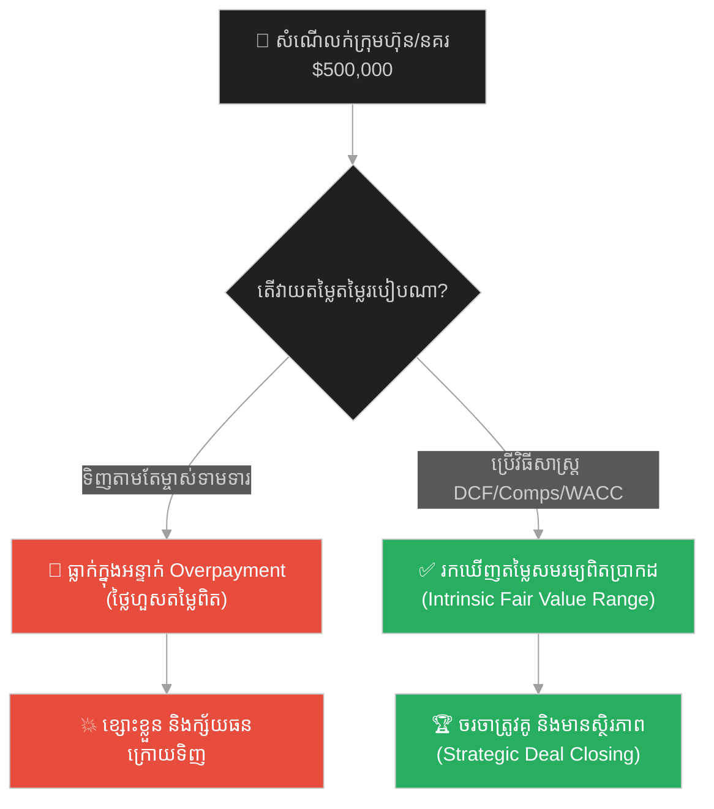
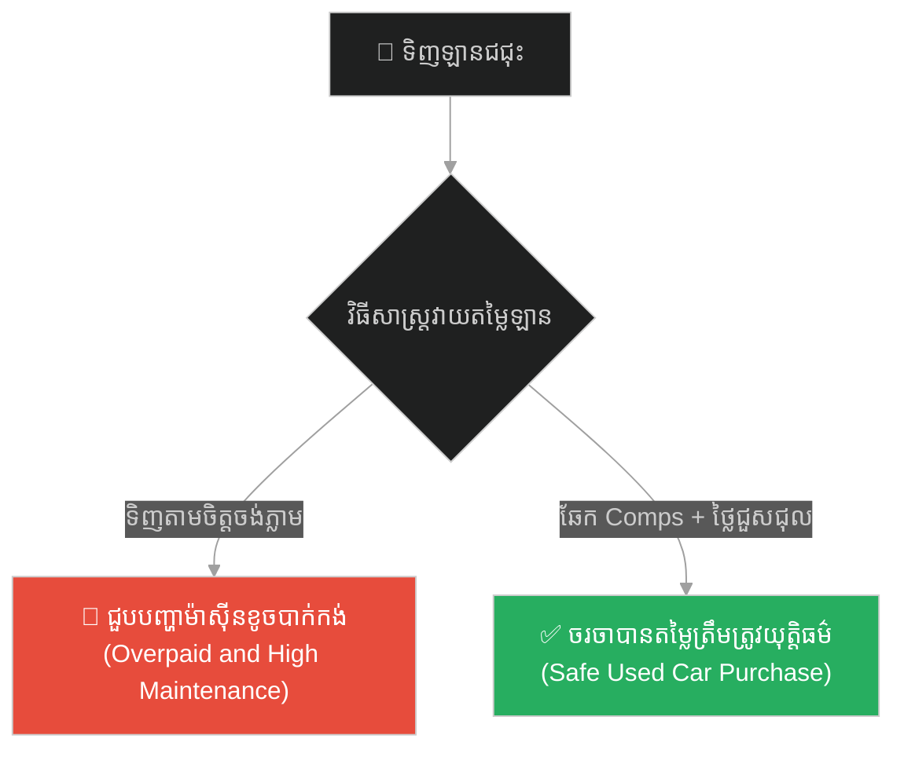
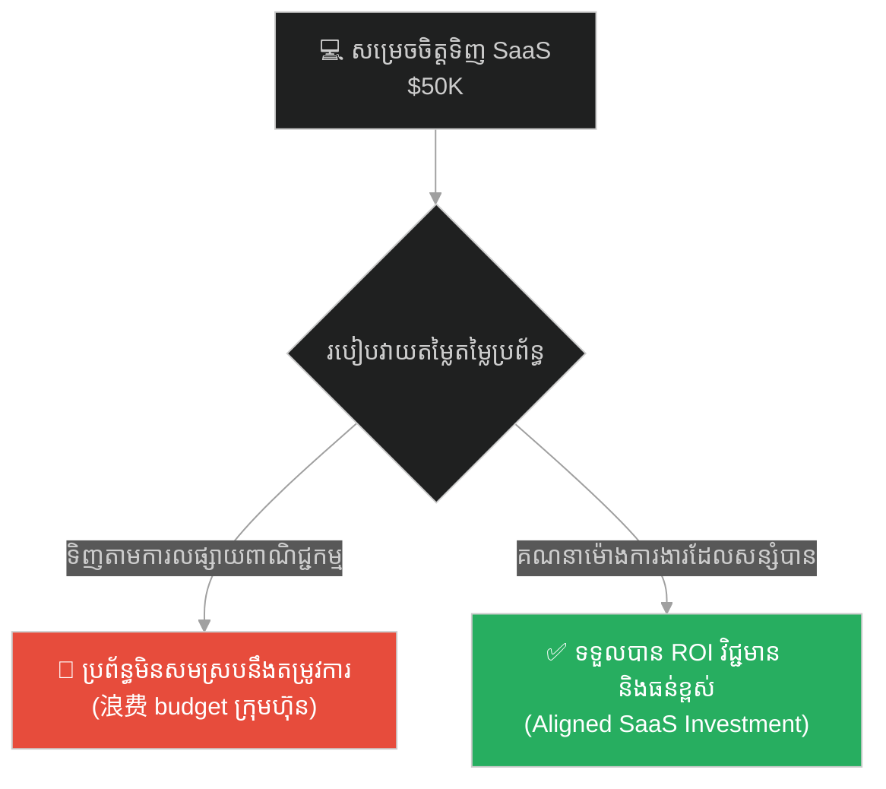
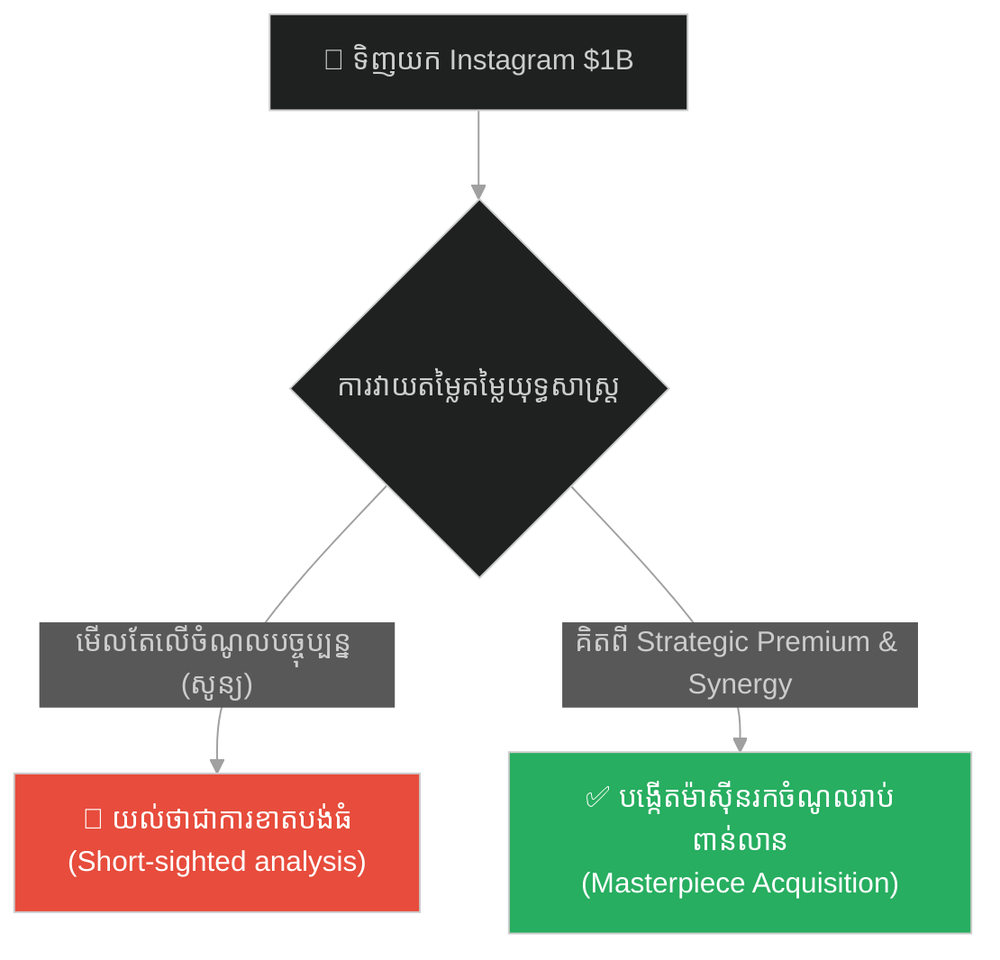
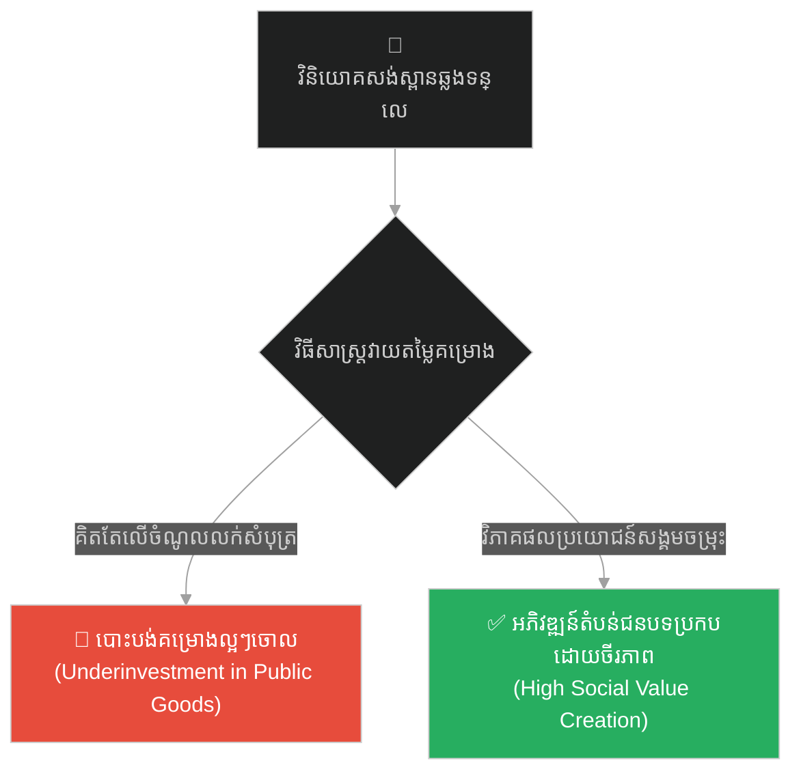
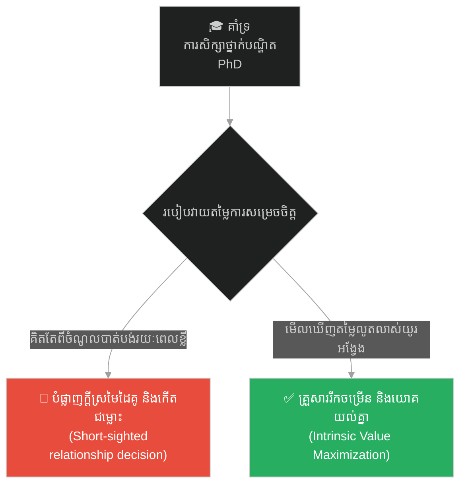
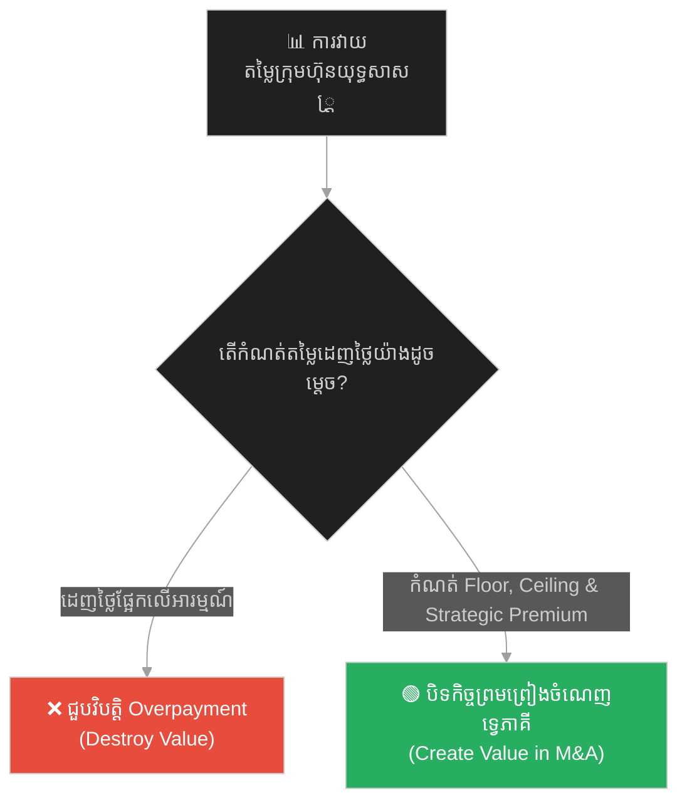

# Corporate Valuation & Finance (នគរសម្រាប់លក់)៖ ការវាយតម្លៃតម្លៃអាជីវកម្ម និងយុទ្ធសាស្ត្រហិរញ្ញវត្ថុ (Corporate Valuation & Finance & Discounted Cash Flow and Comparable Company Analysis & The Kingdom for Sale)

**Author:** ichamrong  
**Date:** 2026-05-26  
**Tags:** #corporate-valuation #dcf #wacc #mergers-acquisitions #finance #investment-banking  
**Category:** Concepts / Parables  
**Read Time:** ~15 min  

---

## 📌 មាតិកា (Table of Contents)
- [អន្ទាក់ផ្លូវចិត្ត (The Trap)](#0)
- [១. រឿងព្រេងនិទាន៖ នគរសម្រាប់លក់ (The Legend of The Kingdom for Sale)](#1)
  - [សំណើទិញ និងបុព្វលាភយុទ្ធសាស្ត្រ (The Climax: The Valuation and Strategic Premium)](#1-1)
- [២. បញ្ហា៖ ភាពមិនច្បាស់លាស់នៃតម្លៃ និងវិធីសាស្ត្រវាយតម្លៃតាមបែបវិទ្យាសាស្ត្រ (The Issue: Intrinsic Value and Valuation Methodology)](#2)
- [៣. ឧទាហរណ៍ជាក់ស្តែងក្នុងពិភពពិត (Real World Examples)](#3)
  - [ឧទាហរណ៍ទី ១ — កម្រិតស្រាល (គ្រួសារ)៖ ការទិញលក់ឡានជជុះ ឬរបស់របរប្រើប្រាស់រួច (The Family Used Car Valuation)](#3-1)
  - [ឧទាហរណ៍ទី ២ — កម្រិតមធ្យម (បច្ចេកទេស)៖ ការវាយតម្លៃគម្រោងទិញប្រព័ន្ធ Software ឬ SaaS tool (The Dev SaaS Tool Valuation and ROI)](#3-2)
  - [ឧទាហរណ៍ទី ៣ — កម្រិតមធ្យម (ធុរកិច្ច)៖ ការទិញយកក្រុមហ៊ុន Instagram ដោយក្រុមហ៊ុន Facebook (The Business Facebook Acquisition of Instagram)](#3-3)
  - [ឧទាហរណ៍ទី ៤ — កម្រិតមធ្យម (សង្គម/គ្រប់គ្រង)៖ ការវាយតម្លៃតម្លៃសង្គម និងការវិនិយោគលើប្រព័ន្ធហេដ្ឋារចនាសម្ព័ន្ធរូបវន្ត (The Management Infrastructure Valuation and Public ROI)](#3-4)
  - [ឧទាហរណ៍ទី ៥ — កម្រិតធ្ងន់ (ទំនាក់ទំនង)៖ ការវាយតម្លៃពេលវេលា និងកម្រិតប្តេជ្ញាចិត្តរបស់ដៃគូជីវិត (The Relationship Investment and Intrinsic Mutual Valuation)](#3-5)
- [៤. ដំណោះស្រាយទូទៅ៖ ការវាយតម្លៃចម្រុះវិធីសាស្ត្រ (The General Solution: Triangulating Business Valuation)](#4)
- [សេចក្តីសន្និដ្ឋាន (Conclusion)](#5)
- [ឯកសារយោង (References)](#6)
- [Related Posts](#7)

---

<a id="0"></a>
## អន្ទាក់ផ្លូវចិត្ត (The Trap)

នៅក្នុងពិភពធុរកិច្ច និងការវិនិយោគ អន្ទាក់ដ៏ធំបំផុតមួយដែលតែងតែបំផ្លាញការទិញ និងច្របាច់បញ្ចូលក្រុមហ៊ុន (Mergers and Acquisitions) គឺ **«អន្ទាក់វាយតម្លៃខុស និងការសម្រេចចិត្តតាមអារម្មណ៍» (The Valuation Bias and Emotional Overpayment Trap)**។ ភាគីអ្នកទិញជារឿយៗតែងតែលង់ស្នេហ៍នឹងម៉ាកសញ្ញា ឬទំហំប្រតិបត្តិការរបស់ក្រុមហ៊ុនគោលដៅ រហូតសុខចិត្តទិញក្នុងតម្លៃថ្លៃកប់ពពក ដោយគ្មានការវិភាគលំហូរសាច់ប្រាក់នាពេលអនាគត ឬការគណនាថ្លៃដើមដើមទុនឱ្យបានម៉ត់ចត់។

* **ផ្លូវងងឹត (Failure Path)** — ការទិញអាជីវកម្មដោយផ្អែកលើតែតម្លៃលក់ដែលម្ចាស់ចាស់ទាមទារ ឬផ្អែកលើការប៉ាន់ស្មានតាមអារម្មណ៍ ដែលនាំទៅរកការខាតបង់ថវិកាយ៉ាងធ្ងន់ធ្ងរ។
* **ផ្លូវពន្លឺ (Success Path)** — ការប្រើប្រាស់វិធីសាស្ត្រវាយតម្លៃតាមបែបវិទ្យាសាស្ត្រ (DCF, Comps, WACC) ដើម្បីចរចាកំណត់ចន្លោះតម្លៃសមរម្យ និងការកំណត់បុព្វលាភយុទ្ធសាស្ត្រឱ្យបានត្រឹមត្រូវ។

ដើម្បីយល់ដឹងពីវិធីវាយតម្លៃ និងចរចាអាជីវកម្ម នេះជាផែនទីបង្ហាញផ្លូវ៖
1. **រឿងព្រេងនិទាន (The Legend)** — យុទ្ធសាស្ត្ររបស់ព្រះអង្គ អរ្យ (Arya) ក្នុងការចរចាទិញយកព្រះរាជាណាចក្រ Silvara តាមរយៈក្រុមទីប្រឹក្សា ៣ ក្រុម។
2. **បញ្ហា (The Issue)** — ការវិភាគរវាង DCF, WACC និង Comps រួមជាមួយគូកូដ Python បង្ហាញពីការគណនា Intrinsic Value។
3. **ឧទាហរណ៍ជាក់ស្តែងក្នុងពិភពពិត (Real World Examples)** — ករណីសិក្សា ៥ កម្រិត ចាប់ពីកម្រិតគ្រួសាររហូតដល់ទំនាក់ទំនងរវាងដៃគូជីវិត។
4. **ដំណោះស្រាយទូទៅ (The General Solution)** — វិធីសាស្ត្រ Triangulation ក្នុងការកំណត់ Ceiling និង Floor តម្លៃសម្រាប់ចរចា។



---

<a id="1"></a>
## ១. រឿងព្រេងនិទាន៖ នគរសម្រាប់លក់ (The Legend of The Kingdom for Sale)

**ព្រះអង្គ អរ្យ (Prince Arya)** គឺជាមេដឹកនាំវ័យក្មេងមួយរូបដែលពោរពេញទៅដោយមហិច្ឆតា (Ambition)។ ទ្រង់បានយល់ច្បាស់ថា ការពង្រីកទឹកដីតាមរយៈការធ្វើសង្គ្រាម (War) — គឺត្រូវលះបង់និងបាត់បង់ជីវិតមនុស្សច្រើនណាស់។ អាស្រ័យហេតុនេះ ទ្រង់បានជ្រើសរើសយកយុទ្ធសាស្ត្រ **ការទិញយក (Acquisition)** វិញ — គឺទ្រង់ចង់ទិញយកព្រះរាជាណាចក្រ Silvara តែម្តង។

ព្រះរាជាប្រចាំនគរ Silvara បានដាក់សំណើលក់ក្នុងតម្លៃ ៖ **៥០០,០០០ ហ្វ្រង់**។

ព្រះអង្គ អរ្យ បានកោះហៅក្រុមទីប្រឹក្សា (Advisors) ចូលគាល់ រួចមានបន្ទូលថា ៖ "**ចូរអ្នកទាំងអស់គ្នាប្រាប់យើងមកមើល៍ ថាតើនគរ Silvara នេះ ពិតជាមានតម្លៃប៉ុន្មានឱ្យប្រាកដ?**"

ក្រុមទីប្រឹក្សាទាំងនោះបានបែងចែកចេញជា ៣ ក្រុម ដើម្បីស្រាវជ្រាវ និងប្រើប្រាស់វិធីសាស្ត្រវាយតម្លៃផ្សេងៗគ្នា៖

**ក្រុមទី ១ — វិធីសាស្ត្រ DCF (Discounted Cash Flow) ៖**  
ពួកគេបានធ្វើការប៉ាន់ស្មានចំណូលពន្ធ (Tax Revenue) របស់នគរ Silvara សម្រាប់រយៈពេល ៥ ឆ្នាំទៅមុខ — ដោយរំពឹងថានឹងទទួលបាន ៦០,០០០ ហ្វ្រង់ ក្នុងឆ្នាំទី ១, ហើយវានឹងកើនឡើង (Grow) ៣% ជារៀងរាល់ឆ្នាំ។ ពួកគេបានកាត់កងតម្លៃនានា (Discount Rate) ក្នុងអត្រា ១២% (Cost of Capital)។ ដូច្នេះតម្លៃវាយតម្លៃតាមរយៈ DCF គឺ ≈ **៤២០,០០០ ហ្វ្រង់**។

**ក្រុមទី ២ — វិធីសាស្ត្រប្រៀបធៀបនគរស្រដៀងគ្នា (Comparable Kingdoms - Comps) ៖**  
ពួកគេបានធ្វើការស្រាវជ្រាវទៅលើព្រះរាជាណាចក្រចំនួន ៣ ផ្សេងទៀត ដែលទើបតែត្រូវបានគេទិញលក់ថ្មីៗនេះ។ ជាមធ្យមតម្លៃលក់ចេញគឺ ≈ **៣៨០,០០០ ហ្វ្រង់**។

**ក្រុមទី ៣ — វិធីសាស្ត្រវិភាគ WACC ៖**  
ពួកគេបានគណនាថ្លៃដើមមូលធន (Cost of Capital) ដោយថ្លឹងថ្លែងលើបំណុលសង្គ្រាមរបស់នគរ Silvara (Debt) បូកជាមួយនឹងតម្លៃដីធ្លី (Equity)។ តាមរយៈការគណនានេះ ពួកគេទទួលបានអត្រា WACC ≈ ១១%។ បន្ទាប់មក ពួកគេបានយកអត្រា WACC នេះទៅគណនាឡើងវិញក្នុងរូបមន្ត DCF → ហើយទទួលបានលទ្ធផលស្មើនឹង **៤៣០,០០០ ហ្វ្រង់**។

---

<a id="1-1"></a>
### សំណើទិញ និងបុព្វលាភយុទ្ធសាស្ត្រ (The Climax: The Valuation and Strategic Premium)

ក្រុមទីប្រឹក្សាទាំងបី បានប្រើប្រាស់វិធីសាស្ត្រខុសៗគ្នា — ប៉ុន្តែលទ្ធផលដែលទទួលបានគឺ **ប្រមូលផ្តុំគ្នា (Cluster)** នៅចន្លោះតម្លៃចាប់ពី ៣៨០,០០០ ដល់ ៤៣០,០០០ ហ្វ្រង់។

ព្រះអង្គ អរ្យ បានសម្លឹងមើលតួលេខទាំងនេះរួចមានបន្ទូលថា៖  
*«តម្លៃ ៥០០,០០០ ហ្វ្រង់ ដែលស្តេច Silvara ទាមទារ គឺខ្ពស់ហួសហេតុពេក។ ប៉ុន្តែយើងក៏មិនអាចដាក់តម្លៃ ៣៨០,០០០ ហ្វ្រង់បានដែរ ព្រោះពួកគេនឹងច្រានចោលសំណើភ្លាមៗ។ យើងនឹងដាក់សំណើទិញក្នុងតម្លៃ **៤៤០,០០០ ហ្វ្រង់**»*

មេទ័ពម្នាក់បានជំទាស់ថា៖ *«ក្រាបទូលព្រះអង្គ! តម្លៃនេះខ្ពស់ជាងតម្លៃពិតសមរម្យ (Fair Value) ចំនួន ១០,០០០ ហ្វ្រង់។ តើយើងមិនខាតបង់ទេឬ?»*

ព្រះអង្គ អរ្យ បានពន្យល់ថា៖  
*«ទឹកប្រាក់បន្ថែម ១០,០០០ ហ្វ្រង់នេះ គឺចាត់ទុកថាជា **បុព្វលាភយុទ្ធសាស្ត្រ (Strategic Premium)**។ នៅពេលយើងគ្រប់គ្រងនគរ Silvara យើងនឹងរួមបញ្ចូលច្រកពាណិជ្ជកម្មរបស់ពួកគេជាមួយយើង (Create Synergy)។ វានឹងជួយកាត់បន្ថយថ្លៃយាមល្បាតតាមព្រំដែនរបស់យើង និងបង្កើនលំហូរពាណិជ្ជកម្មទ្វេដង ដែលនឹងផ្តល់ផលចំណេញមកវិញរាប់សែនហ្វ្រង់ក្នុងរយៈពេលវែង។ នេះជាការចំណាយដ៏មានតម្លៃ»*

ទីបំផុត ព្រះរាជានគរ Silvara ក៏យល់ព្រមលក់ក្នុងតម្លៃ ៤៤០,០០០ ហ្វ្រង់។ ព្រះអង្គ អរ្យ បានគ្រប់គ្រងនគរទាំងពីរដោយសន្តិវិធី និងសន្សំសំចៃថវិការាប់សែនហ្វ្រង់ដែលត្រូវខូចខាតបើធ្វើសង្គ្រាម។

---

<a id="2"></a>
## ២. បញ្ហា៖ ភាពមិនច្បាស់លាស់នៃតម្លៃ និងវិធីសាស្ត្រវាយតម្លៃតាមបែបវិទ្យាសាស្ត្រ (The Issue: Intrinsic Value and Valuation Methodology)

នៅក្នុងការវាយតម្លៃអាជីវកម្ម **(Corporate Valuation)** គ្មានវិធីសាស្ត្រណាដែលផ្តល់តួលេខល្អឥតខ្ចោះតែមួយគត់នោះទេ។ អ្នកវិភាគហិរញ្ញវត្ថុត្រូវតែប្រើប្រាស់ការគណនាចម្រុះវិធីសាស្ត្រ (Triangulation) ដើម្បីបង្កើតជាចន្លោះតម្លៃសមរម្យ (Valuation Range)។

ខាងក្រោមនេះជាកូដគំរូ Python បង្ហាញពីការគណនា Valuation បែបសាមញ្ញ (Comps) ធៀបនឹងការវិភាគតាមបែប DCF រួមទាំងការគណនា Terminal Value៖

```python
# ============================================================================
# FRAGILE VALUATION (វិធីសាស្ត្រប្រៀបធៀបសាមញ្ញ - Comps Only)
# ============================================================================
def calculate_comps_valuation(net_income, industry_multiple):
    """
    Fragile: Relies heavily on market multiples which fluctuate on sentiment.
    ការវាយតម្លៃបែបសាមញ្ញ៖ គុណចំណូលនឹងមេគុណទីផ្សារ (ងាយរងឥទ្ធិពលពីអារម្មណ៍ទីផ្សារ)។
    """
    return net_income * industry_multiple

# ============================================================================
# RESILIENT VALUATION (វិធីសាស្ត្រលំហូរសាច់ប្រាក់កាត់កង - DCF with WACC)
# ============================================================================
def calculate_dcf_valuation(initial_cf, growth_rate, wacc, years, perpetuity_growth):
    """
    Resilient: Focuses on future cash generation capacity discounted by cost of capital (WACC).
    គណនាតម្លៃពិតប្រាកដ Intrinsic Value ដោយប្រើរូបមន្ត Discounted Cash Flow។
    """
    pv_cash_flows = 0.0
    current_cf = initial_cf
    
    # Project and discount cash flows for the forecast period
    for year in range(1, years + 1):
        current_cf = current_cf * (1 + growth_rate)
        discounted_cf = current_cf / ((1 + wacc) ** year)
        pv_cash_flows += discounted_cf
        print(f"Year {year} Cash Flow: ${current_cf:.2f} | Discounted: ${discounted_cf:.2f}")
        
    # Calculate Terminal Value using perpetuity growth model
    terminal_cf = current_cf * (1 + perpetuity_growth)
    terminal_value = terminal_cf / (wacc - perpetuity_growth)
    discounted_terminal_value = terminal_value / ((1 + wacc) ** years)
    
    total_intrinsic_value = pv_cash_flows + discounted_terminal_value
    print(f"Terminal Value: ${terminal_value:.2f} | Discounted Terminal: ${discounted_terminal_value:.2f}")
    return total_intrinsic_value

# Simulation
net_income_silvara = 60000.0
wacc_rate = 0.12            # 12% Cost of Capital
growth_rate = 0.03          # 3% growth for 5 years
terminal_growth_rate = 0.02 # 2% perpetuity growth rate

print("--- COMPS VALUATION RESULT ---")
comps_val = calculate_comps_valuation(net_income_silvara, industry_multiple=6.5)
print(f"Comps Value (6.5x Multiple): ${comps_val:.2f}\n")

print("--- DCF VALUATION RESULT ---")
dcf_val = calculate_dcf_valuation(net_income_silvara, growth_rate, wacc_rate, years=5, perpetuity_growth=terminal_growth_rate)
print(f"Total DCF Intrinsic Value: ${dcf_val:.2f}")
# Output: ~$425,000 (Provides a robust foundation for negotiation)
```

---

<a id="3"></a>
## ៣. ឧទាហរណ៍ជាក់ស្តែងក្នុងពិភពពិត (Real World Examples)

ខាងក្រោមនេះជាករណីសិក្សា ៥ កម្រិតនៃការអនុវត្តការវាយតម្លៃតម្លៃ៖

---

<a id="3-1"></a>
### ឧទាហរណ៍ទី ១ — កម្រិតស្រាល (គ្រួសារ)៖ ការទិញលក់ឡានជជុះ ឬរបស់របរប្រើប្រាស់រួច (The Family Used Car Valuation)

**ស្ថានភាព៖** គ្រួសារមួយចង់ទិញឡានជជុះ (Used Car) មួយគ្រឿងពីអ្នកជិតខាង។
* **ការវាយតម្លៃបែបលំអៀង៖** ពួកគេទិញភ្លាមតាមតែតម្លៃដែលអ្នកជិតខាងសួរនាំ ឬតាមអារម្មណ៍ថាឡាននោះស្អាត។ ក្រោយមកពួកគេត្រូវចំណាយលុយជួសជុលម៉ាស៊ីនច្រើនជាងតម្លៃឡាន។
* **ការវាយតម្លៃបែបយុទ្ធសាស្ត្រ៖** ពួកគេឆែកមើលតម្លៃទីផ្សារស្រដៀងគ្នា (Comps) និងគណនា «តម្លៃប្រើប្រាស់នាពេលអនាគត» (ការសន្សំសំចៃសាំង និងការមិនបាច់ចំណាយជួសជុល) ដើម្បីកំណត់តម្លៃចរចាដ៏សមរម្យ។



---

<a id="3-2"></a>
### ឧទាហរណ៍ទី ២ — កម្រិតមធ្យម (បច្ចេកទេស)៖ ការវាយតម្លៃគម្រោងទិញប្រព័ន្ធ Software ឬ SaaS tool (The Dev SaaS Tool Valuation and ROI)

**ស្ថានភាព៖** CTO ត្រូវសម្រេចចិត្តទិញ Enterprise SaaS tool (ដូចជា Datadog/Salesforce) ក្នុងតម្លៃ $50,000/ឆ្នាំ។
* **ការវាយតម្លៃបែបលំអៀង៖** ទិញភ្លាមដោយសារតែលឺគេល្បី ឬដោយសារតែការបញ្ចុះតម្លៃពីអ្នកលក់ (Sales promotion) ដោយមិនគិតពី ROI ពិតប្រាកដ។
* **ការវាយតម្លៃបែបយុទ្ធសាស្ត្រ៖** វិភាគ DCF លើ «តម្លៃពេលវេលាដែលសន្សំបាន» (Developer hours saved) និងការកាត់បន្ថយពេលវេលាគាំងប្រព័ន្ធ (Downtime cost reduction) ដើម្បីផ្ទៀងផ្ទាត់ ROI រយៈពេល ៣ ឆ្នាំ។



---

<a id="3-3"></a>
### ឧទាហរណ៍ទី ៣ — កម្រិតមធ្យម (ធុរកិច្ច)៖ ការទិញយកក្រុមហ៊ុន Instagram ដោយក្រុមហ៊ុន Facebook (The Business Facebook Acquisition of Instagram)

**ស្ថានភាព៖** Facebook ទិញយក Instagram ក្នុងតម្លៃ $1 Billion នៅឆ្នាំ ២០១២ ខណៈ Instagram គ្មានប្រាក់ចំណេញទាល់តែសោះ។
* **ការវាយតម្លៃបែបលំអៀង៖** មតិសាធារណៈជនយល់ថា Facebook ឆ្កួត និងចំណាយលុយច្រើនហួសហេតុ (Overpaid) ទៅលើក្រុមហ៊ុនដែលមានបុគ្គលិកត្រឹមតែ ១៣ នាក់។
* **ការវាយតម្លៃបែបយុទ្ធសាស្ត្រ៖** Facebook មើលឃើញ **Strategic Premium** ខ្ពស់៖ Instagram គឺជាគូប្រជែងដ៏ធំបំផុត និងមានបច្ចេកវិទ្យាចែករំលែករូបភាពល្អជាងគេ។ ការទិញ Instagram ជួយការពារអាណាចក្រផ្សាយពាណិជ្ជកម្មរបស់ Facebook និងបង្កើត Synergy រាប់ពាន់លានដុល្លារនាពេលបច្ចុប្បន្ន។



---

<a id="3-4"></a>
### ឧទាហរណ៍ទី ៤ — កម្រិតមធ្យម (សង្គម/គ្រប់គ្រង)៖ ការវាយតម្លៃតម្លៃសង្គម និងការវិនិយោគលើប្រព័ន្ធហេដ្ឋារចនាសម្ព័ន្ធរូបវន្ត (The Management Infrastructure Valuation and Public ROI)

**ស្ថានភាព៖** រដ្ឋាភិបាលចង់ដំឡើងស្ពានឆ្លងកាត់ទន្លេធំមួយតភ្ជាប់តំបន់ជនបទទៅកាន់ទីក្រុង។
* **ការវាយតម្លៃបែបលំអៀង៖** វាយតម្លៃផ្អែកលើតែ «ថ្លៃសំបុត្រឆ្លងកាត់ស្ពាន»។ ដោយសារតែចំនួនអ្នកឆ្លងកាត់តិច គម្រោងនេះមើលទៅមិនចំណេញ និងមិនគួរវិនិយោគ។
* **ការវាយតម្លៃបែបយុទ្ធសាស្ត្រ៖** វាយតម្លៃលើ **Social ROI** រួមមាន ៖ ការកាត់បន្ថយថ្លៃដឹកជញ្ជូនកសិផល កំណើនតម្លៃដីធ្លីជុំវិញ និងការបើកច្រកការងារថ្មីៗសម្រាប់ប្រជាជន។



---

<a id="3-5"></a>
### ឧទាហរណ៍ទី ៥ — កម្រិតធ្ងន់ (ទំនាក់ទំនង)៖ ការវាយតម្លៃពេលវេលា និងកម្រិតប្តេជ្ញាចិត្តរបស់ដៃគូជីវិត (The Relationship Investment and Intrinsic Mutual Valuation)

**ស្ថានភាព៖** គូស្វាមីភរិយាត្រូវធ្វើការសម្រេចចិត្តវិនិយោគពេលវេលា និងធនធានដើម្បីគាំទ្រការសិក្សាថ្នាក់បណ្ឌិត (PhD) របស់ដៃគូម្ខាងទៀតរយៈពេល ៤ ឆ្នាំ។
* **ការវាយតម្លៃបែបលំអៀង៖** គិតតែពីការបាត់បង់ប្រាក់ចំណូលរបស់ដៃគូដែលរៀនក្នុងរយៈពេល ៤ ឆ្នាំនោះ រហូតបង្ខំចិត្តឱ្យដៃគូបោះបង់ចោលការសិក្សា។
* **ការវាយតម្លៃបែបយុទ្ធសាស្ត្រ៖** វាយតម្លៃលើ Intrinsic Value រយៈពេលវែង៖ ការកើនឡើងនូវឱកាសអាជីព និងកិត្តិយសរបស់គ្រួសារនាពេលអនាគត (Future Cash Flow Growth) ព្រមទាំងការកសាងទំនុកចិត្ត និងសាមគ្គីភាពក្នុងគ្រួសារ។



---

<a id="4"></a>
## ៤. ដំណោះស្រាយទូទៅ៖ ការវាយតម្លៃចម្រុះវិធីសាស្ត្រ (The General Solution: Triangulating Business Valuation)

ដើម្បីទទួលបានការវាយតម្លៃអាជីវកម្មដ៏ត្រឹមត្រូវ និងចៀសវាងការធ្លាក់ក្នុងអន្ទាក់វាយតម្លៃខុស អ្នកគ្រប់គ្រងគួរតែអនុវត្តយុទ្ធសាស្ត្រទាំងនេះ៖

### ១. អនុវត្តវិធីសាស្ត្រ Triangulation (ប្រើប្រាស់វិធីសាស្ត្រច្រើនបញ្ចូលគ្នា)
កុំពឹងផ្អែកតែលើវិធីសាស្ត្រតែមួយ។ ត្រូវប្រើប្រាស់ DCF សម្រាប់រកតម្លៃ Intrinsic Value, ប្រើ Comps សម្រាប់វាស់ស្ទង់អារម្មណ៍ទីផ្សារជាក់ស្តែង និងប្រើប្រាស់ WACC ដើម្បីកំណត់ថ្លៃដើមមូលធនឱ្យបានត្រឹមត្រូវ។

### ២. កំណត់ Ceiling (តម្លៃអតិបរមា) និង Floor (តម្លៃអប្បបរមា) សម្រាប់ចរចា
*   **Floor (បាតតម្លៃ)៖** គឺផ្អែកលើការវាយតម្លៃទ្រព្យសកម្មសុទ្ធ (Net Asset Value) ឬតម្លៃទីផ្សារ Comps ទាបបំផុត។
*   **Ceiling (ដំបូលតម្លៃ)៖** គឺតម្លៃ DCF អតិបរមា បូករួមទាំង Synergies ដែលរំពឹងទុក។

### ៣. វាយតម្លៃហានិភ័យដោយការវិភាគ Sensitivity (Sensitivity Analysis)
ផ្លាស់ប្តូរអថេរស្នូល (ដូចជាអត្រាកំណើន ឬ WACC) នៅក្នុងគំរូ DCF ដើម្បីមើលថាតើតម្លៃអាជីវកម្មនឹងផ្លាស់ប្តូរកម្រិតណា ប្រសិនបើទីផ្សារជួបប្រទះភាពមិនច្បាស់លាស់។



---

## 🐇 ធ្លាក់ចូលក្នុងរន្ធទន្សាយ (Enter the Rabbit Hole)
ដើម្បីស្វែងយល់បន្ថែមអំពីការវិភាគការផ្សាយពាណិជ្ជកម្ម ការវាស់ស្ទង់សកម្មភាពទីផ្សារ និងសិល្បៈនៃការទាក់ទាញអតិថិជន សូមបន្តដំណើរទៅកាន់៖

* 🚀 **[ចាប់ផ្តើមដំណើររុករក (Start the Journey) ➔ Marketing & Customer Engagement (ផ្សារនៅក្បាលជ្រុង និងការយល់ដឹងពីទីផ្សារ)](../../marketing/parables/250-the-market-at-the-crossroads.md)**

---

<a id="5"></a>
## សេចក្តីសន្និដ្ឋាន (Conclusion)

> **«អ្នកទិញដ៏ឈ្លាសវៃ មិនមែនសម្លឹងមើលតែស្លាកតម្លៃដែលគេព្យួរនៅមុខទ្វារនោះឡើយ ប៉ុន្តែគឺមើលទៅលើលំហូរទឹកឃ្មុំដែលនឹងហូរចូលមកក្នុងក្អមនាពេលអនាគត។»**

ការវាយតម្លៃអាជីវកម្មដោយប្រើប្រាស់វិធីសាស្ត្រចម្រុះ ជួយការពារអ្នកដឹកនាំធុរកិច្ចពីការខាតបង់ទ្រព្យសម្បត្តិ និងធានាថារាល់ប្រតិបត្តិការទិញ-លក់ គឺត្រូវបានធ្វើឡើងផ្អែកលើការគណនាយ៉ាងម៉ត់ចត់។

---

<a id="6"></a>
## ឯកសារយោង (References)

* **Damodaran, Aswath** — *Investment Valuation: Tools and Techniques for Determining the Value of Any Asset* (3rd Edition)។ សៀវភៅល្អបំផុតស្តីពីការវាយតម្លៃតម្លៃអាជីវកម្ម និង DCF។
* **Koller, Tim; Goedhart, Marc & Wessels, David** — *Valuation: Measuring and Managing the Value of Companies* (McKinsey & Company)។ មគ្គុទ្ទេសក៍ប្រតិបត្តិសម្រាប់ M&A និងការកំណត់ WACC។
* **Denison University Coursework** — *02 Corporate Valuation and Finance for Business Sustainability* (Year 1)។ ឯកសារយោងសម្រាប់ការវិភាគហិរញ្ញវត្ថុសាជីវកម្ម។

---

<a id="7"></a>
## Related Posts

* **[02 Corporate Valuation](../02-corporate-valuation.md)** — មុខវិជ្ជា Corporate Valuation នៅ Denison University។
* **[២៤៨ — អ្នកវិនិយោគស្រែ និងទ្រឹស្តីផតហ្វូលីយ៉ូ (The Rice Paddy Investor)](./248-the-rice-paddy-investor.md)** — Portfolio Theory និង Risk Management។
* **[២៤៣ — ពាណិជ្ជករងងឹតភ្នែក និងសៀវភៅកត់ត្រា (The Blind Merchant and the Ledger)](../../core-business/parables/243-the-blind-merchant-and-the-ledger.md)** — ការស្វែងយល់ពីគ្រឹះនៃគណនេយ្យហិរញ្ញវត្ថុ និងរបាយការណ៍តម្លាភាព។
