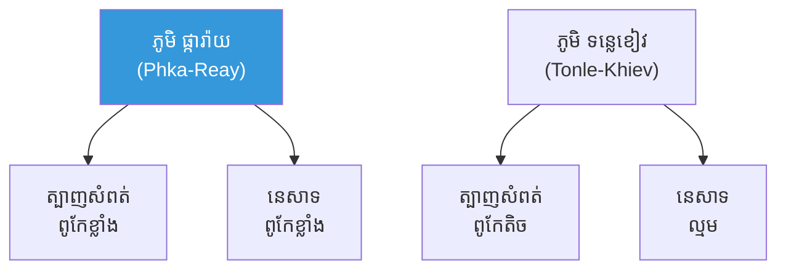
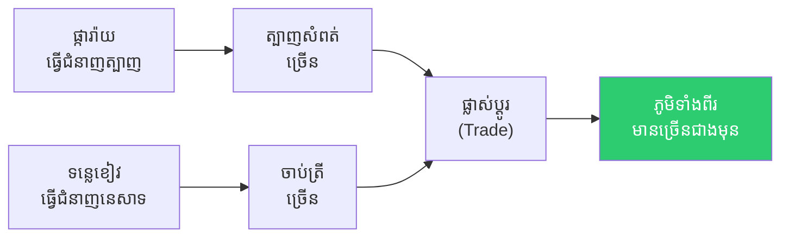
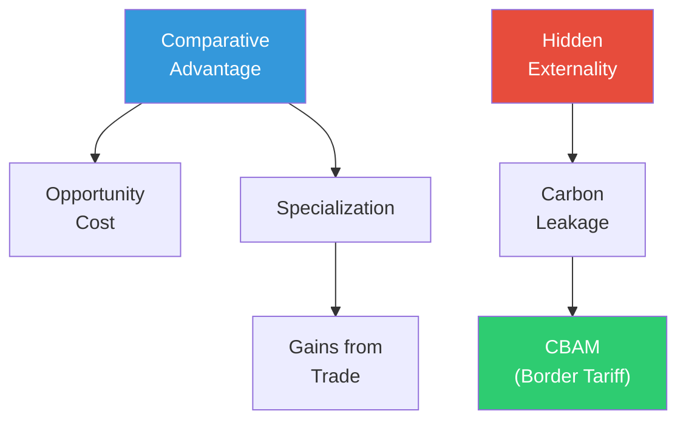

# The Weaver and the Fisherman and Comparative Advantage (ជាងត្បាញ និងអ្នកនេសាទ និងគុណសម្បត្តិប្រៀបធៀប)

**Author:** ichamrong  
**Date:** 2026-06-01  
**Tags:** #international-trade #comparative-advantage #gains-from-trade #specialization #carbon-leakage  
**Category:** Concepts / Parables  
**Read Time:** ~6 min  

---

## 📌 មាតិកា (Table of Contents)
- [ភូមិពីរ និងជំនាញពីរ (Two Villages, Two Skills)](#ភូមិពីរ-និងជំនាញពីរ-two-villages-two-skills)
- [ការគណនាដ៏អស្ចារ្យ (The Surprising Calculation)](#ការគណនាដ៏អស្ចារ្យ-the-surprising-calculation)
- [ផ្សែងដែលលាក់ខ្លួន (The Hidden Smoke)](#ផ្សែងដែលលាក់ខ្លួន-the-hidden-smoke)
- [ការវិភាគទ្រឹស្តី៖ Trade Theory (Theoretical Breakdown)](#ការវិភាគទ្រឹស្តី-trade-theory-theoretical-breakdown)
- [Related Posts](#related-posts)

---

## ភូមិពីរ និងជំនាញពីរ (Two Villages, Two Skills)

មាន​ភូមិ​ពីរ។ ភូមិ **ផ្ការ៉ាយ (Phka-Reay)** ដែល​ពូកែ​**ទាំង​ត្បាញ​សំពត់ (Weaving) ទាំង​នេសាទ (Fishing)** — ពូកែ​ជាង​ភូមិ ​**ទន្លេ​ខៀវ (Tonle-Khiev)** គ្រប់​យ៉ាង។

មេ​ភូមិ ផ្ការ៉ាយ មាន​មោទន​ភាព ៖ **"យើង​ពូកែ​ជាង​គេ​គ្រប់​យ៉ាង — ហេតុ​អ្វី​ត្រូវ​ធ្វើ​ពាណិជ្ជ​កម្ម​ជាមួយ​ភូមិ​ខ្សោយ​ជាង​យើង?"** គាត់​គិត​ថា ការ​ធ្វើ​អ្វីៗ​ដោយ​ខ្លួន​ឯង​ទាំង​អស់ គឺ​ប្រសើរ​បំផុត។

---

## ការគណនាដ៏អស្ចារ្យ (The Surprising Calculation)

ទីប្រឹក្សា​ចំណាស់​ម្នាក់​បាន​គណនា (Calculates) ប្រាប់​មេ​ភូមិ ៖

**"សូម​មើល​ឱ្យ​ច្បាស់ — បើ​ភូមិ​ផ្ការ៉ាយ ​ត្បាញ​សំពត់​មួយ​ផ្ទាំង គឺ​ត្រូវ​លះ​បង់ (Give Up) ការ​នេសាទ​ត្រី​បាន​ច្រើន​ខ្លាំង (ព្រោះ​ពួក​គេ​នេសាទ​ពូកែ​ខ្លាំង)។ តែ​បើ​ភូមិ​ទន្លេ​ខៀវ​ត្បាញ​សំពត់ ​ពួក​គេ​លះ​បង់​ត្រី​តិច​ជាង (ព្រោះ​ពួក​គេ​នេសាទ​មិន​សូវ​ពូកែ)។"**

នេះ​គឺ​ជា **ថ្លៃ​ដើម​ឱកាស (Opportunity Cost)** ៖ បើ​ទោះ​បី​ផ្ការ៉ាយ​ពូកែ​គ្រប់​យ៉ាង — វា​នៅ​តែ​មាន​ប្រយោជន៍​ឱ្យ​**ផ្ការ៉ាយ​ធ្វើ​ជំនាញ​ត្បាញ​សំពត់ (Specialize)** (ដែល​ជា​ជំនាញ​ខ្លាំង​បំផុត​របស់​ខ្លួន), និង​ឱ្យ​**ទន្លេ​ខៀវ​ធ្វើ​ជំនាញ​នេសាទ**, រួច **ផ្លាស់​ប្ដូរ (Trade)** គ្នា។

លទ្ធ​ផល ៖ ភូមិ​ទាំង​ពីរ​មាន​ទាំង​សំពត់ និង​ត្រី **ច្រើន​ជាង​មុន (Both Gain)** — បើ​ទោះ​បី​ភូមិ​មួយ​ពូកែ​ជាង​មួយ​ក៏​ដោយ។ នេះ​ហើយ​ជា **គុណ​សម្បត្តិ​ប្រៀប​ធៀប (Comparative Advantage)** របស់​លោក Ricardo។

---

## ផ្សែងដែលលាក់ខ្លួន (The Hidden Smoke)

ប៉ុន្តែ​មាន​រឿង​មួយ​ដែល​ការ​គណនា​ចាស់​មិន​បាន​បញ្ចូល ៖ ការ​ត្បាញ​សំពត់​របស់ ផ្ការ៉ាយ ​បញ្ចេញ **ផ្សែង​ពុល (Pollution)** ច្រើន ដែល​ហូរ​តាម​ខ្យល់​ទៅ​ភូមិ​ទន្លេ​ខៀវ។ ភូមិ​ទន្លេ​ខៀវ​ទទួល​សំពត់​ថោក — ប៉ុន្តែ​ក៏​ទទួល​ផ្សែង​ដែរ។

តើ​ការ​ផ្លាស់​ប្ដូរ​នោះ​នៅ​តែ​ផ្ដល់​ផល​ដល់​ភាគី​ទាំង​ពីរ​ដែរ​ឬ​ទេ បើ​**ថ្លៃ​ដើម​បរិស្ថាន (Environmental Cost)** មិន​ត្រូវ​បាន​រាប់​បញ្ចូល? នេះ​ជា​សំណួរ​ដែល​ម៉ូដែល​ពាណិជ្ជ​កម្ម​បុរាណ​**លាក់​បាំង (Hides)** — និង​ជា​ប្រភព​នៃ "ការ​លេច​ធ្លាយ​កាបូន" (Carbon Leakage) ៖ ការ​បំពុល​មិន​បាត់​ទេ — វា​គ្រាន់​តែ​ផ្លាស់​ទី​ឆ្លង​ព្រំ​ដែន។

---

## ការវិភាគទ្រឹស្តី៖ Trade Theory (Theoretical Breakdown)

**ទ្រឹស្តី​ពាណិជ្ជ​កម្ម (Trade Theory)** ពន្យល់​ថា ហេតុ​អ្វី​បាន​ជា​ប្រទេស​នានា​ធ្វើ​ពាណិជ្ជ​កម្ម​ជាមួយ​គ្នា — និង​អ្នក​ណា​ចំណេញ។

### ១. គុណសម្បត្តិប្រៀបធៀប (Comparative Advantage — Ricardo)
បើ​ទោះ​បី​ប្រទេស​មួយ​ផលិត​គ្រប់​យ៉ាង​បាន​ល្អ​ជាង​គេ (Absolute Advantage), វា​នៅ​តែ​មាន​ប្រយោជន៍​ឱ្យ​**ធ្វើ​ជំនាញ (Specialize)** លើ​ទំនិញ​ដែល​មាន **ថ្លៃ​ដើម​ឱកាស​ទាប​បំផុត (Lowest Opportunity Cost)** រួច​ផ្លាស់​ប្ដូរ។

### ២. ផលប្រយោជន៍ពីពាណិជ្ជកម្ម (Gains from Trade)
តាម​រយៈ​ការ​ធ្វើ​ជំនាញ និង​ការ​ផ្លាស់​ប្ដូរ, ភាគី​**ទាំង​ពីរ (Both Parties)** អាច​ប្រើ​ប្រាស់​លើស​ពី​អ្វី​ដែល​ខ្លួន​ផលិត​បាន​ម្នាក់​ឯង — នេះ​ជា​ "ផល​ប្រយោជន៍​រួម​ពី​ពាណិជ្ជ​កម្ម" (Mutual Gains)។

### ៣. ដែនកំណត់នៃម៉ូដែល (Limits — The Hidden Externality)
ម៉ូដែល Ricardian សន្មត់​ថា **គ្មាន​ផល​ជះ​ក្រៅ (No Externalities)** និង​គ្មាន​ថ្លៃ​ដើម​ដឹក​ជញ្ជូន — ដែល​**លាក់​បាំង​ថ្លៃ​ដើម​កាបូន (Hides Carbon Cost)** នៃ​ពាណិជ្ជ​កម្ម​សកល​ជាក់​ស្ដែង។

### ៤. ការលេចធ្លាយកាបូន និង CBAM (Carbon Leakage & Border Adjustment)
ពេល​ប្រទេស​មួយ​ដាក់​តម្លៃ​កាបូន​តឹង​រ៉ឹង, ឧស្សាហកម្ម​បំពុល​អាច​ផ្លាស់​ទី​ទៅ​ប្រទេស​ដែល​បទ​ប្បញ្ញត្តិ​ទន់​ខ្សោយ — "លេច​ធ្លាយ" ការ​បំភាយ​ឆ្លង​ព្រំ​ដែន។ **CBAM** (យន្តការ​តម្រូវ​កាបូន​ព្រំ​ដែន​របស់ EU) ដាក់​ពន្ធ​លើ​ទំនិញ​នាំ​ចូល​ដែល​ប្រើ​កាបូន​ច្រើន ដើម្បី​បិទ​គម្លាត​នោះ។

**សេចក្ដីសន្និដ្ឋាន៖** គុណ​សម្បត្តិ​ប្រៀប​ធៀប​បង្ហាញ​ថា ការ​ធ្វើ​ជំនាញ និង​ការ​ផ្លាស់​ប្ដូរ​ផ្ដល់​ផល​ដល់​ទាំង​អស់​គ្នា — ប៉ុន្តែ​ការ​គណនា​ចាស់​មិន​បាន​រាប់ **ផ្សែង (Smoke)**។ **"ពាណិជ្ជ​កម្ម​បង្កើន​ទ្រព្យ​សម្បត្តិ — ប៉ុន្តែ​មិន​មែន​រាល់​ថ្លៃ​ដើម​សុទ្ធ​តែ​លេច​ឡើង​ក្នុង​តម្លៃ​ឡើយ។"**

---

## Related Posts

- **[International Trade Theory](../01-international-trade-theory.md)** — Comparative Advantage, Gains from Trade, Heckscher-Ohlin, Carbon Leakage, CBAM

---

*Last updated: 2026-06-01*
