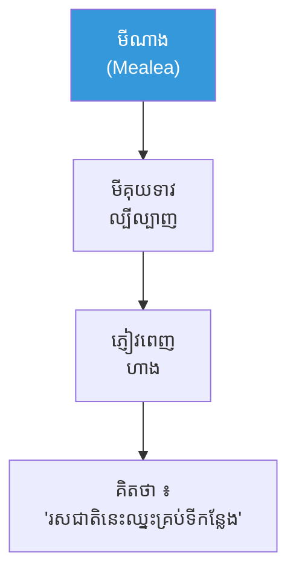
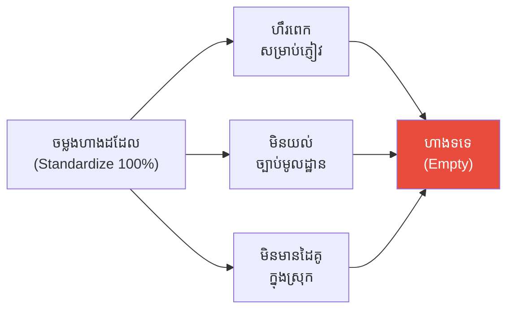
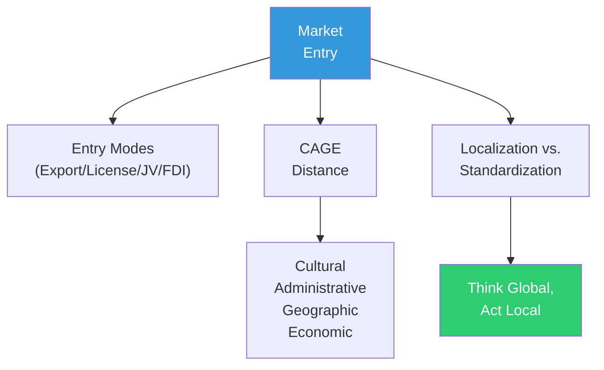

# The Noodle Seller Who Crossed the Border and Market Entry (អ្នកលក់មីដែលឆ្លងព្រំដែន និងការចូលទីផ្សារ)

**Author:** ichamrong  
**Date:** 2026-06-01  
**Tags:** #market-entry #globalization #localization #cage-distance #standardization  
**Category:** Concepts / Parables  
**Read Time:** ~6 min  

---

## 📌 មាតិកា (Table of Contents)
- [អ្នកលក់មីដ៏ល្បីនៅភ្នំពេញ (The Famous Noodle Seller of Phnom Penh)](#អ្នកលក់មីដ៏ល្បីនៅភ្នំពេញ-the-famous-noodle-seller-of-phnom-penh)
- [ការបរាជ័យលើកទីមួយ (The First Failure)](#ការបរាជ័យលើកទីមួយ-the-first-failure)
- [ការវាស់ចម្ងាយ (Measuring the Distance)](#ការវាស់ចម្ងាយ-measuring-the-distance)
- [ការវិភាគទ្រឹស្តី៖ Market Entry (Theoretical Breakdown)](#ការវិភាគទ្រឹស្តី-market-entry-theoretical-breakdown)
- [Related Posts](#related-posts)

---

## អ្នកលក់មីដ៏ល្បីនៅភ្នំពេញ (The Famous Noodle Seller of Phnom Penh)

**មាលា (Mealea)** ជា​ម្ចាស់​ហាង​គុយ​ទាវ (Noodle) ដ៏​ល្បី​បំផុត​នៅ​ភ្នំ​ពេញ។ រសជាតិ​ហឹរ​ខ្លាំង (Spicy) និង​ផ្អែម​ល្មម​របស់​នាង មាន​ភ្ញៀវ​ឈរ​ជួរ​រាល់​ថ្ងៃ។

នាង​សម្រេច​ចិត្ត **ឆ្លង​ព្រំ​ដែន (Cross the Border)** ទៅ​បើក​ហាង​នៅ​ប្រទេស​ជប៉ុន (Japan)។ នាង​គិត​ថា ៖ **"រសជាតិ​ដែល​ឈ្នះ​នៅ​ភ្នំ​ពេញ នឹង​ឈ្នះ​គ្រប់​ទីកន្លែង — ខ្ញុំ​គ្រាន់​តែ​ចម្លង​ហាង​ដដែល (Copy-Paste) ទៅ​ទីនោះ​បាន​ហើយ។"**

---

## ការបរាជ័យលើកទីមួយ (The First Failure)

នាង​បើក​ហាង​ដោយ **ចម្លង​គ្រប់​យ៉ាង​ដដែល (Standardized 100%)** — រសជាតិ​ដដែល, ម៉ឺនុយ​ដដែល, តម្លៃ​ដដែល។ ប៉ុន្តែ ៖

- រសជាតិ​**ហឹរ​ពេក (Too Spicy)** សម្រាប់​អតិថិជន​ជប៉ុន (ចម្ងាយ​វប្បធម៌)។
- នាង​**មិន​យល់​ច្បាប់ (Regulations)** ស្ដី​ពី​អាហារ​មូល​ដ្ឋាន (ចម្ងាយ​រដ្ឋ​បាល)។
- នាង​**គ្មាន​ដៃ​គូ​ក្នុង​ស្រុក (No Local Partner)** ដែល​ស្គាល់​ទីផ្សារ។

ហាង​ស្ងាត់​ជ្រងំ (Empty)។ មាលា ​បាត់​បង់​ប្រាក់​យ៉ាង​ច្រើន។ នាង​ទើប​យល់ ៖ **ការ​ឆ្លង​ព្រំ​ដែន មិន​មែន​គ្រាន់​តែ​ចម្លង​ហាង​ឡើយ។**

---

## ការវាស់ចម្ងាយ (Measuring the Distance)

លើក​ទី​ពីរ មាលា ​ធ្វើ​ខុស​ពី​មុន។ នាង **វាស់​ចម្ងាយ (Measures the Distance)** រវាង​ភ្នំ​ពេញ និង​ទីផ្សារ​ថ្មី​ជា​មុន​សិន — ចម្ងាយ​វប្បធម៌, រដ្ឋ​បាល, ភូមិសាស្ត្រ, និង​សេដ្ឋ​កិច្ច (**CAGE**)។

នាង **សម្រប​ខ្លួន (Localizes)** ៖ បន្ថយ​ល្ហុង​ហឹរ​បន្តិច​ឱ្យ​សម​នឹង​រសជាតិ​មូល​ដ្ឋាន, តែ​**រក្សា (Keeps)** ស្នូល​នៃ​រសជាតិ​ខ្មែរ​ដែល​ធ្វើ​ឱ្យ​ហាង​ខុស​ពី​គេ។ នាង​រក **ដៃ​គូ​ក្នុង​ស្រុក (Local Partner)** តាម​រយៈ​សហគ្រាស​រួម (Joint Venture) ដែល​ស្គាល់​ច្បាប់ និង​អតិថិជន។

នេះ​គឺ​ជា **"គិត​សកល ធ្វើ​មូល​ដ្ឋាន" (Think Global, Act Local)** — តុល្យ​ភាព​រវាង​ការ​ស្តង់ដារ (Standardization) និង​ការ​សម្រប​ខ្លួន (Localization)។ លើក​នេះ ភ្ញៀវ​ចាប់​ផ្ដើម​ឈរ​ជួរ​ម្ដង​ទៀត។

---

## ការវិភាគទ្រឹស្តី៖ Market Entry (Theoretical Breakdown)

**ការ​ចូល​ទីផ្សារ (Market Entry)** ឆ្លើយ​នឹង​សំណួរ ៖ តើ​ក្រុម​ហ៊ុន​មួយ​ចូល​ទីផ្សារ​បរទេស​យ៉ាង​ណា — និង​សម្រប​ខ្លួន​កម្រិត​ណា។

### ១. របៀបចូលទីផ្សារ (Entry Modes)
ការ​ប្ដូរ "ការ​គ្រប់​គ្រង-ការ​ប្តេជ្ញា​ចិត្ត" (Control-Commitment Trade-off) ៖ ការ​នាំ​ចេញ (Export ៖ ហានិភ័យ​ទាប, គ្រប់​គ្រង​តិច) → អាជ្ញាប័ណ្ណ (License) → សហគ្រាស​រួម (JV) → ការ​វិនិយោគ​ផ្ទាល់ (FDI ៖ គ្រប់​គ្រង​ពេញ, ហានិភ័យ​ខ្ពស់)។ មាលា ​បាន​ជ្រើស JV ដើម្បី​ទទួល​ចំណេះ​ដឹង​មូល​ដ្ឋាន។

### ២. ចម្ងាយ CAGE (CAGE Distance — Ghemawat)
ការ​វាស់​ចម្ងាយ​បួន​ប្រភេទ​រវាង​ទីផ្សារ​ដើម និង​គោល​ដៅ ៖ វប្បធម៌ (Cultural), រដ្ឋ​បាល (Administrative), ភូមិសាស្ត្រ (Geographic), និង​សេដ្ឋ​កិច្ច (Economic)។ ការ​បរាជ័យ​លើក​ទី​មួយ​របស់ មាលា គឺ​ព្រោះ​នាង​មិន​បាន​វាស់​ចម្ងាយ​ទាំង​នេះ​ឡើយ។

### ៣. ការសម្របខ្លួន ធៀបនឹង ការស្តង់ដារ (Localization vs. Standardization)
ក្រប​ខណ្ឌ "ការ​រួម​បញ្ចូល-ការ​ឆ្លើយ​តប" (Integration-Responsiveness) ៖ តុល្យ​ភាព​រវាង​សម្ពាធ​ស្តង់ដារ​សកល (សន្សំ​សំចៃ​ធំ) និង​ការ​ឆ្លើយ​តប​មូល​ដ្ឋាន (រសជាតិ, ច្បាប់, វប្បធម៌)។

### ៤. គិតសកល ធ្វើមូលដ្ឋាន (Think Global, Act Local)
ក្រុម​ហ៊ុន​ជោគ​ជ័យ​រក្សា​ស្នូល​ម៉ាក​សកល តែ​សម្រប​ផលិត​ផល, តម្លៃ, និង​ការ​ផ្សាយ​ទៅ​នឹង​ទីផ្សារ​នីមួយៗ — ដូច McDonald's និង Starbucks។

**សេចក្ដីសន្និដ្ឋាន៖** មាលា ​បរាជ័យ​ពេល​នាង​ចម្លង​ហាង​ដោយ​ងងឹត​ងងុល (Copy-Paste), ហើយ​ជោគ​ជ័យ​ពេល​នាង​**វាស់​ចម្ងាយ​ជា​មុន** និង​សម្រប​ខ្លួន​ដោយ​ឆ្លាត។ **"ការ​ឆ្លង​ព្រំ​ដែន មិន​មែន​ការ​នាំ​យក​ហាង​ដដែល​ទៅ​កន្លែង​ថ្មី​ឡើយ — វា​ជា​ការ​យល់​ថា កន្លែង​ថ្មី​ឆ្ងាយ​ប៉ុណ្ណា (How Far the New Place Is)។"**

---

## Related Posts

- **[Market Entry and Globalization](../02-market-entry-and-globalization.md)** — Entry Modes, CAGE Distance, Integration-Responsiveness, Localization vs. Standardization

---

*Last updated: 2026-06-01*
