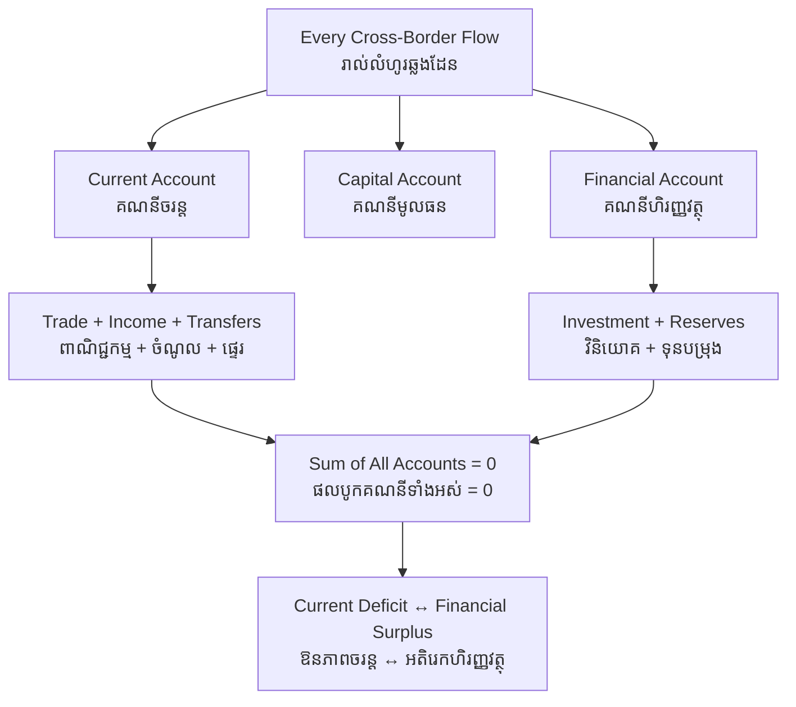

# Balance of Payments — First-Principles Derivation
# ជញ្ជីងទូទាត់ — ការស្រាយបញ្ជាក់ពីគោលការណ៍ដំបូង

*Author: ichamrong | Date: 2026-06-01*

---

## Foundational Scholars / អ្នកសិក្សាស្ថាបនិក

The double-entry logic traces to the mercantilist debates and to **David Hume**, whose 1752 *Of the Balance of Trade* described the *price-specie-flow mechanism* — how trade imbalances self-correct through gold flows. The modern accounting framework was standardized by the **International Monetary Fund** in its *Balance of Payments Manual* (first edition 1948, now BPM6), which defines the current, capital, and financial accounts that every country reports. This course, *Introduction to Global Financial Markets* (see [../../year-1/02-introduction-to-global-financial-markets.md](../../year-1/02-introduction-to-global-financial-markets.md)), uses the balance of payments as the ledger that links a nation to the world economy.

---

## Core Problem / បញ្ហាស្នូល

**English:** A nation, like a household, sends money abroad (for imports, foreign investments, debt repayments) and receives money from abroad (for exports, foreign investment inflows, remittances). How do we account for *every* cross-border money flow in a single, consistent ledger — and what does it mean when one part of that ledger runs a "deficit" or a "surplus"? We need to derive the structure of the accounts, prove why they must balance overall, and interpret what an imbalance in any one account is actually telling us.

**ខ្មែរ:** ប្រទេសមួយ ដូចជាគ្រួសារ ផ្ញើប្រាក់ទៅក្រៅប្រទេស (សម្រាប់ការនាំចូល ការវិនិយោគបរទេស ការសងបំណុល) និងទទួលប្រាក់ពីក្រៅប្រទេស (សម្រាប់ការនាំចេញ ការវិនិយោគចូល ប្រាក់ផ្ញើពីពលករ)។ តើយើងគណនា **រាល់** លំហូរប្រាក់ឆ្លងដែន ក្នុងបញ្ជីតែមួយដែលស៊ីសង្វាក់គ្នាយ៉ាងដូចម្តេច — ហើយតើវាមានន័យដូចម្តេច ពេលផ្នែកមួយនៃបញ្ជីនោះមាន "ឱនភាព" ឬ "អតិរេក"? យើងត្រូវស្រាយរចនាសម្ព័ន្ធគណនី បញ្ជាក់ហេតុអ្វីវាត្រូវតែតុល្យភាពជារួម និងបកស្រាយថា អតុល្យភាពក្នុងគណនីណាមួយ ពិតជាប្រាប់យើងអំពីអ្វី។

---

## First Principles Derivation / ការស្រាយបញ្ជាក់ពីគោលការណ៍ដំបូង

**Axiom 1 — Every transaction has two sides (អ័ក្សទ ១ — រាល់ប្រតិបត្តិការមានពីរផ្នែក):**
The balance of payments is built on double-entry bookkeeping. Every flow that brings money in (a credit) is matched by an entry recording what was given in return (a debit).

**Axiom 2 — Flows sort into three accounts (អ័ក្សទ ២ — លំហូរបែងចែកជាបីគណនី):**
- **Current account:** trade in goods and services, plus income (wages, investment returns) and transfers (remittances, aid).
- **Capital account:** transfers of capital assets and non-produced, non-financial assets (small in most economies).
- **Financial account:** cross-border purchases and sales of assets — direct investment, portfolio flows, reserves.

**Axiom 3 — The full ledger must balance (អ័ក្សទ ៣ — បញ្ជីពេញត្រូវតុល្យភាព):**
Because every credit has a matching debit, the sum of all three accounts (plus a statistical discrepancy term) equals zero by construction.

**Derivation Chain (ខ្សែសង្វាក់ការស្រាយ):**

1. If a country imports more goods and services than it exports, its **current account is in deficit**.
2. That deficit must be financed: foreigners must be lending to it or buying its assets. So a current-account deficit is *mirrored* by a **financial-account surplus** (net capital inflow).
3. Conversely, a current-account *surplus* means the country is a net lender to the world — it accumulates foreign assets.
4. Therefore "deficit" is not automatically bad nor "surplus" automatically good: a deficit financed by productive investment can build future capacity; a surplus from suppressed domestic spending can signal weak demand.
5. The exchange rate and capital flows adjust to keep the overall ledger balanced.

**Key identity (សមីការសំខាន់):** Current Account + Capital Account + Financial Account ≈ 0. An imbalance in one account is necessarily offset elsewhere.

---

## Visual Derivation / ការបង្ហាញដោយមើលឃើញ

---

## Sustainability Note / ចំណាំអំពីនិរន្តរភាព

The balance of payments shapes a developing country's room to fund a green transition. Importing solar panels, wind turbines, and electric buses widens the current-account deficit in the short run; it must be financed by capital inflows — ideally green bonds and climate finance rather than expensive short-term debt. A country dependent on exporting a single commodity (timber, oil, garments) carries a fragile balance of payments vulnerable to price shocks, which is itself a sustainability risk. See [foreign-exchange](../foreign-exchange/01-mit-professor.md) and [comparative-advantage](../comparative-advantage/01-mit-professor.md).

---

## Cambodian Application / ការអនុវត្តន៍ក្នុងបរិបទកម្ពុជា

**Cambodia's reliance on garments and remittances:** Cambodia typically runs a large trade deficit in goods (it imports machinery, fuel, and inputs) partly offset by garment and footwear exports, tourism receipts in the services account, and remittances from migrant workers in the income/transfer lines. The remaining current-account gap is financed by foreign direct investment and concessional lending in the financial account. Reading these accounts together shows how dependent the riel economy is on continued capital inflows — and why a sudden stop in investment would force painful adjustment.

---

## Related Posts / អត្ថបទដែលទាក់ទង

- [02 — Feynman Technique](./02-feynman.md)
- [03 — Socratic Dialogue](./03-socratic.md)
- [04 — Analogy Bridge](./04-analogy.md)
- [05 — Narrative Story](./05-storyteller.md)
- [06 — Journalist Interview](./06-interview.md)
- [Course: Introduction to Global Financial Markets](../../year-1/02-introduction-to-global-financial-markets.md)
- [Parable: The Emperor and the Trade Route](../../year-1/parables/266-the-emperor-and-the-trade-route.md)
