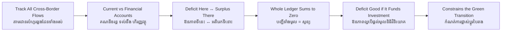

# Balance of Payments — Socratic Dialogue
# ជញ្ជីងទូទាត់ — ការសន្ទនាបែប Socratic

*Author: ichamrong | Date: 2026-06-01*

---

**Professor:** Sophea, when Cambodia buys petrol from abroad, does money leave the country or enter it?

**Sophea:** It leaves — we pay foreigners for the fuel.

**Professor:** And when a foreign buyer purchases Cambodian garments?

**Sophea:** Money comes in. We sell, they pay.

**Professor:** So if I wanted to track *every* such flow — goods, services, money sent home by workers, investments — what would I need?

**Sophea:** A complete ledger of all money crossing the border, in both directions.

**Professor:** That ledger is the **balance of payments**. Now, economists group the everyday buying and selling of goods and services into one account. What might we call it?

**Sophea:** The current account — the current, ongoing trade and income flows.

**Professor:** Good. Suppose Cambodia imports more goods and services than it exports. What's that account doing?

**Sophea:** Running a deficit. More money flowing out for imports than coming in for exports.

**Professor:** Now here's the puzzle. If we're paying out more than we take in, how do we afford it? Where does the extra money come from?

**Sophea:** It has to come from somewhere... foreigners must be lending to us, or investing here, or buying our assets.

**Professor:** And those inflows are recorded in which account?

**Sophea:** The financial account. So when the current account is in deficit, the financial account is in surplus to match.

**Professor:** So can the overall balance of payments ever fail to balance?

**Sophea:** No — by construction it sums to zero. Every riel going out to buy imports is a riel that came in some other way.

**Professor:** Excellent. Now the trap. A newspaper headline screams "Cambodia runs a huge trade deficit!" Should we panic?

**Sophea:** Not necessarily. It depends on *why*. If we're importing machines and equipment to build factories and infrastructure, the deficit is financing investment in the future.

**Professor:** And if the inflows financing it dried up suddenly?

**Sophea:** Then we couldn't afford the imports anymore — the currency would have to weaken or spending would have to fall sharply. A sudden stop.

**Professor:** So is a surplus always the safe, virtuous position?

**Sophea:** No. A surplus can mean a country's own people aren't spending — maybe they're too poor or too cautious — so it sends its savings abroad instead of building at home.

**Professor:** Now connect it to this program's theme. Cambodia wants to import solar panels and electric buses for a green transition. What happens to the balance of payments?

**Sophea:** Those imports widen the current-account deficit in the short run, so we need capital inflows to finance them — ideally green bonds and climate finance rather than expensive debt.

**Professor:** So the balance of payments isn't just accounting — it's the constraint within which a country can afford to transform itself.

**Sophea:** Yes. It tells you how much the rest of the world is willing to fund your future, and on what terms.

---

## Insight Chain / ខ្សែសង្វាក់ការយល់ដឹង

---

## Related Posts / អត្ថបទដែលទាក់ទង

- [01 — MIT Professor](./01-mit-professor.md)
- [02 — Feynman Technique](./02-feynman.md)
- [04 — Analogy Bridge](./04-analogy.md)
- [05 — Narrative Story](./05-storyteller.md)
- [06 — Journalist Interview](./06-interview.md)
- [Course: Introduction to Global Financial Markets](../../year-1/02-introduction-to-global-financial-markets.md)
- [Parable: The Emperor and the Trade Route](../../year-1/parables/266-the-emperor-and-the-trade-route.md)
