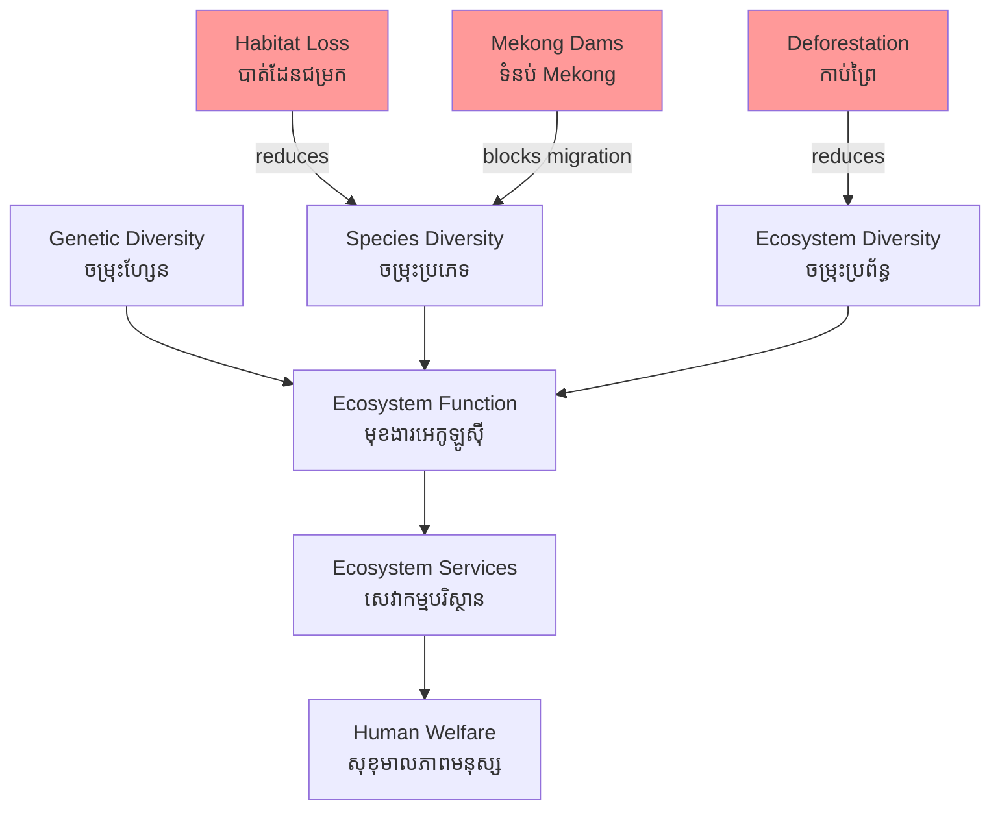

# Biodiversity — First-Principles Derivation
# ជីវចម្រុះ — ការដឹកនាំពីគោលការណ៍មូលដ្ឋាន

*By Prof. E.O. Wilson, Harvard (legacy) & Prof. Partha Dasgupta, Cambridge | ដោយ សាស្ត្រាចារ្យ Partha Dasgupta*

*Author: ichamrong | Date: 2026-05-29*

---

## Core Problem | បញ្ហាស្នូល

The current rate of species extinction is estimated at 100–1,000 times the natural background rate — what scientists call the Sixth Mass Extinction (ការផុតពូជលើកទី ៦). Unlike the previous five, this one is caused by a single species: *Homo sapiens*. The Dasgupta Review (2021) frames biodiversity loss as an economic crisis: we have been running down our natural asset base while recording it as income. Cambodia's Mekong fishery — the most biodiverse river basin on Earth after the Amazon — is at the center of this crisis.

---

## First Principles Derivation | ការដឹកនាំពីគោលការណ៍

**Definition:** *Biodiversity* (ជីវចម្រុះ) encompasses three nested levels:
1. **Genetic diversity** — variation within species (allelic variation enabling adaptation)
2. **Species diversity** — number and relative abundance of species in an area
3. **Ecosystem diversity** — variety of habitat types and ecological communities

**Axiom 1: Ecological function depends on diversity.**
Ecosystems provide services through complex interaction networks among species. Remove keystone species (ប្រភេទសំខាន់) and entire food webs collapse. Diversity provides redundancy — multiple species performing similar functions, so the loss of one does not eliminate the function.

**Axiom 2: Diversity confers resilience.**
A biodiverse system has more functional pathways and can absorb disturbances without state change. Monocultures (systems with low diversity) are brittle — a single pathogen can collapse them.

**Axiom 3: Biodiversity is natural capital.**
Following Dasgupta: biodiversity is not merely an aesthetic or moral value. It is the stock that produces the flow of ecosystem services. Depleting biodiversity is equivalent to consuming capital — drawing down the principal, not just the interest.

**Implication 1:** The economic value of biodiversity includes: direct use values (food, medicine, fiber), indirect use values (ecosystem services), option values (future uses not yet known), and existence values (intrinsic worth).

**Implication 2:** Markets systematically underprovide biodiversity conservation because most biodiversity values are public goods — non-excludable, non-rival. No individual has sufficient incentive to conserve.

**Implication 3:** Biodiversity loss is largely irreversible on human timescales. Unlike financial capital, extinct species cannot be rebuilt by investment. This asymmetry argues for a strong precautionary principle.

**The Mekong case:** The Mekong River basin hosts over 1,000 freshwater fish species — second only to the Amazon. The Tonle Sap Lake alone contains ~200 species. Mekong mainstream dams block fish migration routes that these species have used for millions of years. The Mekong giant catfish (*Pangasianodon gigas* — ត្រីបឹងខ្មែរ) is critically endangered. Disruption of this biodiversity cascade threatens the food security of 60 million people.

---

## Visual Derivation | ដ្យាក្រាមដឹកនាំ

---

## Real-World Application | ការអនុវត្តជាក់ស្តែង

**Cambodia's biodiversity assets:**
- Tonle Sap Lake: UNESCO Biosphere Reserve, ~200 fish species, globally significant waterbird habitat
- Cardamom Mountains: Intact lowland evergreen forest, habitat for tigers (functionally extinct), elephants, Siamese crocodile
- Mekong River: Irrawaddy dolphins (*Orcaella brevirostris*) — fewer than 100 individuals remain
- Cambodia holds ~12% of the world's remaining Siamese crocodile population

**Threats:**
- Mekong mainstream dams (Don Sahong, Pak Beng, etc.) blocking fish migration
- Sand mining in Mekong bed destroying spawning habitat
- Illegal wildlife trade (Cambodia is a transit country)
- Agricultural expansion into protected areas

**Policy response:** Cambodia's Biodiversity Strategy and Action Plan (NBSAP), Protected Area network covering ~25% of land area, Community Fisheries program, REDD+ forest carbon.

---

## Related Posts | អត្ថបទពាក់ព័ន្ធ

- [02 — Feynman Explanation](../negative-externality/02-feynman.md)
- [03 — Socratic Dialogue](../negative-externality/03-socratic.md)
- [04 — Analogy Bridge](../monopoly/04-analogy.md)
- [05 — Narrative Story](../precautionary-principle/05-storyteller.md)
- [06 — Journalist Interview](../precautionary-principle/06-interview.md)
- [Parable: The River That Fed the Village](../../year-1/parables/262-the-river-that-fed-the-village.md)
