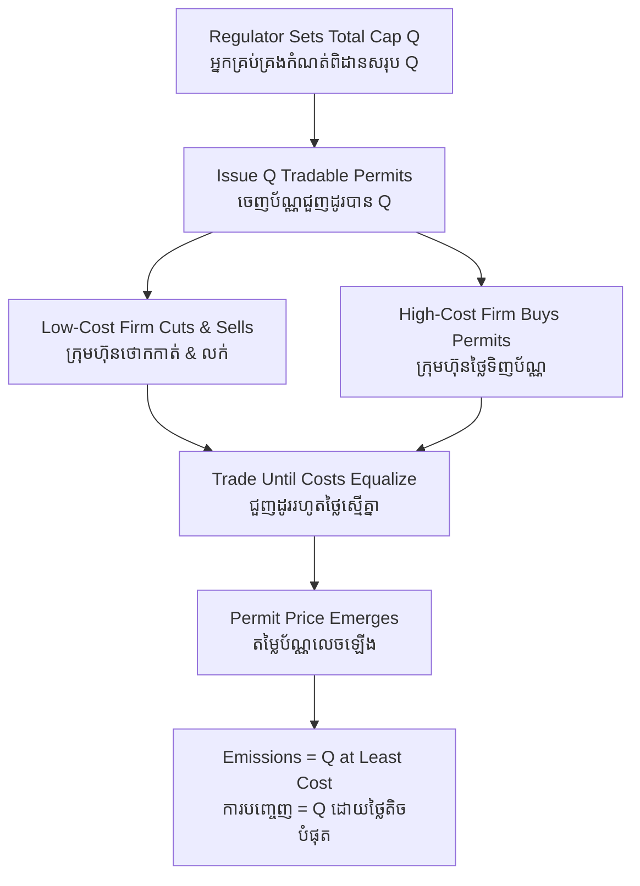

# Cap and Trade — First-Principles Derivation
# ប្រព័ន្ធកំណត់កម្រិត និងការជួញដូរ — ការស្រាយបញ្ជាក់ពីគោលការណ៍ដំបូង

*Author: ichamrong | Date: 2026-06-01*

---

## Foundational Scholars / អ្នកសិក្សាស្ថាបនិក

**John Dales** (University of Toronto), in his 1968 *Pollution, Property and Prices*, proposed that pollution could be controlled by creating tradable rights to emit. Building on Ronald Coase's insight that clearly defined property rights enable efficient bargaining, Dales argued that if a government issued a fixed number of pollution permits and let firms buy and sell them, the market would allocate emissions to whoever valued them most — at least cost. This **cap-and-trade** mechanism became the architecture of real systems like the U.S. sulphur-dioxide program and the European Union Emissions Trading System (EU ETS). This course, *Environmental Economics* (see [../../year-4/02-environmental-economics.md](../../year-4/02-environmental-economics.md)), treats it as the quantity-based twin of the carbon tax.

---

## Core Problem / បញ្ហាស្នូល

**English:** Suppose society decides exactly how much carbon it can safely emit in a year — a hard ceiling. We could order every firm to cut by the same percentage, but firms differ wildly in how cheaply they can cut. A uniform command wastes money: it forces expensive cuts at one firm while leaving cheap cuts unmade at another. We need a way to hit the total ceiling precisely while ensuring the cuts happen wherever they are cheapest — without a planner knowing each firm's cost.

**ខ្មែរ:** ឧបមាថាសង្គមសម្រេចចិត្តយ៉ាងជាក់លាក់ថា វាអាចបញ្ចេញកាបូនប៉ុន្មានដោយសុវត្ថិភាពក្នុងមួយឆ្នាំ — ពិដានរឹង។ យើងអាចបញ្ជាឱ្យក្រុមហ៊ុនទាំងអស់កាត់បន្ថយតាមភាគរយដូចគ្នា ប៉ុន្តែក្រុមហ៊ុនមានភាពខុសគ្នាយ៉ាងខ្លាំងអំពីថ្លៃនៃការកាត់បន្ថយ។ ការបញ្ជាឯកសណ្ឋានខ្ជះខ្ជាយប្រាក់៖ វាបង្ខំឱ្យកាត់បន្ថយថ្លៃនៅក្រុមហ៊ុនមួយ ខណៈដែលទុកការកាត់បន្ថយថោកមិនធ្វើនៅក្រុមហ៊ុនមួយទៀត។ យើងត្រូវការវិធីសម្រេចបានពិដានសរុបយ៉ាងជាក់លាក់ ខណៈធានាថាការកាត់បន្ថយកើតឡើងនៅកន្លែងដែលថោកបំផុត — ដោយមិនចាំបាច់ឱ្យអ្នករៀបចំផែនការដឹងពីថ្លៃរបស់ក្រុមហ៊ុននីមួយៗ។

---

## First Principles Derivation / ការស្រាយបញ្ជាក់ពីគោលការណ៍ដំបូង

**Axiom 1 — A fixed cap defines scarcity (អ័ក្សទ ១ — ពិដានថេរបង្កើតភាពកម្រ):**
The regulator sets the total tonnes allowed and issues exactly that many permits, one tonne each. Emitting without a permit is illegal. Scarcity is created by decree.

**Axiom 2 — Firms differ in marginal abatement cost (អ័ក្សទ ២ — ក្រុមហ៊ុនមានថ្លៃកាត់បន្ថយរឹមខុសគ្នា):**
For some firms, cutting a tonne is cheap; for others, expensive. Each knows its own cost; the regulator does not.

**Axiom 3 — Voluntary trade moves a permit to its highest-value user (អ័ក្សទ ៣ — ការជួញដូរស្ម័គ្រចិត្តផ្លាស់ប័ណ្ណទៅអ្នកប្រើដែលឱ្យតម្លៃខ្ពស់បំផុត):**
A firm that finds cutting cheap will sell its spare permits; a firm that finds cutting dear will buy them.

**Derivation Chain (ខ្សែសង្វាក់ការស្រាយ):**

1. The regulator sets the cap *Q* and distributes *Q* permits (by auction or free allocation).
2. Trading begins. A firm with low abatement cost cuts emissions and sells its unused permits; a firm with high cost buys permits instead of cutting.
3. Trade continues until no two firms have different marginal abatement costs — otherwise a profitable trade would still exist.
4. At that point every firm's marginal cost of abatement equals the **permit price**, which emerges from the market, not the regulator.
5. The result: total emissions equal exactly *Q* (environmental certainty), and the cuts are achieved at **least total cost** (cost-effectiveness) — the same efficiency a carbon tax delivers.

**Cap design (ការរចនាពិដាន):** A declining cap year on year drives emissions down on a schedule. Auctioning permits (rather than giving them free) raises revenue like a tax and avoids windfall profits. A price floor and ceiling ("collar") can prevent the permit price from collapsing or spiking.

---

## Visual Derivation / ការបង្ហាញដោយមើលឃើញ

---

## Cap-and-Trade vs. Carbon Tax / ប្រៀបធៀបនឹងពន្ធកាបូន

Cap-and-trade fixes the **quantity** of emissions and lets the price float; a carbon tax fixes the **price** and lets the quantity float (see [carbon-tax](../carbon-tax/01-mit-professor.md)). Cap-and-trade gives environmental certainty but volatile prices; a tax gives price certainty but uncertain emissions. Both, in theory, achieve the same least-cost abatement. The EU ETS is the largest real-world cap-and-trade system.

---

## Cambodian Application / ការអនុវត្តន៍ក្នុងបរិបទកម្ពុជា

**Regional power and the ASEAN grid:** As Cambodia integrates into a regional electricity market, a cap-and-trade scheme covering large power plants could let a hydro-rich operator sell permits to a coal-dependent one, driving the cheapest regional cuts first. More immediately, Cambodian forest-protection projects already sell verified carbon credits into international voluntary markets — a permit-trading logic that channels foreign payment into keeping Cambodian forests standing, provided the credits are genuine and not double-counted.

---

## Related Posts / អត្ថបទដែលទាក់ទង

- [02 — Feynman Technique](./02-feynman.md)
- [03 — Socratic Dialogue](./03-socratic.md)
- [04 — Analogy Bridge](./04-analogy.md)
- [05 — Narrative Story](./05-storyteller.md)
- [06 — Journalist Interview](./06-interview.md)
- [Keyword: Carbon Tax](../carbon-tax/01-mit-professor.md)
- [Keyword: Negative Externality](../negative-externality/01-mit-professor.md)
- [Course: Environmental Economics](../../year-4/02-environmental-economics.md)
- [Parable: The Lake That Belonged to Everyone](../../year-4/parables/282-the-lake-that-belonged-to-everyone.md)
