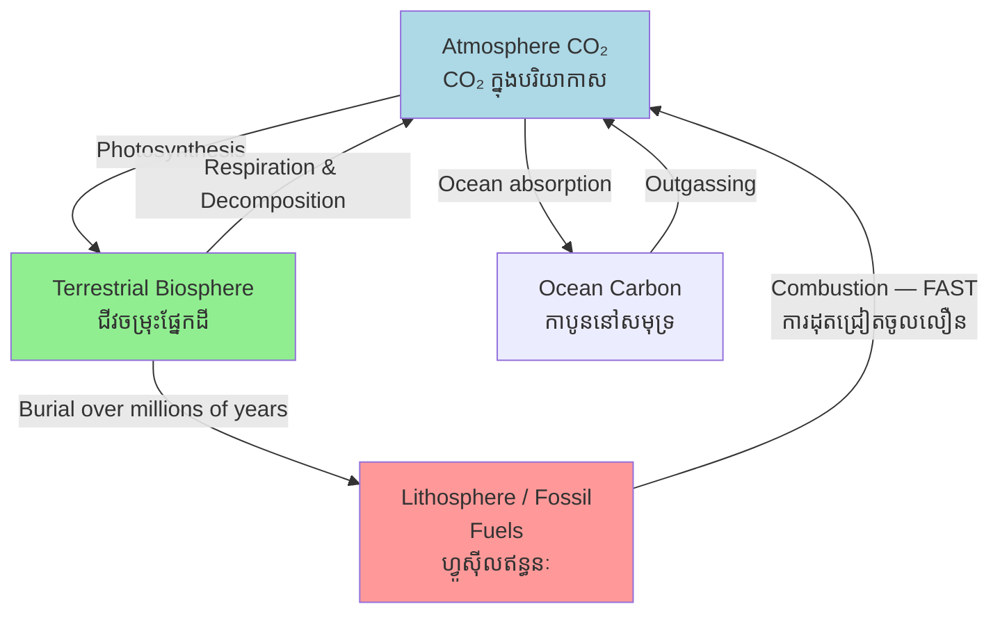

# Carbon Cycle — First-Principles Derivation
# វដ្តកាបូន — ការដឹកនាំពីគោលការណ៍មូលដ្ឋាន

*By Prof. Charles Keeling, Scripps Institution of Oceanography (legacy) | ដោយ សាស្ត្រាចារ្យ Charles Keeling*

*Author: ichamrong | Date: 2026-05-29*

---

## Core Problem | បញ្ហាស្នូល

Carbon (C) is the backbone of life and the regulator of Earth's climate. Human industrial activity has added roughly 420 billion tonnes of carbon to the atmosphere since 1750 — at a rate ten times faster than any natural geological process. Understanding the carbon cycle (វដ្តកាបូន) is prerequisite to understanding climate change, ecosystem function, and the economics of decarbonization.

---

## First Principles Derivation | ការដឹកនាំពីគោលការណ៍

**Axiom 1:** Carbon atoms are neither created nor destroyed — only rearranged between reservoirs.

**Axiom 2:** Four major carbon reservoirs exist: atmosphere (CO₂), terrestrial biosphere (living organisms + soil), ocean (dissolved inorganic + organic carbon), and lithosphere (fossil fuels + rocks).

**Axiom 3:** Carbon flows between reservoirs through specific processes with characteristic timescales:
- **Photosynthesis** (ដំណើរការ photosynthesis): CO₂ + H₂O + sunlight → C₆H₁₂O₆ + O₂ (fast; seasonal to annual)
- **Respiration** (ការដកដង្ហើម): reverse; organisms release CO₂ (fast)
- **Decomposition** (ការរំលាយ): microbes break down dead organic matter, releasing CO₂ and methane CH₄ (fast to slow)
- **Ocean absorption**: CO₂ dissolves in seawater as carbonic acid H₂CO₃ (fast)
- **Geological weathering**: CO₂ reacts with silicate rocks, forming carbonates (very slow — millions of years)
- **Fossil fuel combustion** (ការដុត​ឥន្ធនៈ​ហ្វូស៊ីល): releases lithospheric carbon in decades (anthropogenic; catastrophically fast)

**Axiom 4:** Methane (CH₄) is 28× more potent than CO₂ as a greenhouse gas over 100 years. Rice paddies and livestock produce significant CH₄ through anaerobic decomposition.

**The Carbon Budget Equation:**
> ΔC_atm = C_emissions − C_land_uptake − C_ocean_uptake

Currently: ~10 GtC/year emitted, ~5 GtC/year absorbed by land + ocean, ~5 GtC/year accumulating in atmosphere → rising CO₂.

**Implication 1:** The atmosphere is a shared global sink. Any additional emission by one country imposes a cost on all others.

**Implication 2:** Restoring terrestrial carbon sinks — forests, peatlands, mangroves — is the fastest and cheapest near-term decarbonization lever.

**Implication 3:** Cambodia's rice paddies produce methane from flooded anaerobic conditions. At national scale, this is a significant emission source within Cambodia's NDC (National Determined Contribution — ការ​ប្រতិ​ព័ន្ធ​ជាតិ) under the Paris Agreement.

---

## Visual Derivation | ដ្យាក្រាមដឹកនាំ

---

## Real-World Application | ការអនុវត្តជាក់ស្តែង

**Cambodia's carbon sources and sinks:**

| Source / Sink | Type | Scale |
|---|---|---|
| Cardamom Mountains forest | Sink — carbon stored in biomass | Large |
| Mekong mangroves (Koh Kong) | Sink — "blue carbon" in soil | Significant |
| Rice paddies (flooded) | Source — methane CH₄ | National scale |
| Garment factory energy use | Source — CO₂ from electricity | Growing |
| Phnom Penh transport | Source — CO₂ | Growing |
| REDD+ forest protection | Avoided source — keeps C in trees | Policy lever |

**The REDD+ logic:** A hectare of intact tropical forest in Cambodia stores ~150–200 tonnes of carbon. If that hectare is cleared, that carbon is released as CO₂ over 1–3 years. REDD+ pays Cambodia to avoid this release — essentially monetizing the "avoided emission" as a carbon credit.

**Rice paddy methane:** Cambodia produces roughly 9 million tonnes of rice annually across ~3 million hectares of paddies. Flooded paddies create anaerobic conditions where methanogenic bacteria release CH₄. Techniques like alternate wetting and drying (AWD) can reduce methane by 30–70% with little yield loss — a key target in Cambodia's NDC.

---

## Related Posts | អត្ថបទពាក់ព័ន្ធ

- [02 — Feynman Explanation](./02-feynman.md)
- [03 — Socratic Dialogue](./03-socratic.md)
- [04 — Analogy Bridge](./04-analogy.md)
- [05 — Narrative Story](./05-storyteller.md)
- [06 — Journalist Interview](./06-interview.md)
- [Parable: The River That Fed the Village](../../year-1/parables/262-the-river-that-fed-the-village.md)
