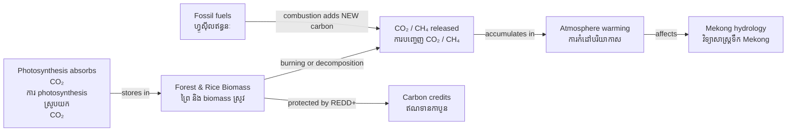

# Carbon Cycle — Socratic Dialogue
# វដ្តកាបូន — កិច្ចសន្ទនាបែប Socrates

*Author: ichamrong | Date: 2026-05-29*

---

**Professor:** Dara, when a Cambodian farmer burns a rice field after harvest, where does the carbon go?

**Dara:** It goes into the air as CO₂ and smoke particles.

**Professor:** Was that carbon always in the air?

**Dara:** No — the rice plant absorbed it from the air through photosynthesis during the growing season.

**Professor:** So burning the rice straw is carbon-neutral?

**Dara:** In principle, yes — the CO₂ released is the same CO₂ that the plant took from the air a few months ago. It's the same carbon returning.

**Professor:** Now, when a coal power plant in Phnom Penh burns coal to make electricity, where did that carbon come from originally?

**Dara:** From ancient plants buried underground for millions of years. It was locked in the lithosphere — not in the active carbon cycle.

**Professor:** So what is the difference between burning rice straw and burning coal?

**Dara:** Rice straw carbon was cycling through the atmosphere recently — it's recirculating. Coal carbon was removed from the atmosphere millions of years ago. Burning it adds new carbon to the active cycle.

**Professor:** Excellent. Now, Cambodia's rice paddies are flooded for much of the year. What happens in anaerobic mud — mud without oxygen?

**Dara:** Bacteria break down organic matter without oxygen and produce methane (CH₄ — ម៉ីតាន) instead of CO₂.

**Professor:** Is methane more or less potent as a greenhouse gas than CO₂?

**Dara:** Much more potent — about 28 times stronger over 100 years.

**Professor:** So Cambodia's rice paddies are a significant greenhouse gas source?

**Dara:** Yes — even though Cambodia has very low fossil fuel emissions, our rice agriculture contributes methane. The NDC (ការប្រតិព័ន្ធជាតិ) mentions this.

**Professor:** What technique can reduce paddy methane without sacrificing yield?

**Dara:** Alternate wetting and drying (AWD — ការស្រោចទឹកជំនួស) — flooding and drying the paddy in cycles rather than keeping it constantly flooded. The aerobic periods reduce methane production.

**Professor:** Now, the Cardamom Mountains forest. Is it a carbon source or sink?

**Dara:** A carbon sink — the living trees and soil store carbon that would otherwise be in the atmosphere.

**Professor:** If that forest is cleared, what happens to the stored carbon?

**Dara:** It is released — some immediately through burning, the rest over years as the soil and dead wood decompose.

**Professor:** REDD+ pays Cambodia not to clear the forest. Is that payment compensating Cambodia for something valuable?

**Dara:** Yes — for the avoided carbon emission that would otherwise warm the global atmosphere. The forest is essentially providing a carbon regulation service to the whole world.

**Professor:** Should that payment be higher than it currently is?

**Dara:** Arguably yes. The true social cost of carbon is estimated at $50–$200 per tonne, but many REDD+ credits trade far below that. Cambodia's forest communities often receive less than $5 per tonne of carbon protected.

---

## Insight Chain | ខ្សែសង្វាក់ការយល់ដឹង

---

## Related Posts | អត្ថបទពាក់ព័ន្ធ

- [01 — MIT Professor](./01-mit-professor.md)
- [02 — Feynman Explanation](./02-feynman.md)
- [04 — Analogy Bridge](./04-analogy.md)
- [05 — Narrative Story](./05-storyteller.md)
- [06 — Journalist Interview](./06-interview.md)
- [Parable: The River That Fed the Village](../../year-1/parables/262-the-river-that-fed-the-village.md)
