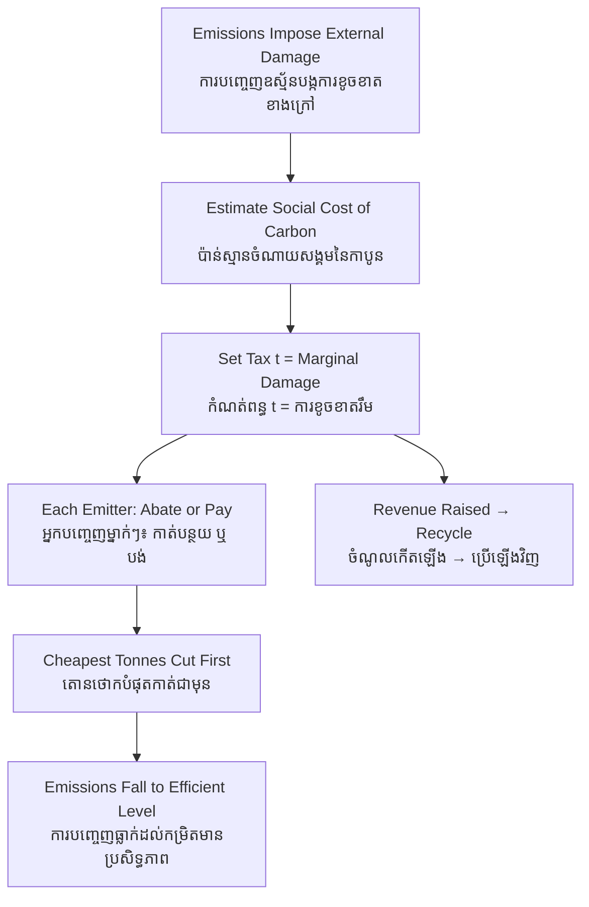

# Carbon Tax — First-Principles Derivation
# ពន្ធកាបូន — ការស្រាយបញ្ជាក់ពីគោលការណ៍ដំបូង

*Author: ichamrong | Date: 2026-06-01*

---

## Foundational Scholars / អ្នកសិក្សាស្ថាបនិក

**Arthur Cecil Pigou** (University of Cambridge), in his 1920 *The Economics of Welfare*, gave us the corrective tax that bears his name. Pigou's insight was that when a factory's smoke harms third parties, the factory's private cost is lower than the cost it imposes on society. The market, left alone, treats pollution as free and therefore produces too much of it. Pigou's remedy: levy a tax equal to the marginal external damage, so the polluter's private cost rises to meet the true social cost. A **carbon tax** is the Pigouvian tax applied to greenhouse-gas emissions. This course, *Environmental Economics* (see [../../year-4/02-environmental-economics.md](../../year-4/02-environmental-economics.md)), treats Pigou's correction as the canonical price-based response to climate externalities.

---

## Core Problem / បញ្ហាស្នូល

**English:** Burning fossil fuels releases carbon dioxide that warms the planet, harming people who had no part in the transaction — future generations, low-lying coastal communities, farmers facing drought. The emitter pays for fuel and labour but not for this climate damage. The price of carbon-intensive goods is therefore too low, and society consumes too much of them. How do we design a single instrument that forces every emitter, everywhere, to face the true cost of their carbon without a planner having to know each one's abatement options?

**ខ្មែរ:** ការដុតឥន្ធនៈផូស៊ីលបញ្ចេញឧស្ម័នកាបូនឌីអុកស៊ីត ដែលធ្វើឱ្យផែនដីកក់ក្ដៅ បង្កគ្រោះថ្នាក់ដល់មនុស្សដែលគ្មានចំណែកក្នុងប្រតិបត្តិការនោះ — មនុស្សជំនាន់ក្រោយ សហគមន៍តាមឆ្នេរសមុទ្រទាប កសិករដែលប្រឈមនឹងគ្រោះរាំងស្ងួត។ អ្នកបញ្ចេញឧស្ម័នបង់ថ្លៃឥន្ធនៈ និងពលកម្ម ប៉ុន្តែមិនបង់ថ្លៃនៃការខូចខាតបរិស្ថាននេះទេ។ ដូច្នេះតម្លៃនៃទំនិញដែលប្រើកាបូនច្រើនមានតម្លៃទាបពេក ហើយសង្គមប្រើប្រាស់វាច្រើនពេក។ តើយើងរចនាឧបករណ៍តែមួយយ៉ាងដូចម្ដេច ដើម្បីបង្ខំឱ្យអ្នកបញ្ចេញឧស្ម័នគ្រប់រូប ប្រឈមនឹងតម្លៃពិតនៃកាបូនរបស់ខ្លួន ដោយមិនចាំបាច់ឱ្យអ្នករៀបចំផែនការដឹងពីជម្រើសកាត់បន្ថយរបស់ម្នាក់ៗ?

---

## First Principles Derivation / ការស្រាយបញ្ជាក់ពីគោលការណ៍ដំបូង

**Axiom 1 — Social cost = private cost + external cost (អ័ក្សទ ១ — ចំណាយសង្គម = ចំណាយឯកជន + ចំណាយខាងក្រៅ):**
The full cost of a tonne of emissions is what the emitter pays *plus* the damage borne by others. The gap is the externality.

**Axiom 2 — Agents optimize against the prices they face (អ័ក្សទ ២ — ភ្នាក់ងារធ្វើឱ្យប្រសើរតាមតម្លៃដែលខ្លួនជួប):**
Firms and households respond to the cost in their own ledger, not to costs that fall on strangers. If carbon is free to them, they ignore it.

**Axiom 3 — A price changes behavior at the margin (អ័ក្សទ ៣ — តម្លៃផ្លាស់ប្ដូរឥរិយាបថនៅរឹម):**
Attach a per-tonne charge and every emitter weighs "abate or pay" for each tonne, choosing whichever is cheaper.

**Derivation Chain (ខ្សែសង្វាក់ការស្រាយ):**

1. Estimate the **marginal external damage** of a tonne of CO₂ — the *social cost of carbon* (SCC).
2. Set a tax *t* per tonne equal to that damage.
3. Each emitter now compares its own **marginal abatement cost** to *t*: if cutting a tonne costs less than *t*, it cuts; if more, it pays the tax.
4. Because every emitter faces the same *t*, the cheapest tonnes are cut first across the whole economy — abatement is achieved at **least total cost** (cost-effectiveness).
5. The new private cost equals the social cost, so the market's equilibrium quantity of emissions falls to the **efficient** level where marginal damage equals marginal abatement cost.

**Revenue recycling (ការប្រើប្រាស់ចំណូលឡើងវិញ):** The tax raises revenue. It can fund clean infrastructure, be returned as a per-capita dividend, or cut distortionary taxes on labour (a "tax shift"). How the revenue is used determines whether the policy is regressive or progressive.

---

## Visual Derivation / ការបង្ហាញដោយមើលឃើញ

---

## Carbon Tax vs. Cap-and-Trade / ពន្ធកាបូន ទល់នឹង ប្រព័ន្ធកំណត់កម្រិត

A carbon tax fixes the **price** of carbon and lets the quantity of emissions adjust. Cap-and-trade fixes the **quantity** and lets the price adjust (see [cap-and-trade](../cap-and-trade/01-mit-professor.md)). Under certainty the two are equivalent; under uncertainty the choice depends on whether the cost of getting the price wrong or the quantity wrong is steeper — the classic Weitzman "prices vs. quantities" result.

---

## Cambodian Application / ការអនុវត្តន៍ក្នុងបរិបទកម្ពុជា

**Diesel generators and garment factories:** Many Cambodian factories run on diesel during grid outages, and brick kilns burn wood and tyres. A modest carbon charge on imported fossil fuel would raise the cost of the dirtiest energy and make rooftop solar — already cheap in Cambodia's sun — the rational private choice. Crucially, recycling the revenue into a rural electrification fund could make the policy net-progressive, since wealthier urban firms emit far more per capita than the rural poor it would help.

---

## Related Posts / អត្ថបទដែលទាក់ទង

- [02 — Feynman Technique](./02-feynman.md)
- [03 — Socratic Dialogue](./03-socratic.md)
- [04 — Analogy Bridge](./04-analogy.md)
- [05 — Narrative Story](./05-storyteller.md)
- [06 — Journalist Interview](./06-interview.md)
- [Keyword: Cap and Trade](../cap-and-trade/01-mit-professor.md)
- [Keyword: Negative Externality](../negative-externality/01-mit-professor.md)
- [Course: Environmental Economics](../../year-4/02-environmental-economics.md)
- [Parable: The Lake That Belonged to Everyone](../../year-4/parables/282-the-lake-that-belonged-to-everyone.md)
