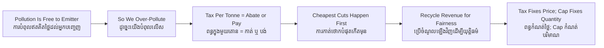

# Carbon Tax — Socratic Dialogue
# ពន្ធកាបូន — ការសន្ទនាបែប Socratic

*Author: ichamrong | Date: 2026-06-01*

---

**Professor:** Dara, when a cement factory burns coal, who pays for the coal?

**Dara:** The factory does. It buys the coal.

**Professor:** And the carbon dioxide that goes up the chimney — who pays for the harm that does?

**Dara:** Nobody, directly. It just goes into the air.

**Professor:** So is the factory paying the full cost of what it does?

**Dara:** No. It pays for the coal and the workers, but not for the climate damage. That part is free to it.

**Professor:** When something harmful is free, would you expect more of it or less?

**Dara:** More. If pollution costs nothing, there is no reason to limit it.

**Professor:** Now suppose we attach a charge — say, a fixed amount per tonne of carbon emitted. What does the factory do?

**Dara:** It would weigh whether to keep polluting and pay, or to find a way to pollute less.

**Professor:** And which would it choose?

**Dara:** Whichever is cheaper. If cutting a tonne costs less than the tax, it cuts. If cutting costs more, it pays.

**Professor:** Beautiful. Now think across a thousand factories, all facing the same charge. Which tonnes of carbon get cut first?

**Dara:** The ones that are cheapest to cut. Each factory cuts where it is easy, and pays where it is hard.

**Professor:** So without any official deciding who cuts what, we get the cheapest possible reduction. Does the government need to know each factory's options?

**Dara:** No. The price does the sorting. That is the elegant part.

**Professor:** Now a worry. A poor family that drives a small motorbike pays this tax on its fuel too. Is the tax fair?

**Dara:** Not by itself. The poor spend a bigger share of income on fuel, so a flat carbon tax can hit them harder. It can be regressive.

**Professor:** Yet the tax collects money. Could that money fix the fairness problem?

**Dara:** Yes — if you return it equally to everyone, the poor family, which pollutes little, gets back more than it paid. The rich, who pollute a lot, get back less than they paid.

**Professor:** So the tax and the rebate are two halves of one policy?

**Dara:** Right. The tax steers behaviour; the rebate handles fairness. Judging the tax without the rebate is judging half a thing.

**Professor:** Last question. We fix the *price* of carbon and let emissions fall to wherever they fall. Cap-and-trade fixes the *quantity* and lets the price move. Which gives you certainty about how much you cut?

**Dara:** Cap-and-trade — you set the cap, so you know the quantity. The tax gives you certainty about the price instead.

**Professor:** Hold that distinction. It is the whole debate between the two main carbon-pricing tools.

---

## Insight Chain / ខ្សែសង្វាក់ការយល់ដឹង

---

## Related Posts / អត្ថបទដែលទាក់ទង

- [01 — MIT Professor](./01-mit-professor.md)
- [02 — Feynman Technique](./02-feynman.md)
- [04 — Analogy Bridge](./04-analogy.md)
- [05 — Narrative Story](./05-storyteller.md)
- [06 — Journalist Interview](./06-interview.md)
- [Keyword: Cap and Trade](../cap-and-trade/03-socratic.md)
- [Course: Environmental Economics](../../year-4/02-environmental-economics.md)
- [Parable: The Lake That Belonged to Everyone](../../year-4/parables/282-the-lake-that-belonged-to-everyone.md)
