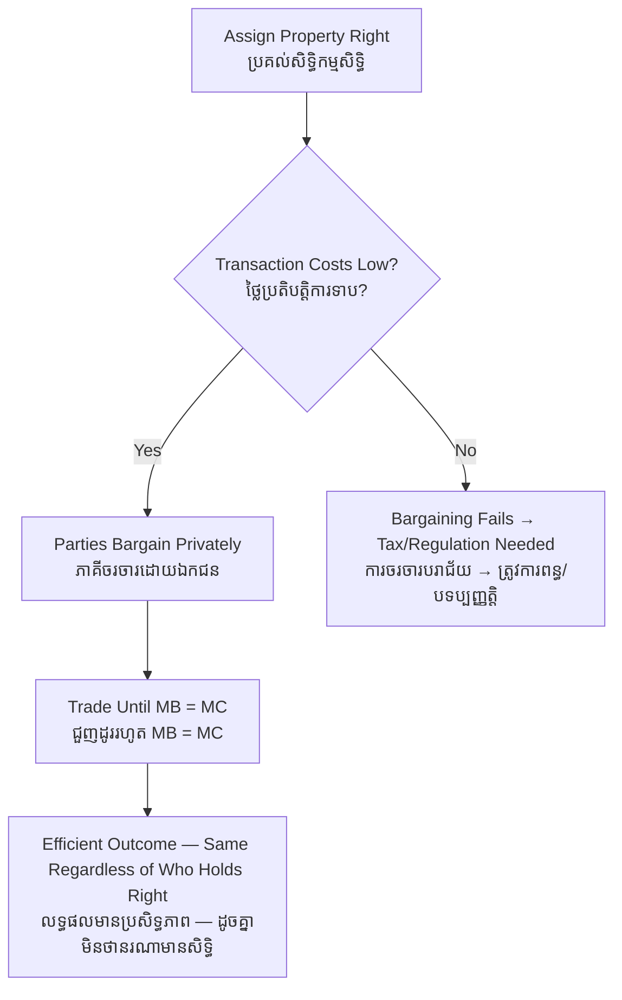

# Coase Theorem — First-Principles Derivation
# ទ្រឹស្តីបទ Coase — ការស្រាយបញ្ជាក់ពីគោលការណ៍ដំបូង

*Author: ichamrong | Date: 2026-06-01*

---

## Foundational Scholars / អ្នកសិក្សាស្ថាបនិក

**Ronald Coase** (University of Chicago), in his 1960 paper *The Problem of Social Cost*, overturned the standard view that externalities always require government taxes. Coase argued that if **property rights are clearly defined** and **the cost of bargaining is low**, the parties to an externality will negotiate their way to the efficient outcome on their own — regardless of *who* holds the right. The award of the right determines who pays whom, but not the final allocation of activity. George Stigler later named this the "Coase Theorem." This course, *Environmental Economics* (see [../../year-4/02-environmental-economics.md](../../year-4/02-environmental-economics.md)), uses it as the counterpoint to Pigouvian taxation: sometimes the cure for a market failure is not government intervention but a clear title and a room to talk in.

---

## Core Problem / បញ្ហាស្នូល

**English:** A factory's smoke harms a laundry next door. The standard remedy is a government tax on the smoke. But Coase asked a deeper question: is government action *necessary*? The harm is reciprocal — the factory harms the laundry only because the laundry is there; stopping the factory harms the factory. If we simply decide who has the right — the factory's right to emit, or the laundry's right to clean air — could the two parties bargain to the efficient level of smoke themselves, without a regulator setting the tax?

**ខ្មែរ:** ផ្សែងរបស់រោងចក្របង្កគ្រោះថ្នាក់ដល់ហាងបោកគក់ជាប់គ្នា។ ដំណោះស្រាយស្តង់ដារគឺពន្ធរបស់រដ្ឋាភិបាលលើផ្សែង។ ប៉ុន្តែ Coase បានសួរសំណួរជ្រៅជាងនេះ៖ តើសកម្មភាពរបស់រដ្ឋាភិបាល *ចាំបាច់* ឬទេ? ការខូចខាតគឺមានលក្ខណៈអន្តរគ្នា — រោងចក្របង្កគ្រោះថ្នាក់ដល់ហាងបោកគក់ ព្រោះតែហាងបោកគក់នៅទីនោះ។ ការបញ្ឈប់រោងចក្របង្កគ្រោះថ្នាក់ដល់រោងចក្រវិញ។ ប្រសិនបើយើងគ្រាន់តែសម្រេចថានរណាមានសិទ្ធិ — សិទ្ធិរបស់រោងចក្រក្នុងការបញ្ចេញផ្សែង ឬសិទ្ធិរបស់ហាងបោកគក់លើខ្យល់ស្អាត — តើភាគីទាំងពីរអាចចរចារទៅរកកម្រិតផ្សែងដែលមានប្រសិទ្ធភាពដោយខ្លួនឯងបានទេ ដោយគ្មានអ្នកគ្រប់គ្រងកំណត់ពន្ធ?

---

## First Principles Derivation / ការស្រាយបញ្ជាក់ពីគោលការណ៍ដំបូង

**Axiom 1 — Rights must be assigned (អ័ក្សទ ១ — សិទ្ធិត្រូវតែប្រគល់):**
Someone holds the entitlement — either the right to pollute or the right to be free of pollution. Without a clear right, no one can bargain over it.

**Axiom 2 — Mutually beneficial trades are taken when bargaining is costless (អ័ក្សទ ២ — ការជួញដូរផលប្រយោជន៍រួមត្រូវធ្វើពេលចរចារឥតគិតថ្លៃ):**
If one party values an outcome more than it harms the other, a payment exists that makes both better off, and they will make it.

**Axiom 3 — The efficient outcome maximizes total value (អ័ក្សទ ៣ — លទ្ធផលមានប្រសិទ្ធភាពធ្វើឱ្យតម្លៃសរុបអតិបរមា):**
The activity should occur up to the point where its marginal benefit equals its marginal cost, counting both parties.

**Derivation Chain (ខ្សែសង្វាក់ការស្រាយ):**

1. Assign the right — say the factory may pollute freely.
2. If the laundry's loss from smoke exceeds the factory's gain from the last unit of output, the laundry will *pay the factory* to cut back, and the factory accepts.
3. They keep trading until the factory's gain from one more unit of smoke just equals the laundry's loss — the **efficient level**.
4. Now reverse the right — the laundry is entitled to clean air. The factory will *pay the laundry* for permission to emit, again up to the point where marginal gain equals marginal loss.
5. **Same efficient level of smoke results either way.** The rights assignment changes *who pays whom* (the distribution), not *how much* pollution occurs (the efficiency). This is the Coase Theorem.

**The crucial assumptions (សម្មតិកម្មសំខាន់):** The result requires (a) clearly defined, enforceable property rights and (b) low **transaction costs** — the costs of finding the other party, negotiating, and enforcing the deal. When transaction costs are high or many parties are involved, private bargaining breaks down, and the rights assignment *does* affect the outcome — reopening the case for taxes or regulation.

---

## Visual Derivation / ការបង្ហាញដោយមើលឃើញ

---

## Limits of the Theorem / ដែនកំណត់នៃទ្រឹស្តីបទ

The Coase Theorem is powerful but fragile. It assumes few parties, costless bargaining, perfect information, and enforceable rights. Real climate change involves billions of emitters and victims across generations — transaction costs are astronomical, so private bargaining cannot work and a Pigouvian instrument (see [carbon-tax](../carbon-tax/01-mit-professor.md)) is needed. Coase's lasting lesson is diagnostic: *find the source of the transaction costs* before assuming government must act.

---

## Cambodian Application / ការអនុវត្តន៍ក្នុងបរិបទកម្ពុជា

**Upstream farm and downstream fishery:** A small community where one family's pesticide runoff harms a neighbour's fish ponds is a near-textbook Coasean setting — few parties, who know each other. With a clear understanding of who holds the right to the stream, the families can and often do negotiate directly: the fishery pays for a buffer of trees, or the farmer is compensated to switch inputs. But scale it up to thousands of farms draining into the Tonlé Sap and the transaction costs explode — now you need collective rules, not private deals, which is exactly the boundary Coase teaches us to look for.

---

## Related Posts / អត្ថបទដែលទាក់ទង

- [02 — Feynman Technique](./02-feynman.md)
- [03 — Socratic Dialogue](./03-socratic.md)
- [04 — Analogy Bridge](./04-analogy.md)
- [05 — Narrative Story](./05-storyteller.md)
- [06 — Journalist Interview](./06-interview.md)
- [Keyword: Carbon Tax](../carbon-tax/01-mit-professor.md)
- [Keyword: Negative Externality](../negative-externality/01-mit-professor.md)
- [Course: Environmental Economics](../../year-4/02-environmental-economics.md)
- [Parable: The Lake That Belonged to Everyone](../../year-4/parables/282-the-lake-that-belonged-to-everyone.md)
