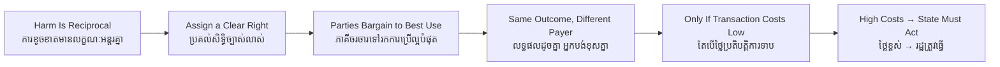

# Coase Theorem — Socratic Dialogue
# ទ្រឹស្តីបទ Coase — ការសន្ទនាបែប Socratic

*Author: ichamrong | Date: 2026-06-01*

---

**Professor:** Pisey, a cattle rancher's herd strays onto a neighbouring farmer's crops and eats them. Whose fault is the damage?

**Pisey:** The rancher's, surely — his cattle did the eating.

**Professor:** But if the farmer had not planted crops there, would the cattle have caused any harm?

**Pisey:** No... so in a way the harm needs both of them. The crops being there and the cattle being there.

**Professor:** Coase called that *reciprocal*. The harm exists only because of both activities. So the question is not "who is bad" but "what is the best use of that land?" Agreed?

**Pisey:** Agreed. Maybe the crops are worth more than the extra cattle, or maybe the reverse.

**Professor:** Suppose we give the rancher the legal right to let cattle roam. Is the farmer helpless?

**Pisey:** No. If his crops are worth more than the rancher's extra cattle, the farmer can pay the rancher to fence them in or keep fewer cattle.

**Professor:** And would the rancher accept?

**Pisey:** If the payment exceeds what the extra cattle earn him, yes. He's better off taking the money.

**Professor:** Now flip it. Give the farmer the right to be free of stray cattle. What happens?

**Pisey:** Then the rancher, if his cattle are worth more than the crops lost, pays the farmer for permission to let them roam.

**Professor:** So in the first case the farmer pays the rancher; in the second the rancher pays the farmer. Different, yes. But what about the final number of cattle and crops?

**Pisey:** It... should be the same? Whichever use is more valuable wins, because the loser can always be paid off up to the value of the activity.

**Professor:** Precisely. The rights assignment changes who pays whom, not the efficient outcome. That is Coase's theorem. Now — does this mean we never need government to fix pollution?

**Pisey:** That seems too strong. It only worked because there were just two people who could easily talk.

**Professor:** Sharp. What if instead of one farmer there were five hundred, scattered across a province, harmed by one factory?

**Pisey:** Then bargaining gets hard. You'd have to find all five hundred, get them to agree, collect contributions, stop people from refusing to pay while still enjoying the cleaner air. That's a nightmare.

**Professor:** We call those nightmares **transaction costs**. When they are low, what does Coase predict?

**Pisey:** Private bargaining reaches the efficient outcome on its own — no government needed.

**Professor:** And when transaction costs are high?

**Pisey:** Bargaining breaks down. Then the rights assignment *does* matter, and you may need a tax or a regulation to reach efficiency.

**Professor:** So is Coase an argument *against* government, or a tool for *deciding when* government is needed?

**Pisey:** The second. It tells you to look at transaction costs first. Low costs, few parties — let them bargain. High costs, many parties — the state may have to step in.

**Professor:** That is the whole value of the theorem. It does not abolish government; it tells you where to point it.

---

## Insight Chain / ខ្សែសង្វាក់ការយល់ដឹង

---

## Related Posts / អត្ថបទដែលទាក់ទង

- [01 — MIT Professor](./01-mit-professor.md)
- [02 — Feynman Technique](./02-feynman.md)
- [04 — Analogy Bridge](./04-analogy.md)
- [05 — Narrative Story](./05-storyteller.md)
- [06 — Journalist Interview](./06-interview.md)
- [Keyword: Negative Externality](../negative-externality/03-socratic.md)
- [Course: Environmental Economics](../../year-4/02-environmental-economics.md)
- [Parable: The Lake That Belonged to Everyone](../../year-4/parables/282-the-lake-that-belonged-to-everyone.md)
