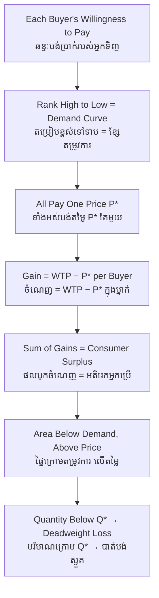

# Consumer Surplus — First-Principles Derivation
# អតិរេកអ្នកប្រើប្រាស់ — ការស្រាយបញ្ជាក់ពីគោលការណ៍ដំបូង

*Author: ichamrong | Date: 2026-06-01*

---

## Foundational Scholars / អ្នកសិក្សាស្ថាបនិក

**Jules Dupuit**, the French engineer-economist, introduced the idea in his 1844 study of the utility of public works, asking how much benefit a bridge gave beyond the tolls it collected. **Alfred Marshall** (University of Cambridge) formalized it in his 1890 *Principles of Economics* and named it *consumer's surplus*: "the excess of the price which he would be willing to pay rather than go without the thing, over that which he actually does pay." It is the monetary measure of the gain a buyer keeps from the difference between what a good is worth to them and what the market charges. This course, *Principles of Microeconomics* (see [../../year-1/01-principles-of-microeconomics.md](../../year-1/01-principles-of-microeconomics.md)), uses it as the basic unit of buyer welfare.

---

## Core Problem / បញ្ហាស្នូល

**English:** Everyone in a market pays the same price, yet not everyone values the good equally. The person desperate for clean water at the height of a drought would pay far more than the price on the bottle; the casual buyer would pay only a little above it. Both pay the same. How do we measure the *invisible benefit* each buyer keeps — the value they captured but never had to hand over? Without measuring it we cannot say whether a tax, a subsidy, or a price change made buyers better or worse off.

**ខ្មែរ:** អ្នកគ្រប់គ្នាក្នុងទីផ្សារបង់តម្លៃដូចគ្នា ប៉ុន្តែមិនមែនអ្នកគ្រប់គ្នាឲ្យតម្លៃលើទំនិញស្មើគ្នាឡើយ។ អ្នកដែលត្រូវការទឹកស្អាតយ៉ាងខ្លាំងពេលគ្រោះរាំងស្ងួត នឹងព្រមបង់ច្រើនជាងតម្លៃលើដប។ អ្នកទិញធម្មតាបង់ត្រឹមតែលើសបន្តិច។ ប៉ុន្តែទាំងពីរបង់ស្មើគ្នា។ តើយើងវាស់ **ផលប្រយោជន៍មើលមិនឃើញ** ដែលអ្នកទិញម្នាក់ៗរក្សាទុក — តម្លៃដែលគេទទួលបានតែមិនបាច់បង់ — យ៉ាងដូចម្តេច? បើគ្មានការវាស់នេះ យើងមិនអាចនិយាយបានថា ពន្ធ ឧបត្ថម្ភធន ឬការប្ដូរតម្លៃ ធ្វើឲ្យអ្នកទិញកាន់តែល្អ ឬអាក្រក់ឡើយ។

---

## First Principles Derivation / ការស្រាយបញ្ជាក់ពីគោលការណ៍ដំបូង

**Axiom 1 — Willingness to pay is the ceiling of value (អ័ក្សទ ១ — ឆន្ទៈបង់ប្រាក់ជាពិដាននៃតម្លៃ):**
For each buyer there exists a maximum price *WTP* at which they are just indifferent between buying and walking away. Above it they refuse; at or below it they buy. *WTP* is the buyer's private valuation of the unit.

**Axiom 2 — Diminishing marginal valuation (អ័ក្សទ ២ — តម្លៃរឹមថយចុះ):**
Rank all buyers (and all units) from highest *WTP* to lowest. The resulting schedule is the **demand curve** — it slopes down because each successive unit is worth less to the market than the one before.

**Axiom 3 — A single market price clears (អ័ក្សទ ៣ — តម្លៃទីផ្សារតែមួយ):**
Everyone who buys pays the same equilibrium price *P\**. Every buyer whose *WTP* exceeds *P\** chooses to buy.

**Derivation Chain (ខ្សែសង្វាក់ការស្រាយ):**

1. A buyer with valuation *WTP* who pays *P\** keeps a private gain of *(WTP − P\*)*.
2. Sum this gain over **every** buyer who trades: total consumer surplus *CS = Σ (WTPᵢ − P\*)*.
3. Geometrically, *CS* is the **area between the demand curve and the horizontal price line**, from zero up to the equilibrium quantity *Q\**.
4. A **lower** price both raises the surplus of existing buyers and admits new buyers → *CS* expands. A **higher** price does the reverse → *CS* shrinks.
5. Consumer surplus plus producer surplus equals **total surplus** — the standard measure of market welfare.

**Deadweight loss (បាត់បង់ស្ងួត):** When a tax, monopoly, or price control pushes quantity below *Q\**, some trades that *would* have created surplus never happen. The lost surplus that goes to *no one* is the **deadweight loss** — a triangle of vanished welfare.

---

## Visual Derivation / ការបង្ហាញដោយមើលឃើញ

---

## Sustainability Note / ចំណាំអំពីនិរន្តរភាព

Consumer surplus is the welfare yardstick used to judge environmental policy. A carbon tax raises the consumer price of fossil energy and visibly *reduces* consumer surplus — which is why such taxes feel painful. But that loss is weighed against the external damage avoided. The honest accounting compares the surplus given up by buyers with the social harm prevented; see the related keywords [negative-externality](../negative-externality/01-mit-professor.md) and [market-failure](../market-failure/01-mit-professor.md).

---

## Cambodian Application / ការអនុវត្តន៍ក្នុងបរិបទកម្ពុជា

**Subsidized irrigation water in Battambang:** When a state scheme delivers canal water far below its true supply cost, farmers enjoy a large consumer surplus and plant water-hungry dry-season rice. The visible benefit is real, but the price omits the cost of depleting the aquifer. The surplus that buyers capture today is partly borrowed from a scarcer tomorrow — a vivid case of measuring private welfare gain while ignoring an unpriced resource cost.

---

## Related Posts / អត្ថបទដែលទាក់ទង

- [02 — Feynman Technique](./02-feynman.md)
- [03 — Socratic Dialogue](./03-socratic.md)
- [04 — Analogy Bridge](./04-analogy.md)
- [05 — Narrative Story](./05-storyteller.md)
- [06 — Journalist Interview](./06-interview.md)
- [Course: Principles of Microeconomics](../../year-1/01-principles-of-microeconomics.md)
- [Parable: The Farmer Who Raised the Price](../../year-1/parables/260-the-farmer-who-raised-the-price.md)
