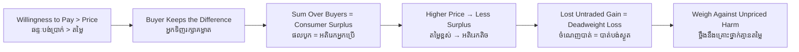

# Consumer Surplus — Socratic Dialogue
# អតិរេកអ្នកប្រើប្រាស់ — ការសន្ទនាបែប Socratic

*Author: ichamrong | Date: 2026-06-01*

---

**Professor:** Dara, suppose you would happily pay 5,000 riel for a plate of num banh chok, but the stall charges 3,000. Did you gain anything beyond the meal?

**Dara:** Yes — I got something I valued at 5,000 for only 3,000. I'm 2,000 better off in a sense.

**Professor:** That 2,000 — does it appear anywhere in the cash that changes hands?

**Dara:** No. No money moves for it. It's a benefit I keep but never pay out.

**Professor:** Good. We call that your **consumer surplus**. Now, the woman behind you in line would only pay 3,200 for the same plate. What is her surplus?

**Dara:** Just 200. She values it much less than I do, but she pays the same 3,000.

**Professor:** So at one price, do all buyers gain equally?

**Dara:** No. The ones who value it most gain the most. The surplus is different for each person.

**Professor:** Now picture a third person who would pay only 2,800. Does she buy?

**Dara:** No, the price is above what it's worth to her. She walks away.

**Professor:** And her surplus?

**Dara:** Zero. There's no trade, so there's no gain for her or the seller.

**Professor:** Now the seller raises the price to 4,000. What happens to your surplus?

**Dara:** Mine drops from 2,000 to 1,000 — I still buy, but the bargain is smaller.

**Professor:** And the woman who valued it at 3,200?

**Dara:** She stops buying. At 4,000 it's not worth it to her. She loses her 200 of surplus entirely.

**Professor:** Does the seller capture that lost 200?

**Dara:** No — there's no sale at all now. The gain just... disappears. Nobody gets it.

**Professor:** You have just discovered **deadweight loss** — surplus that vanishes because a trade both sides would have welcomed no longer happens. Now apply it. The government taxes petrol heavily. The pump price rises. Who loses surplus?

**Dara:** Every driver who still buys loses some, and the drivers near the margin stop buying altogether — that's deadweight loss.

**Professor:** So is the tax simply bad?

**Dara:** Not necessarily. The petrol's price never included the pollution it causes. The lost surplus has to be weighed against the harm the tax prevents.

**Professor:** Precisely. Consumer surplus measures the buyer's gain — but a wise policy asks what *unpriced* cost sits on the other side of the scale.

---

## Insight Chain / ខ្សែសង្វាក់ការយល់ដឹង

---

## Related Posts / អត្ថបទដែលទាក់ទង

- [01 — MIT Professor](./01-mit-professor.md)
- [02 — Feynman Technique](./02-feynman.md)
- [04 — Analogy Bridge](./04-analogy.md)
- [05 — Narrative Story](./05-storyteller.md)
- [06 — Journalist Interview](./06-interview.md)
- [Course: Principles of Microeconomics](../../year-1/01-principles-of-microeconomics.md)
- [Parable: The Farmer Who Raised the Price](../../year-1/parables/260-the-farmer-who-raised-the-price.md)
