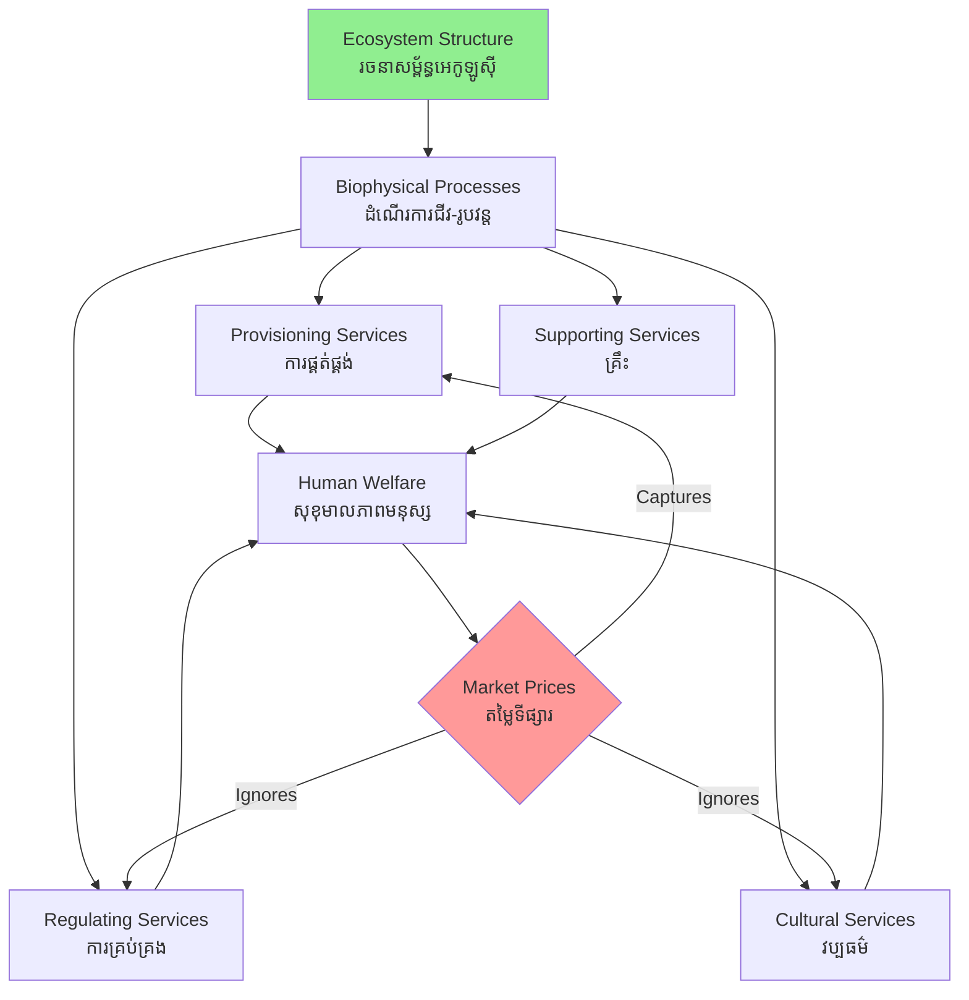

# Ecosystem Services — First-Principles Derivation
# សេវាកម្មបរិស្ថាន — ការដឹកនាំពីគោលការណ៍មូលដ្ឋាន

*By Prof. Gretchen Daily, Stanford Natural Capital Project | ដោយ សាស្ត្រាចារ្យ Gretchen Daily*

---

## Core Problem | បញ្ហាស្នូល

Economies treat nature as either infinite or irrelevant. Cambodia's Tonle Sap Lake (បឹងទន្លេសាប) generates fish protein for 3 million people annually — yet no national account records this value. When the lake shrinks, GDP (ផលិតផលក្នុងស្រុកសរុប) shows no loss. This accounting blindness drives ecological collapse.

---

## First Principles Derivation | ការដឹកនាំពីគោលការណ៍

**Axiom 1:** Human welfare depends on material flows — food, water, air, fiber.

**Axiom 2:** Material flows originate from biophysical processes in ecosystems (ប្រព័ន្ធអេកូឡូស៊ី) — photosynthesis, water filtration, pollination, climate regulation.

**Axiom 3:** Biophysical processes require intact ecosystem structure — biodiversity, soil integrity, hydrological connectivity.

**Therefore:** Human welfare ← material flows ← ecosystem processes ← ecosystem structure.

**Definition:** *Ecosystem Services* (សេវាកម្មបរិស្ថាន) are the benefits that functional ecosystems provide to human societies, derived from the interactions of living organisms with each other and their abiotic environment.

**Classification (MA Framework):**
- **Provisioning** (ផ្គត់ផ្គង់): food, freshwater, timber, medicine
- **Regulating** (គ្រប់គ្រង): flood control, carbon sequestration, disease regulation
- **Cultural** (វប្បធម៌): recreation, spiritual value, tourism
- **Supporting** (គ្រឹះ): nutrient cycling, soil formation, primary production

**Implication 1:** Destroying ecosystem structure eliminates the capital stock that produces these flows.

**Implication 2:** Market prices capture only provisioning services; regulating and cultural services are systematically underpriced → market failure.

**Implication 3:** Sustainable development requires valuing and protecting natural capital (ដើមទុនធម្មជាតិ) alongside built and human capital.

---

## Visual Derivation | ដ្យាក្រាមដឹកនាំ

---

## Real-World Application | ការអនុវត្តជាក់ស្តែង

**Tonle Sap Lake, Cambodia:** The annual flood pulse (ជំនន់រដូវវស្សា) from the Mekong reverses the Tonle Sap River, expanding the lake from 2,500 km² to 16,000 km². This flood recruits fish larvae into flooded forests, producing 350,000–500,000 tonnes of fish per year — an ecosystem service worth ~$350 million annually at local prices, yet uncounted in national accounts.

**Cardamom Mountains (ភ្នំកាដាម៉ូម):** Intact forest delivers water regulation services worth an estimated $114 million/year to downstream rice farmers — more than the timber value of clear-cutting.

**Policy implication:** Payments for Ecosystem Services (PES) programs compensate upstream communities (សហគមន៍ខ្ពង់រាប) for maintaining forest cover that delivers water services to downstream users.

---

## Related Posts | អត្ថបទពាក់ព័ន្ធ

- [02 — Feynman Explanation](./02-feynman.md)
- [03 — Socratic Dialogue](./03-socratic.md)
- [04 — Analogy Bridge](./04-analogy.md)
- [05 — Narrative Story](./05-storyteller.md)
- [06 — Journalist Interview](./06-interview.md)
- [Parable: The River That Fed the Village](../../year-1/parables/262-the-river-that-fed-the-village.md)
