# Ecosystem Services — Socratic Dialogue
# សេវាកម្មបរិស្ថាន — កិច្ចសន្ទនាបែប Socrates

*Author: ichamrong | Date: 2026-05-29*

---

**Professor:** Dara, when you buy fish at the market, what are you actually paying for?

**Dara:** I am paying the fisherman for catching it.

**Professor:** And who made the fish?

**Dara:** ... the lake made it?

**Professor:** What does the lake need in order to keep making fish?

**Dara:** Clean water. Flooded forests in rainy season. No pollution.

**Professor:** If the forests beside the lake are cut down, what happens to the flood that fills the lake each year?

**Dara:** The water runs off faster. Less water reaches the lake. The fish cannot swim into the trees to feed and reproduce.

**Professor:** So the forest is doing something useful for the fisherman, even though the fisherman never pays the forest?

**Dara:** Yes — the forest is working for the fisherman for free.

**Professor:** We call this an ecosystem service (សេវាកម្មបរិស្ថាន). Can you name other things the lake or forest does for people, for free?

**Dara:** The lake absorbs floods so villages don't flood. Trees hold soil so it doesn't wash away. Forests in the Cardamom Mountains (ភ្នំកាដាម៉ូម) filter water for rice farmers below.

**Professor:** If none of these services are paid for, does that mean they have no value?

**Dara:** No — it just means the market is not measuring them.

**Professor:** What happens when someone destroys a service that was never measured?

**Dara:** The loss is invisible. No alarm goes off. GDP (ផលិតផលក្នុងស្រុកសរុប) doesn't drop.

**Professor:** So what is the danger of using GDP as our only measure of national wealth?

**Dara:** We could be getting richer in GDP while losing the natural systems that keep us alive.

**Professor:** Cambodia earns foreign exchange from exporting timber. Is that a good trade?

**Dara:** Only if we are also counting what the forest was giving us in water regulation, flood control, and fish — and the timber price is higher.

**Professor:** Is it usually higher?

**Dara:** Probably not. The Cardamom forest's water services alone are estimated at over $100 million a year.

**Professor:** Then what policy tool could make the forest more valuable standing than cut?

**Dara:** Payments for Ecosystem Services — PES (ការទូទាត់ចំពោះសេវាកម្មបរិស្ថាន). Pay the upstream communities to protect the forest. Cambodia already does this through REDD+ (កម្មវិធី REDD+).

**Professor:** Why might forest communities resist PES even when offered money?

**Dara:** If the payment is less than what they could earn from selling timber or growing crops, it won't work. And if land tenure is insecure, they might not trust the arrangement will last.

**Professor:** Brilliant. So ecosystem services are not just biology — they connect to economics, governance, and justice?

**Dara:** Exactly. The fish, the forest, and the farmer are all part of one system.

---

## Insight Chain | ខ្សែសង្វាក់ការយល់ដឹង

```mermaid
graph LR
    A["Market price of fish<br/>តម្លៃត្រីទីផ្សារ"] -->|misses| B["Forest flood service<br>សេវាព្រៃការពារទឹកជំនន់"]
    B -->|enables| C["Fish reproduction<br>ការបន្តពូជត្រី"]
    C -->|supports| D["Fisherman income<br>ចំណូលជនជាប់ត្រី"]
    D -->|depends on| E["Intact ecosystem<br>ប្រព័ន្ធអេកូឡូស៊ីដែលមិនខូច"]
    E -->|threatened by| F["Deforestation & dams<br>កិច្ចកាប់ព្រៃ និងទំនប់"]
    F -->|prevented by| G["PES / REDD+<br>ការទូទាត់ចំពោះសេវាបរិស្ថាន"]
```

---

## Related Posts | អត្ថបទពាក់ព័ន្ធ

- [01 — MIT Professor](./01-mit-professor.md)
- [02 — Feynman Explanation](./02-feynman.md)
- [04 — Analogy Bridge](./04-analogy.md)
- [05 — Narrative Story](./05-storyteller.md)
- [06 — Journalist Interview](./06-interview.md)
- [Parable: The River That Fed the Village](../../year-1/parables/262-the-river-that-fed-the-village.md)
