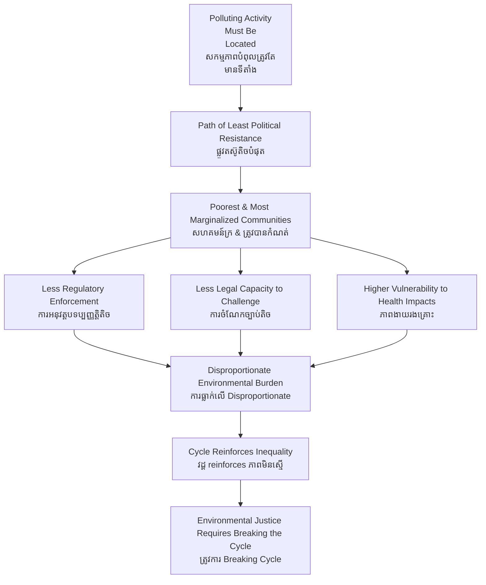

# Environmental Justice — First-Principles Derivation
# យុត្តិធម៌បរិស្ថាន — ការស្រាយបញ្ជាក់ពីគោលការណ៍ដំបូង

*Author: ichamrong | Date: 2026-05-29*

---

## Foundational Framework / ក្របខ័ណ្ឌស្ថាបនិក

**Environmental justice** as a formal field emerged from the US civil rights movement in the 1980s. Sociologist **Robert Bullard** documented in *Dumping in Dixie* (1990) that hazardous waste facilities, polluting industries, and toxic sites were disproportionately located in Black and low-income communities — not by accident, but as a predictable outcome of unequal political power.

The US EPA's definition (1994): *"The fair treatment and meaningful involvement of all people regardless of race, color, national origin, or income with respect to the development, implementation, and enforcement of environmental laws, regulations, and policies."*

The concept has since expanded globally, encompassing **distributional justice** (who bears environmental burdens), **procedural justice** (who participates in decisions), and **recognition justice** (whose knowledge and identity are acknowledged in governance).

---

## Core Problem / បញ្ហាស្នូល

**English:** Environmental harms are not randomly distributed across society. They systematically fall on communities with less political power, lower income, greater economic vulnerability, and weaker legal standing. Simultaneously, environmental benefits — clean air, green spaces, safe water — are concentrated in wealthier, more politically powerful communities. This pattern is not market failure in the classic sense; it is the predictable output of political power operating within market structures.

**ខ្មែរ:** គ្រោះថ្នាក់បរិស្ថានមិនត្រូវបានបែងចែកដោយចៃដន្យនៅទូទាំងសង្គម។ ពួកគេធ្លាក់ទៅលើសហគមន៍ដែលមានអំណាចនយោបាយតិច ប្រាក់ចំណូលទាប ភាពងាយរងគ្រោះសេដ្ឋកិច្ចខ្ពស់ជាង និងស្ថានភាពច្បាប់ចន្លោះ។

---

## First Principles Derivation / ការស្រាយបញ្ជាក់ពីគោលការណ៍ដំបូង

**Axiom 1 — Environmental harms are locatable (អ័ក្សទ 1 — គ្រោះថ្នាក់បរិស្ថានមានទីតាំង):**
Pollution, toxic sites, and environmental degradation affect specific geographic locations and the communities living there — not society uniformly.

**Axiom 2 — Site selection follows power gradients (អ័ក្សទ 2 — ការជ្រើសរើសទំហំប្រក្រតី):**
When firms and governments choose where to locate polluting facilities, they face different resistance levels in different communities. Communities with political connections, legal resources, and economic alternatives offer greater resistance. Communities without these resources offer less.

**Axiom 3 — Markets and regulatory systems are not power-neutral (អ័ក្សទ 3 — ទីផ្សារ និងប្រព័ន្ធបទប្បញ្ញត្តិ មិនព្រួញអំណាច):**
Environmental laws are enforced less rigorously in politically weak communities. Impact assessments are conducted less thoroughly when affected communities lack advocacy resources.

**Derivation Chain (ខ្សែសង្វាក់ការស្រាយ):**

1. Polluting activity must be located somewhere.
2. Proponents prefer sites with least resistance.
3. Least resistance = lowest political power = poorest communities.
4. Poor communities also have least capacity to monitor, document, and legally challenge violations.
5. Regulatory enforcement is weakest where advocacy pressure is weakest.
6. Result: environmental burdens concentrate in poor and politically marginalized communities.
7. Environmental benefits (clean parks, protected watersheds) concentrate in wealthy communities with voice.
8. This is not random — it is structural, reproducible, and systemic.

---

## Three Dimensions of Environmental Justice / ទំហំបីនៃយុត្តិធម៌បរិស្ថាន

| Dimension | Question | ខ្មែរ |
|---|---|---|
| **Distributional** | Who bears environmental costs? Who receives benefits? | ការចែកចាយ |
| **Procedural** | Who participates in environmental decisions? | ដំណើរការ |
| **Recognition** | Whose knowledge, values, and identity are acknowledged? | ការទទួលស្គាល់ |

---

## Visual Derivation / ការបង្ហាញដោយមើលឃើញ

---

## Cambodian Application / ការអនុវត្តន៍ក្នុងបរិបទកម្ពុជា

**Boeung Kak Lake:**
The displacement of approximately 4,000 families from Boeung Kak Lake in Phnom Penh (2008–2012) to accommodate a sand-filling development project is a paradigmatic environmental justice case. The affected community was predominantly poor, with insecure land tenure. The development benefited a politically connected concessionaire. Environmental impact assessment was inadequate. Community members who organized resistance faced legal persecution. All three dimensions of environmental injustice — distributional (who lost their homes and livelihoods), procedural (who was excluded from decisions), and recognition (whose knowledge of the lake's value was dismissed) — are present.

**Indigenous Land Rights in Mondulkiri and Ratanakiri:**
Concessions for mining and plantation agriculture in indigenous territories in northeastern Cambodia disproportionately burden communities with the least formal legal standing, the least capacity to engage regulatory processes, and the least political representation. This reproduces the structural pattern Robert Bullard documented in the American South: the environments of the least powerful communities are treated as expendable.

---

## Related Posts / អត្ថបទដែលទាក់ទង

- [02 — Feynman Technique](./02-feynman.md)
- [03 — Socratic Dialogue](./03-socratic.md)
- [04 — Analogy Bridge](./04-analogy.md)
- [05 — Narrative Story](./05-storyteller.md)
- [06 — Journalist Interview](./06-interview.md)
- [Parable: The River That Fed the Village](../../year-1/parables/262-the-river-that-fed-the-village.md)
