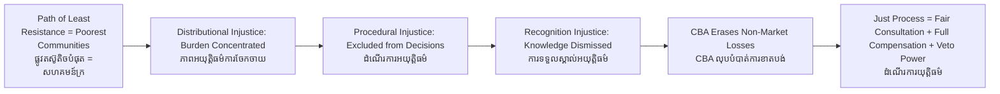

# Environmental Justice — Socratic Dialogue
# យុត្តិធម៌បរិស្ថាន — ការសន្ទនាបែប Socratic

*Author: ichamrong | Date: 2026-05-29*

---

**Professor:** Dara, suppose a Phnom Penh developer fills Boeung Kak Lake to build a shopping center. Thousands of poor families who lived and fished at the lake are displaced. The developer paid the legally required compensation — technically minimal. Has justice been served?

**Dara:** Legally, perhaps. If the law was followed. But whether it is just seems like a different question.

**Professor:** What makes it a different question?

**Dara:** The law might be inadequate. The families had no power in the process. And they lose not just their homes but their livelihoods, their fishing, their community — things money might not restore.

**Professor:** What if I told you that the same developer also wanted to build on land in a wealthy neighborhood — and the wealthy community successfully blocked the project through legal means? What does that tell you?

**Dara:** That the outcome was not about the law being equally applied — it was about who had the resources to use the law.

**Professor:** And where does the development end up?

**Dara:** Where resistance is weakest — with the poorest communities.

**Professor:** Researchers call this pattern "the path of least political resistance." Who bears the environmental burden?

**Dara:** Those with the least power.

**Professor:** Is this pattern random?

**Dara:** No, it is systematic. You could predict it before you knew which specific community would be targeted.

**Professor:** Robert Bullard documented in his research on the American South that hazardous facilities were systematically placed in Black and poor communities — not by explicit racist policy, but as the emergent outcome of political power operating within market systems. Does that resemble what you described in Cambodia?

**Dara:** Very much. Replace race with poverty and political marginalization, and the structure is the same.

**Professor:** Environmental justice scholars identify three dimensions of justice. You have already identified one: distributional — who bears the burden. What about the second dimension, procedural justice?

**Dara:** Whether the affected communities actually had a say in the decision? Whether they were consulted before the lake was filled, not told after?

**Professor:** Correct. And the third dimension is "recognition justice." What might that mean?

**Dara:** I am not sure. Maybe whether the community's way of understanding and valuing the environment is taken seriously?

**Professor:** Exactly. The families at Boeung Kak Lake understood the lake as a source of food, livelihood, cultural life, and community identity. That knowledge was dismissed as irrelevant to a commercial decision. "Recognition justice" asks whether those forms of value are acknowledged in governance.

**Dara:** So even a procedurally fair consultation could fail on recognition grounds if it only accepts economic valuation and ignores cultural or ecological knowledge?

**Professor:** Precisely. Now, suppose the developer says: "We created jobs. The shopping center employs 500 people. The city's tax revenues increased. Net welfare improved." How do you evaluate that claim?

**Dara:** The 500 jobs probably went to people who were not the displaced families. And even if they did — you cannot directly compare a job with a lake that fed your family for thirty years and was the place your parents were married.

**Professor:** What does that tell you about standard cost-benefit analysis applied to environmental displacement?

**Dara:** It is measuring the wrong things, or measuring in units that erase some people's losses. The families lost something that did not appear in the calculation.

**Professor:** If environmental justice is both a distributional concept and a procedural and recognition concept, what would a just process for a project like Boeung Kak have looked like?

**Dara:** Genuine prior consultation. The community's valuation of the lake included in the analysis. Compensation based on full replacement of livelihood and community, not just market value of land. And if the community said no, the project does not proceed — or must change substantially.

**Professor:** And if that standard had applied, what would likely have happened?

**Dara:** The project might not have proceeded, or would have been redesigned significantly.

**Professor:** Is environmental justice therefore anti-development?

**Dara:** No — it is pro-justice in development. It says: development decisions should not systematically impose their costs on the people with the least power. If the project cannot survive a fair process, that is important information about whether the project is actually in the public interest.

---

## Insight Chain / ខ្សែសង្វាក់ការយល់ដឹង

---

## Related Posts / អត្ថបទដែលទាក់ទង

- [01 — MIT Professor](./01-mit-professor.md)
- [02 — Feynman Technique](./02-feynman.md)
- [04 — Analogy Bridge](./04-analogy.md)
- [05 — Narrative Story](./05-storyteller.md)
- [06 — Journalist Interview](./06-interview.md)
- [Parable: The River That Fed the Village](../../year-1/parables/262-the-river-that-fed-the-village.md)
