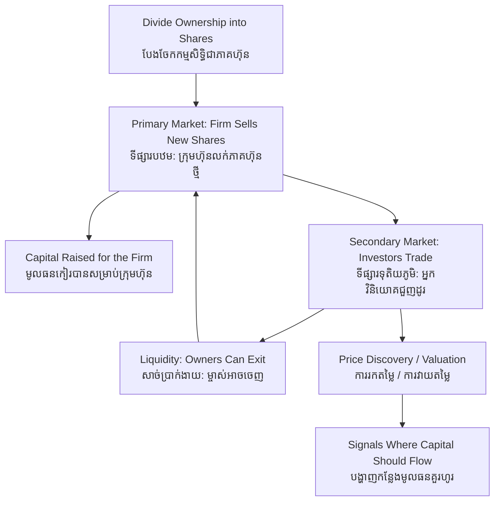

# Equity Markets — First-Principles Derivation
# ទីផ្សារភាគហ៊ុន — ការស្រាយបញ្ជាក់ពីគោលការណ៍ដំបូង

*Author: ichamrong | Date: 2026-06-01*

---

## Foundational Scholars / អ្នកសិក្សាស្ថាបនិក

The idea that a company can be sliced into tradable ownership shares dates to the **Dutch East India Company (1602)**, whose stock traded on the Amsterdam exchange — the first true equity market. The modern theory was built by **Harry Markowitz** (portfolio selection, 1952), **William Sharpe** (the Capital Asset Pricing Model), and **Eugene Fama**, whose *efficient-markets hypothesis* argues that share prices rapidly reflect available information. This course, *Introduction to Global Financial Markets* (see [../../year-1/02-introduction-to-global-financial-markets.md](../../year-1/02-introduction-to-global-financial-markets.md)), treats equity markets as the core mechanism for raising long-term capital.

---

## Core Problem / បញ្ហាស្នូល

**English:** A promising company needs large sums of money to grow — to build a factory, hire engineers, expand abroad — far more than its founders have or a bank will lend. Meanwhile, millions of savers hold money they want to grow but cannot each individually fund a whole company. How do we connect scattered savings to capital-hungry enterprises, let owners share in profits without managing the firm, and discover what a business is actually *worth*? We need to derive how equity — ownership divided into shares — solves all three problems at once.

**ខ្មែរ:** ក្រុមហ៊ុនដែលមានសក្តានុពលត្រូវការប្រាក់ច្រើនដើម្បីលូតលាស់ — សាងសង់រោងចក្រ ជួលវិស្វករ ពង្រីកទៅក្រៅប្រទេស — ច្រើនជាងអ្វីដែលស្ថាបនិកមាន ឬធនាគារនឹងឲ្យខ្ចី។ ខណៈនោះ អ្នកសន្សំរាប់លាននាក់កាន់ប្រាក់ដែលចង់ឲ្យកើន ប៉ុន្តែម្នាក់ៗមិនអាចផ្តល់មូលនិធិដល់ក្រុមហ៊ុនទាំងមូលបាន។ តើយើងភ្ជាប់ប្រាក់សន្សំខ្ចាត់ខ្ចាយ ទៅសហគ្រាសដែលស្រេកឃ្លានមូលធន ឲ្យម្ចាស់ចែករំលែកប្រាក់ចំណេញដោយមិនបាច់គ្រប់គ្រងក្រុមហ៊ុន និងរកឃើញតម្លៃពិតប្រាកដនៃអាជីវកម្ម យ៉ាងដូចម្តេច? យើងត្រូវស្រាយថា ភាគហ៊ុន — កម្មសិទ្ធិបែងចែកជាចំណែក — ដោះស្រាយបញ្ហាទាំងបីក្នុងពេលតែមួយយ៉ាងណា។

---

## First Principles Derivation / ការស្រាយបញ្ជាក់ពីគោលការណ៍ដំបូង

**Axiom 1 — Ownership can be divided into shares (អ័ក្សទ ១ — កម្មសិទ្ធិអាចបែងចែកជាចំណែក):**
A company's ownership is split into equal units (shares). Owning a share means owning a fraction of the firm and a claim on its future profits.

**Axiom 2 — A share is a residual claim (អ័ក្សទ ២ — ភាគហ៊ុនជាសិទ្ធិលើសល់):**
Shareholders are paid *after* workers, suppliers, and lenders — they bear the most risk and so claim the upside. Their return is dividends plus any rise in share price.

**Axiom 3 — Prices form where buyers meet sellers (អ័ក្សទ ៣ — តម្លៃកើតពេលអ្នកទិញជួបអ្នកលក់):**
A share's price is set continuously by supply and demand among investors, each pricing in their estimate of the firm's future.

**Derivation Chain (ខ្សែសង្វាក់ការស្រាយ):**

1. A firm first sells new shares to the public to *raise capital* — this is the **primary market** (e.g. an Initial Public Offering). The cash goes to the company.
2. Thereafter investors trade those existing shares among themselves — the **secondary market** (the stock exchange). No new money reaches the firm; the market provides **liquidity** so owners can exit.
3. The secondary market's prices feed back as a continuous **valuation** of the firm — **price discovery**: the collective judgment of all investors about its prospects.
4. This valuation signals where capital should flow: highly valued firms can raise more cheaply, steering society's savings toward enterprises judged most productive.
5. Liquidity and price discovery make people willing to fund the primary market in the first place — the two markets sustain each other.

**Risk and return (ហានិភ័យ និងផលចំណេញ):** Because equity is a residual claim, it offers higher expected returns than debt but greater volatility — the price can soar or collapse with the firm's fortunes and with market sentiment.

---

## Visual Derivation / ការបង្ហាញដោយមើលឃើញ

---

## Sustainability Note / ចំណាំអំពីនិរន្តរភាព

Equity markets are increasingly the arena of *sustainable finance*. Through **ESG investing**, large funds steer capital toward firms with strong environmental and governance records and away from polluters, raising the cost of capital for unsustainable businesses. Green-focused IPOs fund clean-energy companies; shareholder activism pushes boards toward decarbonization. But the market only rewards sustainability if prices reflect environmental risk — otherwise capital still flows to fossil profits. Compare [market-failure](../market-failure/01-mit-professor.md) and [greenwashing](../greenwashing/01-mit-professor.md), the risk that ESG labels mislead.

---

## Cambodian Application / ការអនុវត្តន៍ក្នុងបរិបទកម្ពុជា

**The Cambodia Securities Exchange (CSX):** Launched in 2011, the CSX is young and thin, with only a handful of listed companies (utilities, ports, and a few others). For a Cambodian firm, an IPO offers an alternative to bank debt for raising growth capital, while giving the public a stake in the economy. The exchange's small size means limited liquidity and price discovery — a reminder that equity markets need depth and trust to function well. As the CSX develops, it could channel domestic savings into sustainable infrastructure rather than relying solely on foreign capital.

---

## Related Posts / អត្ថបទដែលទាក់ទង

- [02 — Feynman Technique](./02-feynman.md)
- [03 — Socratic Dialogue](./03-socratic.md)
- [04 — Analogy Bridge](./04-analogy.md)
- [05 — Narrative Story](./05-storyteller.md)
- [06 — Journalist Interview](./06-interview.md)
- [Course: Introduction to Global Financial Markets](../../year-1/02-introduction-to-global-financial-markets.md)
- [Parable: The Merchant Who Crossed Seven Seas](../../year-1/parables/261-the-merchant-who-crossed-seven-seas.md)
