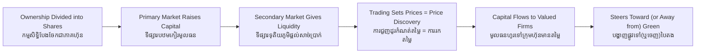

# Equity Markets — Socratic Dialogue
# ទីផ្សារភាគហ៊ុន — ការសន្ទនាបែប Socratic

*Author: ichamrong | Date: 2026-06-01*

---

**Professor:** Sophea, suppose a company needs ten million dollars to build a factory, but the founders have only one million and the bank will lend just two. Where can the rest come from?

**Sophea:** They could sell part of the company — pieces of ownership — to many investors.

**Professor:** Those pieces have a name?

**Sophea:** Shares. Each share is a slice of ownership.

**Professor:** And what does an investor get for buying a share?

**Sophea:** A claim on the company's future profits — dividends — and ownership that can rise in value if the company does well.

**Professor:** Now, when the company sells brand-new shares to the public for the first time, where does that money go?

**Sophea:** To the company itself, to fund the factory. That's the primary market — raising capital.

**Professor:** Good. Now a sharp question. Once you own a share, must you hold it forever?

**Sophea:** No — I can sell it to another investor on the stock exchange.

**Professor:** When you sell it that way, does the company receive any money?

**Sophea:** No. It just changes hands between investors. That's the secondary market.

**Professor:** Then if the company gets nothing from the secondary market, why does it matter at all?

**Sophea:** Because... if I couldn't sell easily, I'd be afraid to buy in the first place. The ability to exit — liquidity — is what makes me willing to invest originally.

**Professor:** Excellent. So the secondary market feeds the primary market. Now, every time shares trade, what is created?

**Sophea:** A price — what people will pay for a piece of the company right now.

**Professor:** And what does that price represent? Is it just a number?

**Sophea:** No. It's the collective judgment of all investors about the company's future, each betting their own money. Price discovery.

**Professor:** Now the consequence. A company the market values highly — what can it do that a doubted company cannot?

**Sophea:** Raise more capital easily and cheaply. So money flows toward businesses investors believe in.

**Professor:** So the market steers society's savings. Now connect it to sustainability. Large funds increasingly avoid polluters and favour green firms. What does that do?

**Sophea:** It raises the cost of capital for unsustainable businesses and lowers it for clean ones — steering money toward sustainability.

**Professor:** Does it always work?

**Sophea:** Only if prices honestly reflect environmental risk. If a polluting firm is still hugely profitable and the market ignores the harm, capital still flows to it. And some firms fake their green credentials — greenwashing — to attract that capital.

**Professor:** So the equity market is a powerful steering wheel, but it steers only as well as the information in its prices.

**Sophea:** Yes. It funds whatever the crowd believes is valuable — which is wonderful when the crowd sees clearly, and dangerous when it doesn't.

---

## Insight Chain / ខ្សែសង្វាក់ការយល់ដឹង

---

## Related Posts / អត្ថបទដែលទាក់ទង

- [01 — MIT Professor](./01-mit-professor.md)
- [02 — Feynman Technique](./02-feynman.md)
- [04 — Analogy Bridge](./04-analogy.md)
- [05 — Narrative Story](./05-storyteller.md)
- [06 — Journalist Interview](./06-interview.md)
- [Course: Introduction to Global Financial Markets](../../year-1/02-introduction-to-global-financial-markets.md)
- [Parable: The Merchant Who Crossed Seven Seas](../../year-1/parables/261-the-merchant-who-crossed-seven-seas.md)
