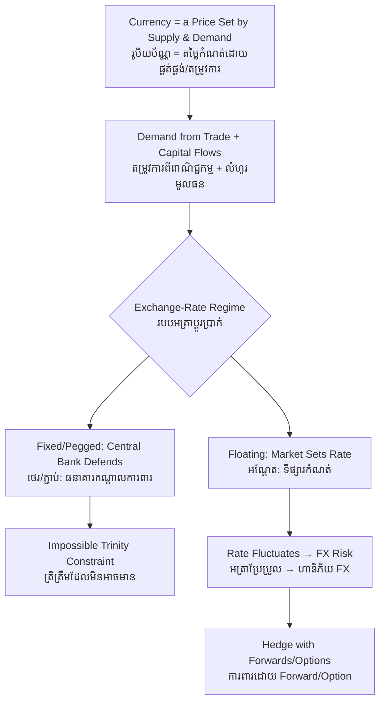

# Foreign Exchange — First-Principles Derivation
# ការប្តូរប្រាក់បរទេស — ការស្រាយបញ្ជាក់ពីគោលការណ៍ដំបូង

*Author: ichamrong | Date: 2026-06-01*

---

## Foundational Scholars / អ្នកសិក្សាស្ថាបនិក

The theory of the price of one money in terms of another runs from **Gustav Cassel**, who formalized *purchasing power parity* in 1918, to **John Maynard Keynes**, whose 1923 *Tract on Monetary Reform* analyzed forward exchange and covered interest parity. The modern architecture of exchange-rate regimes was shaped at **Bretton Woods (1944)** and its collapse in 1971, after which **Milton Friedman**'s case for floating rates became dominant. This course, *Introduction to Global Financial Markets* (see [../../year-1/02-introduction-to-global-financial-markets.md](../../year-1/02-introduction-to-global-financial-markets.md)), treats the foreign-exchange market as the world's largest and most fundamental market.

---

## Core Problem / បញ្ហាស្នូល

**English:** A Cambodian exporter is paid in US dollars but pays workers in riel. A Japanese carmaker earns euros in Europe but reports profits in yen. Whenever value crosses a currency border, someone must convert one money into another at *some* rate — and that rate moves constantly. We need to derive what determines the exchange rate between two currencies, how different exchange-rate *regimes* (fixed, floating, pegged) constrain a country, and why fluctuating rates create a genuine risk that international businesses must manage.

**ខ្មែរ:** អ្នកនាំចេញកម្ពុជាទទួលប្រាក់ជាដុល្លារ ប៉ុន្តែបង់ប្រាក់ឲ្យកម្មករជារៀល។ ក្រុមហ៊ុនផលិតឡានជប៉ុនរកប្រាក់អឺរ៉ូនៅអឺរ៉ុប ប៉ុន្តែរាយការណ៍ប្រាក់ចំណេញជាយ៉េន។ រាល់ពេលដែលតម្លៃឆ្លងព្រំដែនរូបិយប័ណ្ណ នរណាម្នាក់ត្រូវប្តូរប្រាក់មួយទៅប្រាក់មួយទៀតក្នុង **អត្រា** ណាមួយ — ហើយអត្រានោះប្រែប្រួលជានិច្ច។ យើងត្រូវស្រាយថា អ្វីកំណត់អត្រាប្តូរប្រាក់រវាងរូបិយប័ណ្ណពីរ របៀបដែល **របបអត្រាប្តូរប្រាក់** ផ្សេងៗ (ថេរ អណ្តែត ភ្ជាប់) កំណត់ប្រទេសមួយ និងហេតុអ្វីអត្រាប្រែប្រួល បង្កើតហានិភ័យពិតប្រាកដ ដែលអាជីវកម្មអន្តរជាតិត្រូវគ្រប់គ្រង។

---

## First Principles Derivation / ការស្រាយបញ្ជាក់ពីគោលការណ៍ដំបូង

**Axiom 1 — A currency is a good with supply and demand (អ័ក្សទ ១ — រូបិយប័ណ្ណជាទំនិញមានតម្រូវការ និងផ្គត់ផ្គង់):**
The exchange rate is simply the price of one currency in terms of another, set where the demand for and supply of that currency meet.

**Axiom 2 — Demand for a currency comes from wanting its assets and goods (អ័ក្សទ ២ — តម្រូវការមកពីការចង់បានទ្រព្យ និងទំនិញ):**
People buy riel to purchase Cambodian exports or to invest in Cambodian assets; they buy dollars to purchase US goods or assets. Trade flows and capital flows drive currency demand.

**Axiom 3 — A regime is a rule about who sets the rate (អ័ក្សទ ៣ — របបជាច្បាប់កំណត់អ្នកដាក់អត្រា):**
A government chooses how much it lets the market set the rate versus fixing it by policy.

**Derivation Chain (ខ្សែសង្វាក់ការស្រាយ):**

1. Under a **floating** regime the rate moves freely with supply and demand; the central bank does not target it.
2. Under a **fixed/pegged** regime the central bank commits to a rate and must buy or sell reserves to defend it.
3. Defending a peg requires either ample reserves or the surrender of independent monetary policy — the **"impossible trinity"**: a country cannot simultaneously have a fixed rate, free capital flows, and an independent interest-rate policy.
4. In the long run, rates gravitate toward **purchasing power parity** — currencies whose goods are cheap tend to appreciate — though short-run rates are dominated by capital flows and expectations.
5. Because rates fluctuate, any contract settled later in a foreign currency carries **currency (FX) risk** — the rate may move against you before payment.

**Hedging (ការការពារហានិភ័យ):** Firms manage FX risk with forward contracts, options, or by matching foreign-currency revenues to foreign-currency costs — locking in a rate rather than gambling on it.

---

## Visual Derivation / ការបង្ហាញដោយមើលឃើញ

---

## Sustainability Note / ចំណាំអំពីនិរន្តរភាព

Exchange rates shape the affordability of the green transition. Most clean-energy equipment is priced in dollars or euros, so a depreciating local currency makes solar panels and batteries dearer for developing nations — currency risk can stall climate investment. International climate finance and green bonds often carry FX risk that the borrowing country must hedge or absorb. A stable, well-managed exchange-rate regime lowers the cost of importing the technology a sustainable economy needs. See [balance-of-payments](../balance-of-payments/01-mit-professor.md) and [comparative-advantage](../comparative-advantage/01-mit-professor.md).

---

## Cambodian Application / ការអនុវត្តន៍ក្នុងបរិបទកម្ពុជា

**Cambodia's dual-currency economy:** Cambodia is heavily *dollarized* — much of the economy transacts in US dollars alongside the riel, with the National Bank managing a tightly stable riel-dollar rate. This dampens day-to-day FX risk for dollar-denominated trade but means Cambodia imports US monetary conditions and has limited independent monetary policy — a living illustration of the impossible trinity. A garment factory paid in dollars but with some riel costs still faces residual currency exposure, and exporters to the EU or Japan face real FX risk on euro and yen receipts.

---

## Related Posts / អត្ថបទដែលទាក់ទង

- [02 — Feynman Technique](./02-feynman.md)
- [03 — Socratic Dialogue](./03-socratic.md)
- [04 — Analogy Bridge](./04-analogy.md)
- [05 — Narrative Story](./05-storyteller.md)
- [06 — Journalist Interview](./06-interview.md)
- [Course: Introduction to Global Financial Markets](../../year-1/02-introduction-to-global-financial-markets.md)
- [Parable: The Merchant Who Crossed Seven Seas](../../year-1/parables/261-the-merchant-who-crossed-seven-seas.md)
