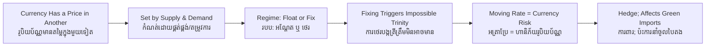

# Foreign Exchange — Socratic Dialogue
# ការប្តូរប្រាក់បរទេស — ការសន្ទនាបែប Socratic

*Author: ichamrong | Date: 2026-06-01*

---

**Professor:** Dara, when you hand a money changer one US dollar and she gives you 4,000 riel, what have you just observed?

**Dara:** The price of a dollar in riel — the exchange rate.

**Professor:** So is a currency, in this sense, like any other good with a price?

**Dara:** Yes. A dollar has a price measured in riel, set by supply and demand.

**Professor:** Who creates the *demand* for riel, then?

**Dara:** Anyone who needs riel — foreign buyers of Cambodian exports, or investors putting money into Cambodia.

**Professor:** And demand for dollars?

**Dara:** Cambodians buying imports, paying for foreign study, or moving money abroad.

**Professor:** Good. Now, who decides where the rate settles? Is it always the free market?

**Dara:** Not always. The government can choose. It can let the rate float freely, or it can fix it at a chosen level.

**Professor:** If it fixes the rate, what must the central bank be prepared to do?

**Dara:** Buy or sell its own currency to defend the chosen rate — using its reserves of foreign money.

**Professor:** Now here's a hard one. Suppose a country wants three things: a fixed exchange rate, freely flowing capital across its borders, and the freedom to set its own interest rates for its own economy. Can it have all three?

**Dara:** I think... no. If money flows freely and the rate is fixed, then if it set a different interest rate from the world, money would rush in or out and break the peg.

**Professor:** Precisely — the impossible trinity. It can have any two, never all three. Now let's bring it to a business. A Cambodian factory will be paid 100,000 euros in three months. What worries you about that?

**Dara:** The euro's value in riel could change before payment. They might end up with fewer riel than expected.

**Professor:** That uncertainty has a name?

**Dara:** Currency risk — exchange-rate risk.

**Professor:** And if the factory owner doesn't want to gamble on the rate?

**Dara:** They lock in today's rate for the future payment — a forward contract. Hedging.

**Professor:** Now connect it to this program's theme. A developing country wants to import solar panels priced in dollars, but its currency is weakening. What happens?

**Dara:** The panels get more expensive in local money. A falling currency makes the green transition costlier and can stall clean-energy investment.

**Professor:** So is the exchange rate just a number on a money changer's board?

**Dara:** No — it decides how affordable the outside world is, including the technology a country needs to go green. And the regime a country picks decides how much control it keeps over its own economy.

**Professor:** Hold onto that. Foreign exchange is the hinge between a nation's economy and the world's.

---

## Insight Chain / ខ្សែសង្វាក់ការយល់ដឹង

---

## Related Posts / អត្ថបទដែលទាក់ទង

- [01 — MIT Professor](./01-mit-professor.md)
- [02 — Feynman Technique](./02-feynman.md)
- [04 — Analogy Bridge](./04-analogy.md)
- [05 — Narrative Story](./05-storyteller.md)
- [06 — Journalist Interview](./06-interview.md)
- [Course: Introduction to Global Financial Markets](../../year-1/02-introduction-to-global-financial-markets.md)
- [Parable: The Merchant Who Crossed Seven Seas](../../year-1/parables/261-the-merchant-who-crossed-seven-seas.md)
