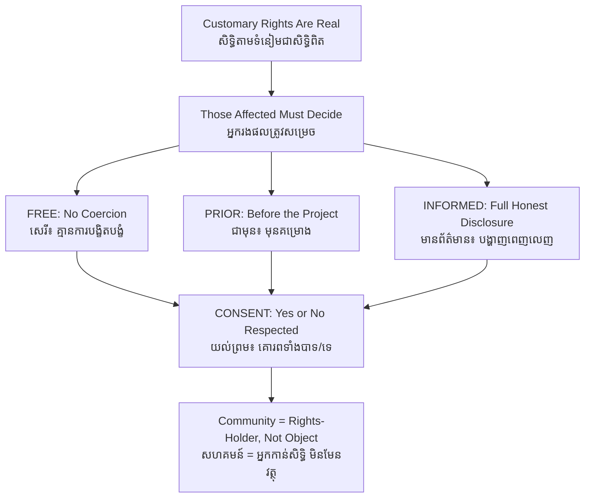

# FPIC / Free, Prior and Informed Consent — First-Principles Derivation
# ការទទួលបានការយល់ព្រមជាមុនដោយសេរី — ការស្រាយបញ្ជាក់ពីគោលការណ៍ដំបូង

*Author: ichamrong | Date: 2026-06-01*

---

## Foundational Scholars / អ្នកសិក្សាស្ថាបនិក

**FPIC** — Free, Prior and Informed Consent — is grounded in the work of anthropologists and legal scholars who documented how development projects repeatedly dispossessed Indigenous peoples without their agreement. Its clearest codification is the **United Nations Declaration on the Rights of Indigenous Peoples (UNDRIP, 2007)**, which states that Indigenous peoples must give free, prior and informed consent before states or companies undertake projects affecting their lands, territories, and resources. The principle draws on the anthropological recognition — developed by scholars of legal pluralism and political ecology — that customary land rights are real rights even when no state title exists. This course, *Introduction to Anthropology and Sociology* (see [../../year-1/08-introduction-to-anthropology-and-sociology.md](../../year-1/08-introduction-to-anthropology-and-sociology.md)), treats FPIC as where anthropology meets the ethics of business and the state.

---

## Core Problem / បញ្ហាស្នូល

**English:** A mining company, a hydropower developer, or a plantation acquires a concession over land that a community has lived on and used for generations — often without formal title, but with deep customary claims. The community may lose its forests, fishing grounds, burial sites, and way of life. The state granted the concession; the company holds the paper. Yet the people who will bear the consequences had no real say. How do we define a standard of *consent* that protects people whose rights are real but undocumented, against actors who hold legal power but not moral authority over that land?

**ខ្មែរ:** ក្រុមហ៊ុនរ៉ែ អ្នកអភិវឌ្ឍន៍វារីអគ្គិសនី ឬចម្ការ ទទួលបានសម្បទានលើដីដែលសហគមន៍មួយបានរស់នៅ និងប្រើប្រាស់អស់ជាច្រើនជំនាន់ — ជារឿយៗដោយគ្មានកម្មសិទ្ធិផ្លូវការ ប៉ុន្តែមានការទាមទារតាមទំនៀមទម្លាប់យ៉ាងជ្រាលជ្រៅ។ សហគមន៍អាចបាត់បង់ព្រៃឈើ កន្លែងនេសាទ ទីបញ្ចុះសព និងរបៀបរស់នៅរបស់ខ្លួន។ រដ្ឋបានផ្តល់សម្បទាន ក្រុមហ៊ុនកាន់ឯកសារ។ ប៉ុន្តែប្រជាជនដែលនឹងទទួលរងផលវិបាក គ្មានសិទ្ធិនិយាយពិតប្រាកដ។ តើយើងកំណត់ស្តង់ដារនៃ *ការយល់ព្រម* យ៉ាងដូចម្តេច ដើម្បីការពារប្រជាជនដែលសិទ្ធិពិតប្រាកដ តែគ្មានឯកសារ ប្រឆាំងនឹងតួអង្គដែលកាន់អំណាចច្បាប់ តែគ្មានសិទ្ធិអំណាចសីលធម៌លើដីនោះ?

---

## First Principles Derivation / ការស្រាយបញ្ជាក់ពីគោលការណ៍ដំបូង

**Axiom 1 — Customary rights are real rights (អ័ក្សទ ១ — សិទ្ធិតាមទំនៀមជាសិទ្ធិពិត):**
A community's long-standing use and governance of land confers a legitimate claim, even absent a state title. Anthropology shows land tenure exists in many valid forms beyond the deed.

**Axiom 2 — Those who bear the consequences should decide (អ័ក្សទ ២ — អ្នកដែលទទួលផលវិបាកគួរសម្រេច):**
A project that can destroy a community's livelihood is a decision *about* that community, so the community must be a decision-maker, not a mere object of the decision.

**Axiom 3 — Consent is meaningless unless it is real (អ័ក្សទ ៣ — ការយល់ព្រមឥតន័យបើមិនពិត):**
A "yes" extracted by pressure, given too late to matter, or based on hidden facts is not consent at all.

**Derivation Chain — unpacking the four words (ខ្សែសង្វាក់ការស្រាយ — ស្រាយពាក្យទាំងបួន):**

1. **Free (សេរី):** consent given without coercion, intimidation, bribery, or manipulation. A community pressured by police presence or split by selective payments is not free.
2. **Prior (ជាមុន):** consent sought *before* the project is authorized or begun, and with enough time for the community to deliberate in its own way. Asking after the bulldozers arrive is not prior.
3. **Informed (មានព័ត៌មាន):** the community receives full, honest, accessible information — in its own language — about the project's scope, risks, duration, and who benefits. Hidden downsides void the consent.
4. **Consent (ការយល់ព្រម):** the community can say **yes or no**, through its own legitimate institutions, and a *no* must be respected — otherwise it is mere "consultation," not consent.

5. The four conditions together convert a community from an object that things are done *to*, into a rights-holder whose agreement is a precondition for the project. This is FPIC.

**FPIC vs. consultation (FPIC ទល់នឹង ការពិគ្រោះយោបល់):** Many laws require only that companies *consult* — listen, then do as they planned. FPIC is stronger: it requires the genuine possibility of *no*. The gap between the two is where most abuses live.

---

## Visual Derivation / ការបង្ហាញដោយមើលឃើញ

---

## Business Application / ការអនុវត្តន៍ក្នុងធុរកិច្ច

For a sustainable business, FPIC is both an ethical floor and a risk-management tool. Projects that override community consent face protests, litigation, reputational damage, financing withdrawal, and operational shutdowns — the very risks that destroy long-term value. Lenders increasingly require FPIC compliance (it appears in the IFC Performance Standards and Equator Principles). Genuine FPIC is therefore not charity but due diligence: it secures the *social license to operate* without which a project's legal license is fragile.

---

## Cambodian Application / ការអនុវត្តន៍ក្នុងបរិបទកម្ពុជា

**Economic land concessions and Indigenous communities:** In Cambodia's northeast — Ratanakiri and Mondulkiri — Indigenous groups such as the Bunong and Tampuon hold land under customary, communal tenure. When economic land concessions for rubber or agribusiness overlapped these lands, communities that were never genuinely consulted lost forests tied to their spiritual and economic life. Cambodia's own communal land titling for Indigenous communities, and the FPIC expectations of international buyers and lenders, are the instruments meant to convert those communities from objects of concession decisions into parties whose consent is required.

---

## Related Posts / អត្ថបទដែលទាក់ទង

- [02 — Feynman Technique](./02-feynman.md)
- [03 — Socratic Dialogue](./03-socratic.md)
- [04 — Analogy Bridge](./04-analogy.md)
- [05 — Narrative Story](./05-storyteller.md)
- [06 — Journalist Interview](./06-interview.md)
- [Keyword: Environmental Justice](../environmental-justice/01-mit-professor.md)
- [Course: Introduction to Anthropology and Sociology](../../year-1/08-introduction-to-anthropology-and-sociology.md)
- [Parable: The River That Fed the Village](../../year-1/parables/262-the-river-that-fed-the-village.md)
