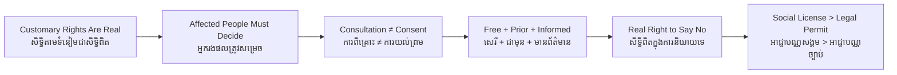

# FPIC / Free, Prior and Informed Consent — Socratic Dialogue
# ការទទួលបានការយល់ព្រមជាមុនដោយសេរី — ការសន្ទនាបែប Socratic

*Author: ichamrong | Date: 2026-06-01*

---

**Professor:** Channary, suppose a community has farmed and worshipped on a stretch of forest for two hundred years but holds no land title. Do they have a right to that land?

**Channary:** In the law, maybe not — they have no deed. But morally, and by custom, surely yes. They've lived there for generations.

**Professor:** Anthropologists would agree with your second answer. Land rights exist in many forms beyond the deed. Now, a company gets a government concession over that exact forest. Who, so far, has been asked what they want?

**Channary:** The government and the company. Not the people who live there.

**Professor:** And who will bear the consequences if the forest is cleared?

**Channary:** The people who live there. They lose everything tied to it.

**Professor:** So is it just that the ones who decide are not the ones who suffer?

**Channary:** No. The people affected should have a say. It's their lives being changed.

**Professor:** Good. Now suppose the company holds a village meeting and says, "We're going to consult you." Is consultation enough?

**Channary:** It sounds good... but consulting just means they listen. They could listen and then do exactly what they planned.

**Professor:** Precisely. So what stronger thing would actually protect the community?

**Channary:** They'd need the power to say no — and have the no respected. Not just be heard, but actually decide.

**Professor:** That power is called *consent*. Now let me test how real a given consent is. Soldiers stand at the back of the meeting, and the chief has quietly received a payment. The village says yes. Is that consent?

**Channary:** No. They're afraid, and the chief was bought. It's not freely given.

**Professor:** What word captures "no fear, no bribe"?

**Channary:** Free.

**Professor:** Next: the company asks only after clearing has already begun. Is that proper?

**Channary:** No — it's too late to matter. They should ask before, with time to think. That's... prior?

**Professor:** Yes. And if they tell the village the project is harmless while hiding that it will poison the river?

**Channary:** Then the yes is based on a lie. The consent isn't informed.

**Professor:** So now name all four conditions that make consent real.

**Channary:** Free, prior, informed — and genuine consent, meaning they can refuse. FPIC.

**Professor:** Last question, the business one. A company gets every legal permit but skips FPIC. The community protests, sues, blocks the road, and the bank pulls financing. What does this tell us about legal permits versus consent?

**Channary:** That a legal permit isn't enough. Without the people's real agreement, the project isn't safe — the company can lose everything even while holding all the right papers.

**Professor:** That gap — between the legal license and the social license — is exactly where FPIC does its work.

---

## Insight Chain / ខ្សែសង្វាក់ការយល់ដឹង

---

## Related Posts / អត្ថបទដែលទាក់ទង

- [01 — MIT Professor](./01-mit-professor.md)
- [02 — Feynman Technique](./02-feynman.md)
- [04 — Analogy Bridge](./04-analogy.md)
- [05 — Narrative Story](./05-storyteller.md)
- [06 — Journalist Interview](./06-interview.md)
- [Keyword: Environmental Justice](../environmental-justice/03-socratic.md)
- [Course: Introduction to Anthropology and Sociology](../../year-1/08-introduction-to-anthropology-and-sociology.md)
- [Parable: The River That Fed the Village](../../year-1/parables/262-the-river-that-fed-the-village.md)
