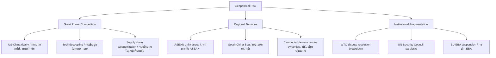

# Geopolitical Risk: First Principles
# ហានិភ័យភូមិសាស្ត្រនយោបាយ៖ គោលការណ៍មូលដ្ឋាន

> *In the tradition of Joseph Nye — power, interdependence, and the strategic environment*

---

## What Is Geopolitical Risk? / ហានិភ័យភូមិសាស្ត្រនយោបាយគឺជាអ្វី?

**Geopolitical risk** is the probability that international tensions — between states, alliances, or great powers — will materially disrupt business operations, supply chains, trade flows, or investment values.

**ហានិភ័យភូមិសាស្ត្រនយោបាយ** គឺជាប្រូបាបដែលភាពតានតឹងអន្តរជាតិ — រវាងរដ្ឋ សម្ព័ន្ធ ឬមហាអំណាច — នឹងរំខានដល់ប្រតិបត្តិការអាជីវកម្ម ខ្សែសង្វាក់ផ្គត់ផ្គង់ ឬការវិនិយោគ។

It differs from *political risk* in scope: political risk is about the relationship between a firm and a single sovereign state. Geopolitical risk is about the relationships *between* states — and how those inter-state dynamics cascade into the business environment.

---

## Joseph Nye's Analytical Framework / ក្របខ័ណ្ឌ Joseph Nye

Joseph Nye distinguishes between two forms of power that shape the geopolitical environment:

**Hard Power:** Military and economic coercion — the ability to force outcomes through strength or sanctions.

**Soft Power:** The ability to attract and co-opt — to get others to *want* what you want through culture, values, and institutions.

**Smart Power:** The strategic combination of both.

For businesses operating in geopolitically contested regions, understanding *which type of power* is in play determines the nature of the risk:

- Hard power conflicts (wars, blockades) create physical disruption
- Soft power competition (influence campaigns, standard-setting) creates regulatory and reputational risk
- Sanctions and trade wars (economic hard power) create supply-chain and market-access risk

---

## The Geopolitical Risk Taxonomy / ចំណាត់ថ្នាក់ហានិភ័យ

---

## Cambodia at the Epicenter: The BRI Case / កម្ពុជានៅចំណុចកណ្ដាល

Cambodia sits at the intersection of three geopolitical dynamics that create compounded risk:

### 1. US-China Strategic Competition

China has invested heavily in Cambodia through BRI — ports (Sihanoukville), roads, special economic zones, and military facility access (Ream Naval Base). This creates a dependent relationship where Cambodia's policy positions align closely with China's — on South China Sea disputes, on Taiwan, on ASEAN consensus.

For foreign businesses, this translates to:
- Risk of US secondary sanctions on firms perceived as enabling China's BRI expansion
- Risk of EU trade preference suspension due to governance concerns linked to Chinese-backed authoritarianism
- Risk of being caught between competing supply-chain decoupling demands

### 2. ASEAN Neutrality Erosion

ASEAN's consensus principle means Cambodia's vote is a de facto Chinese veto on ASEAN statements about South China Sea. This fractures regional institutional reliability — businesses that assumed ASEAN would provide a stable rule-based framework for Southeast Asian operations are discovering that framework is under stress.

### 3. Angkor Wat and Soft Power Geopolitics

Cambodia's cultural heritage — particularly Angkor Wat — is itself a geopolitical asset. China and Japan have competed for restoration funding rights. The US and EU have used UNESCO platforms. Soft-power competition around Cambodia's most iconic symbol shapes which countries get favorable diplomatic treatment, which in turn shapes regulatory environments for their businesses.

---

## Measuring Geopolitical Risk: The GPR Index / វាស់វែង

The Geopolitical Risk Index (Caldara and Iacoviello, 2022) tracks newspaper coverage of geopolitical tensions globally. Key finding: geopolitical risk spikes correlate with:

- 1% reduction in business investment in exposed economies
- 0.8% increase in energy price volatility
- Significant portfolio capital outflows from frontier markets

For Cambodia specifically: geopolitical risk is not symmetric. Chinese geopolitical assertiveness *reduces* some Cambodia-specific risks (Beijing protects its client states) while increasing others (US-EU countermeasures punish Cambodia by association).

---

## The Smart Power Lens for Business / ទស្សនៈ Smart Power

Nye's insight for business strategists: the most dangerous moment is not when hard power is used, but when *the rules of the game shift* — when the multilateral institutions that businesses relied on (WTO, ASEAN, UN frameworks) are no longer enforced reliably.

We are in exactly that transition now.

ការប្រើ Hard Power ក្នុងជម្លោះអន្តរជាតិ មិនដែលគ្រោះថ្នាក់ស្មើ នឹងការផ្ដាច់ច្បាប់ស្ថាប័ន — ពេលដែលក្របខ័ណ្ឌពហុភាគីដែលអាជីវកម្មពឹងផ្អែកលើ (WTO, ASEAN, UN) មិនអាចជឿទុកចិត្តបានទៀតឡើយ។

---

## Related Posts / អត្ថបទពាក់ព័ន្ធ

- [Political Risk](../political-risk/01-mit-professor.md)
- [Realism vs. Liberalism](../realism-vs-liberalism/01-mit-professor.md)
- [Sanctions](../sanctions/01-mit-professor.md)
- [Corporate Social Responsibility](../corporate-social-responsibility/01-mit-professor.md)
- [Parable: The Emperor and the Trade Route](../../year-1/parables/266-the-emperor-and-the-trade-route.md)
