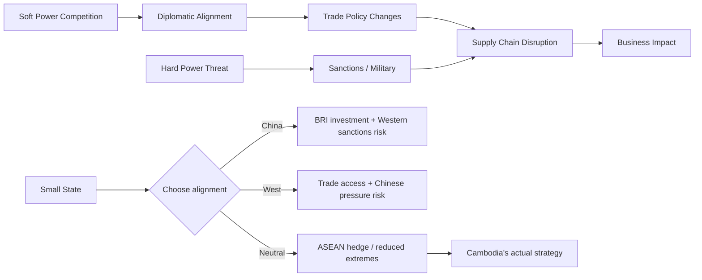

# Geopolitical Risk: A Socratic Dialogue
# ហានិភ័យភូមិសាស្ត្រនយោបាយ៖ វិធីសំណួរ-ចម្លើយ

*Professor and student Dara explore geopolitical risk through questions alone.*

---

**Professor:** Dara, if Cambodia's garment factories produce the exact same T-shirts at the exact same quality as last year — why might European buyers suddenly stop ordering from them?

**Dara:** Because of the EBA suspension — the EU reduced trade preferences for Cambodia?

**Professor:** Yes. But *why* did the EU do that? Was it because Cambodian T-shirts changed?

**Dara:** No — because of the 2018 election. The EU said Cambodia's democracy was not functioning.

**Professor:** So a political event in Phnom Penh affected the business of a factory sewing clothes. What is the chain of causation?

**Dara:** Political event → international relations response → trade policy change → business impact?

**Professor:** And none of those intermediate steps are within the factory owner's control. What name do we give to a risk that originates in the *relationship between states* rather than between a firm and its host government?

**Dara:** Geopolitical risk?

---

**Professor:** Good. Now — why would China build a port in Sihanoukville? They already have ports in China.

**Dara:** To expand trade routes? To project military power into the Indian Ocean?

**Professor:** What does having access to a Cambodian port give China strategically?

**Dara:** A foothold on the Gulf of Thailand. A point from which to monitor, or challenge, or supply forces in the South China Sea area?

**Professor:** And how might the United States interpret that?

**Dara:** As a threat. As China encircling US allies in the region.

**Professor:** If the US perceives the Ream Naval Base as a threat — what options does it have to respond, short of military action?

**Dara:** Sanctions? Diplomatic pressure? Reducing aid? Lobbying other ASEAN countries to pressure Cambodia?

**Professor:** And what happens to a European garment company sourcing from Cambodia if the US puts Cambodia on a sanctions watch list?

**Dara:** Their investors and boards might pressure them to move production elsewhere. Their supply chain becomes a reputational risk.

---

**Professor:** So who is *actually* harmed by the geopolitical competition between the US and China over a Cambodian naval base?

**Dara:** The Cambodian garment workers? The factory owners? The local economy?

**Professor:** And who made the decisions that led to that harm?

**Dara:** Beijing, Washington, Phnom Penh's leadership — none of them the workers.

**Professor:** This is the central moral and analytical problem of geopolitical risk. Who bears the cost?

---

**Professor:** Let me ask you about soft power. What is Angkor Wat?

**Dara:** Cambodia's greatest ancient monument. A UNESCO World Heritage Site.

**Professor:** Japan has funded restoration work there for decades. China has too. India. France historically. Why do wealthy countries spend money preserving someone else's temples?

**Dara:** To build goodwill? To demonstrate cultural respect?

**Professor:** And what does goodwill buy in geopolitics?

**Dara:** Favorable diplomatic positions? Trade deals? Military access?

**Professor:** So cultural investment is also strategic investment. What does that tell you about where geopolitical risk *actually* starts?

**Dara:** Long before military confrontation — in the competition for influence, trust, and allegiance?

**Professor:** And for a business operating in Cambodia, at what point in that long competition should they begin assessing geopolitical risk?

**Dara:** At the beginning — before investing. Not after the gunboats arrive.

---

## The Insight Chain / ខ្សែភ្ជាប់សម្រាប់យល់ដឹង

---

## Related Posts / អត្ថបទពាក់ព័ន្ធ

- [Political Risk](../political-risk/03-socratic.md)
- [Realism vs. Liberalism](../realism-vs-liberalism/03-socratic.md)
- [Sanctions](../sanctions/03-socratic.md)
- [Corporate Social Responsibility](../corporate-social-responsibility/03-socratic.md)
- [Parable: The Emperor and the Trade Route](../../year-1/parables/266-the-emperor-and-the-trade-route.md)
