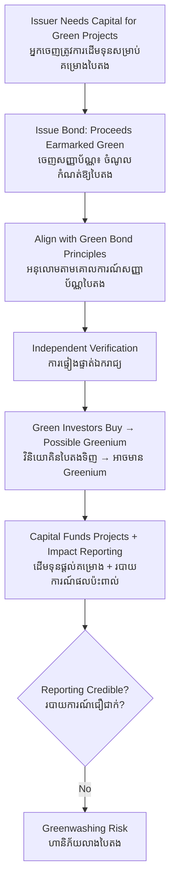

# Green Bond — First-Principles Derivation
# សញ្ញាប័ណ្ណបៃតង — ការស្រាយបញ្ជាក់ពីគោលការណ៍ដំបូង

*Author: ichamrong | Date: 2026-06-01*

---

## Foundational Scholars / អ្នកសិក្សាស្ថាបនិក

The green bond has no single inventor, but its intellectual lineage runs through **modern corporate finance** — the Modigliani–Miller framework on capital structure and the theory of the cost of capital — applied to a new purpose. The European Investment Bank issued the first "Climate Awareness Bond" in 2007, and the World Bank followed in 2008. The market's rules were later codified by the International Capital Market Association in the **Green Bond Principles** (2014). A green bond is, mechanically, an ordinary bond — a promise to repay borrowed money with interest — distinguished only by the *use of proceeds*: the money must fund environmental projects. This course, *Advanced Corporate Finance* (see [../../year-3/03-advanced-corporate-finance.md](../../year-3/03-advanced-corporate-finance.md)), treats it as a case study in how labelling and disclosure can reshape capital allocation.

---

## Core Problem / បញ្ហាស្នូល

**English:** A company or government wants to finance environmental projects — solar farms, clean water, mass transit — that have long horizons and uncertain near-term returns. Meanwhile, a growing pool of investors wants their money to do environmental good *and* earn a return. How do you connect this capital to these projects, credibly, so the investor knows the money truly went green and isn't just funding business-as-usual with a green sticker?

**ខ្មែរ:** ក្រុមហ៊ុន ឬរដ្ឋាភិបាលចង់ផ្តល់ហិរញ្ញប្បទានដល់គម្រោងបរិស្ថាន — កសិដ្ឋានសូឡា ទឹកស្អាត ការដឹកជញ្ជូនសាធារណៈ — ដែលមានរយៈពេលវែង និងផលត្រឡប់រយៈពេលខ្លីមិនច្បាស់លាស់។ ទន្ទឹមនឹងនេះ មានវិនិយោគិនកាន់តែច្រើនចង់ឱ្យលុយរបស់ខ្លួនធ្វើល្អដល់បរិស្ថាន ហើយក៏រកប្រាក់ចំណេញផងដែរ។ តើអ្នកភ្ជាប់ដើមទុននេះទៅគម្រោងទាំងនេះយ៉ាងដូចម្តេច ដោយមានភាពជឿជាក់ ដើម្បីឱ្យវិនិយោគិនដឹងថាលុយពិតជាបានទៅបៃតង ហើយមិនមែនគ្រាន់តែផ្តល់ហិរញ្ញប្បទានដល់អាជីវកម្មធម្មតាជាមួយស្លាកបៃតង?

---

## First Principles Derivation / ការស្រាយបញ្ជាក់ពីគោលការណ៍ដំបូង

**Axiom 1 — A bond is a contract to repay (អ័ក្សទ ១ — សញ្ញាប័ណ្ណជាកិច្ចសន្យាសងវិញ):**
An issuer borrows a principal today and promises to repay it with periodic interest (coupons). The bondholder is a creditor, not an owner.

**Axiom 2 — Investors price risk, not labels (អ័ក្សទ ២ — វិនិយោគិនកំណត់តម្លៃហានិភ័យ មិនមែនស្លាក):**
A bond's yield reflects the issuer's credit risk. The "green" label does not change the borrower's ability to repay, so in pure theory a green bond and an identical conventional bond should price the same.

**Axiom 3 — Demand can create a price premium (អ័ក្សទ ៣ — តម្រូវការអាចបង្កើតថ្លៃលើស):**
If many investors specifically want green assets, their extra demand can bid the price up slightly and the yield down — the so-called **"greenium"** — letting the issuer borrow marginally cheaper.

**Derivation Chain (ខ្សែសង្វាក់ការស្រាយ):**

1. The issuer commits, in the bond documents, that proceeds will fund eligible green projects (the *use of proceeds*).
2. To make the commitment credible, the issuer aligns with the **Green Bond Principles**: defined use of proceeds, a process for selecting projects, ring-fenced management of proceeds, and **reporting** on where the money went and its environmental impact.
3. Often an independent **second-party opinion** or verifier certifies the framework, reducing the investor's monitoring cost.
4. Investors who value the green commitment buy; their demand may produce a small greenium.
5. The capital flows to green projects at a slightly lower cost, *and* the disclosure lets investors verify the outcome — closing the credibility gap.

**The central vulnerability (ភាពងាយរងគ្រោះកណ្តាល):** Because the label is mostly self-applied and the money is fungible, an issuer can raise "green" funds while continuing dirty operations elsewhere, or fund projects that would have happened anyway. This is **greenwashing**, and it is the dominant risk the Principles and verification exist to contain (see [greenwashing](../greenwashing/01-mit-professor.md)).

---

## Visual Derivation / ការបង្ហាញដោយមើលឃើញ

---

## Sustainability Note / ចំណាំអំពីនិរន្តរភាព

A green bond's environmental value rests entirely on **additionality and transparency**: did the money fund something that would not otherwise have happened, and can outsiders verify it? Without rigorous impact reporting, a green bond is just a marketing instrument. The discipline the market is moving toward — taxonomies, mandatory disclosure, third-party audit — is the same discipline that separates genuine sustainability from greenwashing across the whole field.

---

## Cambodian Application / ការអនុវត្តន៍ក្នុងបរិបទកម្ពុជា

**Solar and clean water financing:** Cambodia's energy transition needs long-term capital that domestic banks, geared to short-term lending, struggle to provide. A sovereign or corporate green bond — issued in the region's growing green-bond market — could fund grid-scale solar or rural water systems, tapping international green investors hungry for emerging-market environmental assets. The catch is credibility: a Cambodian issuer would need a verified framework and honest impact reporting, or investors will discount it as potential greenwashing and the greenium will vanish.

---

## Related Posts / អត្ថបទដែលទាក់ទង

- [02 — Feynman Technique](./02-feynman.md)
- [03 — Socratic Dialogue](./03-socratic.md)
- [04 — Analogy Bridge](./04-analogy.md)
- [05 — Narrative Story](./05-storyteller.md)
- [06 — Journalist Interview](./06-interview.md)
- [Keyword: Greenwashing](../greenwashing/01-mit-professor.md)
- [Course: Advanced Corporate Finance](../../year-3/03-advanced-corporate-finance.md)
- [Parable: The Young Farmer Who Built a Green Market](../../year-4/parables/281-the-young-farmer-who-built-a-green-market.md)
