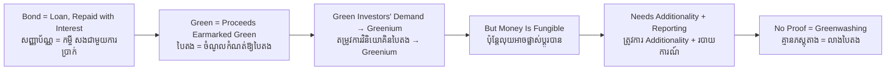

# Green Bond — Socratic Dialogue
# សញ្ញាប័ណ្ណបៃតង — ការសន្ទនាបែប Socratic

*Author: ichamrong | Date: 2026-06-01*

---

**Professor:** Vichea, if a company borrows money by selling a bond, what does the lender get in return?

**Vichea:** Interest payments along the way, and the principal back at the end. The lender is a creditor.

**Professor:** Does it matter to the lender's repayment whether the company spends the money on a factory or a forest?

**Vichea:** Not directly. Repayment depends on the company's overall health, not on which project the cash went to.

**Professor:** So if I told you a bond is "green," does that change the credit risk?

**Vichea:** In principle, no. The greenness is about where the money goes, not about whether you get paid back.

**Professor:** Then why would any investor prefer a green bond over an identical ordinary one?

**Vichea:** Because some investors care about more than the return. They want their money to fund environmental projects, so they'll choose the green one even at the same yield.

**Professor:** And if many such investors compete to buy it, what happens to its price and yield?

**Vichea:** Price up, yield down a little. The issuer borrows slightly cheaper. I think that's called the greenium.

**Professor:** Good. Now the catch. The company says "this money will build a solar farm." How do you know it actually did?

**Vichea:** I'd want some proof — a report, maybe an auditor checking.

**Professor:** Suppose there's no report. The company builds a solar farm it was going to build regardless, and uses the freed-up cash to expand its coal plant. Did the green bond make the world greener?

**Vichea:** No... the solar farm would have existed anyway, and the bond effectively helped fund the coal expansion. The label is true on paper but meaningless in effect.

**Professor:** What do we call dressing something up as green when it adds no real green benefit?

**Vichea:** Greenwashing.

**Professor:** So what must a credible green bond have, to avoid being greenwashing?

**Vichea:** A clear statement of what the money funds, a process for choosing projects, the money kept separate, and honest reporting on results — ideally checked by an independent verifier.

**Professor:** There's a concept finance students call *additionality*. Given the coal example, can you guess what it means?

**Vichea:** Whether the bond funded something that wouldn't have happened otherwise. If the project would have happened anyway, there's no additional green benefit.

**Professor:** Precisely. So when you judge a green bond, what is the real question — the label, or the additionality and the proof?

**Vichea:** The additionality and the proof. The label is just a claim. The reporting is what makes it real.

**Professor:** Hold onto that. A green bond is only as green as its weakest disclosure.

---

## Insight Chain / ខ្សែសង្វាក់ការយល់ដឹង

---

## Related Posts / អត្ថបទដែលទាក់ទង

- [01 — MIT Professor](./01-mit-professor.md)
- [02 — Feynman Technique](./02-feynman.md)
- [04 — Analogy Bridge](./04-analogy.md)
- [05 — Narrative Story](./05-storyteller.md)
- [06 — Journalist Interview](./06-interview.md)
- [Keyword: Greenwashing](../greenwashing/03-socratic.md)
- [Course: Advanced Corporate Finance](../../year-3/03-advanced-corporate-finance.md)
- [Parable: The Young Farmer Who Built a Green Market](../../year-4/parables/281-the-young-farmer-who-built-a-green-market.md)
