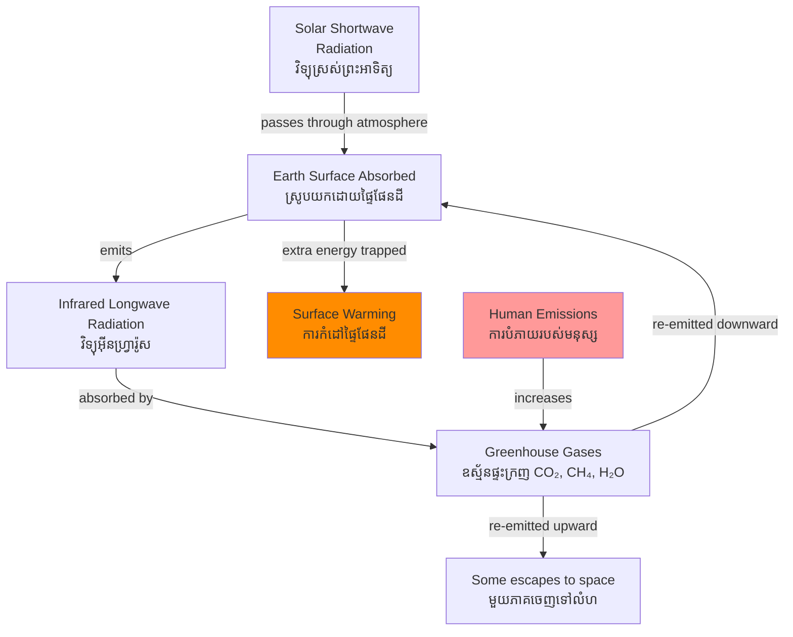

# Greenhouse Effect — First-Principles Derivation
# បែបផែនផ្ទះក្រញ — ការដឹកនាំពីគោលការណ៍មូលដ្ឋាន

*By Prof. Svante Arrhenius (legacy) & Prof. Kerry Emanuel, MIT | ដោយ សាស្ត្រាចារ្យ Kerry Emanuel*

*Author: ichamrong | Date: 2026-05-29*

---

## Core Problem | បញ្ហាស្នូល

Earth's surface temperature of ~15°C average is not a coincidence. It is the result of a radiative energy balance between incoming solar energy and outgoing infrared radiation, mediated by the composition of the atmosphere. Human industrial emissions have altered that composition, shifting the balance. Understanding this requires tracing the physics from first principles.

---

## First Principles Derivation | ការដឹកនាំពីគោលការណ៍

**Axiom 1: Stefan-Boltzmann Law.** Every body with temperature above absolute zero radiates electromagnetic energy. Power radiated ∝ T⁴. Hotter bodies radiate more energy and at shorter wavelengths.

**Axiom 2: Energy balance.** At steady state, the energy Earth receives from the Sun must equal the energy Earth radiates back to space.

**Without atmosphere:**
- Sun emits radiation peaking at visible wavelengths (~500 nm)
- Earth absorbs ~70% of incoming solar radiation
- Earth must emit equal energy at infrared wavelengths (~10,000 nm)
- Balance temperature: ~−18°C

**Actual Earth surface temperature: +15°C → difference = 33°C**

**What accounts for the 33°C difference?**

**Axiom 3: Selective absorption.** Certain gas molecules — CO₂, H₂O, CH₄, N₂O, O₃ — absorb infrared radiation at specific wavelengths corresponding to their molecular vibration modes, then re-emit it in all directions, including back toward Earth's surface.

**Mechanism:**
1. Sun's shortwave radiation passes through atmosphere → absorbed by Earth's surface → surface warms
2. Warm surface emits longwave (infrared) radiation upward
3. Greenhouse gases (ឧស្ម័នផ្ទះក្រញ) absorb this infrared → molecules vibrate → re-emit in all directions
4. Downward re-emission adds energy back to surface → surface warms further
5. New equilibrium temperature is higher than the no-atmosphere case

**The natural greenhouse effect** (33°C warming) is essential for life. The **enhanced greenhouse effect** is the additional warming from anthropogenic emissions increasing greenhouse gas concentrations.

**Key greenhouse gases and their sources:**

| Gas | GWP (100yr) | Cambodian source |
|---|---|---|
| CO₂ | 1 | Deforestation, fuel combustion |
| CH₄ (methane) | 28 | Rice paddies, livestock |
| N₂O | 265 | Nitrogen fertilizer |
| HFCs | 1,000–3,000 | Refrigeration (garment factories) |

**Implication 1:** Even a small increase in greenhouse gas concentration produces significant temperature change due to the logarithmic relationship between CO₂ concentration and radiative forcing.

**Implication 2:** Water vapor is the most abundant greenhouse gas but a *feedback*, not a forcing — it amplifies warming initiated by CO₂. Higher temperatures → more evaporation → more water vapor → more warming.

**Implication 3:** Cambodia's primary adaptation challenges are expressions of the enhanced greenhouse effect: more intense monsoons, longer droughts, sea level rise affecting Mekong Delta and Cambodian coastal provinces.

---

## Visual Derivation | ដ្យាក្រាមដឹកនាំ

---

## Real-World Application | ការអនុវត្តជាក់ស្តែង

**Cambodia's greenhouse effect exposure:**
- Sea level rise projections of 0.5–1.0 m by 2100 threaten Cambodian coastal areas in Koh Kong and Kampot
- Increased monsoon variability affects rice planting calendar — farmers in Kampong Chhnang report planting season uncertainty increasing
- Higher wet-season temperatures during rice grain-fill period reduce yields by an estimated 10% per 1°C above 35°C threshold
- Phnom Penh urban heat island effect (ឥទ្ធិពលកំដៅទីក្រុង) intensifies as impervious surfaces replace vegetation

**Cambodia's NDC commitments:** Cambodia submitted its updated NDC under the Paris Agreement committing to reduce greenhouse gas emissions by 42% below business-as-usual by 2030, conditional on international support — with rice paddy methane management and forest protection as key measures.

---

## Related Posts | អត្ថបទពាក់ព័ន្ធ

- [02 — Feynman Explanation](./02-feynman.md)
- [03 — Socratic Dialogue](./03-socratic.md)
- [04 — Analogy Bridge](./04-analogy.md)
- [05 — Narrative Story](./05-storyteller.md)
- [06 — Journalist Interview](./06-interview.md)
- [Parable: The River That Fed the Village](../../year-1/parables/262-the-river-that-fed-the-village.md)
