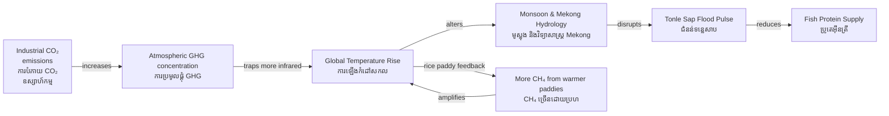

# Greenhouse Effect — Socratic Dialogue
# បែបផែនផ្ទះក្រញ — កិច្ចសន្ទនាបែប Socrates

*Author: ichamrong | Date: 2026-05-29*

---

**Professor:** Dara, what is the temperature of Earth's surface without any atmosphere?

**Dara:** About −18°C — well below freezing. All the oceans would be ice.

**Professor:** And the actual average surface temperature?

**Dara:** About +15°C. A difference of 33°C.

**Professor:** What produces that 33°C difference?

**Dara:** The greenhouse effect (បែបផែនផ្ទះក្រញ) — certain gases in the atmosphere absorb outgoing infrared radiation and re-emit some of it back to the surface.

**Professor:** Which gases are the major contributors?

**Dara:** Water vapor is the largest in absolute terms, but it is a feedback, not a forcing. CO₂ is the primary forcing agent, along with methane (CH₄), nitrous oxide (N₂O), and others.

**Professor:** What is the difference between a forcing and a feedback?

**Dara:** A forcing is an external change that perturbs the energy balance — like adding CO₂ from burning fossil fuels. A feedback is a response to warming that amplifies or dampens the initial perturbation — like more water vapor evaporating as temperature rises, which then causes more warming.

**Professor:** Is water vapor a positive or negative feedback?

**Dara:** Positive — more warming leads to more evaporation, more water vapor, more infrared absorption, more warming. It amplifies the initial forcing.

**Professor:** Cambodia's rice paddies produce methane. How does methane compare to CO₂ in terms of warming effect?

**Dara:** Methane is about 28 times more potent than CO₂ over a 100-year period, but it has a much shorter atmospheric lifetime — about 12 years versus centuries for CO₂. So methane is a powerful near-term forcer; reducing methane emissions would have a faster impact on temperature than reducing CO₂ by the same mass.

**Professor:** In Phnom Penh, why does the city feel hotter than the surrounding countryside?

**Dara:** The urban heat island effect (ឥទ្ធិពលកំដៅទីក្រុង). Dark roads and buildings absorb more solar radiation than vegetation. Cities also generate heat from engines, air conditioners, and industry. Less vegetation means less evaporative cooling.

**Professor:** Is the urban heat island effect the same as the greenhouse effect?

**Dara:** No — the urban heat island is a local phenomenon driven by surface properties and waste heat. The greenhouse effect is a global, atmosphere-wide phenomenon driven by gas composition.

**Professor:** Cambodia's NDC (National Determined Contribution — ការប្រតិព័ន្ធជាតិ) under the Paris Agreement commits to emission reductions. Why does Cambodia commit if its emissions are tiny globally?

**Dara:** Because the Paris Agreement requires all countries to contribute. Cambodia's commitment demonstrates global solidarity and gives Cambodia diplomatic standing to demand that large emitters do more. Also, Cambodia's own emissions are not zero — forest clearing and rice paddies are real sources that the NDC addresses.

**Professor:** If global average temperature rises by 2°C above pre-industrial levels, what happens specifically to the Tonle Sap system?

**Dara:** The Mekong basin rainfall becomes more variable. Glaciers feeding the Mekong in Tibet melt faster, increasing seasonal flow irregularity. The Tonle Sap's flood pulse — which the entire lake ecosystem depends on — becomes less predictable. There is also the risk of longer, more intense dry seasons reducing the lake's minimum level, threatening spawning habitats.

**Professor:** So the greenhouse effect, mediated through the Mekong, reaches the fish on a Cambodian family's dinner table?

**Dara:** Exactly. The physics of molecular vibration in atmospheric CO₂ connects, through a long chain, to whether a family in Kampong Phluk can afford to eat tomorrow.

---

## Insight Chain | ខ្សែសង្វាក់ការយល់ដឹង

---

## Related Posts | អត្ថបទពាក់ព័ន្ធ

- [01 — MIT Professor](./01-mit-professor.md)
- [02 — Feynman Explanation](./02-feynman.md)
- [04 — Analogy Bridge](./04-analogy.md)
- [05 — Narrative Story](./05-storyteller.md)
- [06 — Journalist Interview](./06-interview.md)
- [Parable: The River That Fed the Village](../../year-1/parables/262-the-river-that-fed-the-village.md)
