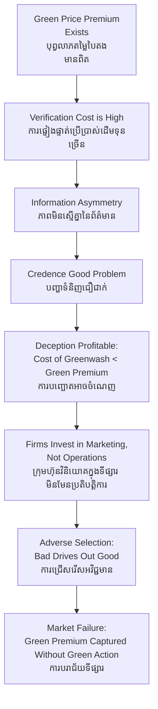

# Greenwashing — First-Principles Derivation
# ការធ្វើលំអបញ្ញត្តិបៃតង — ការស្រាយបញ្ជាក់ពីគោលការណ៍ដំបូង

*Author: ichamrong | Date: 2026-05-29*

---

## Core Problem / បញ្ហាស្នូល

**English:** Markets rely on truthful signals to function efficiently. When firms misrepresent their environmental credentials, they exploit an information asymmetry — consumers cannot verify claims at the point of purchase, which allows low-quality "green" goods to crowd out genuinely sustainable ones.

**ខ្មែរ:** ទីផ្សារពឹងផ្អែកលើសញ្ញាណដ៏ស្មោះត្រង់ដើម្បីដំណើរការប្រកបដោយប្រសិទ្ធភាព។ នៅពេលក្រុមហ៊ុនបង្ហាញព័ត៌មានមិនពិតស្ដីពីលក្ខណៈបរិស្ថានរបស់ខ្លួន ពួកគេកំពុងទាញយកប្រយោជន៍ពីភាពមិនស្មើគ្នានៃព័ត៌មាន — អ្នកប្រើប្រាស់មិនអាចផ្ទៀងផ្ទាត់ការអះអាងបានទេនៅចំណុចទិញ ដែលអនុញ្ញាតឱ្យទំនិញ "បៃតង" គុណភាពទាបជំរុញលើទំនិញប្រកបនឹងចីរភាពពិតប្រាកដ។

---

## Foundational Scholar / អ្នកសិក្សាដំបូង

The term **greenwashing** was coined by environmental activist **Jay Westerveld** in 1986, but the rigorous economic framework for understanding it draws on **George Akerlof's** 1970 "Market for Lemons" — the Nobel Prize-winning model of how information asymmetry causes market failure.

**Key principle:** When buyers cannot distinguish quality before purchase, sellers have an incentive to claim high quality regardless of actual quality. The equilibrium outcome: bad products drive out good products (adverse selection / ការជ្រើសរើសអវិជ្ជមាន).

---

## First Principles Derivation / ការស្រាយបញ្ជាក់ពីគោលការណ៍ដំបូង

**Axiom 1 — Green premium exists (អ័ក្សទ 1 — បុព្វលាភបៃតងមានពិតប្រាកដ):**
Consumers are willing to pay a price premium P_green > P_standard for products verified as environmentally responsible.

**Axiom 2 — Verification is costly (អ័ក្សទ 2 — ការផ្ទៀងផ្ទាត់ប្រើចំណាយ):**
Third-party environmental audits are expensive. Consumers cannot distinguish genuine ESG investments from marketing claims using observation alone.

**Axiom 3 — Disclosure is voluntary or weakly enforced (អ័ក្សទ 3 — ការបង្ហាញព័ត៌មានស្ម័គ្រចិត្ត):**
Without mandatory, standardized disclosure regimes, firms choose what environmental data to publish.

**Derivation Chain (ខ្សែសង្វាក់ការស្រាយ):**

1. Green premium exists → rational firms want to capture it.
2. Verification is costly → consumers rely on claims, not evidence.
3. Weak enforcement → cost of deception < benefit of premium.
4. Profit-maximizing firm invests in green marketing instead of green operations.
5. Market cannot differentiate genuine sustainability from performance.
6. Consumers who pay the green premium are systematically defrauded.
7. Genuinely sustainable firms cannot recoup their higher costs → they exit the market or cut investments.
8. **Result:** Market equilibrium collapses toward greenwashing as dominant strategy.

---

## The Credence Good Problem / បញ្ហាទំនិញជឿជាក់

Environmental claims are **credence goods** — their true quality cannot be verified even after consumption. You buy "eco-certified" coffee and drink it, but you never know whether the farm actually protected the forest. This is structurally different from **experience goods** (you taste quality) or **search goods** (you see quality before buying).

---

## Visual Derivation / ការបង្ហាញដោយមើលឃើញ

---

## Cambodian Application / ការអនុវត្តន៍ក្នុងបរិបទកម្ពុជា

**Microfinance Greenwashing in Cambodia:**
Several Cambodian microfinance institutions (MFIs) advertise "financial inclusion for rural women" and market themselves to ESG-focused international lenders at lower interest rates. Yet field research by the Cambodian League for the Promotion and Defense of Human Rights (LICADHO) documented household over-indebtedness, coercive collection, and land seizures — the opposite of socially responsible finance. The ESG label attracted capital; the label was not tied to verified outcomes.

This matches the greenwashing model precisely: the green/social premium was captured (lower borrowing costs, reputational benefit) without the corresponding social investment.

---

## Policy Responses / ការឆ្លើយតបតាមគោលនយោបាយ

| Mechanism | Purpose | ខ្មែរ |
|---|---|---|
| Mandatory disclosure (TCFD, CSRD) | Force standardized, auditable data | បង្ខំឱ្យបង្ហាញព័ត៌មានស្ដង់ដារ |
| Third-party certification (B Corp, Rainforest Alliance) | Reduce verification cost for consumers | កាត់បន្ថយចំណាយផ្ទៀងផ្ទាត់ |
| Greenwashing litigation (FTC Green Guides) | Raise cost of deception | បង្កើនការចំណាយលើការបញ្ឆោត |
| Consumer watchdogs | Crowdsourced verification | ការផ្ទៀងផ្ទាត់ដោយសហគមន៍ |

---

## Related Posts / អត្ថបទដែលទាក់ទង

- [02 — Feynman Technique](./02-feynman.md)
- [03 — Socratic Dialogue](./03-socratic.md)
- [04 — Analogy Bridge](./04-analogy.md)
- [05 — Narrative Story](./05-storyteller.md)
- [06 — Journalist Interview](./06-interview.md)
- [Parable: The King Who Banned the Smoke](../../year-1/parables/263-the-king-who-banned-the-smoke.md)
