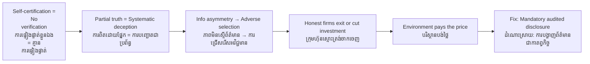

# Greenwashing — Socratic Dialogue
# ការធ្វើលំអបញ្ញត្តិបៃតង — ការសន្ទនាបែប Socratic

*Author: ichamrong | Date: 2026-05-29*

---

**Professor:** Dara, if a garment factory in Kandal Province prints "eco-certified" on all its labels, does that make it an environmentally responsible company?

**Dara:** I think so, if it says certified, it must have passed some kind of test.

**Professor:** Who issued the certification?

**Dara:** ...the company itself?

**Professor:** And if a student writes their own exam and also grades it, what grade do you think they will receive?

**Dara:** They would give themselves a perfect score. That is not fair.

**Professor:** So what is the minimum condition for a certification to be meaningful?

**Dara:** It has to come from someone who is not the company — someone independent.

**Professor:** Good. Now suppose the certification is independent, but it only covers the packaging material. The factory still releases untreated wastewater into the Mekong. Is the certification truthful?

**Dara:** It is truthful about one small part, but it hides a much bigger problem.

**Professor:** Does hiding a truth count as deception?

**Dara:** I think so — especially if the buyer thinks "certified" means the whole operation is clean.

**Professor:** What do economists call the condition where one party in a transaction knows more than the other?

**Dara:** Information asymmetry?

**Professor:** And when sellers exploit that asymmetry by advertising quality they do not possess, what happens to the market?

**Dara:** The buyers get tricked. They pay more than the product deserves. And companies that are genuinely sustainable cannot compete because they charge more for real improvements.

**Professor:** So who suffers most from greenwashing?

**Dara:** The buyers, certainly. But also honest companies that actually invested in sustainability.

**Professor:** And what about the environment itself?

**Dara:** The environment suffers because people think the problem is being solved — while it keeps getting worse.

**Professor:** Dara, if greenwashing is profitable, rational, and hard to detect, why would any company choose to invest in genuine sustainability?

**Dara:** Maybe if there are laws with real penalties? Or if investigative journalists expose them?

**Professor:** What else might change the calculation?

**Dara:** If investors start requiring proof — actual emissions data, third-party audits — before lending money cheaply?

**Professor:** And if consumers demand transparency?

**Dara:** Then the cost of deception rises, and the benefit of real sustainability rises too.

**Professor:** So greenwashing is not simply a moral failure — it is a structural feature of markets with weak information and weak enforcement?

**Dara:** Yes. It will keep happening until the incentives change.

**Professor:** What is the one reform that would do the most to close that information gap?

**Dara:** Mandatory standardized environmental reporting — like financial reporting. Every company must disclose the same data, audited by independent parties, or face legal penalties.

**Professor:** And who bears the cost of that reform?

**Dara:** Companies that were coasting on false claims. Honest companies would benefit.

---

## Insight Chain / ខ្សែសង្វាក់ការយល់ដឹង

---

## Related Posts / អត្ថបទដែលទាក់ទង

- [01 — MIT Professor](./01-mit-professor.md)
- [02 — Feynman Technique](./02-feynman.md)
- [04 — Analogy Bridge](./04-analogy.md)
- [05 — Narrative Story](./05-storyteller.md)
- [06 — Journalist Interview](./06-interview.md)
- [Parable: The King Who Banned the Smoke](../../year-1/parables/263-the-king-who-banned-the-smoke.md)
