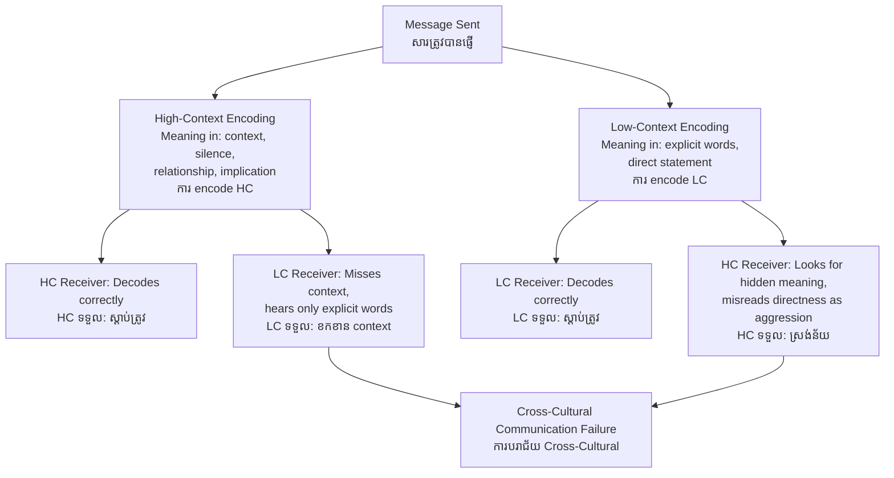

# High-Context vs. Low-Context Communication — First-Principles Derivation
# ការទំនាក់ទំនងបរិបទខ្ពស់ ទល់ ទាប — ការស្រាយបញ្ជាក់ពីគោលការណ៍ដំបូង

*Author: ichamrong | Date: 2026-05-29*

---

## Foundational Scholar / អ្នកសិក្សាស្ថាបនិក

**Edward T. Hall** (1914–2009), American anthropologist, introduced the high-context/low-context communication framework in *Beyond Culture* (1976). Hall argued that cultures differ systematically in how much meaning they embed in explicit verbal messages versus in shared context — physical setting, relationship history, social position, nonverbal signals, and what is *not* said.

Hall's insight came from his work on cross-cultural communication failure: American executives and Japanese counterparts repeatedly misunderstood each other not because of language barriers but because they operated on fundamentally different assumptions about where meaning resides.

---

## Core Problem / បញ្ហាស្នូល

**English:** Communication is not merely the transfer of explicit verbal information. Every message is embedded in a context — the relationship between speaker and listener, their shared history, social roles, physical setting, and cultural assumptions. Different cultures encode different amounts of meaning in that context versus in explicit words. When people from high-context and low-context cultures interact, they systematically misread each other — one side reads subtext that isn't there; the other misses subtext that was critical.

**ខ្មែរ:** ការទំនាក់ទំនងមិនមែនគ្រាន់តែជាការផ្ទេរព័ត៌មានពាក្យសំដីច្បាស់លាស់នោះទេ។ សារនីមួយៗត្រូវបានបញ្ចូលនៅក្នុងបរិបទ — ទំនាក់ទំនងរវាងអ្នកនិយាយ និងអ្នកស្ដាប់ ប្រវត្តិរួមរបស់ពួកគេ តួនាទីសង្គម ការកំណត់ physical និងការសន្មត់文化។

---

## First Principles Derivation / ការស្រាយបញ្ជាក់ពីគោលការណ៍ដំបូង

**Axiom 1 — Communication carries two channels (អ័ក្សទ 1 — ការទំនាក់ទំនងមានពីរ channel):**
Every communicative act carries both explicit content (the words, the stated proposition) and contextual signals (tone, relationship, timing, what's omitted, nonverbal cues).

**Axiom 2 — Cultures vary in channel weighting (អ័ក្សទ 2 —文化ខុសគ្នាក្នុងការ weighting channel):**
Some cultures encode most meaning in explicit content. Others encode most meaning in contextual signals. This is a learned, stable cultural pattern — not an individual preference.

**Axiom 3 — Misunderstanding occurs at the decoding mismatch (អ័ក្សទ 3 — ការយល់ច្រឡំ):**
When a high-context communicator encodes meaning in context and a low-context receiver decodes only explicit words, the message is systematically lost. The reverse also applies.

**Derivation Chain (ខ្សែសង្វាក់ការស្រាយ):**

1. High-context culture (HC): speaker embeds critical meaning in relationship, implied meaning, silence, indirect phrasing, nonverbal signals.
2. Low-context culture (LC): speaker encodes critical meaning in explicit, direct verbal statements. Context fills in only minor details.
3. HC person speaking to LC person: LC person hears only the words — misses the meaning embedded in what was not said, in the tone, in the social context of the relationship.
4. LC person speaking to HC person: HC person looks for the implied meaning, reads directness as aggression or disrespect, misses the literal intent.
5. Both sides believe they communicated clearly. Both sides are wrong about the other.

---

## Hall's Spectrum / ចន្លោះ Hall

**High-context (HC) cultures / 文化 HC:**
Japan, Korea, China, Arab world, Cambodia, most of Southeast Asia, Latin America, sub-Saharan Africa.
*Meaning in:* relationship, social hierarchy, silence, indirect phrasing, nonverbal cues, shared cultural knowledge.

**Low-context (LC) cultures / 文化 LC:**
Germany, Scandinavia, United States, Netherlands, Australia.
*Meaning in:* explicit verbal statement, written agreement, direct proposition, words at face value.

---

## Visual Derivation / ការបង្ហាញដោយមើលឃើញ

---

## Cambodian Application / ការអនុវត្តន៍ក្នុងបរិបទកម្ពុជា

**Japanese Investment Negotiations in Cambodia:**
Japanese business delegations operating in Cambodia often operate in classic high-context mode: building relationship through multiple meetings before discussing terms, using silence as a signal of serious consideration, rarely saying "no" directly, preferring to signal disagreement through hesitation, vague phrases, or deflection.

Cambodian counterparts, while also high-context, may interpret specific Japanese indirect signals differently — leading to misreads about commitment level. When Cambodian officials have worked with European or American investors immediately before Japanese partners, the contrast in communication styles creates visible dissonance. The European investor's explicit written term sheet is read as aggressive or impersonal by the Japanese partner.

Understanding the HC/LC framework is not just academic — it is directly applicable to Cambodia's cross-cultural business environment, where investors from Japan, Korea, China, Europe, and the United States all operate simultaneously with Cambodian counterparts.

---

## Related Posts / អត្ថបទដែលទាក់ទង

- [02 — Feynman Technique](./02-feynman.md)
- [03 — Socratic Dialogue](../negative-externality/03-socratic.md)
- [04 — Analogy Bridge](../monopoly/04-analogy.md)
- [05 — Narrative Story](../precautionary-principle/05-storyteller.md)
- [06 — Journalist Interview](../precautionary-principle/06-interview.md)
- [Parable: The Trader Who Learned Three Languages](../../year-1/parables/265-the-trader-who-learned-three-languages.md)
