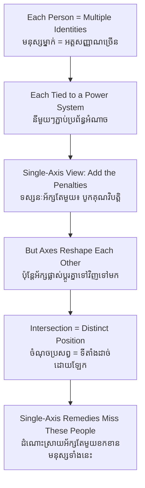

# Intersectionality — First-Principles Derivation
# អន្តរផ្នែកសង្គម — ការស្រាយបញ្ជាក់ពីគោលការណ៍ដំបូង

*Author: ichamrong | Date: 2026-06-01*

---

## Foundational Scholars / អ្នកសិក្សាស្ថាបនិក

**Kimberlé Crenshaw** (UCLA and Columbia Law School) coined the term **intersectionality** in 1989, analysing legal cases in which Black women were denied recognition of discrimination because courts treated "race" and "sex" as separate, additive boxes. Crenshaw showed that a Black woman could be harmed *specifically as a Black woman* — a harm invisible to a court that asked only "were Black men hurt?" or "were white women hurt?" Building on the standpoint sociology of scholars like Patricia Hill Collins, intersectionality became a core analytic tool in sociology and anthropology for understanding how overlapping identities produce distinct, compounded experiences of advantage and disadvantage. This course, *Introduction to Anthropology and Sociology* (see [../../year-1/08-introduction-to-anthropology-and-sociology.md](../../year-1/08-introduction-to-anthropology-and-sociology.md)), uses it as a lens on stratification, labour, and environmental justice.

---

## Core Problem / បញ្ហាស្នូល

**English:** Social analysis often studies one category at a time — gender, or class, or ethnicity — as if a person's disadvantages simply stack like separate weights. But a poor Indigenous woman does not experience "being poor" plus "being Indigenous" plus "being a woman" as three independent burdens. The categories interact, producing a situation that none of them describes alone. How do we analyse disadvantage in a way that captures these interactions, rather than treating identities as separable, additive boxes that erase the people who live at their intersection?

**ខ្មែរ:** ការវិភាគសង្គមជារឿយៗសិក្សាប្រភេទមួយក្នុងពេលតែមួយ — យេនឌ័រ ឬវណ្ណៈ ឬជនជាតិ — ហាក់ដូចជាគុណវិបត្តិរបស់មនុស្សម្នាក់ត្រឹមតែគរលើគ្នាដូចទម្ងន់ដាច់ដោយឡែក។ ប៉ុន្តែស្ត្រីជនជាតិដើមភាគតិចក្រីក្រម្នាក់ មិនជួបប្រទះ "ភាពក្រីក្រ" បូក "ភាពជាជនជាតិដើម" បូក "ភាពជាស្ត្រី" ជាបន្ទុកឯករាជ្យបីទេ។ ប្រភេទទាំងនេះអន្តរកម្មគ្នា បង្កើតស្ថានភាពមួយដែលគ្មានប្រភេទណាមួយពិពណ៌នាបានតែម្នាក់ឯង។ តើយើងវិភាគគុណវិបត្តិយ៉ាងដូចម្តេច ដើម្បីចាប់យកអន្តរកម្មទាំងនេះ ជំនួសឱ្យការចាត់ទុកអត្តសញ្ញាណជាប្រអប់ដាច់ដោយឡែក ដែលលុបបំបាត់មនុស្សដែលរស់នៅចំណុចប្រសព្វ?

---

## First Principles Derivation / ការស្រាយបញ្ជាក់ពីគោលការណ៍ដំបូង

**Axiom 1 — Every person holds multiple identities at once (អ័ក្សទ ១ — មនុស្សម្នាក់កាន់អត្តសញ្ញាណច្រើនក្នុងពេលតែមួយ):**
Gender, class, ethnicity, religion, disability, age, and more are all present in one person simultaneously, not one at a time.

**Axiom 2 — Systems of power are organized around these categories (អ័ក្សទ ២ — ប្រព័ន្ធអំណាចរៀបចំជុំវិញប្រភេទទាំងនេះ):**
Each category is tied to a structure that distributes advantage or disadvantage — patriarchy around gender, class hierarchy around wealth, ethnic hierarchy around group.

**Axiom 3 — Interacting systems are not additive (អ័ក្សទ ៣ — ប្រព័ន្ធអន្តរកម្មមិនមែនជាការបូក):**
Two forms of disadvantage acting together can produce an effect different from, and often larger than, their sum — they multiply and reshape each other.

**Derivation Chain (ខ្សែសង្វាក់ការស្រាយ):**

1. Take a single axis — say gender. It explains *some* of a woman's disadvantage, but not all.
2. Add a second axis — say class. The "additive" model says total disadvantage = gender penalty + class penalty.
3. But test it: a wealthy woman and a poor woman face *different kinds* of gender discrimination; a poor woman and a poor man face *different kinds* of class disadvantage. The axes change each other's meaning.
4. Therefore disadvantage at the **intersection** must be analysed as its own distinct position, not reconstructed by adding single-axis findings.
5. **Consequence — invisibility:** people at intersections (the poor Indigenous woman) fall through analytical and legal frameworks built around single categories, because no single-axis remedy fits them. Crenshaw's original cases are exactly this failure.

**The compounding mechanism (យន្តការគរបន្ថែម):** A garment worker who is a woman *and* a rural migrant *and* from an ethnic minority faces hiring bias, wage suppression, language exclusion, and harassment that reinforce one another — each making the others harder to escape. The disadvantage is locked, not merely stacked.

---

## Visual Derivation / ការបង្ហាញដោយមើលឃើញ

---

## Relevance to Environmental Justice & Labor / ពាក់ព័ន្ធនឹងយុត្តិធម៌បរិស្ថាន និងពលកម្ម

Environmental harms and labour exploitation rarely fall evenly. When a river is polluted or a forest cleared, the heaviest cost often lands on those at multiple intersections — poor, rural, ethnic-minority women who depend most directly on the land and have least power to resist or relocate. A single-axis lens ("the poor are affected" or "women are affected") undercounts their burden. Intersectionality is therefore essential to environmental justice (see [environmental-justice](../environmental-justice/01-mit-professor.md)) and to understanding stratified labour markets (see [social-stratification](../social-stratification/01-mit-professor.md)).

---

## Cambodian Application / ការអនុវត្តន៍ក្នុងបរិបទកម្ពុជា

**The garment-sector and the displaced farmer:** Consider a young woman who migrated from a Tampuon community in Ratanakiri to a Phnom Penh garment factory after her family's land was lost to a concession. She experiences gender (low-paid "women's work," harassment risk), class (no capital, dependent on a wage), rural-to-urban migrant status (no city networks), and ethnic-minority identity (language barriers, discrimination) all at once. A program targeting only "women workers" or only "Indigenous land rights" would each capture part of her situation and miss the rest. Intersectionality names the compounded position she actually occupies — and explains why she is among the most exposed to both labour abuse and environmental dispossession.

---

## Related Posts / អត្ថបទដែលទាក់ទង

- [02 — Feynman Technique](./02-feynman.md)
- [03 — Socratic Dialogue](./03-socratic.md)
- [04 — Analogy Bridge](./04-analogy.md)
- [05 — Narrative Story](./05-storyteller.md)
- [06 — Journalist Interview](./06-interview.md)
- [Keyword: Environmental Justice](../environmental-justice/01-mit-professor.md)
- [Keyword: Social Stratification](../social-stratification/01-mit-professor.md)
- [Course: Introduction to Anthropology and Sociology](../../year-1/08-introduction-to-anthropology-and-sociology.md)
- [Parable: The Anthropologist in the Factory](../../year-1/parables/267-the-anthropologist-in-the-factory.md)
