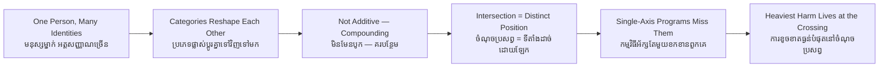

# Intersectionality — Socratic Dialogue
# អន្តរផ្នែកសង្គម — ការសន្ទនាបែប Socratic

*Author: ichamrong | Date: 2026-06-01*

---

**Professor:** Sreymom, name two things about a person that can affect how society treats them.

**Sreymom:** Their gender, and how much money they have — their class.

**Professor:** Good. If being a woman brings some disadvantage, and being poor brings some disadvantage, how would you describe a poor woman's total disadvantage?

**Sreymom:** I'd guess... both added together? The woman-disadvantage plus the poor-disadvantage.

**Professor:** Let's test that. Think of a wealthy woman and a poor woman. Do they face the *same* kind of sexism?

**Sreymom:** Not really. A wealthy woman might face being underestimated at work; a poor woman might face dangerous, low-paid jobs and no protection. Different forms.

**Professor:** So class changes *what kind* of gender disadvantage a woman faces?

**Sreymom:** Yes. They're not separate after all — the class shapes the gender part.

**Professor:** Now the reverse. A poor man and a poor woman — do they experience poverty identically?

**Sreymom:** No. The poor woman also carries unpaid care work, more risk of harassment, fewer options. Her poverty has an extra texture.

**Professor:** So gender changes *what kind* of class disadvantage too. If each reshapes the other, is "just add them up" correct?

**Sreymom:** No. Adding assumes they stay separate. But they blend. The poor woman is in a position that neither "poor people" nor "women" fully describes.

**Professor:** Excellent. Now suppose a court reasons like this: "Poor men got jobs here, and wealthy women got jobs here, so there's no discrimination." What might it miss?

**Sreymom:** It misses poor women specifically. They could be shut out even when poor men and wealthy women are not. They fall in the gap between the categories.

**Professor:** That exact gap is what Kimberlé Crenshaw found in real cases involving Black women. What does it reveal about analysing one category at a time?

**Sreymom:** That it can make the most disadvantaged people invisible — the ones standing where the categories cross.

**Professor:** Now apply it. A river is polluted by a factory. Who in a poor rural village likely bears the heaviest cost?

**Sreymom:** Probably women — they fetch the water, grow the food, care for sick children. And if they're also from an ethnic minority with no land title and no money to move...

**Professor:** Then how many "roads" cross on her?

**Sreymom:** Gender, class, ethnicity, maybe rural status. Four. The harm lands hardest exactly where they meet.

**Professor:** So if a relief program targets only "women" or only "the poor," what happens to her?

**Sreymom:** Each program catches part of her and misses the rest. She slips through, even though she's the most affected.

**Professor:** That is why intersectionality matters for environmental justice and labour. The question is never just "which group?" but —

**Sreymom:** "Which *combination*?" — and who lives at the crossing.

**Professor:** Hold onto that. The crossing is where the deepest harm, and the deepest blind spots, are found together.

---

## Insight Chain / ខ្សែសង្វាក់ការយល់ដឹង

---

## Related Posts / អត្ថបទដែលទាក់ទង

- [01 — MIT Professor](./01-mit-professor.md)
- [02 — Feynman Technique](./02-feynman.md)
- [04 — Analogy Bridge](./04-analogy.md)
- [05 — Narrative Story](./05-storyteller.md)
- [06 — Journalist Interview](./06-interview.md)
- [Keyword: Environmental Justice](../environmental-justice/03-socratic.md)
- [Course: Introduction to Anthropology and Sociology](../../year-1/08-introduction-to-anthropology-and-sociology.md)
- [Parable: The Anthropologist in the Factory](../../year-1/parables/267-the-anthropologist-in-the-factory.md)
